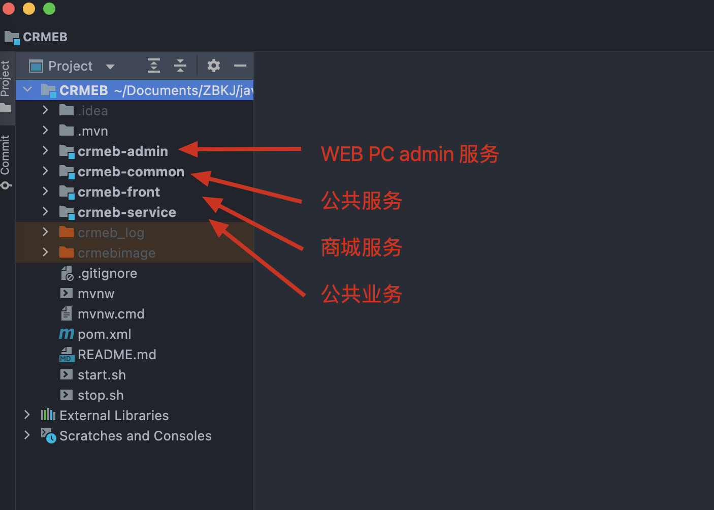
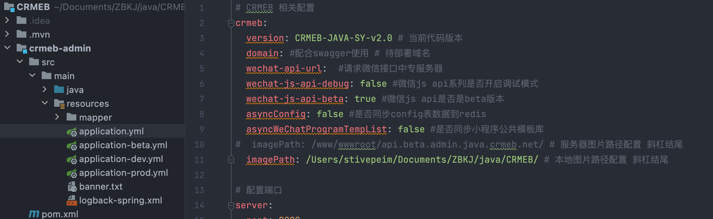
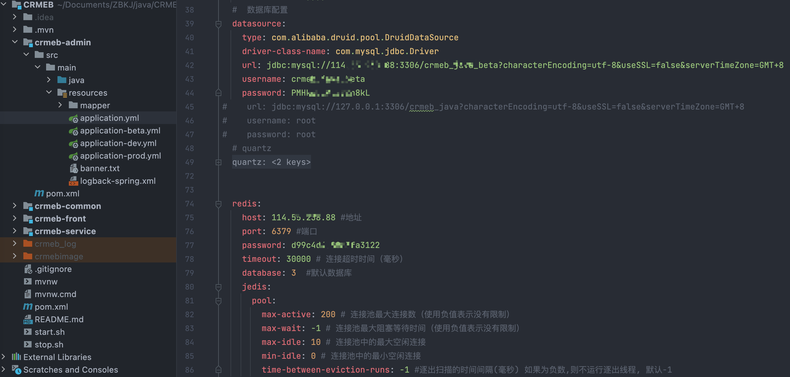
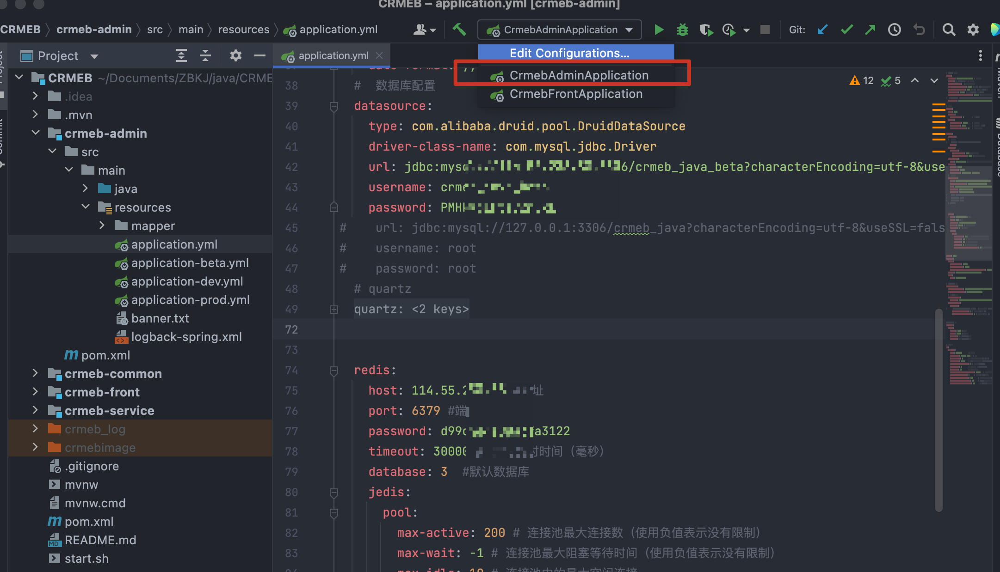
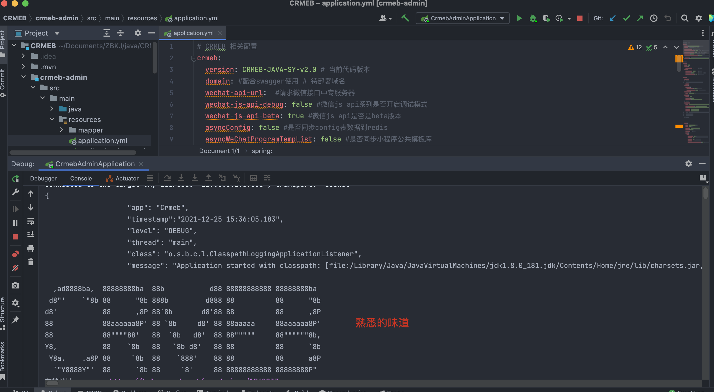
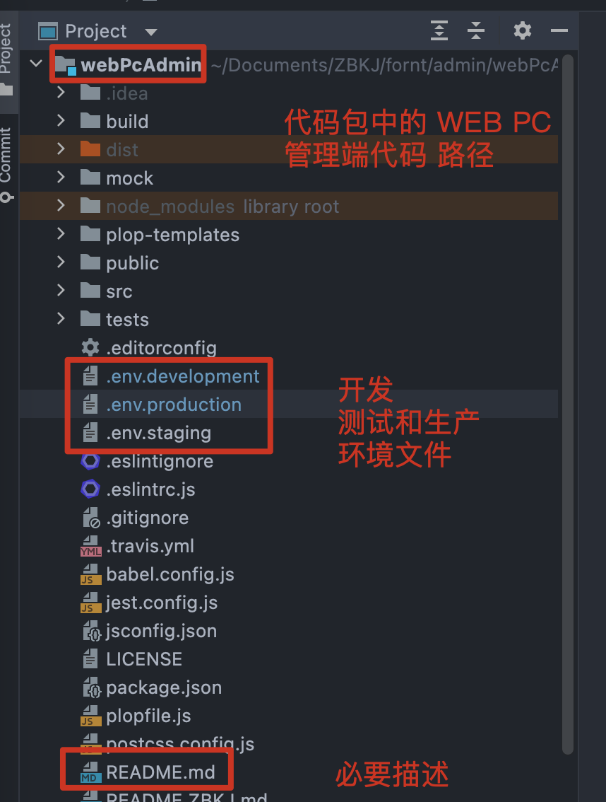
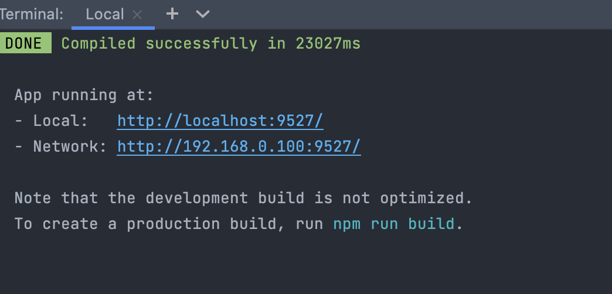
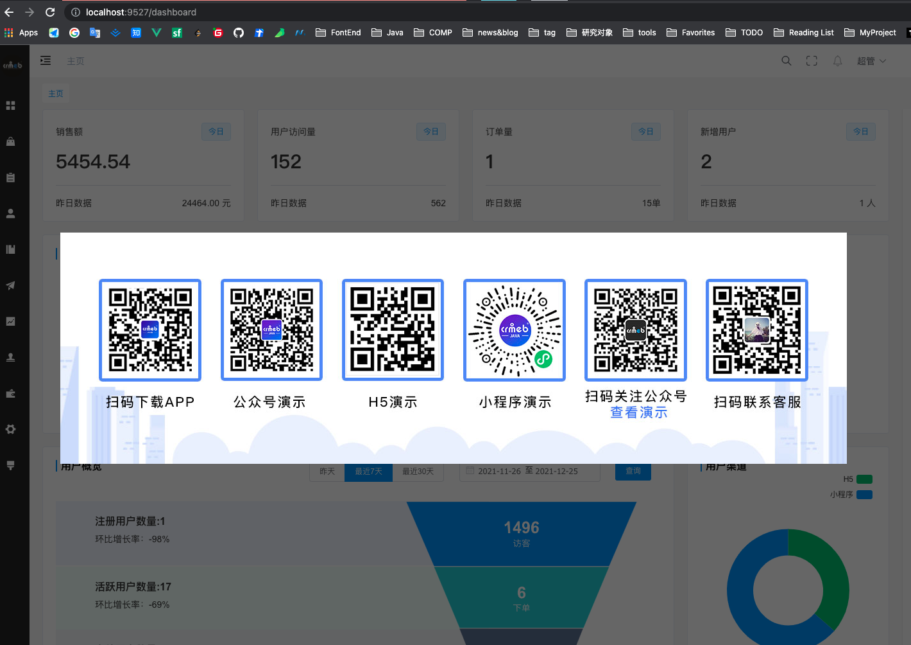
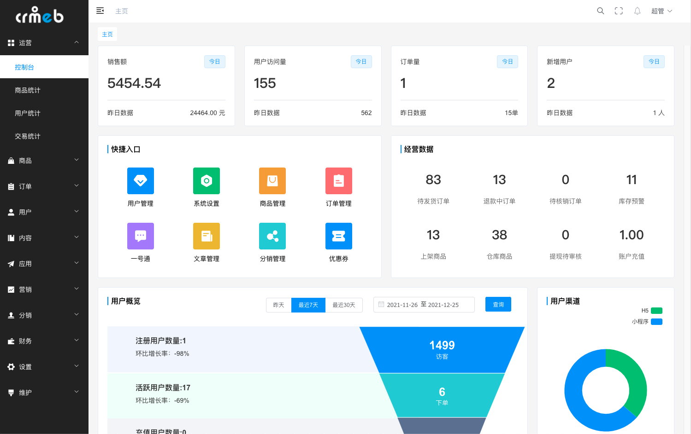

# 🚀 本地开发环境搭建指南

> 你好呀！👋
> 想在自己的电脑上跑起来这个系统吗？别慌，跟着这份指南一步一步来，你一定能搞定！
> 这不是复杂的配置，只是装几个工具而已 ✨

---

## 📋 准备工作（5分钟快速检查）

在开始之前，先看看你的电脑能不能"胜任"这个项目：

### 💻 电脑配置需求

| 需求 | 最低配置 | 推荐配置 |
|------|--------|--------|
| 💾 内存 | 8GB | 16GB（更舒服） |
| 💿 磁盘 | 20GB | 50GB（以防万一） |
| ⚙️ 操作系统 | Windows / Mac / Linux | 都可以！ |

💡 **小贴士：** 内存太小的话，可能会感觉有点卡，但也能运行

### 🎯 需要装什么软件

| 工具 | 最低版本 | 推荐版本 | 用来干什么 |
|------|--------|--------|----------|
| JDK | 1.8 | 17 | 运行 Java 后端代码 |
| MySQL | 5.7 | 8.0 | 数据存储 |
| Redis | 5.0 | 6.0+ | 缓存和队列 |
| Node.js | 14.0 | 18.0+ | 运行前端代码 |
| Git | 2.0 | 最新 | 获取代码 |

⚠️ **注意：** 如果你用的是云服务器上的 MySQL 和 Redis，可以跳过装这两个

---

## 🎯 第一步：装 JDK（Java 开发工具包）

Java 是后端代码的运行环境，必须装。别担心，这个很简单！

### 💻 Windows 用户看这里

1. **点这个链接去官网下 JDK** 👉 [Oracle Java SE Download](https://www.oracle.com/java/technologies/javase-downloads.html)

2. **选择 JDK 17（或 11）版本下载**

   

   💡 **为什么选 17？** 这是目前最新最稳定的版本

3. **运行安装程序，一路点 Next**

   📂 **默认安装位置：** `C:\Program Files\Java\jdk-17.0.x`

   ⚠️ **重要：** 路径里不要有中文和空格，以后会有各种 bug

4. **配置环境变量（这步容易踩坑，跟紧了！）**

   - 按 `Win + X`，选择"系统"
   - 点左边的"高级系统设置"
   - 点"环境变量"按钮
   - 新建系统变量：
     - **变量名：** `JAVA_HOME`
     - **变量值：** `C:\Program Files\Java\jdk-17.0.x`（换成你装的位置）

   - 再编辑 `Path` 这个变量，添加：`%JAVA_HOME%\bin`

   💡 **小贴士：** 环境变量就是告诉系统在哪里找 Java，别漏了这步！

5. **验证一下装对没有**

   打开命令行，输入：
   ```bash
   java -version
   ```

   看到版本号就成功了！👍 如果看不到，说明环境变量没设对，回到第 4 步重新检查一下

### 🍎 Mac 和 🐧 Linux 用户（更简单！）

太棒了，你们的安装更快！

**Mac 用户（用 Homebrew）：**
```bash
brew install openjdk@17
```

**Linux 用户（Ubuntu/Debian）：**
```bash
sudo apt update
sudo apt install openjdk-17-jdk
```

**然后验证一下：**
```bash
java -version
```

搞定！ 🎉

---

## 🎯 第二步：装 MySQL（数据库）

数据库就是存东西的地方 - 商品、订单、用户信息都放这里。

### 💻 Windows 用户

1. **下载安装程序** 👉 [MySQL 官网](https://dev.mysql.com/downloads/mysql/)

   选择最新稳定版本（推荐 8.0）

2. **运行安装程序**

   选择"Developer Default"（开发者配置）

3. **设置 MySQL 密码**

   

   💡 **本地开发建议用简单密码：** `123456`

   ⚠️ **生产环境绝对不能这样做！** 那是要被黑的

4. **确认安装完成**

### 🍎 Mac 用户

```bash
brew install mysql@8.0
brew services start mysql@8.0
```

首次启动需要初始化：
```bash
mysql_secure_installation
```

### 🐧 Linux 用户

```bash
sudo apt update
sudo apt install mysql-server
sudo systemctl start mysql
sudo systemctl enable mysql
```

### ✅ 初始化数据库（所有用户都要做）

打开 MySQL 命令行：
```bash
mysql -u root -p
```

输入你设置的密码，然后运行：

```sql
-- 创建项目专用用户
CREATE USER 'crmeb'@'localhost' IDENTIFIED BY '123456';
GRANT ALL PRIVILEGES ON *.* TO 'crmeb'@'localhost' WITH GRANT OPTION;
FLUSH PRIVILEGES;

-- 创建项目数据库
CREATE DATABASE crmeb_db CHARACTER SET utf8mb4 COLLATE utf8mb4_unicode_ci;

-- 给新用户授权
GRANT ALL PRIVILEGES ON crmeb_db.* TO 'crmeb'@'localhost';
FLUSH PRIVILEGES;
```

💡 **小贴士：** 这样做是把 crmeb 这个用户跟项目绑定，更安全

---

## 🎯 第三步：装 Redis（缓存系统）

Redis 就像是 MySQL 的"小帮手"，用来加快速度和处理消息队列。很多互联网公司都用它。



### 💻 Windows 用户

1. **下载 Redis** 👉 [GitHub 版本](https://github.com/microsoftarchive/redis/releases)

2. **解压到一个文件夹**

   比如：`C:\Redis`

3. **以管理员身份运行命令行**

4. **进到 Redis 文件夹，运行：**
   ```bash
   redis-server.exe --service-install redis.windows.conf --loglevel verbose
   redis-server --service-start
   ```

### 🍎 Mac 用户

```bash
brew install redis
brew services start redis
```

### 🐧 Linux 用户

```bash
sudo apt update
sudo apt install redis-server
sudo systemctl start redis-server
sudo systemctl enable redis-server
```

### ✅ 验证 Redis 是否启动

```bash
redis-cli ping
```

看到 `PONG` 就说明成功了！👍

⚠️ **如果没看到 PONG，说明 Redis 没启动，回到上面重新检查一下**

---

## 🎯 第四步：装 Node.js（前端开发工具）

你的电脑需要 Node.js 来运行前端代码。别慌，这个是最简单的！



### 🍎 Mac 和 🐧 Linux 用户（推荐方案）

用 NVM（Node 版本管理器），以后想换版本不用重新装：

```bash
# 安装 NVM
curl -o- https://raw.githubusercontent.com/nvm-sh/nvm/v0.39.0/install.sh | bash

# 安装 Node.js 18 版本
nvm install 18
nvm use 18

# 验证
node -v
npm -v
```

### 💻 Windows 用户

1. **下载 nvm-windows** 👉 [GitHub](https://github.com/coreybutler/nvm-windows/releases)

2. **运行安装程序，一路 Next**

   ⚠️ **不要放在有中文和空格的路径**

3. **重启电脑**

4. **打开 PowerShell（管理员模式），运行：**
   ```bash
   nvm install 18.0.0
   nvm use 18.0.0
   ```

5. **验证：**
   ```bash
   node -v
   npm -v
   ```

### 🎯 不想用 NVM？直接装也行

👉 [Node.js 官网](https://nodejs.org/) 下载 LTS 版本，一直 Next 就行

⚠️ **但是：** 以后要换版本得全部卸载重装，不如 NVM 方便

---

## 🚀 启动后端服务（Java）

好的，环境装好了，现在来启动项目的后端服务吧！

### 📂 准备工作

1. **获取项目代码**
   ```bash
   git clone <项目仓库地址>
   cd shop-system
   ```

2. **导入数据库**
   ```bash
   mysql -u dbuser -p123456 shop_db < database/database.sql
   ```

### 🎯 第一个服务：Admin（管理后台）

Admin 服务是管理员后台，跑在 8000 端口。

1. **用 IDE 打开项目**

   推荐用 IntelliJ IDEA（社区版免费）

   

2. **找到 crmeb-admin 文件夹下的 application.yml**

   改成这样：
   ```yaml
   spring:
     datasource:
       url: jdbc:mysql://localhost:3306/crmeb_db?useUnicode=true&characterEncoding=utf8mb4&serverTimezone=UTC
       username: crmeb
       password: 123456
       driver-class-name: com.mysql.cj.jdbc.Driver

     redis:
       host: localhost
       port: 6379
       password:
       database: 0

   server:
     port: 8000
   ```

3. **启动服务**

   右键 `AdminApplication.java`，选择"Run"，或者按 `Shift + F10`

4. **访问管理后台**

   打开浏览器，输入：http://localhost:8000

   💡 **登录账号：** admin / 123456

   看到登录页就成功了！🎉

⚠️ **启动失败了？** 常见原因：
- MySQL 没启动 - 检查 MySQL 服务
- 端口被占用 - 换个端口或关掉占用的程序
- JDK 版本不对 - 检查 java -version

### 🎯 第二个服务：Front（商城前台）

Front 服务是用户看到的商城，跑在 8001 端口。

启动方法跟 Admin 一样，只是：

1. **打开 crmeb-front 文件夹下的 application.yml**

2. **改 server.port 为 8001**

3. **运行 FrontApplication.java**

4. **访问** http://localhost:8001

---

## 🚀 启动 Web 管理平台（前端）

现在启动 PC 管理端（也就是那个漂亮的网页界面）。



### 📂 开始步骤

1. **进入前端项目目录**
   ```bash
   cd web-admin
   ```

2. **安装依赖（第一次需要，以后不用）**
   ```bash
   npm install
   ```

   ⚠️ **如果很慢，试试这个：**
   ```bash
   npm config set registry https://registry.npmmirror.com
   npm install
   ```

   💡 **小贴士：** 这是用了国内镜像，下载会快很多

3. **启动开发服务器**
   ```bash
   npm run dev
   ```

4. **打开浏览器访问**

   http://localhost:3000

   看到登录页就成功了！👍

5. **登录测试**

   账号：admin / 123456

✨ **恭喜！** 你已经把前后端都启动起来了！

---

## 📱 启动移动端（Uniapp 项目）

你的项目支持多个平台：H5（网页）、小程序、App。都用同一份代码，很省事！

### 🎯 H5（网页版）本地调试

最简单的就是 H5，直接在浏览器里看效果：

1. **进入 Uniapp 项目目录**
   ```bash
   cd uniapp
   ```

2. **安装依赖**
   ```bash
   npm install
   ```

3. **启动 H5**
   ```bash
   npm run dev:h5
   ```

4. **打开浏览器**

   http://localhost:5173/

   

✅ **完成！** 你现在可以在浏览器里看移动端的样子了

### 🎯 微信小程序开发

小程序有点复杂，但也不难：

1. **先装微信开发者工具** 👉 [下载](https://developers.weixin.qq.com/miniprogram/dev/devtools/download.html)

2. **修改小程序配置**

   打开 `uniapp/manifest.json`，改这里：
   ```json
   "mp-weixin": {
     "appid": "你的小程序AppID"
   }
   ```

   

3. **编译项目**
   ```bash
   npm run build:mp-weixin
   ```

4. **在微信开发者工具中导入**

   

   - 点"导入项目"
   - 选择 `uniapp/dist/build/mp-weixin` 文件夹
   - 输入你的小程序 AppID

5. **开始调试**

   微信开发者工具会帮你测试各种功能

💡 **小贴士：** 第一次可能会看到白屏，这很正常。检查一下：
- API 地址对不对？
- 后端服务启动了吗？
- 有没有跨域问题？

### 🎯 App（安卓和 iOS）

App 打包比较复杂，如果你只是想本地开发，可以先用安卓模拟器：

1. **装一个安卓模拟器**

   推荐：[网易 Mumu](https://mumu.mumu.163.com/)（不要求科学网络）

2. **用 HBuilder X 编译到模拟器**

   菜单：运行 → 运行到手机或模拟器

   按照提示选择模拟器就行

💡 **小贴士：** 第一次编译会比较慢，耐心等等

---

## 🔧 常见问题速查

### Q: 卡在 npm install 这一步怎么办？

很正常！这是大家最常卡的地方。

💡 **可能的原因和解决方案：**

1. **网络慢**
   ```bash
   npm config set registry https://registry.npmmirror.com
   npm install
   ```
   用了国内镜像，速度会快 10 倍

2. **特定包下载失败**
   ```bash
   npm cache clean --force
   npm install
   ```

3. **有科学网络的话**
   ```bash
   npm config set registry https://registry.npmjs.org/
   npm install
   ```

### Q: MySQL 连接失败，说"拒绝访问"？

⚠️ **检查清单：**

1. MySQL 启动了没？
   ```bash
   # Windows
   sc query mysql80

   # Mac
   brew services list

   # Linux
   sudo systemctl status mysql
   ```

2. 用户名和密码对不对？
   ```bash
   mysql -h localhost -u crmeb -p123456 -e "SELECT 1"
   ```

3. 防火墙放行了没？

   如果上面两个都对，还是连不上，可能是防火墙问题，允许 3306 端口

### Q: Redis 连接失败？

试试这个：
```bash
redis-cli ping
```

如果看到 `PONG` 就说明 Redis 正常，问题可能在代码配置

看不到 PONG，说明 Redis 没启动：
```bash
# Windows
redis-server.exe

# Mac
brew services start redis

# Linux
sudo systemctl start redis-server
```

### Q: Admin 启动后访问 localhost:8000 显示白屏？

Don't panic！ 可能是这几个原因：

1. **MySQL 或 Redis 没启动** - 先检查这两个

2. **端口被占用**
   ```bash
   # 查看 8000 端口占用情况
   lsof -i :8000  # Mac/Linux
   netstat -ano | findstr :8000  # Windows

   # 改成其他端口，比如 8002
   # 在 application.yml 改：server.port: 8002
   ```

3. **查看日志找问题**

   IDE 的 console 会输出错误信息，仔细看看是什么

### Q: 启动太卡，或者出现内存不足的错误？

增加内存分配：

```bash
java -Xmx2G -Xms512M -jar crmeb-admin.jar
```

或者在 IDE 中配置 VM options（加 `-Xmx2G`）

---

## ✅ 完成检查清单

检查一下，你是不是都搞定了？

### 环境工具

- [ ] JDK 装了，`java -version` 能看到版本
- [ ] MySQL 装了，能正常连接
- [ ] Redis 装了，`redis-cli ping` 能看到 PONG
- [ ] Node.js 装了，`node -v` 能看到版本
- [ ] Git 装了，可以克隆项目代码

### 项目启动

- [ ] Admin 服务启动成功，http://localhost:8000 能访问
- [ ] Front 服务启动成功，http://localhost:8001 能访问
- [ ] Web 管理端启动成功，http://localhost:3000 能访问
- [ ] 都能用 admin/123456 登录

### 移动端

- [ ] H5 项目能启动，http://localhost:5173/ 能访问
- [ ] （可选）小程序能编译成功
- [ ] （可选）App 模拟器能跑起来

---

## 🎉 恭喜你！

你已经成功搭建了整个开发环境！

现在你可以：
- 🔧 修改后端代码，实时看到效果
- 🎨 修改前端代码，热更新看到变化
- 📱 开发移动端功能，多平台测试
- 🐛 debug 自己的代码

**这只是开始！** 接下来可以：

1. **熟悉项目结构** - 看看各个文件夹是干什么的
2. **修改一点小功能** - 比如改个文案，改个颜色
3. **提交代码** - 学习 Git 工作流
4. **部署到测试环境** - 看看真实的上线流程

---

## 📚 常用文件位置

```
项目根目录/
├── system-admin/         ← Admin 后台服务
├── system-front/         ← Front 商城服务
├── web-admin/            ← Web 管理平台
├── uniapp/               ← 移动端项目
└── database/
    └── database.sql      ← 数据库文件
```

---

## 🔗 相关资源

- [Spring Boot 官方文档](https://spring.io/projects/spring-boot)
- [Vue.js 官方文档](https://vuejs.org/)
- [Uniapp 官方文档](https://uniapp.dcloud.io/)
- [MySQL 官方文档](https://dev.mysql.com/doc/)
- [Redis 官方文档](https://redis.io/documentation)
- [Node.js 官方文档](https://nodejs.org/en/docs/)

---

## 💬 遇到问题？

如果你遇到了本指南里没提到的问题：

1. **看看错误信息** - 仔细读一下错误提示，通常会告诉你问题在哪
2. **Google 搜索** - 大多数问题都有人遇到过
3. **社区提问** - 在论坛或 QQ 群里问问其他人
4. **联系我们** - 给我们留言反馈

---

**祝你开发愉快！** 🚀✨

有任何问题，别犹豫，随时问哦！😄
