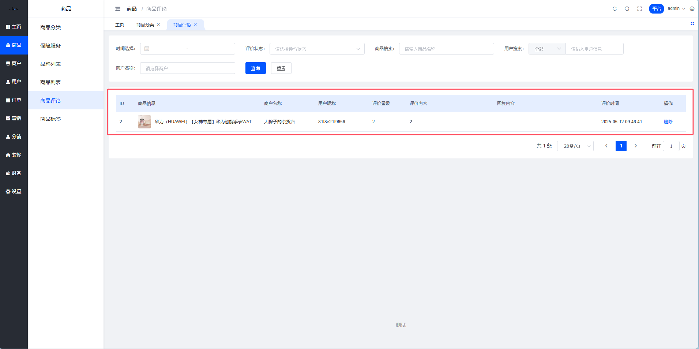
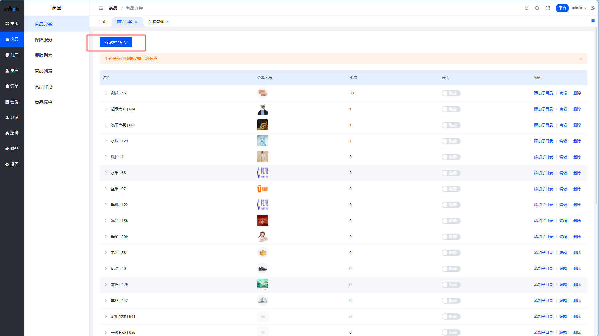
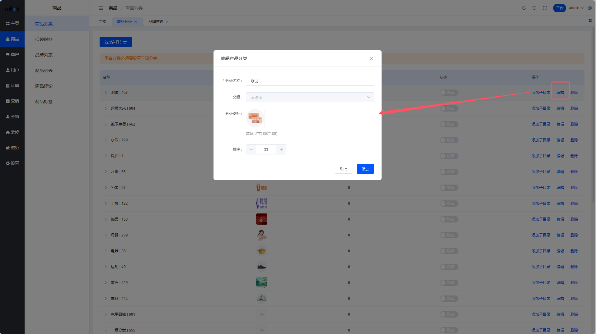
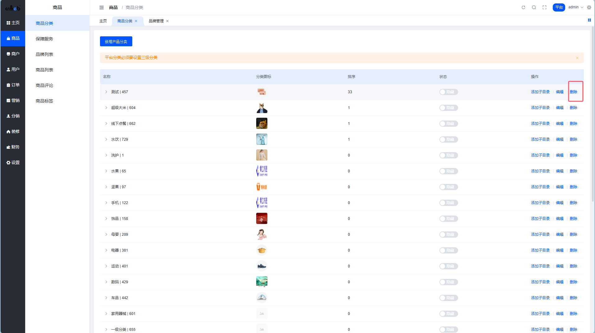
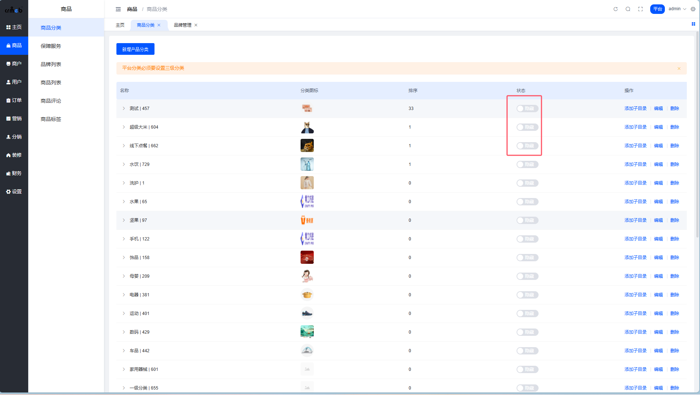
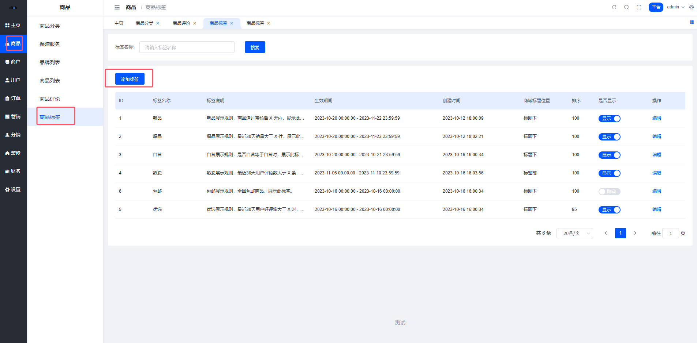
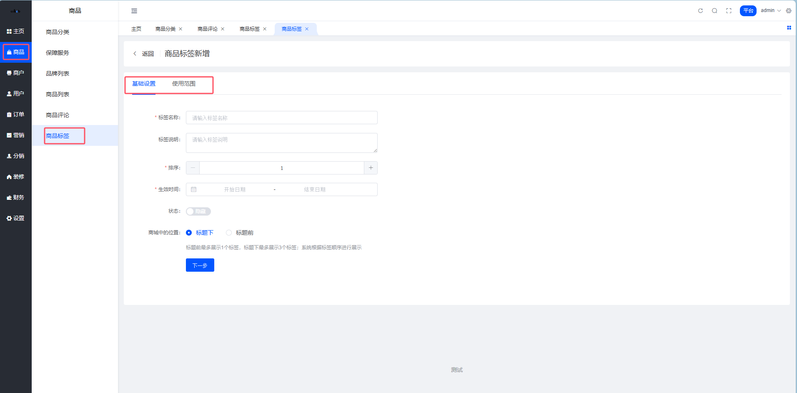
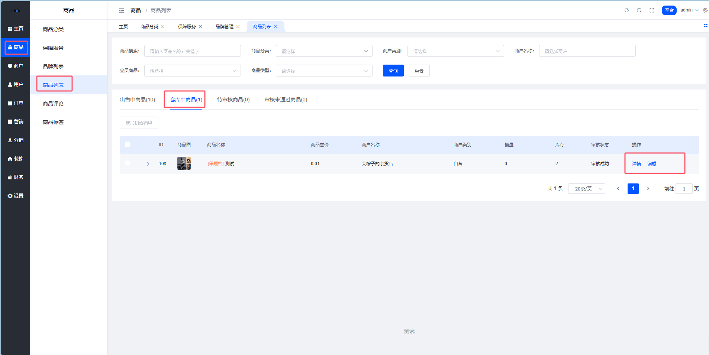
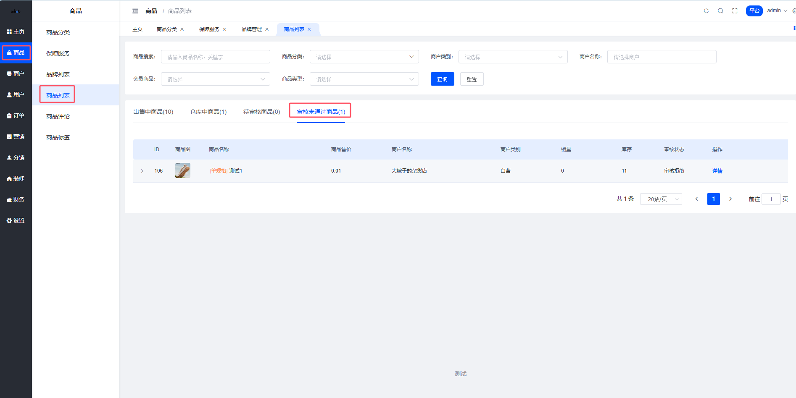

# 平台商品管理

# 商品评论说明

## 一、平台商品评论

### 1. 平台商品评论说明

#### 1.1功能概述

本模块用于管理用户提交的商品评价信息，支持按时间范围、用户属性等多维度筛选评价记录，并提供基础的数据操作能力。核心功能包括：

评价检索：通过时间范围、评价状态/商品搜索/用户搜索/商户搜索精准定位评价。

数据看板：实时展示评价量级分布与用户互动状态。

评价管理：支持评价内容查看、无效评价删除，删除后将不在用户端展示。

#### 1.2页面结构说明

**筛选区（顶部）**

**时间选择：**
支持自定义时间段（起始日-截止日）

**评价状态：**
下拉选择已回复和未回复
点击”查询”根据选择的条件进行筛选，点击”重置”清空已选条件

**商品搜索：**
输入框支持商品名称模糊搜索（如输入”华为”筛选相关评价）

**用户搜索：**
支持根据用户ID、手机号、用户昵称来筛选评价

**商户名称：**
根据商户名称筛选评论

**数据列表区**

| 字段名称 | 字段说明 |
| --- | --- |
| ID | 评论id |
| 商品信息 | 展示商品的图片名称信息 |
| 商户名称 | 展示店铺名称 |
| 用户昵称 | 展示用户昵称 |
| 评价星级 | 根据商品质量和服务态度来进行评分，1-5分制，评价星级商品质量优先于服务态度 |
| 评价内容 | 展示用户评价内容，限制140字符，图片不展示 |
| 回复内容 | 展示对应商户对此评价的回复内容，限制50字符 |
| 评价时间 | 用户提交评价的精确时间 |
| 操作 | 仅提供”删除”功能（需二次确认，删除后不可恢复） |

---

# 商品分类说明

## 一、平台商品分类

### 1. 平台商品分类说明

1.平台商品分类为三级分类，添加商品前需要先添加分类;
2.平台商品分类用于商家添加商品时，对商品根据平台分类进行划分，在添加商品时只能选择一个三级平台商品分类;

### 2. 平台商品分类添加

功能说明：添加商品分类前，先根据平台自己经营产品的类型进行划分，一级分类为食品/服装等大类，二三级分类在一级分类的基础上进行详细划分，划分清楚后将数据添加至系统中。
页面路径：商品 > 商品分类

第一步：进入商品分类页面；

第二步：点击【新增产品分类】按钮，打开产品分类添加弹窗；

第三步：填写商品分类信息，点击【确定】按钮，商品分类添加完成（添加子分类操作也是如此）。

#### 2.1 添加商品分类字段说明表

| 字段名称 | 字段说明 |
| --- | --- |
| 分类名称 | 分类名称用于用户端商品分类的展示，分类名称一般针对商品类型进行添加，最多可以输入8个字 |
| 父级 | 平台商品分类为多层级结构，平台分类必须设置3级分类，通过指定父级绑定分类父子级关系 |
| 分类图标 | 三级分类图标在用户端-移动端显示，一级图标在用户端- PC商城显示；建议图标尺寸为180*180px |
| 排序 | 用户端及管理端均是按照排序倒叙排列，数字大的在前 |

### 3. 平台商品分类编辑

功能说明：若平台商品分类信息不正确，可通过编辑功能进行修改，修改完成之后用户端对应的分类信息也会同步进行修改。
第一步：在商品分类页面，点击【编辑】按钮，打开产品分类编辑弹窗；

第二步：修改错误的商品分类信息，点击【确定】按钮，商品分类修改完成。

### 4. 平台商品分类删除

功能说明：分类下有产品或者下级分类，则该分类无法直接删除，需先删除分类下的下级分类和产品。
第一步：在商品分类列表页面，点击【删除】按钮，打开删除二次确认弹窗；

第二步：在删除二次确认弹窗中，点击【确定】按钮，商品分类删除完成。

### 5. 平台商品分类隐藏

功能说明：部分已经使用的商品分类，由于特殊原因不想继续使用，可以将此商品分类隐藏；也可用于小程序提交WX审核，快速隐藏分类使用
第一步：将状态按钮点击至隐藏状态，隐藏分类操作完成。

---

# 商品标签-平台

平台端商品标签主要用于用户端（移动端商城+PC商城）商品列表的展示；平台端商品标签包括：根据系统规则自动化标签运营，以及手动创建修改标签两种模式。
菜单页面路径：商品—-商品标签

## 一、标签展示规则

商品标签会根据标签选择的位置，展示在标题前/标题下；
标题前最多展示1个标签，标题下最多展示3个标签；
一个商品对应多个标签时，按照标签排序，排序大的进行展示；
系统最多允许同时开启5个标签。

## 二、自动化标签

系统内置了一些标签规则，运营者可以根据运营规则展示/隐藏这些标签，内置标签规则如下：
新品展示规则，商品创建时间后 X 天内，展示此标签；
爆品展示规则，最近30天销量大于 X 件，展示此标签；
自营展示规则，商家有自营标签时，展示此标签；
热卖展示规则，最近30天用户评论数大于 X 条，展示此标签；
优选展示规则，最近30天用户5星好评大于X时，展示此标签；
包邮展示规则，全国包邮商品，展示此标签。

系统根据标签生效时间以及标签的开启状态，将符合规则的商品自动标记此标签。

## 三、手动创建标签

第一步：点击【添加标签】按钮，打开添加标签侧滑；

第二步：填写标签相关信息，点击【保存】按钮，创建标签完成。

字段说明：
标签名称：展示在用户端的标签文字；
标签说明：对于标签进行描述，方便后期维护；
排序：标签根据排序进行展示优先级；
生效时间：标签只有在生效时间满足条件才会展示；
状态：只有开启状态才会展示；
商城中的位置：标签在用户端的展示位置；
商品参与类型：通过商品绑定标签，通过品牌绑定标签，通过分类绑定标签，通过商户绑定标签

---

# 商品列表说明

## 一、平台商品列表

### 1. 平台商品列表说明

1.出售中商品；可以查看商品详情、预览商品、编辑商品的虚拟销量和排序、强制下架商品。

2.仓库中商品；平台审核通过且没有上架的商品，可以查看商品详情、编辑商品的虚拟销量和排序。

3.待审核商品；商户端提交需要审核的商品将会进入待审核，可以查看商品详情、审核商品、编辑商品的虚拟销量和排序。

4.审核未通过商品；审核没有通过的商品将会在此展示。

| 字段名称 | 字段说明 |
| --- | --- |
| 商品搜索 | 根据商品名称和关键字进行搜索 |
| 商品分类 | 根据商品的分类进行筛选（三级分类） |
| 商户类别 | 商户类别分为自营和非自营，在添加商户的时候选择 |
| 商户名称 | 根据商户名字进行筛选 |
| 会员商品 | 会员商品分为会员商品和非会员商品，在添加商品的时候选择 |
| 商品类型 | 商品类型分为普通商品、虚拟商品、云盘商品、卡密商品，商品的类型在添加商品时选择 |

---
