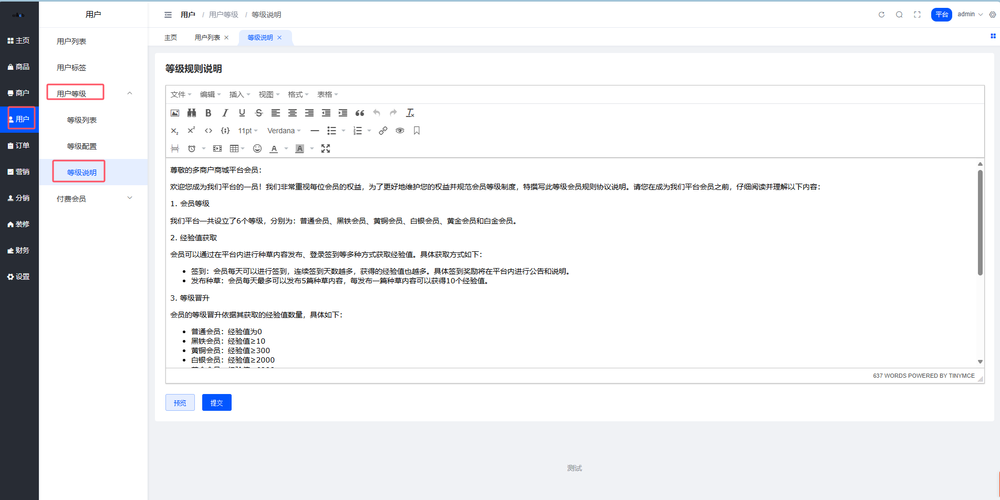
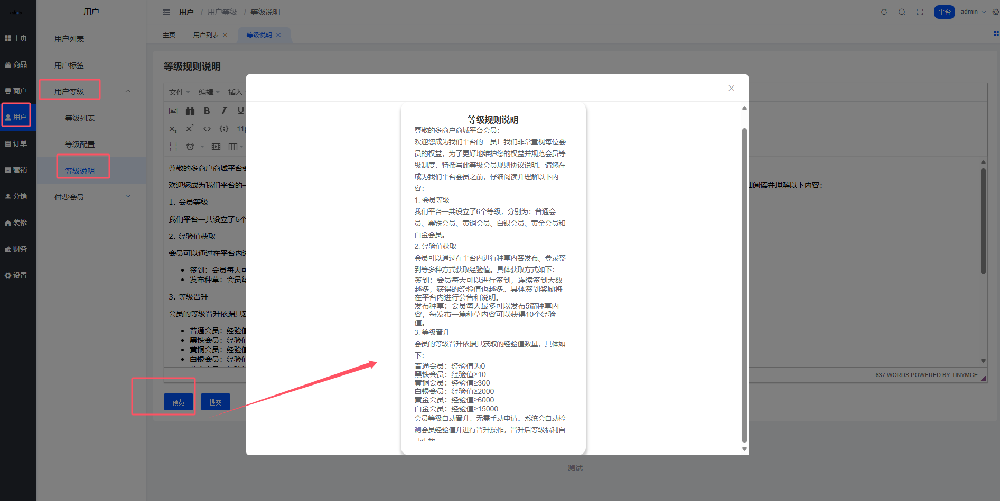
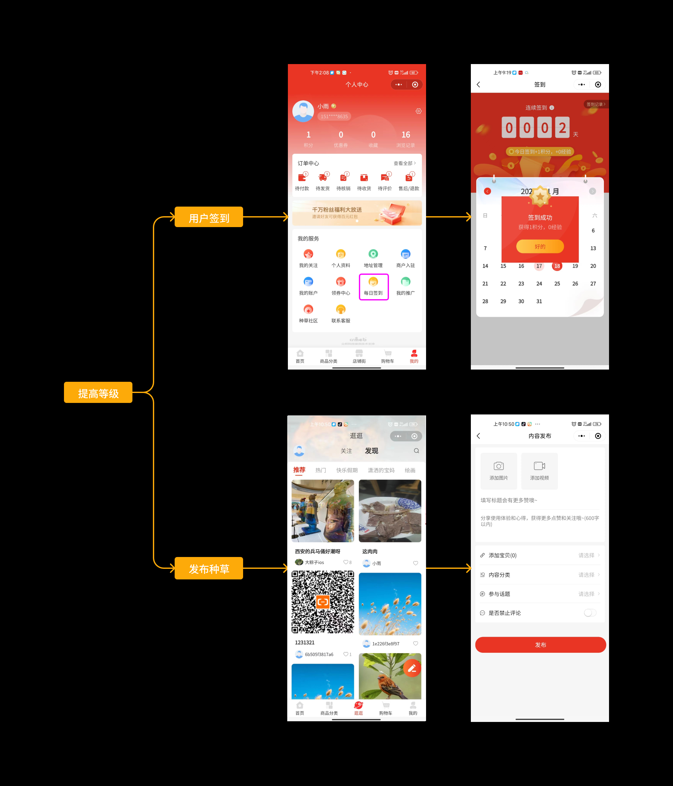
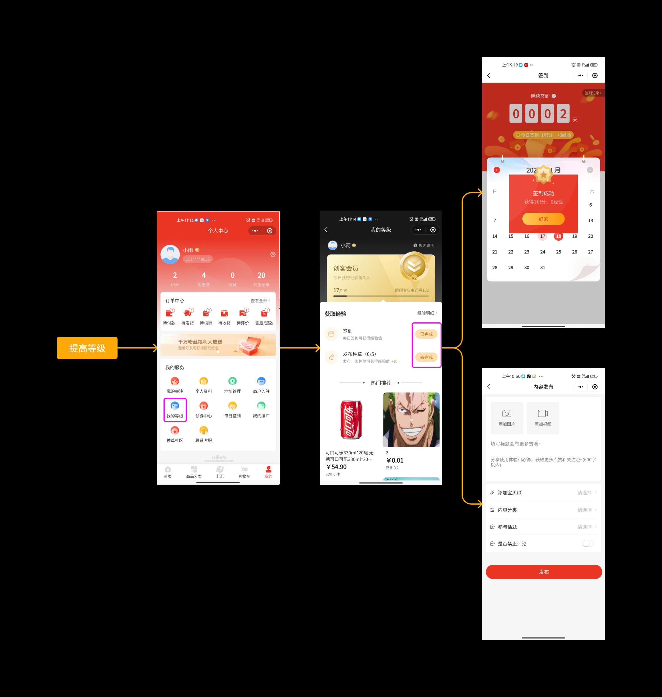
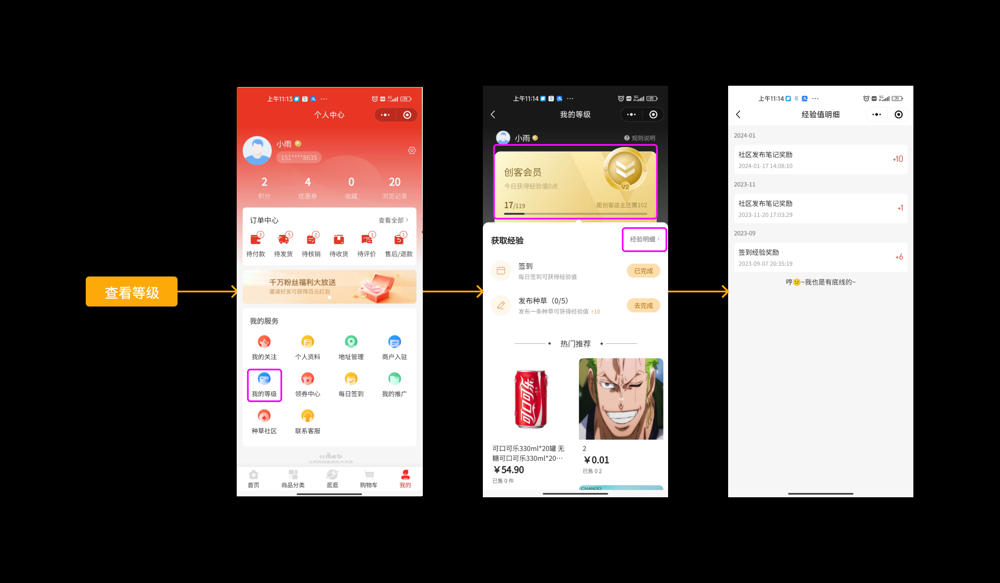
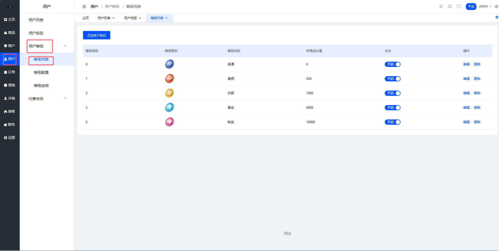
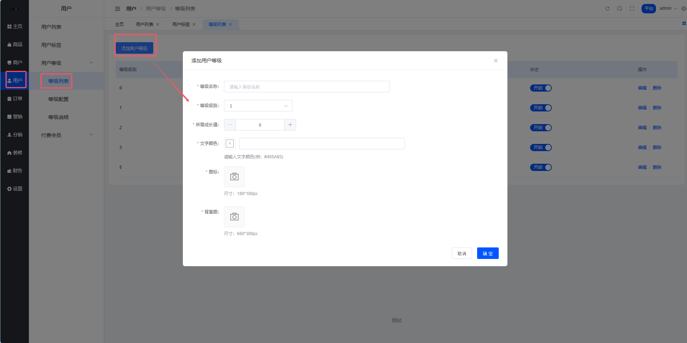
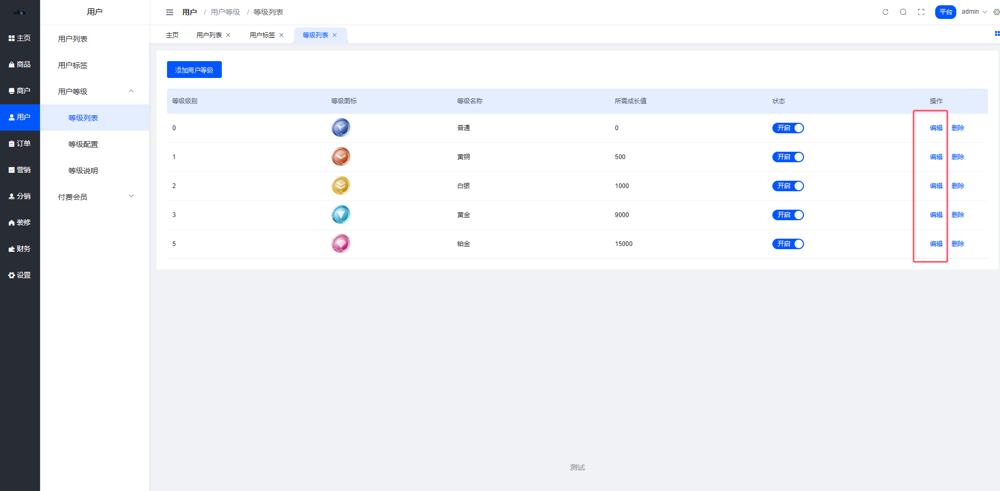

# 用户等级管理

## 目录

- [一、等级说明](#一等级说明)
  - [位置](#位置)
  - [预览效果](#预览效果)
- [二、用户等级说明](#二用户等级说明)
  - [用户等级介绍](#用户等级介绍)
  - [功能说明](#功能说明)
    - [2.1 提高等级](#21-提高等级)
    - [2.2 查看等级及明细](#22-查看等级及明细)
    - [2.3 等级规则](#23-等级规则)
- [三、等级列表](#三等级列表)
  - [位置](#位置-1)
  - [添加用户等级](#添加用户等级)
  - [编辑用户等级](#编辑用户等级)

---

## 一、等级说明

### 位置

平台管理后台 → 用户 → 用户等级 → 等级说明

### 预览效果

---

## 二、用户等级说明

### 用户等级介绍

用户等级在商城及种草社区中通常是根据用户的活跃度、贡献度以及社区参与程度等因素来确定的，高等级的用户在商城及种草社区中具有一种尊贵的身份象征，他们的言论和推荐更受其他用户的关注和认可，这也激励了用户在商城/社区中更积极地参与和贡献,形成了一个互相交流、互相学习的社区氛围，以此促成商品成交。

### 功能说明

#### 2.1 提高等级

用户可通过累计经验值来提高自身等级，经验值可以通过签到、发布种草来获取。

#### 2.2 查看等级及明细

用户可以查看自己现在的等级，累计经验值，以及距离下一等级所需经验值；支持用户查看等级明细。

#### 2.3 等级规则

1. 用户等级获取的经验值，只会增加，不会减少
2. 用户等级名称、卡片背景、文字颜色、等级提升所需的经验值等均支持平台设置
3. 等级会员与会员折扣等权益均无关

---

## 三、等级列表

### 位置

平台管理后台 → 用户 → 用户等级 → 等级列表

### 添加用户等级

**字段说明：**

- **等级名称** — 展示使用
- **等级级别** — 等级一定是连续的数字
- **所需成长值** — 当用户经验值需要多少就能达到此等级
- **文字颜色** — 移动端用户等级页面 字体颜色
- **图标** — 等级图标icon
- **背景图** — 移动端用户等级页面展示

### 编辑用户等级

编辑页面同上图（添加等级页面）

**需要注意的是：**

**等级为0的数据是预设数据，无法编辑级别、成长值、会员状态字段**

