# 用户管理

## 目录

- [一、用户标签](#一用户标签)
  - [功能介绍](#功能介绍)
  - [位置](#位置)
  - [操作说明](#操作说明)
- [二、用户列表](#二用户列表)
  - [功能介绍](#功能介绍-1)
  - [界面说明](#界面说明)
  - [用户编辑](#用户编辑)
  - [用户查看](#用户查看)
  - [修改用户积分](#修改用户积分)
  - [修改用户余额](#修改用户余额)
  - [设置用户标签](#设置用户标签)
  - [修改用户推广人](#修改用户推广人)
  - [后台赠券功能](#后台赠券功能)
- [三、用户等级配置](#三用户等级配置)
  - [位置](#位置-1)
  - [字段说明](#字段说明)

---

## 一、用户标签

### 功能介绍

用来管理用户的标签。

### 位置

平台后台 > 用户 > 用户标签

### 操作说明

**可以添加、编辑、删除标签**

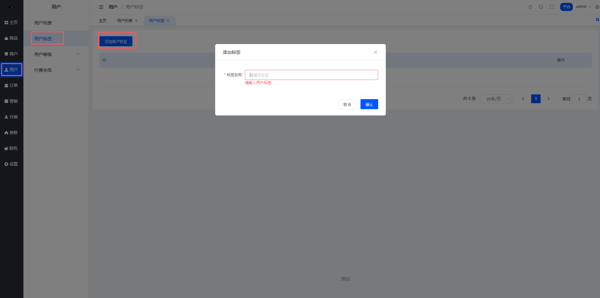

---

## 二、用户列表

### 功能介绍

本模块用于管理平台注册用户信息，支持多维度筛选、用户数据查看及账户操作。核心功能包括：

- **精准筛选**：通过身份标签、注册类型、时间范围等条件定位目标用户
- **账户状态管理**：标记异常��户（如"已注销"）、调整用户余额/积分/标签/修改上级推广员/赠送会员
- **操作审计**：记录用户注册时间、最后一次登录时间等

### 界面说明

#### 1. 筛选区（顶部）

用户搜索

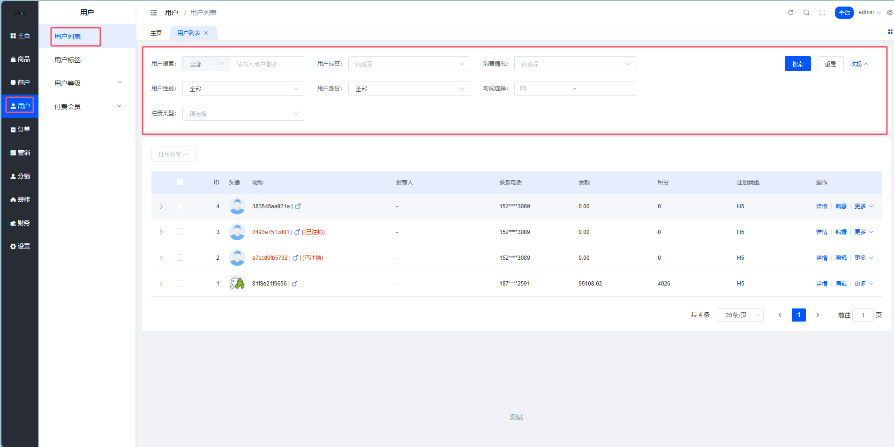

### 用户编辑

用户可编辑，可以开启是否为推广员的操作。

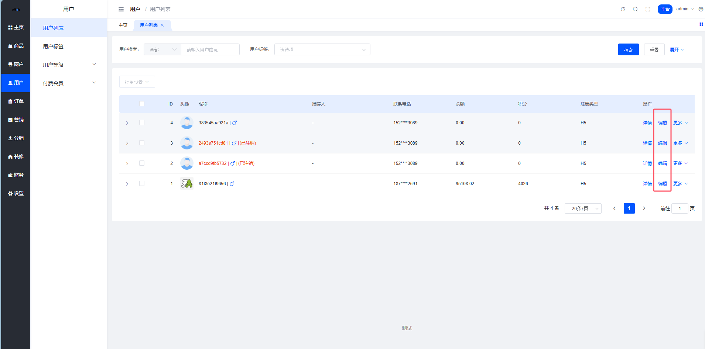

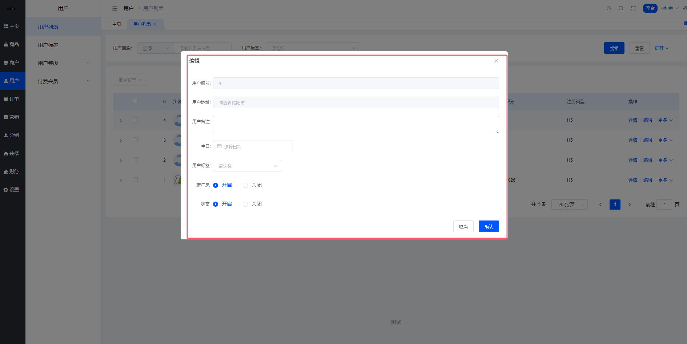

### 用户查看

列表可查看用户信息。

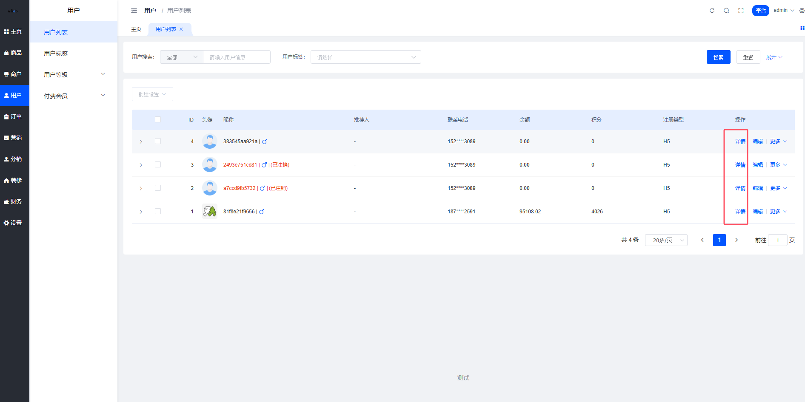

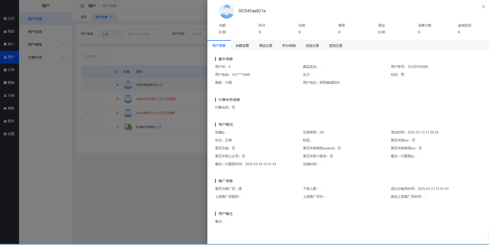

### 修改用户积分

列表可修改用户积分。

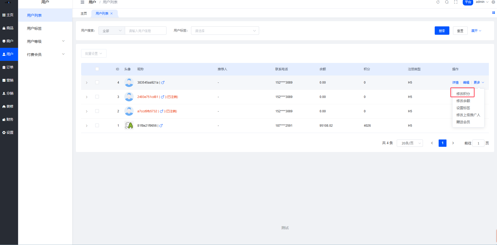

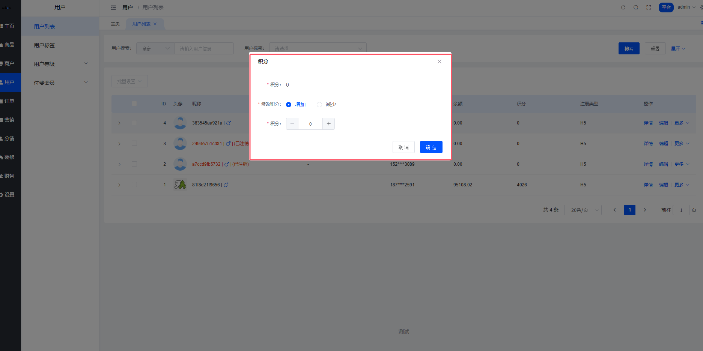

### 修改用户余额

列表可修改用户余额。

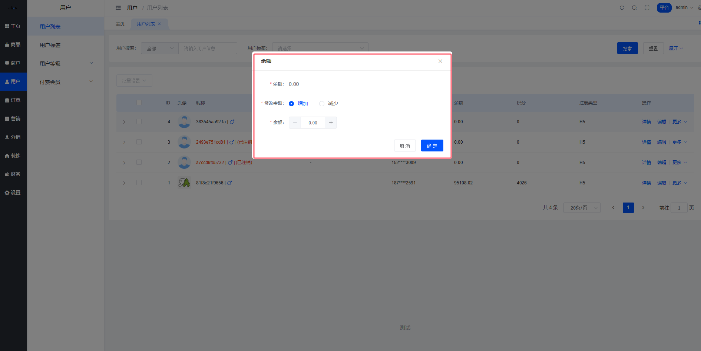

### 设置用户标签

列表可设置用户标签，可单独设置，也可批量设置。

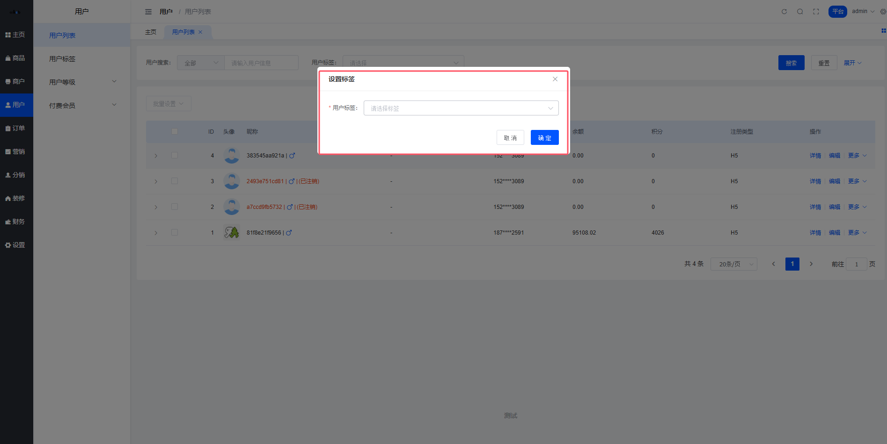

### 修改用户推广人

列表可修改用户的推广人。

点击用户头像选择用户

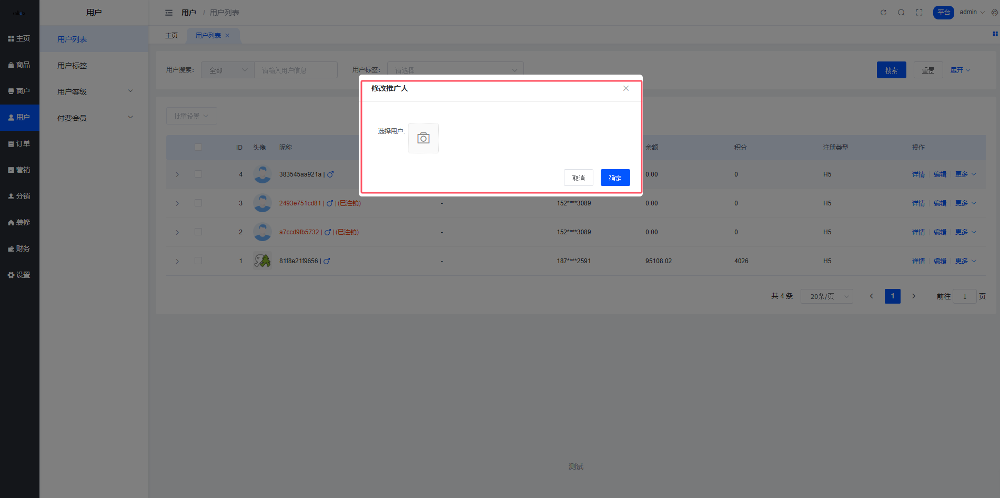

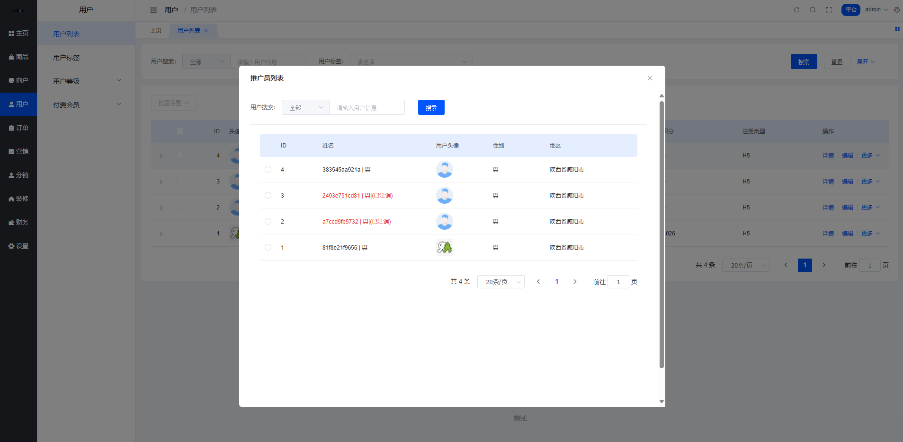

### 后台赠券功能

系统支持批量选择用户赠送优惠券

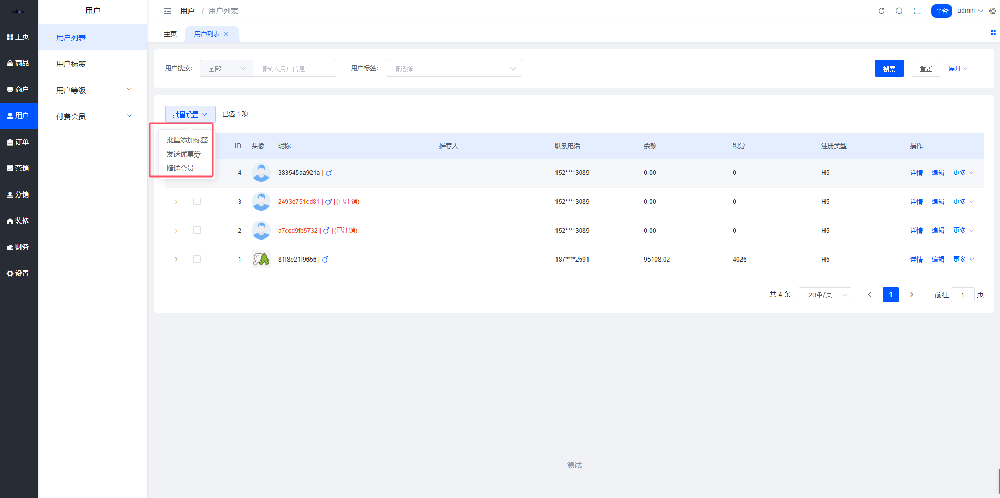

---

## 三、用户等级配置

### 位置

平台管理后台 → 用户 → 用户等级 → 等级配置

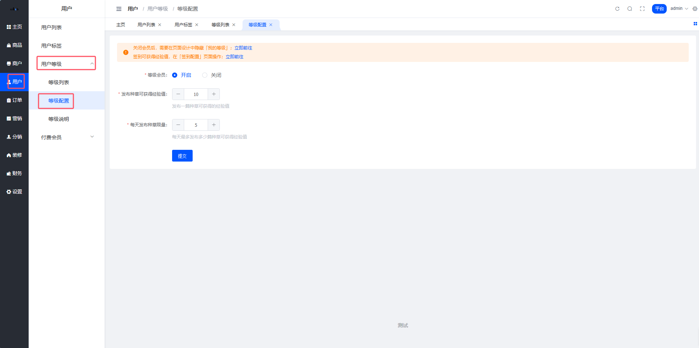

### 字段说明

- **用户等级开关** — 关闭后不再展示用户等级，社区种草不再提供经验获取
- **发布种草可获得经验值** — 发布一篇社区种草可获得经验值
- **每天发布种草限量** — 每天可获得经验的种草数量

> 注意：每天发布种草限量、发布种草可获得经验值任意一值为0时，发布种草不获得经验值
