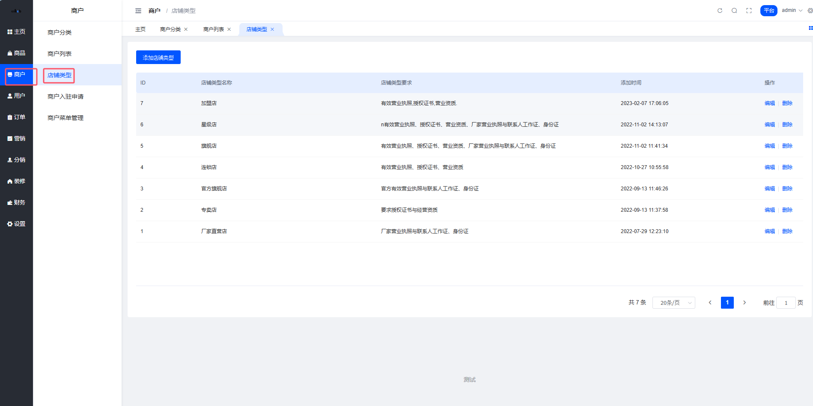
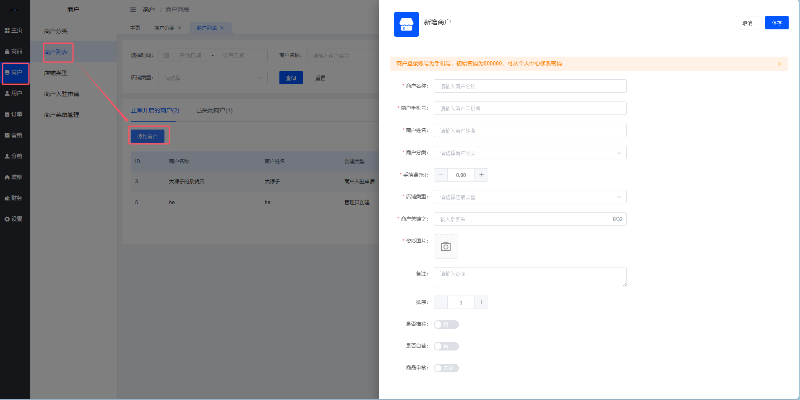
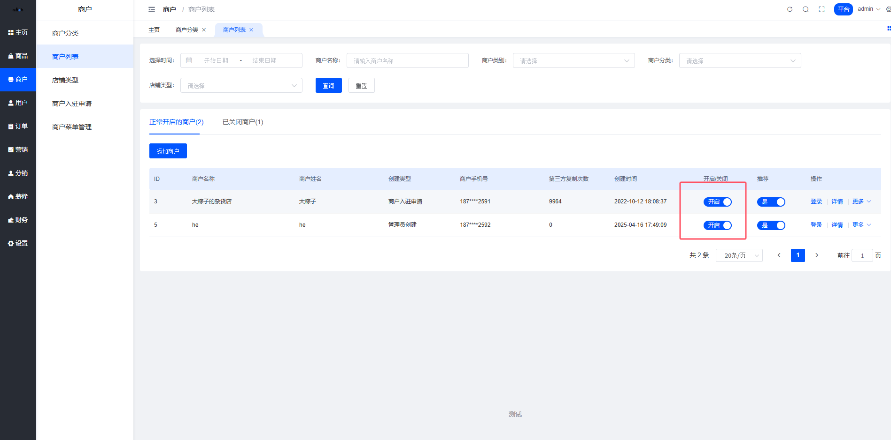
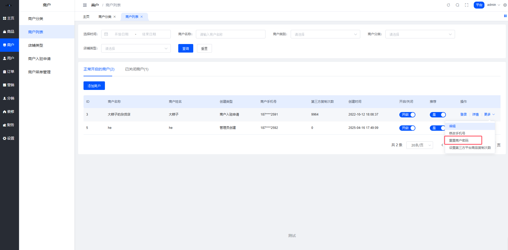
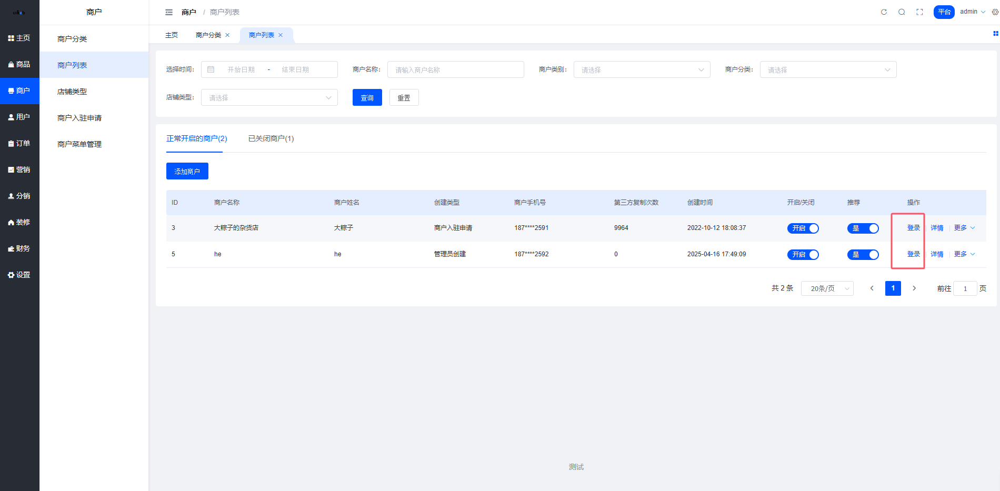
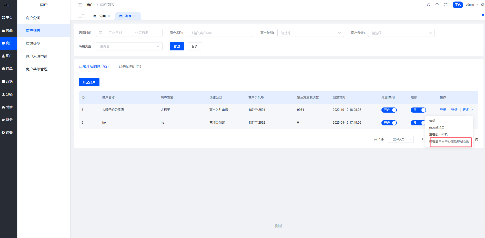
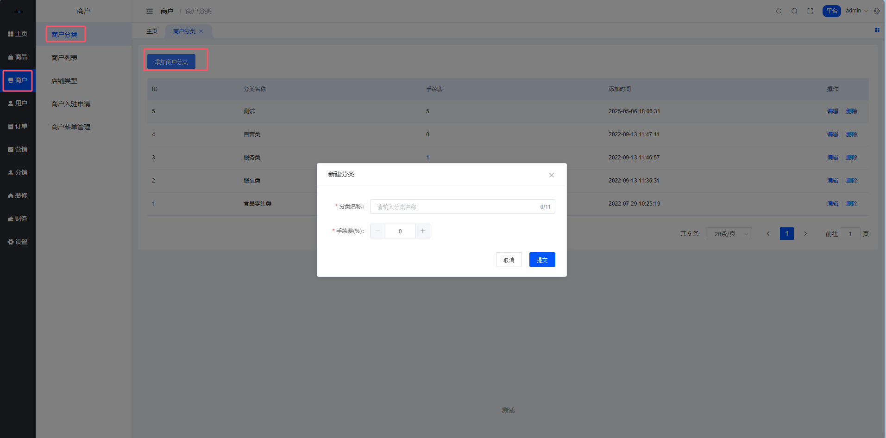
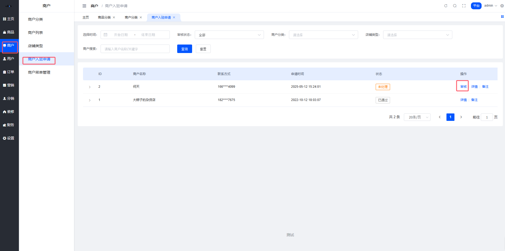
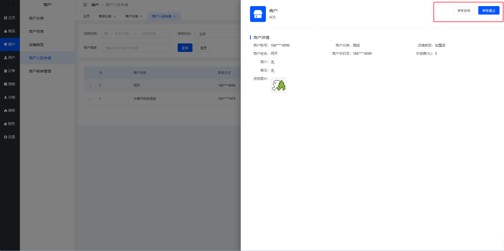
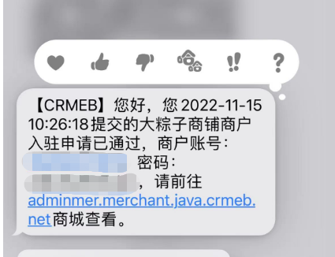

# 商户管理

本文档介绍CRMEB多商户商城系统的商户管理功能，包括店铺类型设置、商户列表管理、商户分类配置和商户入驻流程。

## 目录

- [店铺类型](#店铺类型)
- [商户列表](#商户列表)
- [商户分类](#商户分类)
- [商户入驻](#商户入驻)

---

## 店铺类型

### 一、功能介绍

创建商户需先创建店铺类型，店铺类型是多商户商城系统特有的功能，CRMEB JAVA多商户商城是一个商户对应一个店铺的模式，设置店铺类型，方便平台针对不同类店铺多样化运营。

### 二、位置

平台后台 > 商户 > 店铺类型

### 三、说明

设置店铺属于哪种类型，并且有店铺类型的要求，上传商户资质的时候可按照此要求上传资质。可进行增加、编辑、删除操作。

---

## 商户列表

### 一、功能介绍

本模块用于管理系统商户账户状态及基础信息，支持账户状态控制、登录行为操作及基础信息维护。主要功能包括：

- 商户状态管理：实时查看商户启用/关闭状态，支持快速切换登录商户
- 安全控制：提供密码重置、登录行为监控等安全功能
- 管理入驻平台的所有商户，分为正常开启的商户、关闭的商户。手动添加的商户默认关闭状态。

### 二、位置

平台后台 > 商户 > 商户列表

### 三、说明

1. 可手动添加商户、编辑商户信息、设置商户手���费、开启商户、推荐商户、修改手机号、重置商户密码、设置第三方平台商品复制次数功能。
2. 商户登录账号为手机号，初始密码为000000，可从个人中心修改密码。

**手续费：**此处如果设置商户手续费，优先以此处设置的商户手续费为准；此处如果没有设置商户手续费，会默认取商户分类中设置的商户手续费。

**商品审核：**可设置商户下的商品是否手动审核，开启为手动审核商品，关闭为免审核。

**是否推荐：**可设置是否推荐到首页展示。

**是否自营：**可设置该商户是否为自营店，开启为自营，移动端及会显示自营标识，关闭则为非自营店，其店铺相关信息均不展示自营标识。

### 四、核心操作

**1. 商户状态管理**

场景：临时禁用风险商户

步骤：
- 在列表中找到目标商户行
- 点击 开启/关闭 切换按钮

**2. 密码紧急重置**

步骤：
- 点击 更多 列的 重置商户密码 按钮

**3. 快速商户登录**

操作流程：
- 点击 登录 按钮
- 系统自动跳转至商户视角界面

**4. 设置商户商品采集次数**

设置第三方平台商品复制次数功能

---

## 商户分类

### 一、功能介绍

本模块用于管理系统商户的分组分类规则，支持自定义分类标准及差异化手续费设置。核心功能包括：

- 分类管理：创建/编辑/删除商户分类，配置差异化手续费率
- 数据追溯：记录分类创建时间，支持历史版本回溯

创建商户需先创建商户分类，商户分类设置为三级分类。

### 二、位置

平台后台 > 商户 > 商户分类

### 三、说明

平台可向入驻的商户收取手续费，此费用为商户每笔收入收取的费用。在商户分类处可设置默认手续费，取值范围为0~100。可进行增加、修改、删除操作。此手续费还可在商户编辑处修改。

### 四、核心操作

**1. 新建商户分类**

路径：商户 → 商户分类 → 添加商户分类

步骤：
- 点击顶部 + 添加商户分类 按钮
- 填写表单：
  - 分类名称：建议按行业/业务特征命名（如"零食"）
  - 手续费率：输入0-100之间的整数（如免手续费输入0）
- 提交后系统自动生成ID并记录时间

**2. 调整手续费率**

步骤：
- 找到目标分类行
- 点击 编辑 → 修改手续费数值
- 保存后即时生效

**3. 删除分类**

注意事项：
- 分类下有关联商户时不可删除（需先迁移商户到其他分类）

操作流程：
- 点击 删除 按钮

---

## 商户入驻

### 一、功能介绍

商户入驻是多商户商城系统招商运营的第一重要功能，需在后台先设置好商户分类、店铺类型、入驻协议、配置好短信通知，才可在移动端、PC端顺利完成商户入驻。

### 二、位置

平台后台 > 商户 > 商户入驻申请

### 三、平台端审核商户

**1. 在平台端管理入驻商户，可审核申请的商户，可添加备注。**

位置：平台后台 > 商户 > 商户入驻申请

- 1.1、审核通过直接提交
- 1.2、审核拒绝要填写拒绝原因

### 四、审核状态

**1. 入驻商户查看入驻审核状态。**

审核通过短信内容模板：

#### 短信内容

恭喜，您的商户已经入驻成功，并且可以使用商户端系统操作您的商品。商户端登录账号为您的手机号，登录密码为发送至手机短信中初始密码，祝您使用愉快！

---
