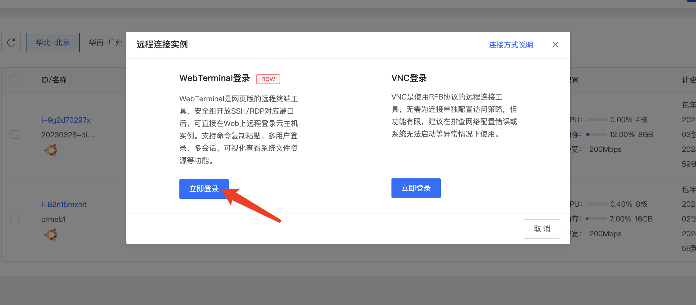
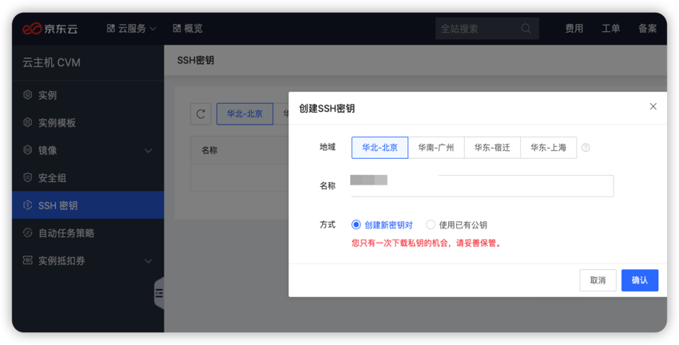
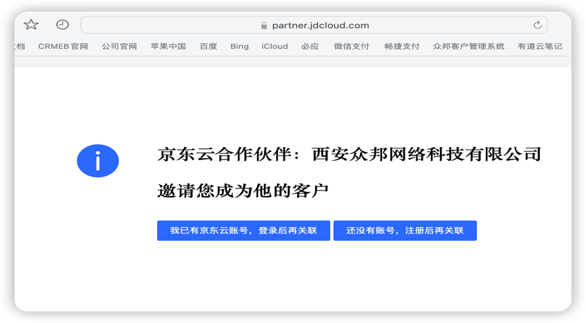
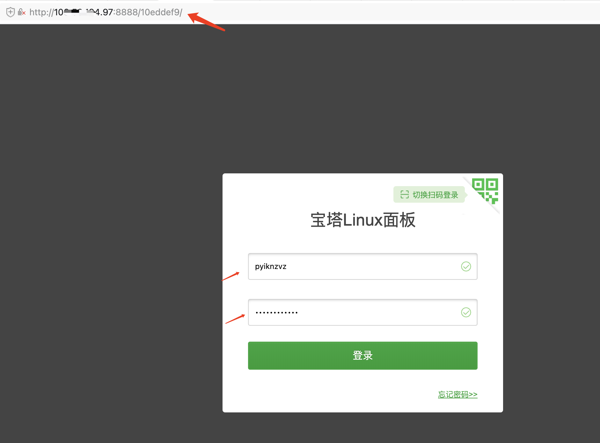

# 云服务器购买和部署指南

想把系统部署到云服务器上吗？
不想在本地电脑上跑？别慌，这份指南告诉你怎么买服务器、怎么装软件、怎么让网站上线！

---

## 快速决策（选择适合你的方案）

我应该选择哪种方案？

| 场景 | 选择 | 原因 |
|------|------|------|
| 我在学习/测试 | 本地运行 | 便宜，快速，但只有你自己能访问 |
| 我要正式上线 | 云服务器部署 | 24小时运行，别人能访问，稳定可靠 |
| 我钱比较紧 | 云服务器（低配） | 2核2GB内存就能跑，一个月几十块 |
| 我要很多用户 | 云服务器（高配） | 多核高内存，能应对并发 |

小贴士：大多数公司都是先本地开发，测试好了再上云

---

## 第一步：选择云服务商和服务器配置

云服务商有很多，我们用京东云做例子（当然用阿里云、腾讯云也可以）

### 推荐配置（不同预算）

| 预算 | 配置 | 价格 | 适合 |
|------|------|------|------|
| 入门 | 2核2G内存、50GB硬盘 | 约50元/月 | 学习、小流量项目 |
| 标准 | 2核4G内存、100GB硬盘 | 约100元/月 | 中小商城，正常上线 |
| 专业 | 4核8G内存、200GB硬盘 | 约200元/月 | 大一点的流量 |

重要提醒：
- 硬盘不能太小，要留给数据库、日志、上传文件的空间
- 内存太小会经常卡
- 建议新手选"标准"配置，体验最好

---

## 开始购买服务器

### 1. 打开云服务商官网

我们以京东云为例：
访问京东云官网 https://www.jdcloud.com/



### 2. 登录或注册账号

- 点击右上角"登录"
- 如果没有账号就注册一个
- 需要实名认证（身份证号）


小贴士：如果你是第一次买，可能有新用户优惠，记得看看

### 3. 进入云主机购买页面

- 找到菜单里的"云主机"或"服务器"
- 点击"购买"按钮

### 4. 选择基础配置

操作系统选择：
- 推荐 CentOS 7.x 或 Ubuntu 20.04
- 不要选 Windows（贵，而且不太适合部署Java项目）

地域选择：
- 选离你用户最近的地区
- 或者选你公司所在的城市

可用区：
- 一般不用改，系统给你默认就行



### 5. 选择硬件配置

根据你的预算：

- CPU：选2核或4核
- 内存：选2GB、4GB或8GB
- 硬盘：选50GB以上（系统盘+数据盘）

配置组合建议：
新手推荐：2核4GB + 100GB硬盘
实际需要的话可以升级

### 6. 选择网络配置

宽带选择：
- 推荐5Mbps以上
- 按用量计费（按月付费）比较划算

公网IP：
- 一定要勾选！不然外面访问不了你的网站

### 7. 设置登录方式

两种方式选一个：

1. 密码登录（推荐新手）
   - 设置一个强密码（大小写+数字+符号）
   - 保存好这个密码！

2. 秘钥对登录（更安全，但有点复杂）
   - 适合有经验的开发者

重要：密码不要设得太简单！123456这样的密码分分钟被黑

### 8. 确认订单

- 检查一遍所有配置
- 选择购买时长（新手建议先买一个月试试）
- 点击"立即购买"

付款：
- 支付宝或微信
- 记住订单号

服务器购买完成！

几分钟后，你就会拿到：
- 一个IP地址（用来访问你的网站）
- 登录密码（很重要！）
- 服务器名称

---

## 服务器初始化和环境安装

现在你有了一台裸服务器，需要给它装软件。

### 第一步：远程连接到服务器

Windows 用户

用PuTTY或MobaXterm连接（这些是免费工具）

1. 下载PuTTY：官网 https://www.putty.org/
2. 打开PuTTY
3. 输入你的服务器IP地址
4. 点击"Open"
5. 输入用户名：root
6. 输入你设置的密码

Mac和Linux用户

打开终端，运行：
ssh root@你的服务器IP地址

然后输入密码

### 第二步：更新系统软件

连接成功后，运行：

如果是CentOS：
```
yum update -y
yum install -y curl wget vim
```

如果是Ubuntu：
```
apt update
apt upgrade -y
apt install -y curl wget vim
```

这会花几分钟，耐心等待

### 第三步：安装宝塔面板（强烈推荐！）

宝塔面板是个可视化工具，让你不用记那么多命令就能管理服务器。很方便！

运行这条命令安装宝塔：

```
yum install -y wget && wget -O install.sh http://download.bt.cn/install/install_6.0.sh && sh install.sh
```

小贴士：
- 上面的命令很长，直接复制粘贴
- 会问你是否继续，输入y然后回车
- 安装完会给你一个地址和账号密码，记好了！



### 第四步：在宝塔面板里装软件

安装完宝塔后，你就可以用网页来管理服务器了。

打开宝塔给你的地址，就能看到一个很漂亮的界面。

在"软件商店"里，一键安装：

- Nginx（网页服务器）
- MySQL 8.0（数据库）
- Redis（缓存）
- Java JDK 17（Java运行环境）
- Node.js 18（前端工具）

重要：
- 按照上面的顺序装（先装基础的）
- 每个装好后再装下一个
- 装MySQL和Redis的时候会让你设密码，保存好！



---

## 部署你的项目到服务器

### 前期准备

1. 上传项目代码
   - 用SFTP工具把项目上传到服务器
   - 或者在服务器上用git clone拉取代码

2. 数据库初始化
```
mysql -u root -p
# 输入密码
```

然后运行（和本地一样）：
```
CREATE USER 'dbuser'@'localhost' IDENTIFIED BY '你的密码';
GRANT ALL PRIVILEGES ON *.* TO 'dbuser'@'localhost';
FLUSH PRIVILEGES;
CREATE DATABASE shop_db CHARACTER SET utf8mb4;
GRANT ALL PRIVILEGES ON shop_db.* TO 'dbuser'@'localhost';
FLUSH PRIVILEGES;
```

3. 导入数据库脚本
```
mysql -u dbuser -p shop_db < /path/to/database/database.sql
```

### 启动后端服务

进入Java项目目录，修改配置文件指向服务器的MySQL和Redis：

```
spring:
  datasource:
    url: jdbc:mysql://localhost:3306/shop_db
    username: dbuser
    password: 你的数据库密码
  redis:
    host: localhost
    port: 6379
    password: 你的redis密码
server:
  port: 8000
```

然后启动：
```
java -jar system-admin.jar
```

小贴士：可以用nohup让程序在后台运行
```
nohup java -jar system-admin.jar > app.log 2>&1 &
```

### 部署前端项目

用宝塔的"网站"功能很方便：

1. 在宝塔里新建网站
2. 绑定你的域名
3. 上传编译好的前端文件（dist文件夹）
4. 配置反向代理指向你的Java后端
5. 申请SSL证书（https）

重要：
- 前端和后端要在不同的端口或域名
- 记得配置跨域CORS
- API地址要改成你的服务器地址

---

## 安全防护（很重要！）

线上环境比本地更容易被攻击，一定要做好这些：

### 1. 防火墙配置

用宝塔的防火墙：

- 只开放80（HTTP）、443（HTTPS）、22（SSH）端口
- 关闭不需要的端口

### 2. 数据库密码要强

- 用复杂密码（大小写+数字+符号）
- 不要用123456这样的弱密码

### 3. 定期备份

用宝塔的备份功能：

- 每天自动备份数据库
- 每周备份整个网站
- 备份文件存到别的地方（比如OSS）

### 4. 监控日志

- 定期看看服务器日志
- 看有没有可疑访问
- 看有没有错误导致服务崩溃

---

## 监控和性能优化

### 监控服务运行状态

用宝塔看：
- CPU使用率
- 内存使用率
- 硬盘使用率
- 网络流量

警惕这些情况：
- CPU经常跑满 → 需要优化代码或升级硬件
- 内存经常不足 → 增加内存或优化数据库查询
- 硬盘快满了 → 清理日志文件或增加硬盘

### 性能优化技巧

1. 启用Redis缓存
   - 把热门数据缓存在Redis
   - 数据库查询就快多了

2. 启用CDN
   - 给静态资源（图片、CSS、JS）用CDN
   - 访问速度会快很多

3. 数据库优化
   - 给常用字段加索引
   - 定期清理日志表

4. 代码优化
   - 避免N+1查询
   - 减少不必要的数据库操作

---

## 常见问题速查

### Q: 服务器连接不上？

检查清单：

1. IP地址对不对？
2. 密码对不对？
3. 防火墙有没有关闭22端口？
4. 服务器有没有宕机？

解决：登录云服务商后台，重启服务器试试

### Q: 网站访问很慢？

可能是：
- 硬件配置太低 → 升级配置
- 代码有问题 → 优化代码
- 数据库有问题 → 优化查询
- 网络问题 → 换个网络试试

快速排查：看宝塔的监控，找出是CPU、内存还是网络的问题

### Q: 突然访问不了，怎么办？

1. 看宝塔的日志 → 找错误信息
2. 检查磁盘是否满了 → 清理日志
3. 看Java程序是否还在运行 → 重启服务
4. 检查防火墙规则 → 确保端口开放

### Q: 怎样让网站用HTTPS（https://）？

在宝塔里：
1. 找到你的网站
2. 点击"SSL"
3. 申请免费证书（Let's Encrypt）
4. 自动配置

小贴士：HTTPS对SEO和用户信任很重要，一定要配置

### Q: 需要备案吗？

如果用国内服务器（比如阿里云、京东云）：
- 需要备案（用你的域名）
- 流程大约7-20天
- 先备案再解析域名

如果用国外服务器：
- 不需要备案
- 但访问可能比较慢

---

## 相关工具和资源

| 工具 | 用途 | 下载 |
|------|------|------|
| PuTTY | Windows连接服务器 | https://www.putty.org/ |
| MobaXterm | Windows连接服务器（功能更多） | https://mobaxterm.mobatek.net/ |
| FileZilla | SFTP上传文件 | https://filezilla-project.org/ |
| Navicat | 远程管理数据库 | https://www.navicat.com/ |

---

## 小结

现在你已经知道了：
- 怎么选择云服务器配置
- 怎么购买服务器
- 怎么安装和配置软件
- 怎么部署你的项目
- 怎么做安全防护
- 怎么监控和优化性能

接下来的步骤：
1. 选择合适的云服务商
2. 购买服务器
3. 按照本指南一步一步配置
4. 测试你的网站
5. 告诉朋友访问你的网站！

祝你部署顺利！

---

## 遇到问题？

- 看宝塔的文档（很详细）
- Google搜索错误信息
- 在云服务商的社区提问
- 找专业的运维人员帮忙

记住：所有云服务商都有免费的技术支持，别犹豫！
