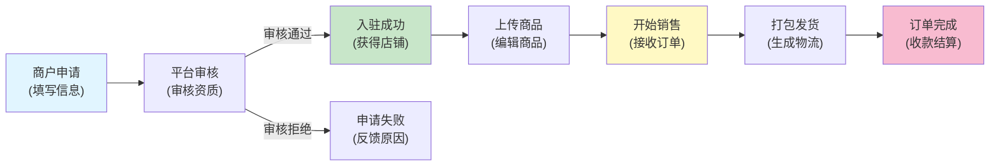
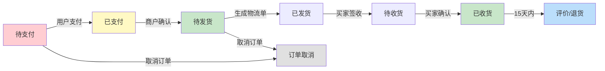
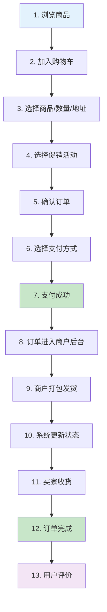

# 00_简介.md 配图制作指南

这份指南帮你快速制作文章中的7张配图。每张配图预计10-30分钟。

---

## 配图列表

### 1. 系统架构图 【必做】

**位置**：系统架构章节，第102行附近
**替换文字**：`【配图：系统架构图 - 用Excalidraw画一个简洁的三层架构图...】`

**使用工具**：Excalidraw （https://excalidraw.com）

**制作步骤**：
```
1. 打开 https://excalidraw.com
2. 新建画布
3. 绘制如下内容：

左侧 - 客户端层（Rectangle）：
  ├─ PC商城网站
  ├─ 移动H5网站
  ├─ 微信小程序
  └─ 移动APP

中间 - API服务层（Rectangle）：
  ├─ 用户认证服务
  ├─ 商品管理服务
  ├─ 订单服务
  ├─ 支付结算服务
  ├─ 促销营销服务
  └─ 报表分析服务

右侧 - 数据层（Rectangle）：
  ├─ MySQL数据库
  ├─ Redis缓存
  ├─ 文件存储
  └─ 日志系统

用箭头连接三层，标注 "HTTP/HTTPS API"

4. 颜色方案：
   - 客户端层：蓝色 (#4A90E2)
   - API层：绿色 (#50E3C2)
   - 数据层：紫色 (#B8E986)

5. 导出为 PNG 1200×800px，保存为：
   docs/01_初步了解/images/architecture.png
```

**预期效果**：简洁的三层盒状图，清晰展示系统分层

---

### 2. 商户管理流程图

**位置**：第145行

**使用工具**：Mermaid （在Markdown中代码生成）

**制作步骤**：
```markdown
在第145行，替换占位符为：

【配图：商户管理流程】

```

**预期效果**：左→右的流程图，展示商户生命周期

---

### 3. 商品规格矩阵表

**位置**：第170行

**使用工具**：Markdown表格（或Excel导出PNG）

**当前状态**：已在文章中用代码注释表示，可直接导出为表格截图

**如果要生成图片**：
```
1. 在Excel中创建表格：
   - 行头：颜色（黑、红、蓝）
   - 列头：尺寸（S、M、L、XL）
   - 单元格：库存/价格信息

2. 美化：
   - 颜色：交替填充背景
   - 字体：加粗表头
   - 边框：清晰的网格线

3. 导出为PNG 800×400px
   保存为：docs/01_初步了解/images/sku-matrix.png
```

---

### 4. 订单生命周期图 【必做】

**位置**：第193行

**使用工具**：Mermaid

**制作步骤**：
```markdown
【配图：订单生命周期】

```

---

### 5. 资金流向图 【必做】

**位置**：第218行

**使用工具**：Excalidraw

**制作步骤**：
```
1. 打开 https://excalidraw.com
2. 绘制三个主体（Rectangle）：
   - 左：消费者 👤
   - 中：平台方 🏢
   - 右：商户 👨‍💼

3. 用不同颜色的箭头表示资金流：
   - 消费者 → 平台：¥100 (蓝色箭头，标注"订单金额")
   - 平台 → 商户：¥90 (绿色箭头，标注"扣除佣金")
   - 平台 ⬅ 佣金：¥10 (红色箭头，标注"平台佣金")

4. 在各部分下方标注计算：
   商户到账 = 订单金额 - 佣金 - 退款 + 返利

5. 导出PNG 1000×600px
   保存为：docs/01_初步了解/images/payment-flow.png
```

**预期效果**：清晰的三方资金流向示意图

---

### 6. 完整交易流程图 【必做】

**位置**：第271行

**使用工具**：Mermaid

**制作步骤**：
```markdown
【配图：完整交易流程】

```

---

### 7. 运营后台截图拼图

**位置**：第404行

**使用工具**：实际系统截图 或 设计工具（Figma/Mock）

**制作步骤**：
```
选项A - 用真实系统截图（推荐）：
1. 部署CRMEB系统
2. 登录后台管理界面
3. 截图以下4个页面：
   - 商户管理列表
   - 订单管理列表
   - 数据分析仪表板
   - 促销活动配置

4. 用截图工具将4张图拼成2×2网格
   - 推荐工具：Photoshop / Figma / 免费的Canva
   - 尺寸：1200×800px

5. 保存为：docs/01_初步了解/images/admin-dashboard.png

选项B - 用设计工具绘制示意图：
如果还没部署系统，可用Figma快速绘制UI示意图
```

---

## 图片文件夹结构

```
docs/01_初步了解/
├─ 00_简介.md
├─ images/                          （新建此目录）
│  ├─ architecture.png             （系统架构图）
│  ├─ sku-matrix.png               （商品规格矩阵）
│  ├─ payment-flow.png             （资金流向图）
│  └─ admin-dashboard.png          （运营后台拼图）
├─ ILLUSTRATION_GUIDE.md           （本文件）
└─ ...其他文件
```

---

## 配图质量标准

所有配图都需要满足以下标准：

| 项目 | 标准 | 说明 |
|------|------|------|
| **分辨率** | ≥1200×800px | 高清，适配各设备 |
| **文件大小** | <300KB | 网页加载快速 |
| **文字大小** | ≥12px | 清晰可读 |
| **颜色** | 3-5种 | 和谐搭配，不过多 |
| **留白** | 充足 | 不拥挤，有呼吸感 |
| **标注** | 清晰 | 用中文标签说明各部分 |

---

## 快速制作提示

**⏱️ 最快的方法**：
1. 使用 Mermaid 生成流程图（只需5分钟）
2. 使用 Excalidraw 生成架构图（15分钟）
3. 用截图+Figma拼图做运营后台截图（20分钟）
4. 总耗时：40分钟内完成全部配图

**💡 省时技巧**：
- Mermaid 代码可直接在Markdown中生成，不需额外导出
- Excalidraw 支持分享链接，可边设计边调整
- 如果赶时间，优先完成3个【必做】配图，其他可后续补充

**🎨 美化技巧**：
- 用统一的颜色主题（建议蓝/绿/紫的配色）
- 所有框体使用同样的圆角度数
- 箭头标注清晰，用中文标签
- 重要节点用不同颜色突出

---

## 配图完成检查清单

- [ ] 所有7张配图都已创建
- [ ] 图片尺寸 ≥1200px 宽度
- [ ] 文件大小 <300KB
- [ ] 文字清晰可读
- [ ] 在Markdown中正确引用：``
- [ ] 本地预览时所有图片都能正确显示
- [ ] 图片命名规范：小写 + 连字符（如 architecture.png）

---

## 下一步

完成配图后，在文章中逐个替换占位符文字，例如：

```markdown
# 之前（占位符）
【配图：系统架构图 - 用Excalidraw画...】

# 之后（真实图片）

```

预计时间：40分钟 - 2小时（取决于你的图形设计经验）
