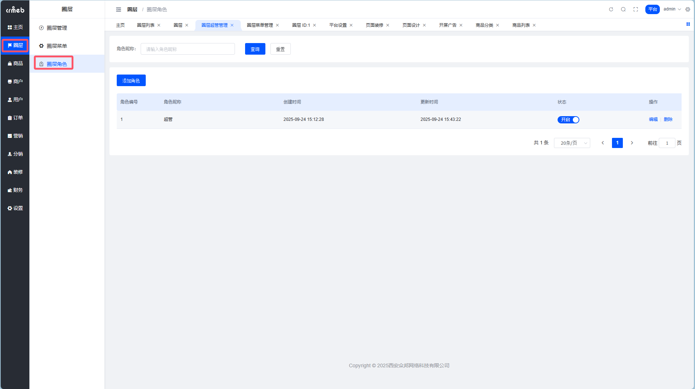
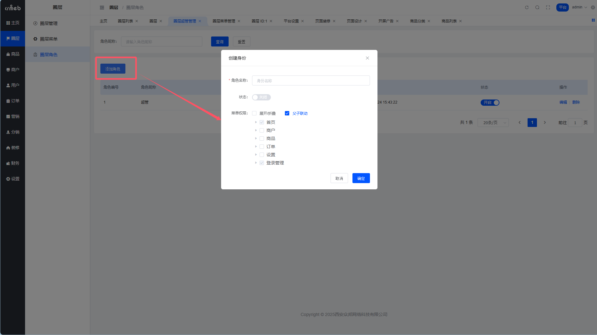
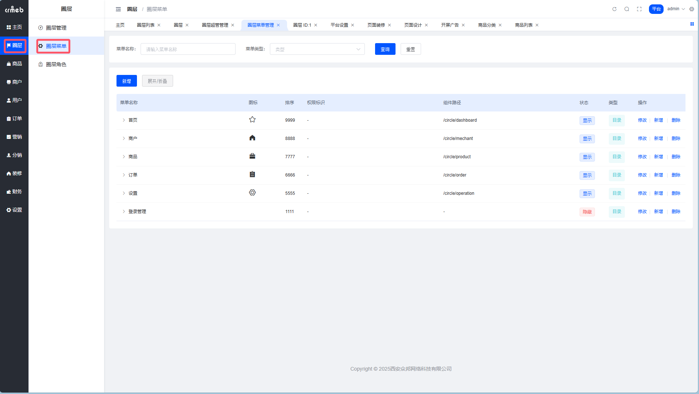
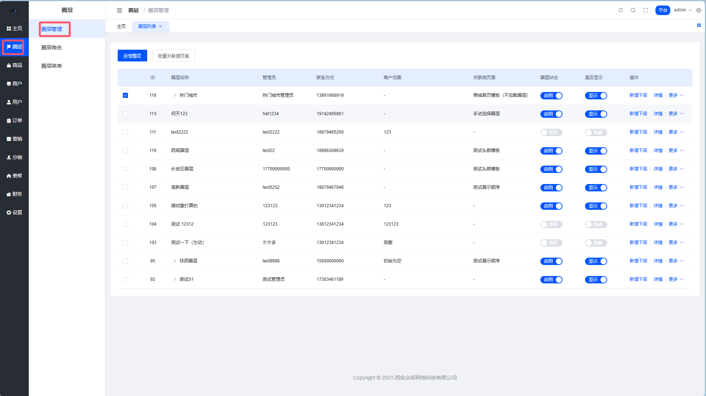
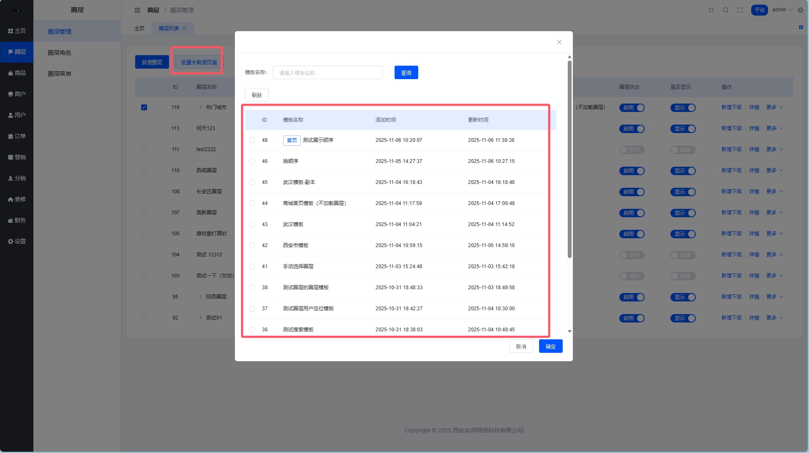
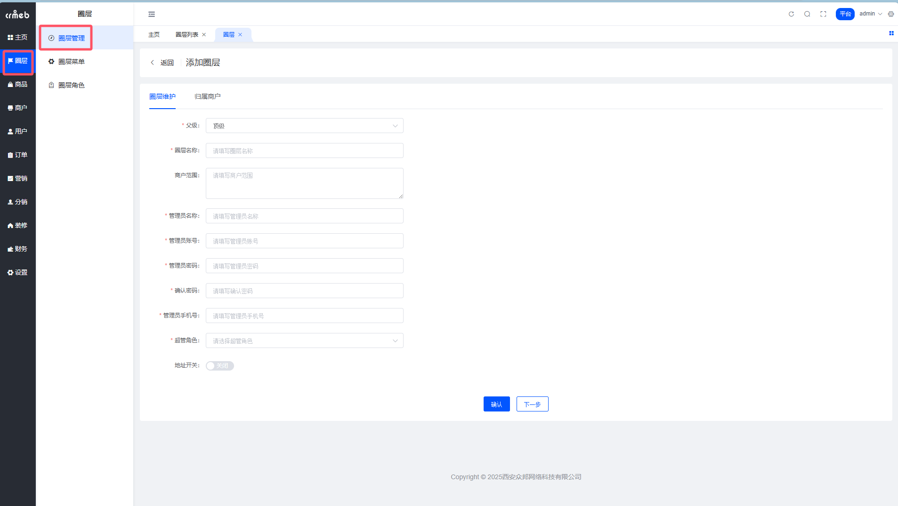
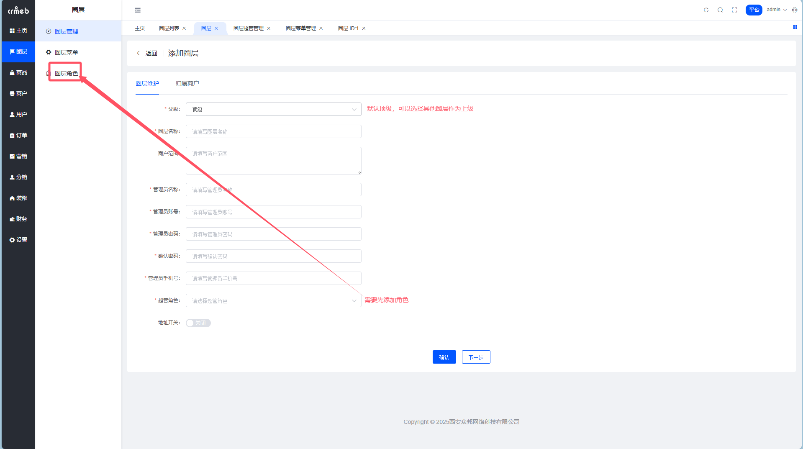
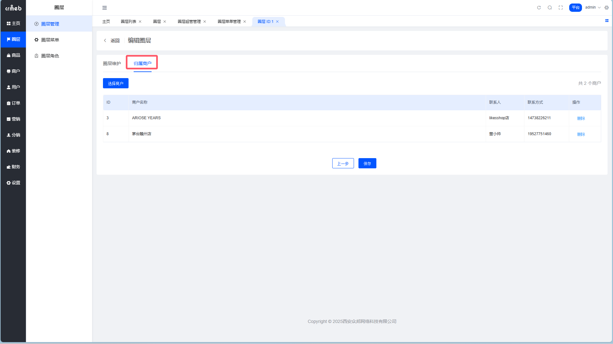
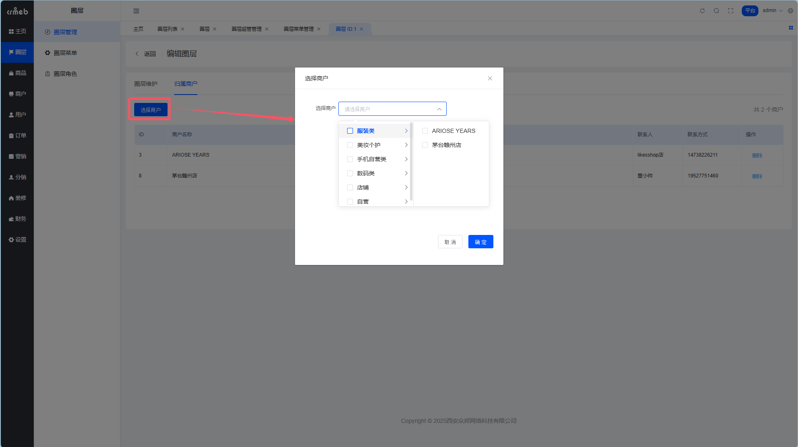

# 🎯 圈层管理完全指南

> 本文档详细介绍平台端的圈层管理功能，包括圈层概念、角色配置、菜单管理和实际操作流程

---

## 📋 目录

- [功能概述](#功能概述)
- [圈层划分概念](#圈层划分概念)
- [圈层代理说明](#圈层代理说明)
- [圈层角色管理](#圈层角色管理)
- [圈层菜单配置](#圈层菜单配置)
- [圈层管理操作](#圈层管理操作)
- [最佳实践](#最佳实践)

---

## 💡 功能概述

### 什么是圈层管理？

圈层管理功能，可以将 B2B2C 电商平台的**"全域混杂"粗放模式**，升级为**"分圈层管理"的精准模式**。

**核心价值：**
- ✅ 平台根据不同维度创建多个圈层
- ✅ 用户可以精准选择目标圈层
- ✅ 商户获得高质量目标流量
- ✅ 构建活跃、高效、体验优越的商城生态
- ✅ 提升整体运营效率与用户购物体验

**说白了：** 就是把平台按照不同的标准（地域、行业、人群等）分成不同的"圈子"，每个圈子独立管理，精准服务！

---

## 🗺️ 圈层划分概念

圈层可以按照多种维度进行划分，平台可以根据实际业务需求选择合适的划分方式。

### 1. 行政区域划分

| 级别 | 说明 | 示例 |
|------|------|------|
| **省级别** | 覆盖面广的大区域 | 全省、西北五省联盟 |
| **市区级别** | 城市及下属县城 | 西安市（含23线县城） |

**适用场景：** 本地生活服务、区域特产、物流配送优化

### 2. 经济圈划分

| 范围 | 说明 | 示例 |
|------|------|------|
| **跨省经济圈** | 经济联系紧密的区域 | 京津冀、江浙沪、粤港澳大湾区 |
| **城市商圈** | 城市内的商业区域 | 小寨商圈、曲江商圈、土门商圈 |

**适用场景：** 高端商品、连锁品牌、商务服务

### 3. 非物理维度划分

#### 按渠道/人群划分

- 🎓 **学生圈层** - 针对在校学生的专属商城
- 👨‍🏫 **教师圈层** - 教师专属优惠和服务
- 💼 **线上代理** - 线上渠道分销商
- 🏪 **线下代理** - 实体店铺合作商

#### 按行业划分

- 💇 **美业圈层** - 美容美发相关商户
- 📚 **教育圈层** - 教育培训机构
- 🍔 **美食圈层** - 餐饮食品商家
- 🏠 **房产圈层** - 房地产中介
- 💰 **金融圈层** - 金融理财服务

**说明：** 以上所有圈层维度均由**平台统一创建和维护**，商户只能被分配到相应圈层。

---

## 👥 圈层代理说明

### 角色定位

圈层代理（圈层管理员）是介于**平台**和**商户**之间的管理角色。

```
平台管理员
    ↓
圈层代理（区域管理员）
    ↓
商户
```

### 工作流程

**1. 平台创建圈层**
```
示例：平台开启经济圈划分
  ├─ 西北地区
  ├─ 华北地区
  ├─ 华东地区
  └─ 华南地区
```

**2. 商户入驻分配**
- 平台根据商户的**入驻条件**和**经营特性**，将其关联到某个圈层
- 也可以不关联（全平台商户）
- 平台有权解除圈层与商户的绑定关系

**3. 圈层代理管理**
- 圈层代理登录后**只能查看**自己圈层下关联的商户信息
- 权限以**查看为主**
- 权限级别：**平台 > 圈层代理 > 商户**

### 权限说明

| 功能模块 | 平台管理员 | 圈层代理 | 商户 |
|---------|----------|---------|------|
| 创建圈层 | ✅ | ❌ | ❌ |
| 分配商户 | ✅ | ❌ | ❌ |
| 查看数据 | ✅ 全部 | ✅ 本圈层 | ✅ 自己 |
| 修改配置 | ✅ | 🔸 部分 | ✅ 自己 |
| 财务管理 | ✅ | 👁️ 查看 | ✅ 自己 |

---

## 🎭 圈层角色管理

### 功能说明

圈层角色管理用于配置不同的用户角色及其权限，实现精细化的权限控制。

### 角色列表

进入 **平台端 → 圈层管理 → 圈层角色**，可以查看所有已创建的圈层角色。



### 新增角色

点击"**新增角色**"按钮，可以创建新的圈层角色并分配权限。



**配置项说明：**

| 配置项 | 说明 | 示例 |
|--------|------|------|
| 角色名称 | 角色的显示名称 | 西北区域管理员 |
| 角色说明 | 角色的职责描述 | 负责西北五省的商户管理 |
| 权限分配 | 勾选该角色可访问的功能 | 商户查看、数据统计等 |
| 状态 | 启用/禁用 | 启用 |

**注意事项：**
- ⚠️ 角色名称建议清晰明确，便于后续管理
- ⚠️ 权限分配遵循**最小权限原则**
- ⚠️ 修改角色权限会立即生效，请谨慎操作

---

## 🎛️ 圈层菜单配置

### 功能说明

圈层菜单管理用于配置不同角色可以访问的菜单项，实现**菜单级别的权限控制**。

### 菜单配置界面

进入 **平台端 → 圈层管理 → 圈层菜单**



### 配置说明

**菜单权限控制：**
- ✅ 为每个角色分配可访问的菜单项
- ✅ 支持多级菜单权限配置
- ✅ 灵活控制功能访问范围

**配置步骤：**
1. 选择目标角色
2. 勾选该角色可以访问的菜单
3. 保存配置
4. 该角色的用户登录后，只能看到被授权的菜单

---

## ⚙️ 圈层管理操作

### 1. 新增圈层

进入 **平台端 → 圈层管理 → 圈层管理**，点击"新增圈层"



**填写信息：**
- 圈层名称
- 圈层类型（经济圈/行政区域/行业等）
- 圈层说明
- 排序权重

### 2. 批量关联微页面

为圈层配置专属的微页面展示



**用途：**
- 🎨 为不同圈层定制专属的首页
- 🎨 展示圈层特色内容
- 🎨 提升用户归属感

### 3. 添加圈层

完善圈层的基础信息



### 4. 圈层维护

对已创建的圈层进行管理和维护



**可执行操作：**
- ✏️ 编辑圈层信息
- 👁️ 查看圈层数据
- 🔗 管理关联商户
- ❌ 删除圈层（需确认）

### 5. 归属商户管理

为圈层分配或移除商户



**操作步骤：**
1. 选择目标圈层
2. 点击"关联商户"
3. 搜索并选择要添加的商户
4. 确认关联



**注意事项：**
- ⚠️ 一个商户可以同时属于多个圈层
- ⚠️ 商户必须先完成入驻审核
- ⚠️ 取消关联不影响商户的其他圈层归属

---

## 🌟 最佳实践

### 圈层划分建议

**1. 初期阶段**
- 建议先按**地域**划分，简单明了
- 圈层数量控制在 **3-5 个**
- 确保每个圈层有足够的商户数量

**2. 发展阶段**
- 根据用户画像，增加**行业/人群**维度
- 优化圈层结构，提高转化率
- 定期分析各圈层数据，调整策略

**3. 成熟阶段**
- 实现**多维度交叉**管理
- 精细化运营每个圈层
- 打造特色圈层品牌

### 权限配置建议

| 角色类型 | 建议权限范围 | 说明 |
|---------|------------|------|
| 平台管理员 | 全部权限 | 最高权限，谨慎分配 |
| 圈层代理 | 查看+部分编辑 | 本圈层数据查看和日常管理 |
| 商户管理员 | 本店铺全部 | 店铺内的完整管理权 |
| 商户员工 | 受限权限 | 特定功能的操作权限 |

### 常见问题

**Q1: 商户可以切换圈层吗？**
A: 不可以。圈层归属由平台管理员统一管理，商户不能自主选择或切换。

**Q2: 圈层代理可以审核商户吗？**
A: 不可以。商户入驻审核由平台管理员负责，圈层代理只有查看权限。

**Q3: 一个圈层可以有多个代理吗？**
A: 可以。一个圈层可以分配多个圈层代理，共同管理该圈层。

**Q4: 删除圈层后商户会受影响吗？**
A: 会。删除圈层后，该圈层下的商户会失去圈层归属，需要重新分配。建议先移除商户关联，再删除圈层。

---

