# 商品管理

本文档介绍商城系统中的商品评论和商品标签管理功能。

## 目录

1. [商品评论](#商品评论)
   - [商品评论说明](#商品评论说明)
   - [功能概述](#功能概述)
   - [页面结构说明](#页面结构说明)
2. [商品标签](#商品标签)
   - [标签展示规则](#标签展示规则)
   - [自动化标签](#自动化标签)
   - [手动创建标签](#手动创建标签)
3. [商品列表](#商品列表)
   - [平台商品列表说明](#平台商品列表说明)
4. [商品分类](#商品分类)
   - [平台商品分类说明](#平台商品分类说明)
   - [平台商品分类添加](#平台商品分类添加)
   - [平台商品分类编辑](#平台商品分类编辑)
   - [平台商品分类删除](#平台商品分类删除)
   - [平台商品分类隐藏](#平台商品分类隐藏)
5. [品牌列表](#品牌列表)
   - [品牌说明](#品牌说明)
   - [创建品牌](#创建品牌)
   - [品牌编辑](#品牌编辑)
   - [品牌删除](#品牌删除)
   - [品牌隐藏](#品牌隐藏)
   - [关联品牌](#关联品牌)
6. [保障服务](#保障服务)
   - [保障服务说明](#保障服务说明)
   - [添加保障服务](#添加保障服务)

---

## 商品评论

### 商品评论说明

#### 功能概述

本模块用于管理用户提交的商品评价信息，支持按时间范围、用户属性等多维度筛选评价记录，并提供基础的数据操作能力。核心功能包括：

- **评价检索**：通过时间范围、评价状态/商品搜索/用户搜索/商户搜索精准定位评价
- **数据看板**：实时展示评价量级分布与用户互动状态
- **评价管理**：支持评价内容查看、无效评价删除，删除后将不在用户端展示

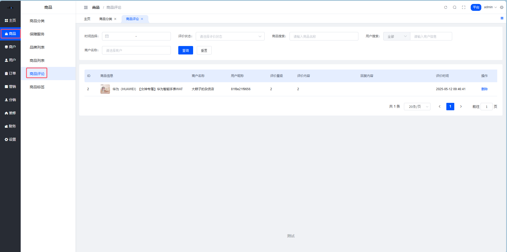

#### 页面结构说明

##### 筛选区（顶部）

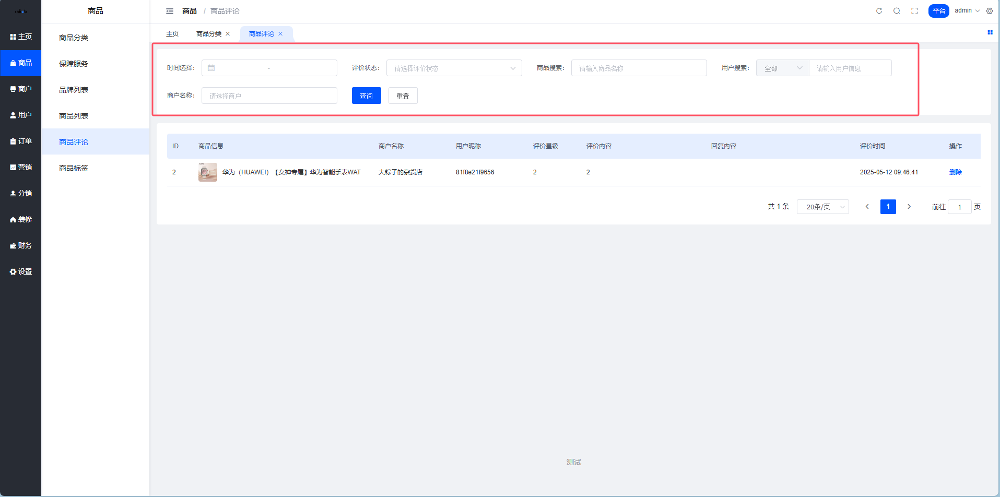

**时间选择：**
- 支持自定义时间段（起始日-截止日）

**评价状态：**
- 下拉选择已回复和未回复
- 点击"查询"根据选择的条件进行筛选，点击"重置"清空已选条件

**商品搜索：**
- 输入框支持商品名称模糊搜索（如输入"华为"筛选相关评价）

**用户搜索：**
- 支持根据用户ID、手机号、用户昵称来筛选评价

**商户名称：**
- 根据商户名称筛选评论

##### 数据列表区

| 字段名称 | 字段说明 |
|---------|---------|
| ID | 评论id |
| 商品信息 | 展示商品的图片名称信息 |
| 商户名称 | 展示店铺名称 |
| 用户昵称 | 展示用户昵称 |
| 评价星级 | 根据商品质量和服务态度来进行评分，1-5分制，评价星级商品质量优先于服务态度 |
| 评价内容 | 展示用户评价内容，限制140字符，图片不展示 |
| 回复内容 | 展示对应商户对此评价的回复内容，限制50字符 |
| 评价时间 | 用户提交评价的精确时间 |
| 操作 | 仅提供"删除"功能（需二次确认，删除后不可恢复） |

---

## 商品标签

平台端商品标签主要用于用户端（移动端商城+PC商城）商品列表的展示；平台端商品标签包括：根据系统规则自动化标签运营，以及手动创建修改标签两种模式。

**菜单页面路径**：商品 → 商品标签

### 标签展示规则

1. 商品标签会根据标签选择的位置，展示在标题前/标题下
2. 标题前最多展示1个标签，标题下最多展示3个标签
3. 一个商品对应多个标签时，按照标签排序，排序大的进行展示
4. 系统最多允许同时开启5个标签

### 自动化标签

系统内置了一些标签规则，运营者可以根据运营规则展示/隐藏这些标签，内置标签规则如下：

- **新品**：展示规则，商品创建时间后 X 天内，展示此标签
- **爆品**：展示规则，最近30天销量大于 X 件，展示此标签
- **自营**：展示规则，商家有自营标签时，展示此标签
- **热卖**：展示规则，最近30天用户评论数大于 X 条，展示此标签
- **优选**：展示规则，最近30天用户5星好评大于X时，展示此标签
- **包邮**：展示规则，全国包邮商品，展示此标签

系统根据标签生效时间以及标签的开启状态，将符合规则的商品自动标记此标签。

### 手动创建标签

#### 第一步：添加标签

点击【添加标签】按钮，打开添加标签侧滑

#### 第二步：填写标签信息

填写标签相关信息，点击【保存】按钮，创建标签完成

#### 字段说明

- **标签名称**：展示在用户端的标签文字
- **标签说明**：对于标签进行描述，方便后期维护
- **排序**：标签根据排序进行展示优先级
- **生效时间**：标签只有在生效时间满足条件才会展示
- **状态**：只有开启状态才会展示
- **商城中的位置**：标签在用户端的展示位置
- **商品参与类型**：通过商品绑定标签，通过品牌绑定标签，通过分类绑定标签，通过商户绑定标签

---

## 商品列表

### 平台商品列表说明

#### 1. 出售中商品

可以查看商品详情、预览商品、编辑商品的虚拟销量和排序、强制下架商品。

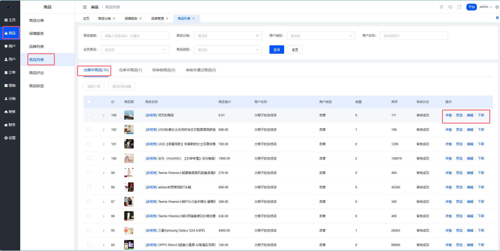

#### 2. 仓库中商品

平台审核通过且没有上架的商品，可以查看商品详情、编辑商品的虚拟销量和排序。

#### 3. 待审核商品

商户端提交需要审核的商品将会进入待审核，可以查看商品详情、审核商品、编辑商品的虚拟销量和排序。

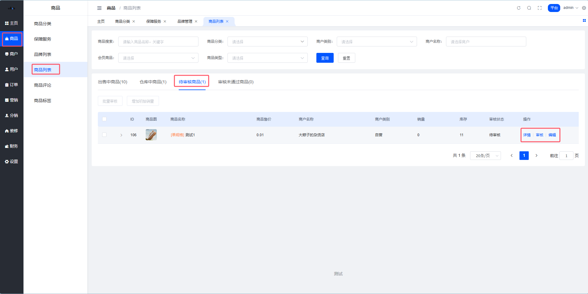

#### 4. 审核未通过商品

审核没有通过的商品将会在此展示。

#### 5. 字段说明表

| 字段名称 | 字段说明 |
|---------|---------|
| 商品搜索 | 根据商品名称和关键字进行搜索 |
| 商品分类 | 根据商品的分类进行筛选（三级分类） |
| 商户类别 | 商户类别分为自营和非自营，在添加商户的时候选择 |
| 商户名称 | 根据商户名字进行筛选 |
| 会员商品 | 会员商品分为会员商品和非会员商品，在添加商品的时候选择 |
| 商品类型 | 商品类型分为普通商品、虚拟商品、云盘商品、卡密商品，商品的类型在添加商品时选择 |

---

## 商品分类

### 平台商品分类说明

#### 1. 概述

- 平台商品分类为三级分类，添加商品前需要先添加分类
- 平台商品分类用于商家添加商品时，对商品根据平台分类进行划分，在添加商品时只能选择一个三级平台商品分类

### 平台商品分类添加

添加商品分类前，先根据平台自己经营产品的类型进行划分，一级分类为食品/服装等大类，二三级分类在一级分类的基础上进行详细划分，划分清楚后将数据添加至系统中。

**页面路径**：商品 → 商品分类

#### 第一步：进入商品分类页面

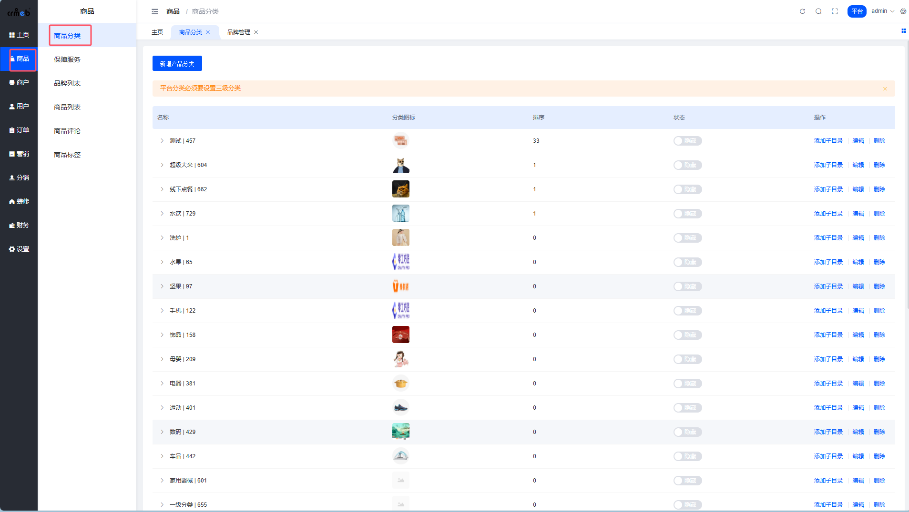

#### 第二步：点击【新增产品分类】按钮

打开产品分类添加弹窗

#### 第三步：填写商品分类信息

填写商品分类信息，点击【确定】按钮，商品分类添加完成（添加子分类操作也是如此）。

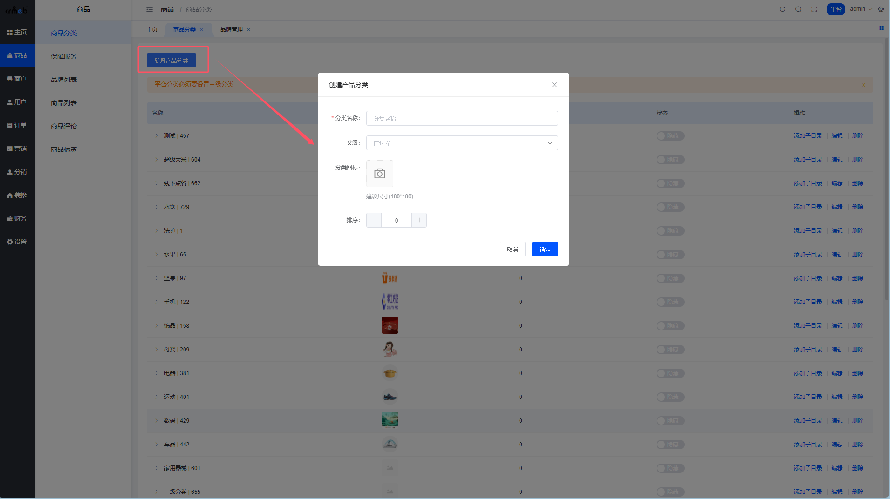

#### 添加商品分类字段说明表

| 字段名称 | 字段说明 |
|---------|---------|
| 分类名称 | 分类名称用于用户端商品分类的展示，分类名称一般针对商品类型进行添加，最多可以输入8个字 |
| 父级 | 平台商品分类为多层级结构，平台分类必须设置3级分类，通过指定父级绑定分类父子级关系 |
| 分类图标 | 三级分类图标在用户端-移动端显示，一级图标在用户端-PC商城显示；建议图标尺寸为180*180px |
| 排序 | 用户端及管理端均是按照排序倒叙排列，数字大的在前 |

### 平台商品分类编辑

若平台商品分类信息不正确，可通过编辑功能进行修改，修改完成之后用户端对应的分类信息也会同步进行修改。

#### 第一步：点击【编辑】按钮

在商品分类页面，点击【编辑】按钮，打开产品分类编辑弹窗

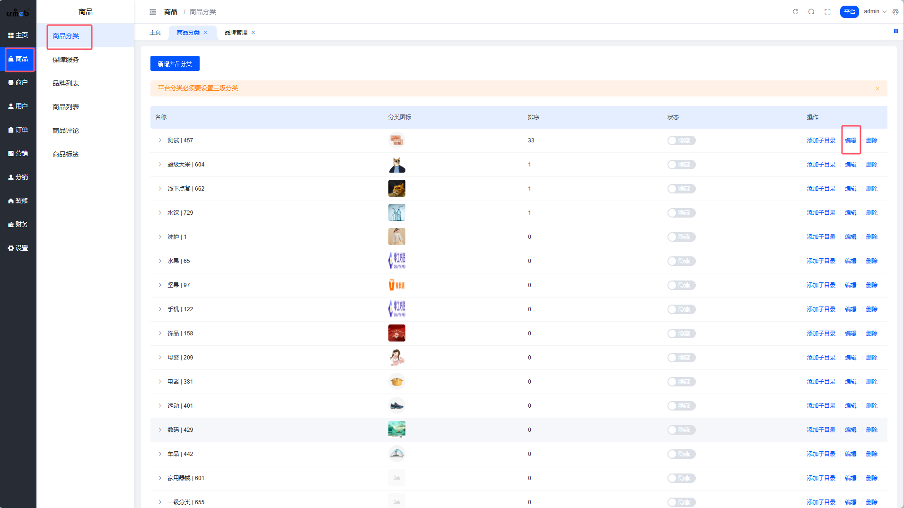

#### 第二步：修改商品分类信息

修改错误的商品分类信息，点击【确定】按钮，商品分类修改完成。

### 平台商品分类删除

分类下有产品或者下级分类，则该分类无法直接删除，需先删除分类下的下级分类和产品。

#### 第一步：点击【删除】按钮

在商品分类列表页面，点击【删除】按钮，打开删除二次确认弹窗

#### 第二步：确认删除

在删除二次确认弹窗中，点击【确定】按钮，商品分类删除完成。

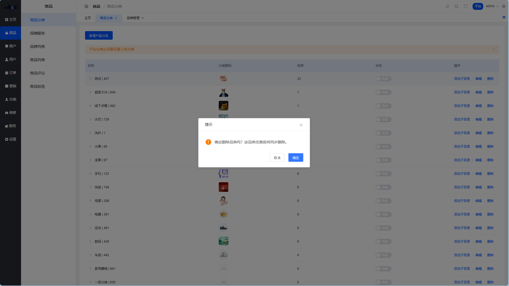

### 平台商品分类隐藏

部分已经使用的商品分类，由于特殊原因不想继续使用，可以将此商品分类隐藏；也可用于小程序提交微信审核，快速隐藏分类使用。

#### 隐藏操作

将状态按钮点击至隐藏状态，隐藏分类操作完成。

---

## 品牌列表

### 品牌说明

1. 添加商品时可添加商品品牌，品牌需提前创建
2. 支持根据平台商品分类添加品牌，例如：某品牌可关联的商品分类为商城源码，以此来提高商品添加检索效率

### 创建品牌

**功能说明**：添加商品时，支持选择商品对应的品牌，用户端筛选商品支持根据商品品牌进行快速检索，提高用户购物体验。

**页面路径**：平台后台 > 商品 > 品牌列表

#### 第一步：进入商品品牌管理页面

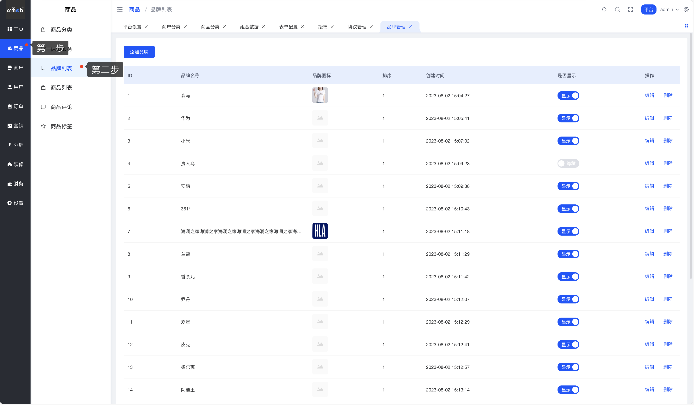

#### 第二步：点击【添加品牌】按钮

打开添加品牌弹窗

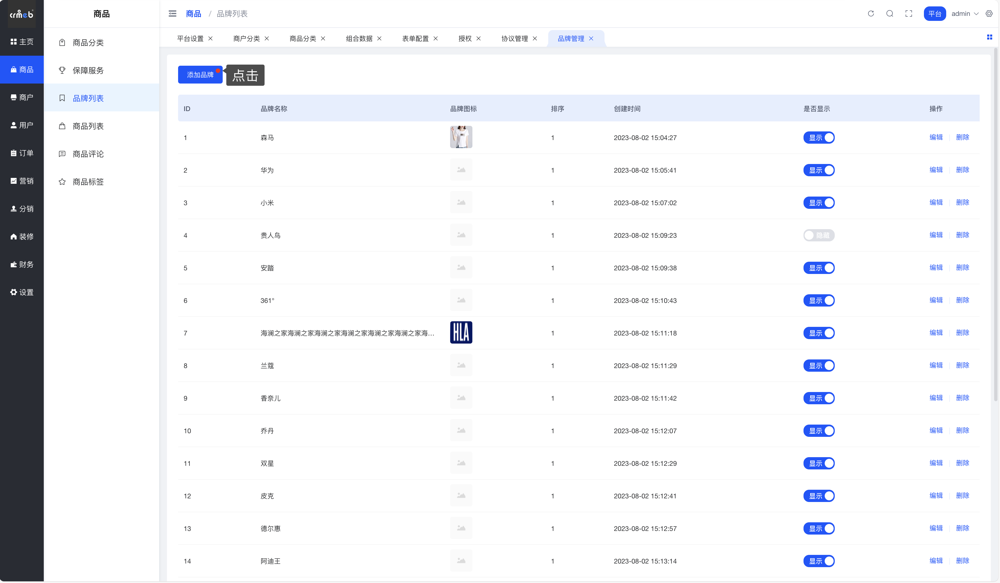

#### 第三步：填写品牌信息

在添加品牌弹窗中，填写品牌相关信息，点击【保存】按钮，添加品牌完成。

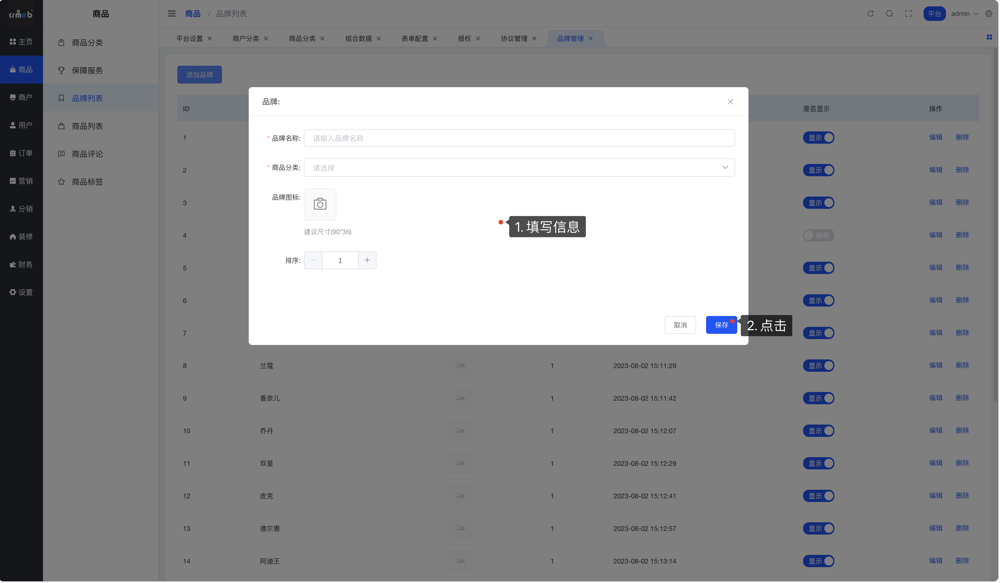

#### 添加品牌字段说明表

| 字段名称 | 字段说明 |
|---------|---------|
| 品牌名称 | 分类名称用于用户端商品品牌的搜索展示 |
| 商品分类 | 选中添加品牌对应的平台商品分类，支持一个品牌对应多个分类，一个分类可以被多个品牌关联；商户端添加商品时先选择平台商品分类，再选择品牌时只会展示关联此商品分类的品牌 |
| 品牌图标 | 品牌图标在用户端-PC商城搜索页面显示，支持按照品牌进行检索；建议图标尺寸为90*36px |
| 排序 | 用户端及管理端均是按照排序倒叙排列，数字大的在前 |

### 品牌编辑

**功能说明**：若已经添加的品牌信息不正确，可通过编辑功能进行修改，修改完成之后用户端对应的品牌信息也会同步进行修改。

#### 第一步：点击【编辑】按钮

在品牌列表页面，点击【编辑】按钮，打开品牌编辑弹窗

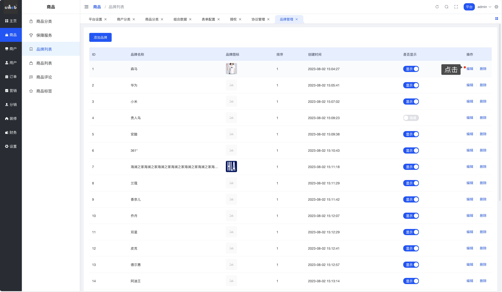

#### 第二步：修改品牌信息

修改错误的品牌信息，点击【保存】按钮，品牌修改完成。

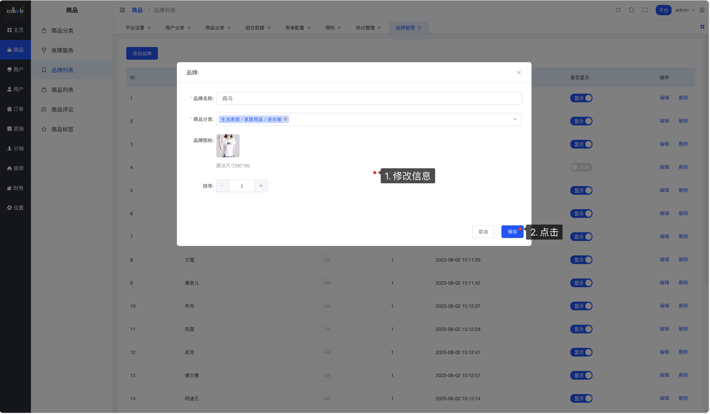

### 品牌删除

**功能说明**：品牌下有产品，则该品牌无法直接删除，需先删除品牌下关联的产品或者解除关联关系；若该品牌关联有品牌优惠券等信息，则会将该品牌优惠券同步删除。

#### 第一步：点击【删除】按钮

在品牌列表页面，点击【删除】按钮，打开删除二次确认弹窗

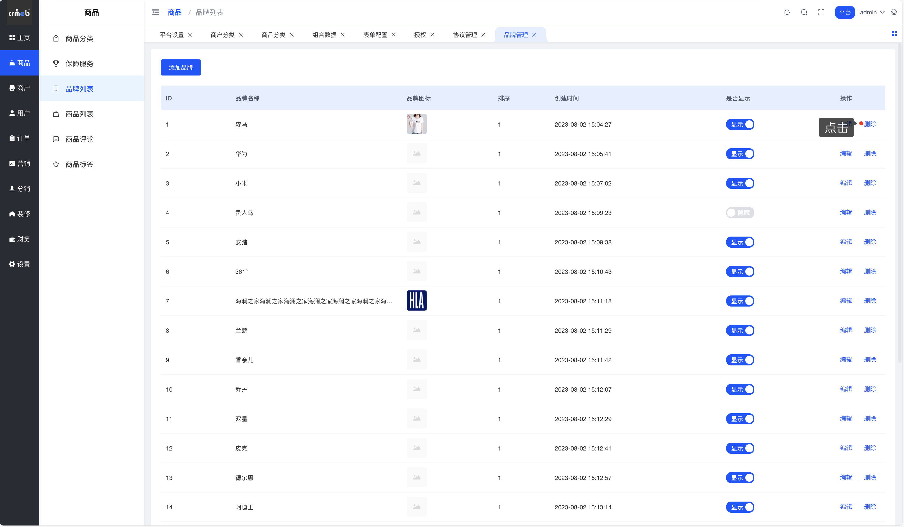

#### 第二步：确认删除

在删除二次确认弹窗中，点击【确定】按钮，品牌删除完成。

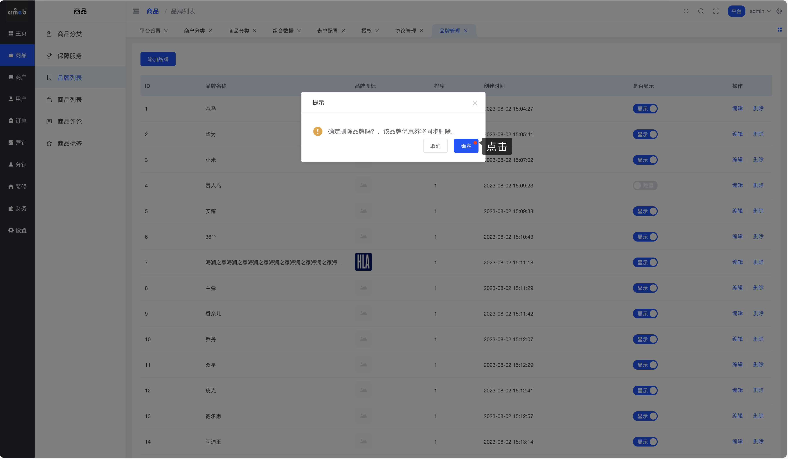

### 品牌隐藏

**功能说明**：部分已经使用的品牌，由于特殊原因不想继续使用，可以将此品牌隐藏。

#### 隐藏操作

将状态按钮点击至隐藏状态，隐藏品牌操作完成。

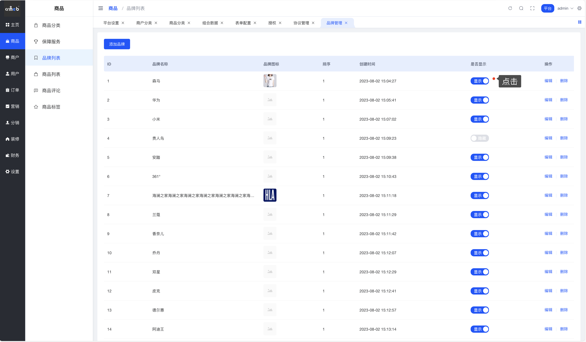

### 关联品牌

1. 添加商品品牌时需关联商品分类

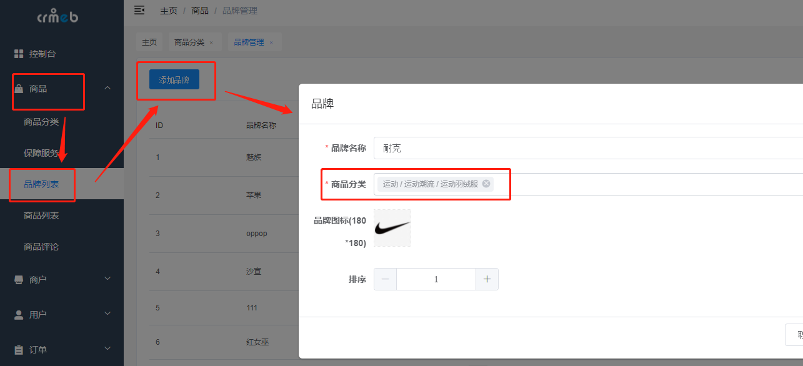

2. 添加商品时，选择商品分类，可自动关联到品牌信息

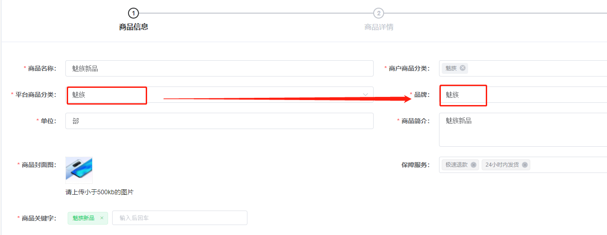

---

## 保障服务

### 保障服务说明

保障服务在平台端添加，在商户端添加商品时使用，商户也可以自由组合保障服务。

**页面路径**：平台后台 → 商品 → 保障服务

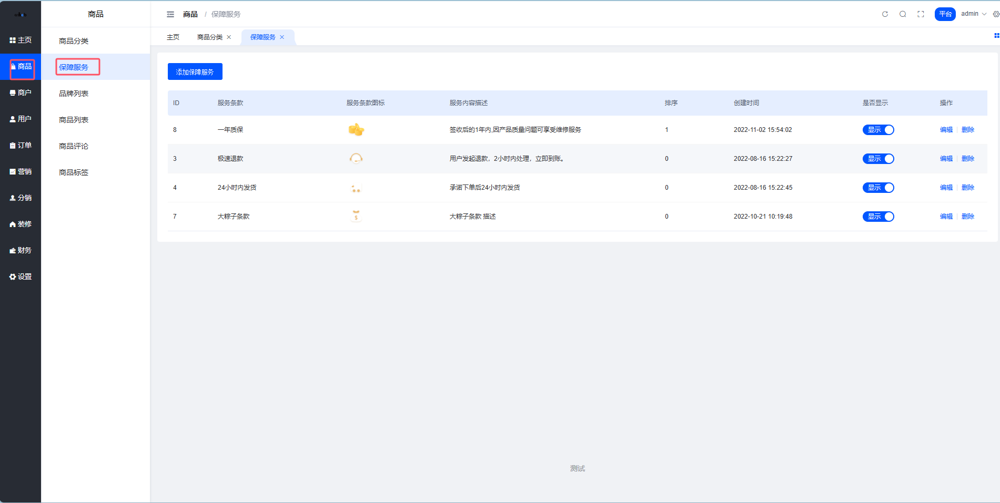

### 添加保障服务

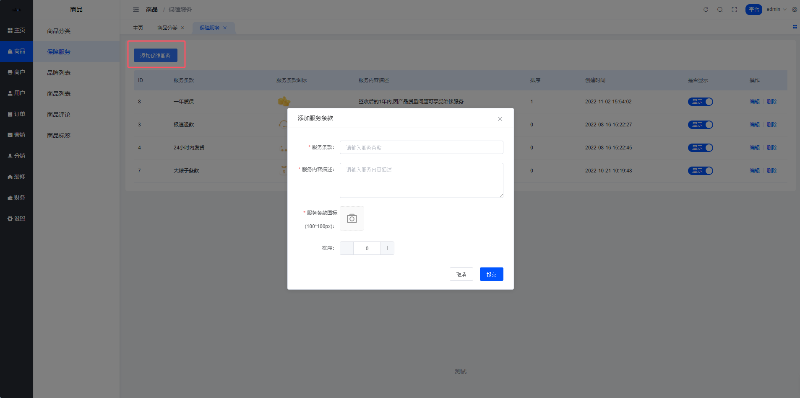

#### 字段说明

- **服务条款**：一般填写7天无理由退货、运费险等条款标题
- **服务内容描述**：一般填写服务条款的详细描述信息，对服务条款进行详细说明
- **服务条款图标**：用于用户查看商品对应的服务条款前的展示
- **排序**：用户端及管理端均是按照排序倒叙排列，数字大的在前

---

**说明**：本文档内容基于商城系统管理功能整理，如有疑问请参考系统使用手册或联系技术支持。
