# 付费会员管理

## 目录

- [一、会员说明](#一会员说明)
  - [1.1 SVIP会员在商城平台的作用意义](#11-svip会员在商城平台的作用意义)
  - [1.2 SVIP会员对于用户的作用意义](#12-svip会员对于用户的作用意义)
  - [2.1 成为SVIP会员](#21-成为svip会员)
  - [2.2 查看购买记录](#22-查看购买记录)
  - [2.3 查看会员权益](#23-查看会员权益)
- [二、会员配置](#二会员配置)
  - [2.1 功能介绍](#21-功能介绍)
  - [2.2 基础设置](#22-基础设置)
  - [2.3 会员权益设置](#23-会员权益设置)
  - [2.4 会员卡设置](#24-会员卡设置)
- [三、购买记录](#三购买记录)
  - [3.1 功能介绍](#31-功能介绍)
  - [3.2 列表管理](#32-列表管理)
  - [3.3 订单详情](#33-订单详情)

---

## 一、会员说明

### 1.1 SVIP会员在商城平台的作用意义

#### 1. 增加用户粘性

通过SVIP会员制度，商城平台可以为用户提供额外的优惠和特权，从而提高用户的购物频率和消费金额。用户为了享受这些特权，会更倾向于在该平台上进行购物，从而增加了用户的粘性和忠诚度。

#### 2. 提升销售额

SVIP会员的积分翻倍和经验值翻倍等特权，能够鼓励用户增加购物次数和金额，以更快地累积积分和升级。这有助于提升商城平台的整体销售额和用户活跃度。

#### 3. 增强用户服务体验

通过为SVIP会员提供专属客服服务，商城平台能够为用户提供更加贴心、个性化的购物体验。这种专属服务能够解决用户在购物过程中遇到的问题，提高用户满意度，进一步巩固用户忠诚度。

#### 4. 塑造品牌形象

SVIP会员服务是商城平台高品质服务的一种体现，能够展示商城平台对用户的重视和关怀。这种高品质服务能够提升商城平台的品牌形象，增强用户对商城平台的信任感。

### 1.2 SVIP会员对于用户的作用意义

#### 1. 享受更多优惠

SVIP会员可以享受商品折扣、积分翻倍等特权，这意味着用户在购物时可以节省更多的费用，获得更大的实惠。这些优惠能够降低用户的购物成本，提高用户的购物体验。

#### 2. 积分更快累积

SVIP会员的积分翻倍特权能够让用户更快地累积积分。积分可以用于抵扣现金、兑换礼品等，为用户带来更多的实际利益。这种积分累积的加速能够让用户更快地享受到商城平台的福利。

#### 3. 升级更快

SVIP会员的经验值翻倍特权能够加速用户的会员等级升级。随着会员等级的提升，用户可以享受到更多的特权和服务，如更高的折扣、更多的积分等。这种升级加速能够让用户更快地感受到SVIP会员的价值。

#### 4. 专属服务体验

SVIP会员享有专属客服服务，这意味着用户在购物过程中可以享受到更加贴心、个性化的服务。这种专属服务能够解决用户在购物过程中遇到的问题，提高用户的购物满意度和信任感。同时，专属客服还能为用户提供更加便捷、高效的售后服务支持。

### 2.1 成为SVIP会员

商城用户可以通过购买付费会员来提高自身的权益，比如会员商品的会员特价、积分翻倍、经验值翻倍、专属客服等，从而降低自己购买商品的成本金额。平台后台也可以赠送付费会员给商城用户。

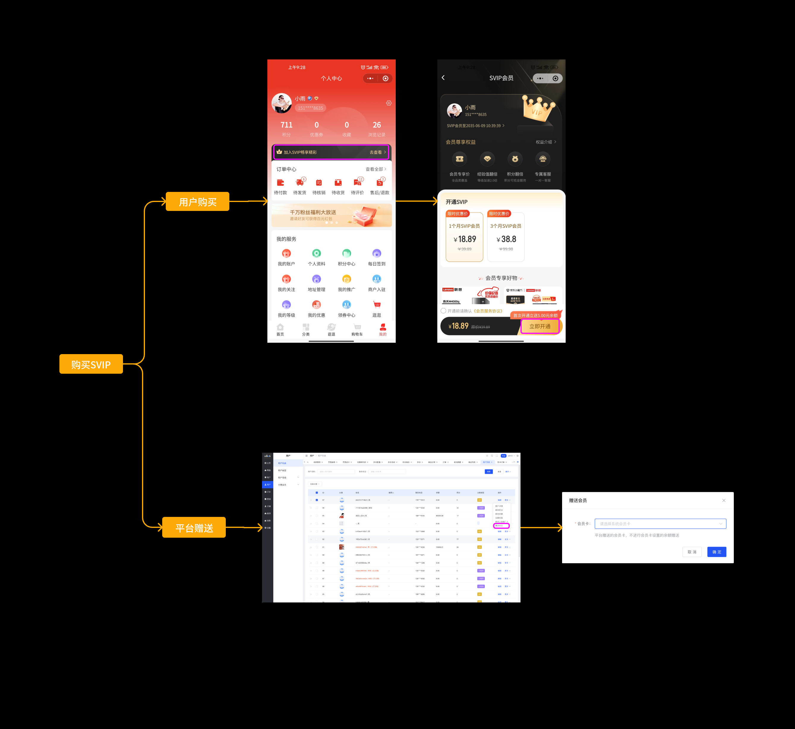

### 2.2 查看购买记录

用户可以查看自己历史的会员记录，包括自己购买的会员记录以及平台赠送SVIP的赠送记录。

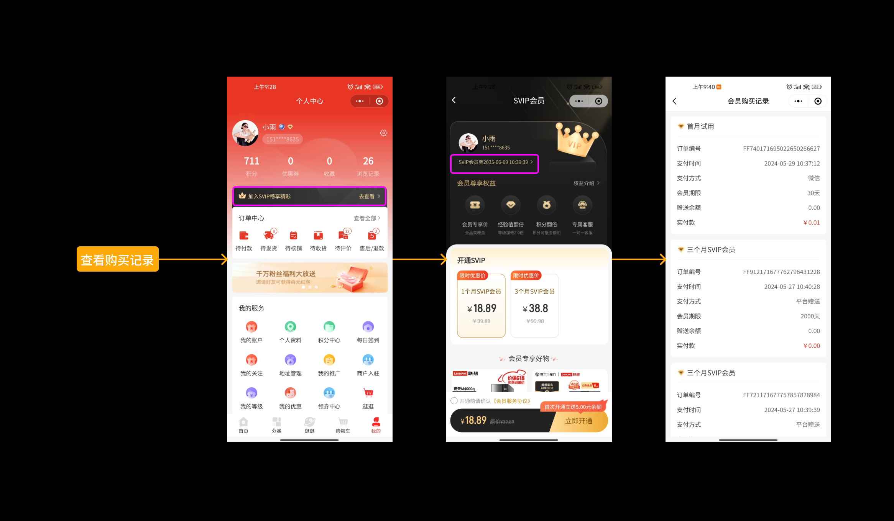

### 2.3 查看会员权益

1. 会员权益包括：会员专享价、积分翻倍、经验值翻倍、专属客服
2. 会员专享价由商家添加商品的时候设置，积分翻倍、经验值翻倍具体的权益渠道、倍数由平台在付费会员权益中进行设置
3. 会员权益图片、展示名称、说明文字、权益介绍等均支持平台设置
4. 平台可设置会员价的展示群体（仅会员/全部用户），以及付费会员购买入口开关等设置

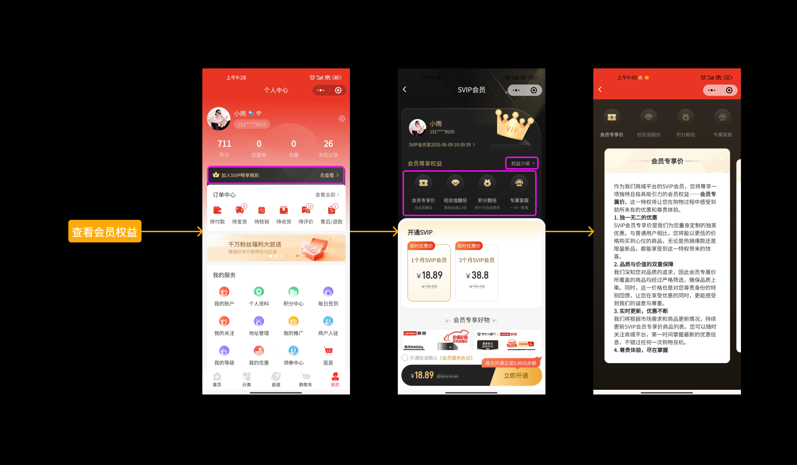

---

## 二、会员配置

### 2.1 功能介绍

会员配置包括：基础设置、会员权益设置、会员卡设置 3 个模块。

#### 基础设置

主要针对用户端购卡入口、会员价格的展示群体（仅会员/全部用户）、会员页面会员商品列表的展示开关进行设置。

#### 会员权益

1. 会员权益包括：会员专享价、积分翻倍、经验值翻倍、专属客服
2. 会员专享价由商家添加商品的时候设置，积分翻倍、经验值翻倍具体的权益渠道、倍数由平台在付费会员权益中进行设置
3. 会员权益图片、展示名称、说明文字、权益介绍等均支持平台设置

#### 会员卡设置

支持针对会员卡期限设置不同的售价、原价、余额赠送等内容。

### 2.2 基础设置

**页面路径：** 平台后台 > 用户 > 付费会员 > 会员配置

根据页面路径，进入会员配置页面。

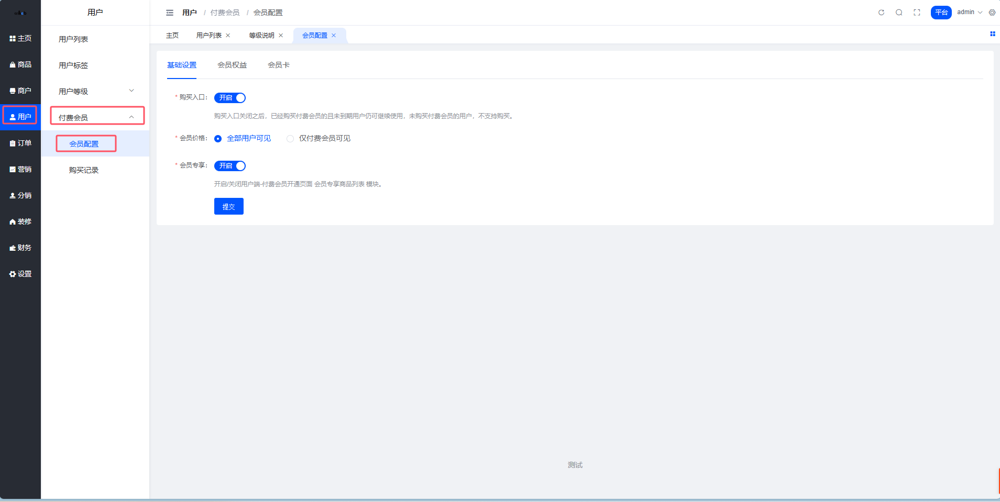

#### 字段说明表

| 字段名称 | 字段说明 |
|---------|---------|
| 购卡入口开关 | 购卡入口关闭之后，已经购买付费会员的且未到期用户仍可继续使用，未购买付费会员的用户，不支持购买。 |
| 会员价格 | 会员价格的展示群体（仅付费会员可见/全部用户可见） |
| 会员专享开关 | 开启/关闭用户端-付费会员开通页面 会员专享商品列表 模块；平台设置全部用户可见会员价，普通用户可以看到会员商品列表；平台设置仅付费会员可见会员价，普通用户看不到会员商品列表。 |

### 2.3 会员权益设置

用于设置付费会员可以享受的权益，所有付费会员卡类型除"开会员送余额"权益根据会员类型设置外，可享受的其他权益均一致。支持设置用户端展示的权益名称、权益图标、权益简介、权益说明等，支持控制权益状态（开启/关闭），支持对会员权益进行自定义设置。

#### 1. 查看权益列表

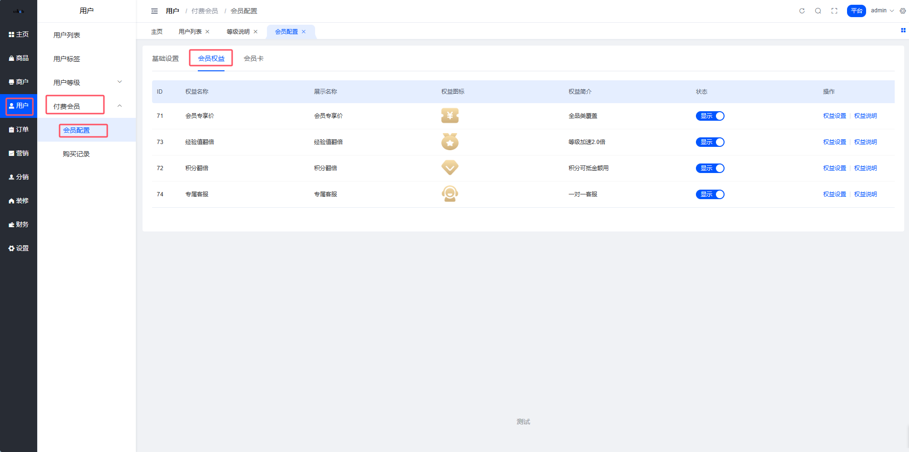

##### 权益列表数据

会员优惠、积分翻倍、经验值翻倍、专属客服 4 条权益数据写死。

##### 权益列表排序

先按照权益设置中填写的排序数字倒序排序，排序数字一致按照权益 ID 倒叙排序。

##### 权益列表操作说明

1. **权益状态：** 权益被关闭之后，用户端「付费会员购买」页面不展示此权益卡片，关闭权益之后用户购买付费会员不可享受此权益，权益关闭之前用户购买的付费会员也不能使用此权益；会员优惠这项权益被关闭之后，用户端商品列表/商品详情均不再展示会员价
2. **权益设置：** 权益修改之后，用户端「付费会员购买」页面实时查询此权益内容，权益修改之后用户购买付费会员按照新规则享受此权益，权益修改之前用户购买的付费会员也按照新权益规则享受权益
3. **权益说明：** 一般用于填写权益相关介绍信息，权益说明修改之后，用户端「付费会员购买」页面查看权益说明页面查询此权益说明内容

#### 2. 权益设置

**第一步：** 点击操作列后的【权益设置】按钮，打开权益设置侧滑弹窗；

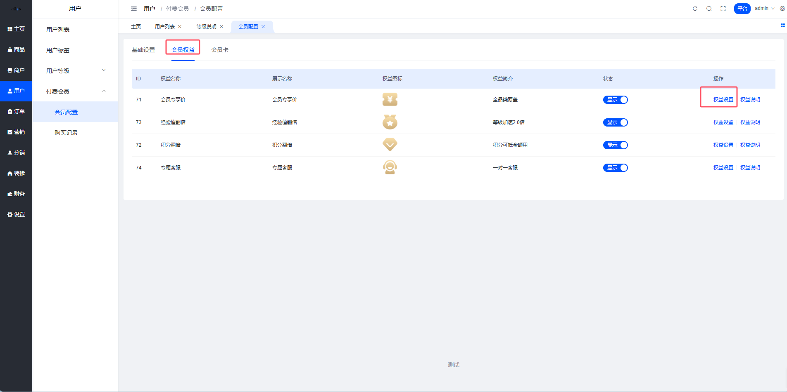

**第二步：** 在权益设置侧滑弹窗中，填写相关的权益数据，点击【确定】按钮，权益设置完成。

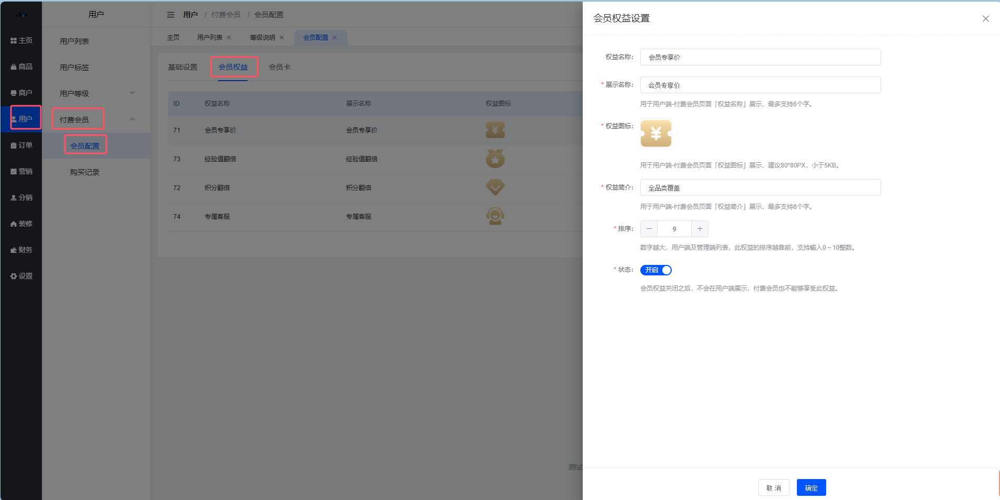

##### 权益设置字段说明

每个权益固定字段：权益名称、展示名称、权益图标、权益简介、排序、状态

1. **权益名称：** 系统默认的权益名称，不支持修改操作，文本框禁用
2. **展示名称：** 用于用户端-付费会员页面「权益名称」展示，文本框，最多支持 6 个字
3. **权益图标：** 用于用户端-付费会员页面「权益图标」展示，建议 80*80PX，小于 5KB
4. **权益简介：** 用于用户端-付费会员页面「权益简介」展示，文本框，最多支持 12 个字
5. **付费会员权益：** 会员优惠、开卡送余额、积分翻倍、经验值翻倍、专属客户（没有实际权益）
   - **会员专享价**
     - 优惠金额由商家端承担
     - 会员优惠优惠支持与积分抵扣、平台优惠券、商家优惠券进行叠加（代替原有商品售价进行计算）
   - **积分翻倍**（文本框计数器，支持输入整数，范围 0～9）
     - 翻倍渠道：现支持通过签到、商城消费渠道获取积分翻倍，支持选中翻倍渠道
     - 倍数：支持设置翻倍倍数
     - 积分翻倍产生的积分抵扣金额由平台承担
   - **经验值翻倍**（文本框计数器，支持输入整数，范围 0～9）
     - 翻倍渠道：现支持通过签到、发布种草文章渠道获取经验值翻倍，支持选中翻倍渠道
     - 倍数：支持设置翻倍倍数
6. **排序：** 数字越大，用户端及管理端列表，此权益的排序越靠前（文本框计数器，支持输入整数，范围 0～10）
7. **状态：** 会员权益关闭之后，不会在用户端展示，付费会员也不能够享受此权益

#### 3. 权益说明设置

**第一步：** 点击操作列后的【权益说明】按钮，打开权益说明设置侧滑弹窗；

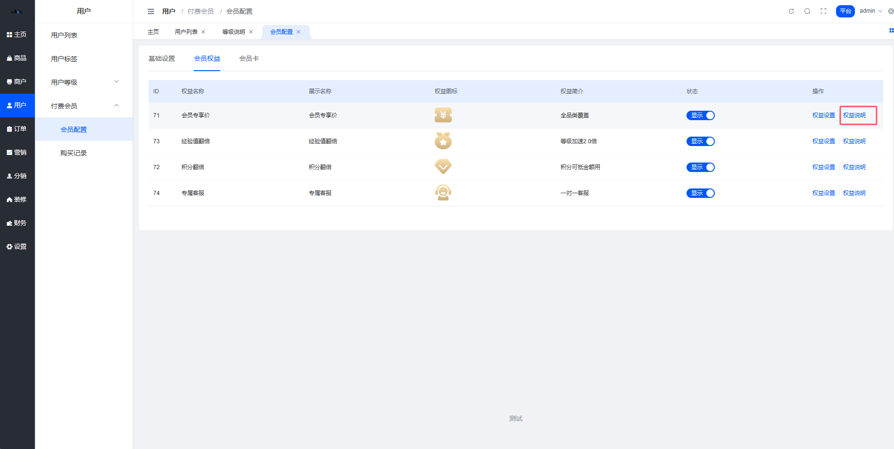

**第二步：** 在权益说明设置侧滑弹窗中，填写相关的权益数据，点击【提交】按钮，权益设置完成。

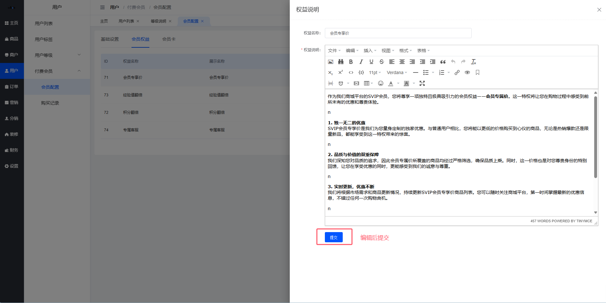

**用户端展示：**

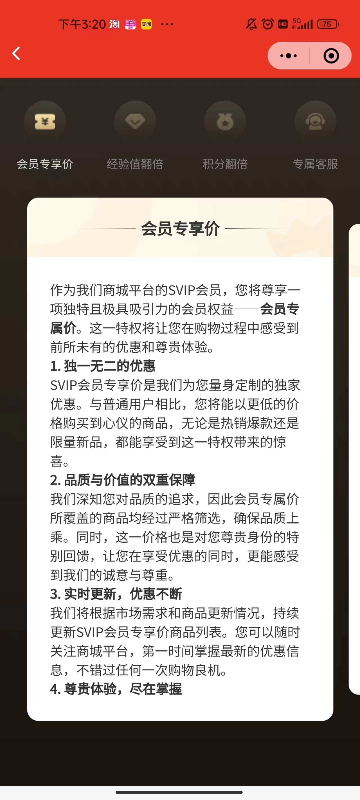

### 2.4 会员卡设置

支持针对不同的会员类型设置不同的使用时长、价格、开会员赠送的余额。

#### 1. 查看会员卡列表

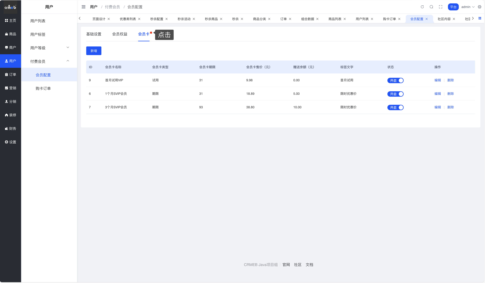

##### 列表数据

平台管理员新增的会员卡数据，展示在此列表中。

##### 列表排序

先按照新增/编辑会员卡中填写的排序数字倒序排序，排序数字一致按照创建时间倒叙排序。

##### 操作说明

1. **状态开关：** 会员卡被关闭之后，用户端「付费会员购买」页面不展示此会员卡，即用户无法购买此会员卡，但之前已购买用户不会影响使用
2. **编辑：** 会员卡类型不支持修改，会员卡修改之后，用户端「付费会员购买」页面实时查询此会员卡内容，修改之后用户按照新规则购买此会员卡，之前已购买用户不会影响使用
3. **删除：** 删除为逻辑删除，会员卡被删除之后，用户端「付费会员购买」页面不展示此会员卡，即用户无法购买此会员卡，但之前已购买用户不会影响使用

#### 2. 新增会员卡

**第一步：** 点击【新增】按钮，打开新增会员卡侧滑弹窗；

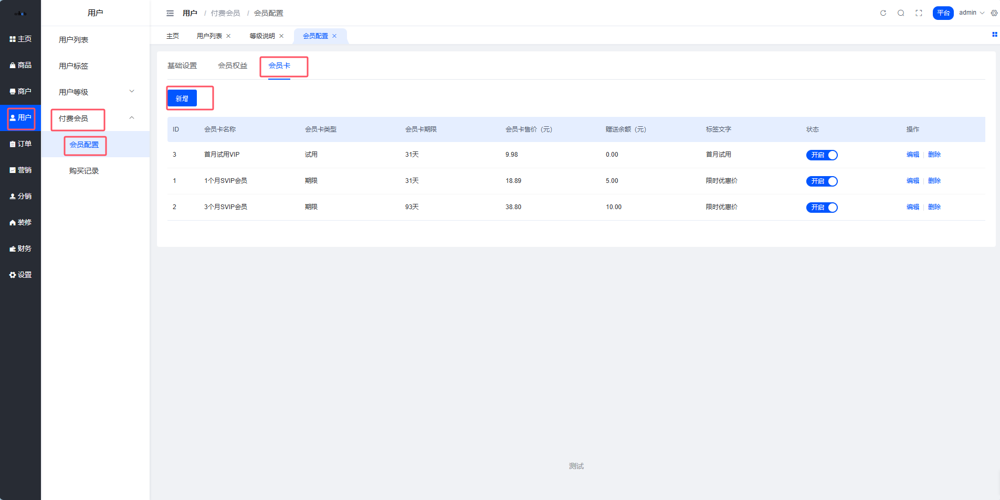

**第二步：** 在新增会员卡侧滑弹窗中，填写相关内容，点击【确定】按钮，新增会员卡完成。

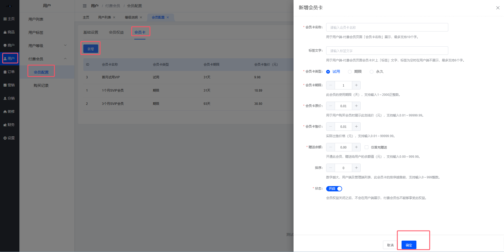

##### 会员卡字段说明

| 字段名称 | 字段说明 |
|---------|---------|
| 会员卡名称 | 会员卡名称，文本框，最多输入 10 个字 |
| 标签文字 | 用于用户端 VIP 类型卡片上的标签文字设置，文本框，最多输入 6 个字，标签文字为空时在用户端不展示 |
| 会员卡类型 | 试用、续费、永久 **a. 试用** - 试用会员每个用户总共只能购买一次，购买过付费会员后将不能再购买试用会员（用户端不展示） - 支持设置会员期限（文本框计数器，仅支持输入正整数，最大值 2000，到期时间的日期为{开通会员日期+N} 23:59:59） **b. 期限** - 续费会员每个用户可以购买多次，会员到期时间根据续费周期计算（会员未到期时也可进行续费，在原到期时间上累加续费周期，到期时间的日期为{开通会员日期/原到期日期+N} 23:59:59） - 支持设置会员期限（文本框计数器，仅支持输入正整数，最大值 2000，支持平台自定义开启付费周期，不同付费周期对应不同的价格） **c. 永久** - 永久会员每个用户只能购买一次，购买过付费会员后将不能再购买任何会员（用户端不展示） |
| 会员卡价格 | 支持设置原价、售价 **a. 原价：** 划线价，仅用于展示（文本框计数器，最多输入两位小数，范围 0.00～99999.99） **b. 售价：** 实际出售价格（文本框计数器，最多输入两位小数，范围 0.01～99999.99） |
| 赠送余额 | 用户开通此会员，赠送给用户的余额值（文本框计数器，最多输入两位小数，范围 0.00～999.99） - 用户开通会员卡，即可得到相应的商城余额，开通会员支付之后根据购买的会员卡配置的赠送面值下发余额，余额支持商城消费使用 - 开卡赠送的余额由平台承担 - 赠送余额填写 0.00 时，用户端开通会员按钮上不展示赠送标签 - 选中仅首充赠送则只有新会员开通才会赠送余额，即只有新会员的付费会员开通页面才会展示提示语 |
| 状态 | 开启/关闭，关闭之后用户端不展示此会员类型 |
| 排序 | 数字越大，用户端及管理端列表，此会员卡的排序越靠前（文本框计数器，仅支持输入整数，范围 0～999） |

#### 3. 编辑会员卡

编辑会员卡，会员卡类型不支持修改，试用、永久类型的会员卡只能购买一次，修改类型容易导致程序不稳定，于是设计为会员卡类型不支持修改。会员卡修改之后，用户端「付费会员购买」页面实时查询此会员卡内容，修改之后用户按照新规则购买此会员卡，之前已购买用户不会影响使用。

**第一步：** 点击【编辑】按钮，打开编辑会员卡侧滑弹窗；

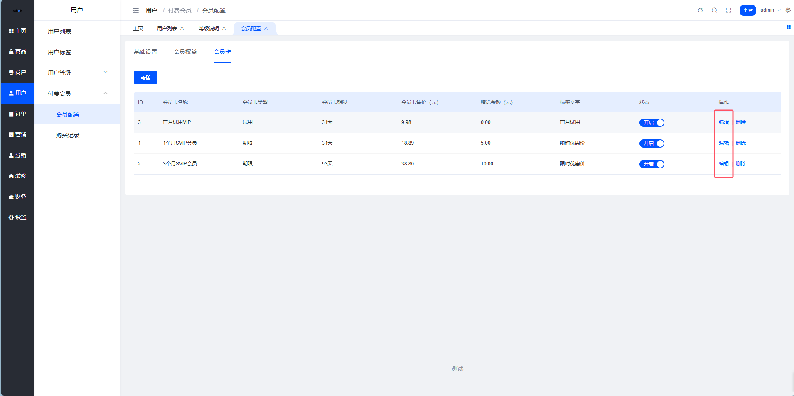

**第二步：** 在编辑会员卡侧滑弹窗中，填写相关内容，点击【确定】按钮，编辑会员卡完成。

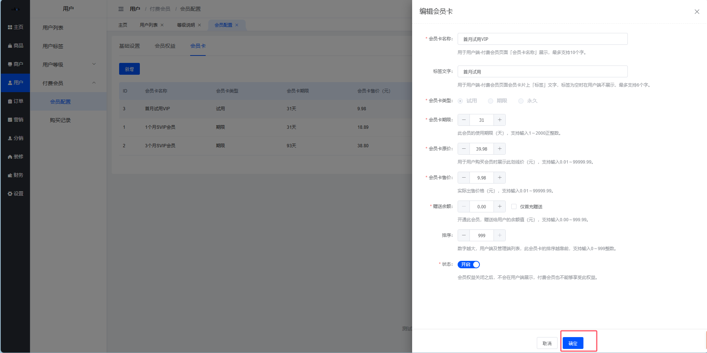

#### 4. 删除会员卡

删除为逻辑删除，会员卡被删除之后，用户端「付费会员购买」页面不展示此会员卡，即用户无法购买此会员卡，但之前已购买用户不会影响使用。

**第一步：** 点击【删除】按钮，打开二次确认弹窗；

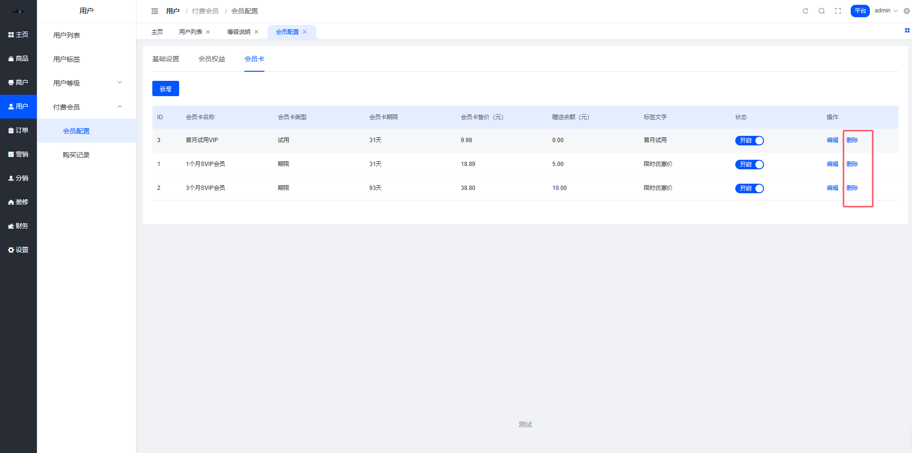

**第二步：** 在二次确认弹窗中，点击【确定】按钮，删除会员卡完成。

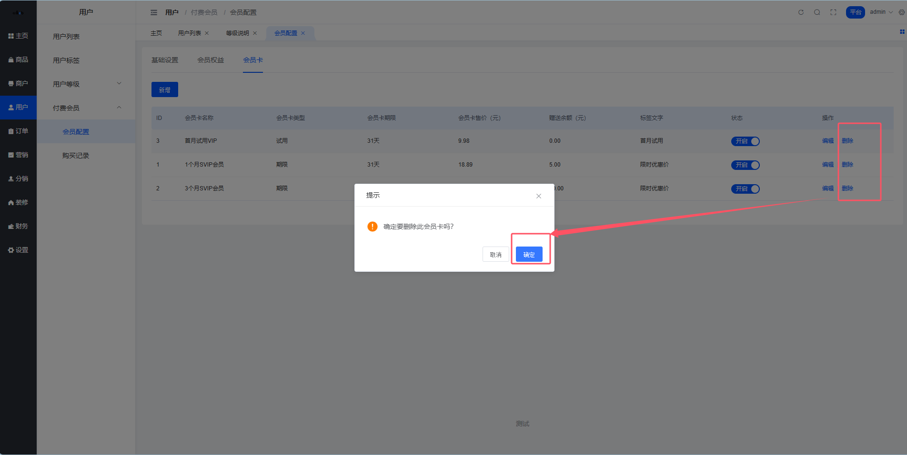

---

## 三、购买记录

### 3.1 功能介绍

展示用户购买付费会员的订单记录以及平台赠送给用户的会员记录，支持查看订单详情（包含订单信息、会员卡信息、余额赠送信息）。

### 3.2 列表管理

**页面路径：** 平台后台 > 用户 > 付费会员 > 购买记录

根据页面路径，进入用户等级配置页面。

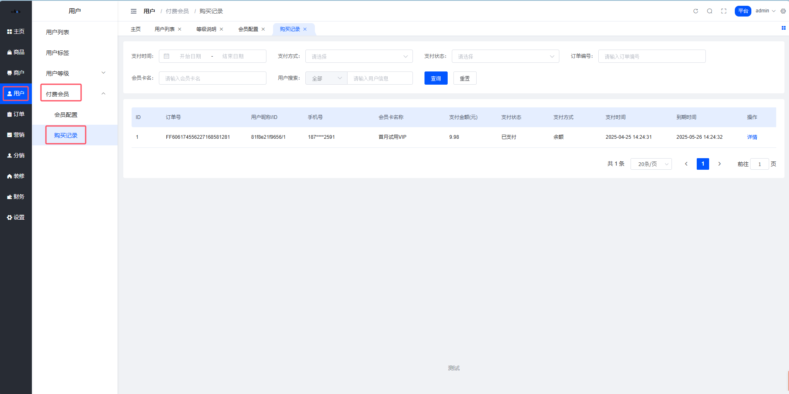

#### 列表字段说明

用户购买会员记录订单号、用户 ID、会员卡名称、会员卡类型、会员卡期限、会员卡售价、会员权益 ID 及赠送余额、支付金额、支付方式、支付时间、到期时间，列表中用户昵称、手机号、会员权益（会员价、积分翻倍、经验值翻倍）通过 ID 实时查询。

#### 列表数据

用户购买付费会员，支付完成之后产生的订单数据，平台管理员通过用户列表赠送会员操作完成之后产生订单数据（订单状态仅有已完成），订单号系统自动生成（需要确保唯一）。

#### 列表排序

按照支付时间倒叙排序。

#### 搜索条件说明

1. **支付时间：** 时间范围选择器，快捷选项支持今天、昨天、最近 7 天、本月、最近 30 天、最近一年，选中结果可清空，选中即触发搜索
2. **支付方式：** Select 选择器，单选（微信/支付宝/平台赠送），选中结果可清空，选中即触发搜索
3. **支付状态：** Select 选择器，单选（已支付/未支付），选中结果可清空，选中即触发搜索
4. **订单编号：** 文本框，根据订单号完整匹配搜索，填写内容可清空，回车可触发搜索
5. **会员卡名：** 文本框，支持根据会员卡名称模糊搜索，填写内容可清空，回车可触发搜索
6. **用户搜索：** 文本框，支持根据（用户 id/手机号/用户昵称）模糊搜索，填写内容可清空，回车可触发搜索

#### 操作说明

**详情：** 点击【详情】打开订单详情侧滑，查看用户购买会员订单详情数据，订单详情具体说明如下文描述。

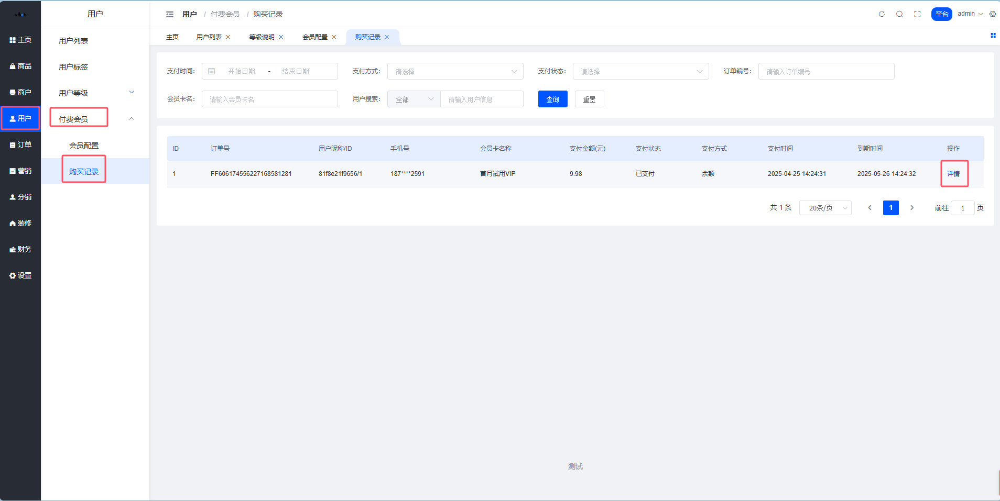

### 3.3 订单详情

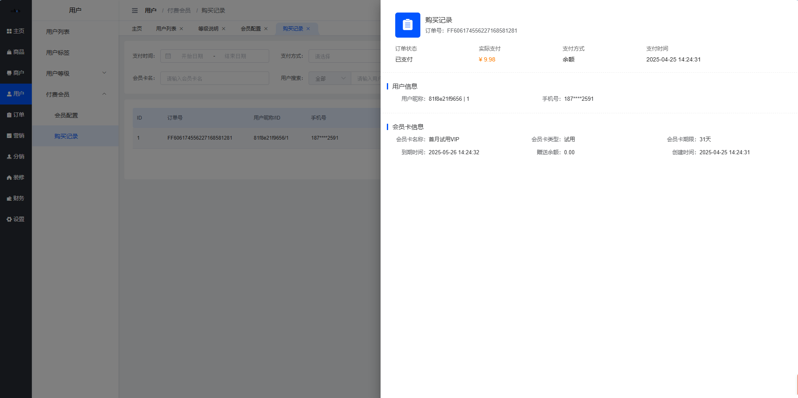

#### 订单信息说明

用户昵称、手机号通过 ID 实时查询，其余字段数据根据订单记录查询。

---

## 相关文档

- [用户等级管理](./05_用户等级管理.md)
- [积分管理](./07_积分管理.md)
