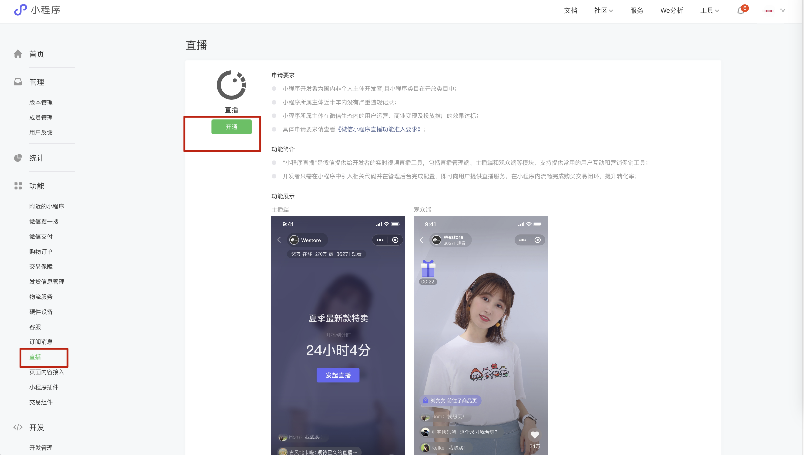
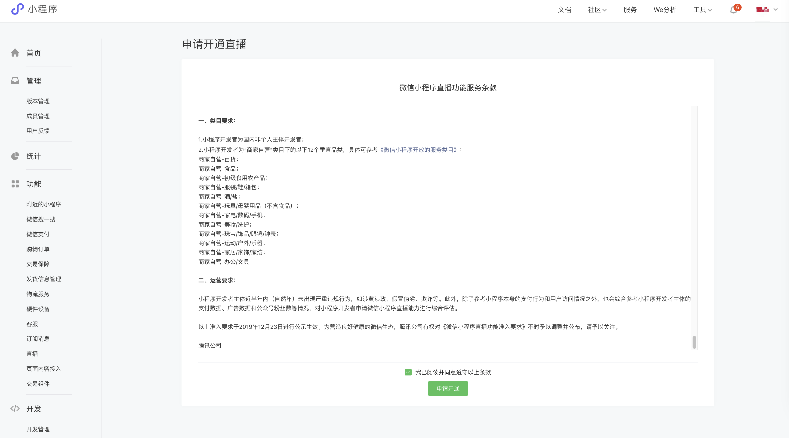
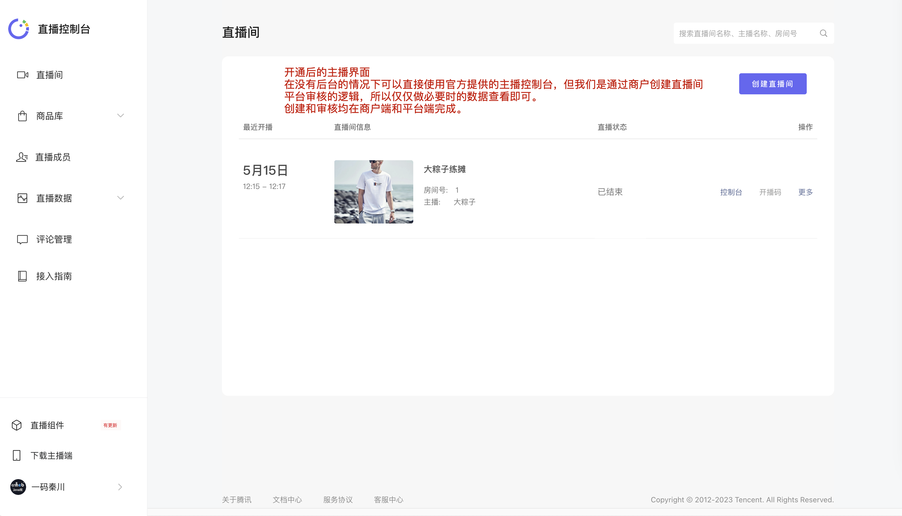
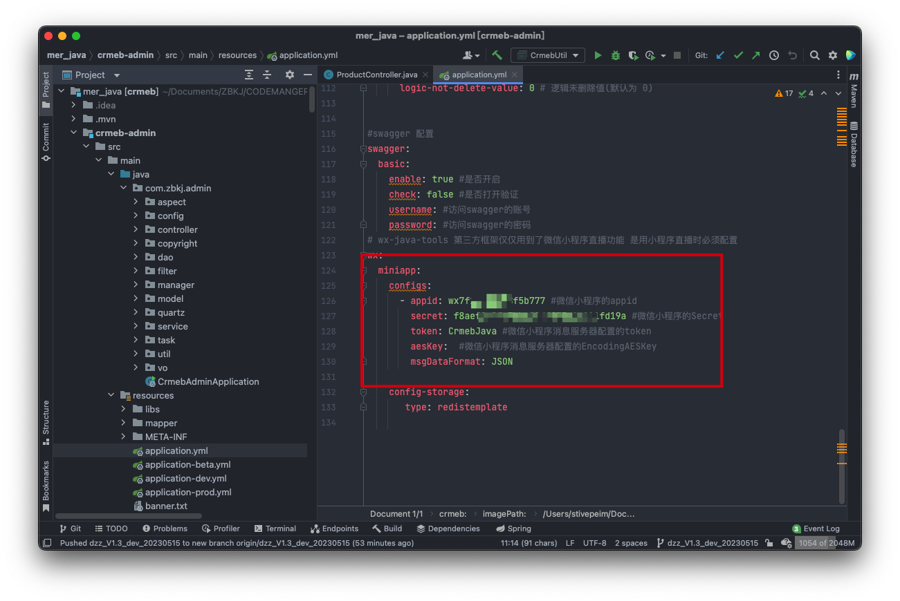
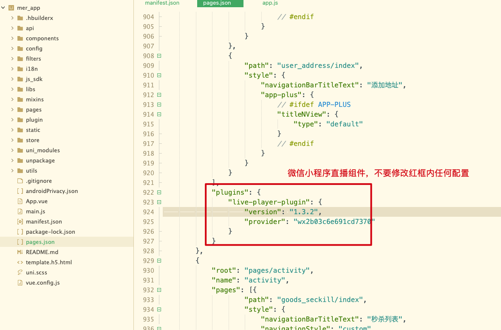

# 微信小程序直播

## 如何开通小程序直播及使用

随着Java多商户版本升级，我们在v1.2版本中已经加入了小程序直播功能，具体开通和运行功能如下。

已经开通的请参照此文档使用。

## 开通微信小程序直播

### 注意：开通条件

查看链接确认自己的小程序资质是否满足

### 确认开通

## 配置Java直播服务

在上述描述中开启了微信小程序直播组件后就可以配置Java程序和微信直播组件，创建自己的直播间啦！

### Java项目配置

Admin 和 Front都需要配置

接下来让微信小程序也支持我们的直播组件业务

### Uniapp 运行微信小程序

运行微信小程序之前确认直播组件是开启的，如下图：

运行小程序后发布线上提审即可，切记一定要有已经审核过后的要不小程序认为当前直播并未开启！

审核过后发布，即可愉快的直播啦
