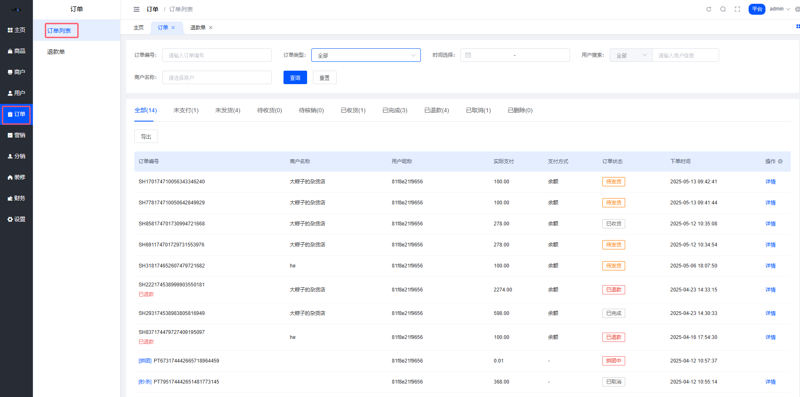
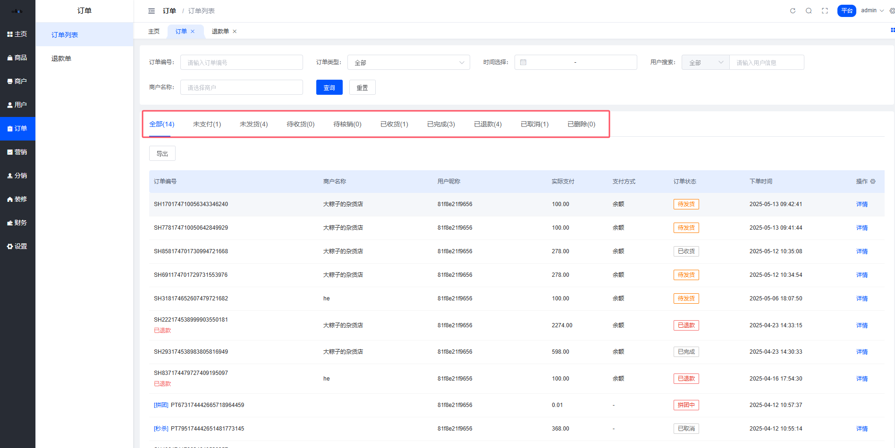

# 订单管理

## 平台端订单

### 平台订单介绍

本模块用于管理平台所有订单的全生命周期，支持订单查询、状态跟踪、数据统计。核心功能包括：

多维度筛选：按订单编号、商户名称、时间范围、订单类型等精准定位订单

状态管理：实时跟踪订单状态（未支付/未发货/待收货/待核销/已收货/已完成/已退款/已取消/已删除）

数据操作：查看订单详情、导出数据等业务处理

位置：平台后台 → 订单 → 订单列表

### 页面说明

#### 1.筛选区

| 字段 | 说明 |
|------|------|
| 订单编号 | 支持精确输入或模糊匹配（如输入SH107筛选前缀匹配订单） |
| 商户名称 | 输入商户全称或关键词（如"大粽子"） |
| 时间选择 | 支持自定义下单时间范围（精确到秒） |
| 订单类型 | 筛选普通订单/秒杀订单/拼团订单等 |
| 用户搜索 | 按用户类型筛选（如用户ID/手机号/用户昵称） |

#### 2.状态分类导航

动态统计标签：显示各状态订单数量（如"已退款(4)"）

快速筛选：点击标签立即展示对应状态订单（如点击"已发货"）

