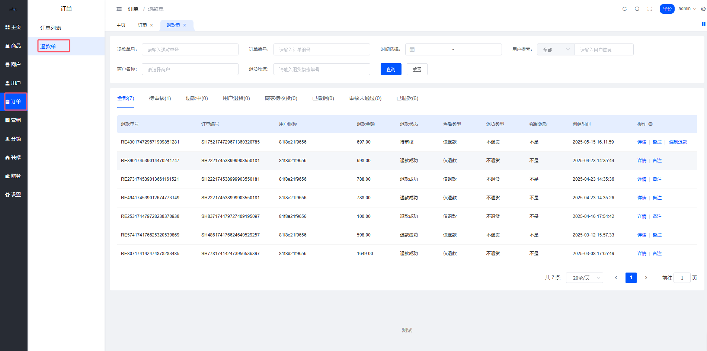
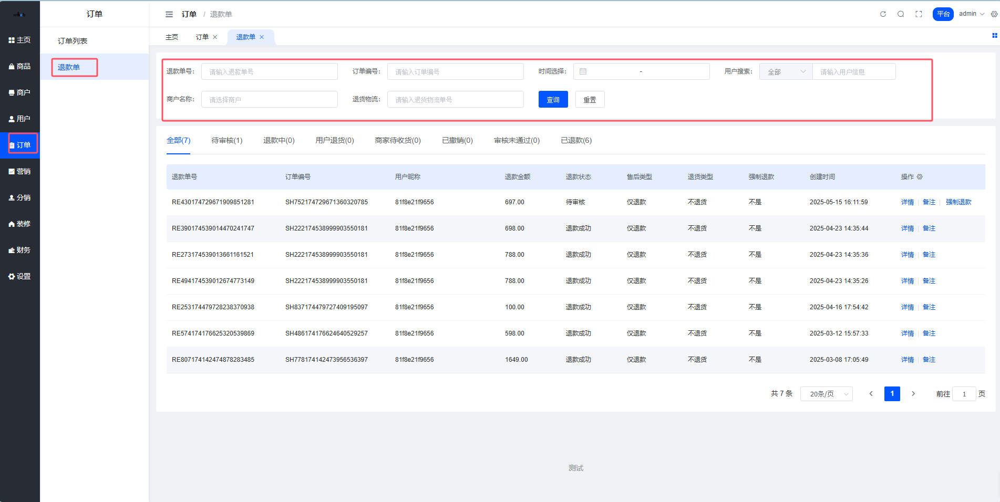
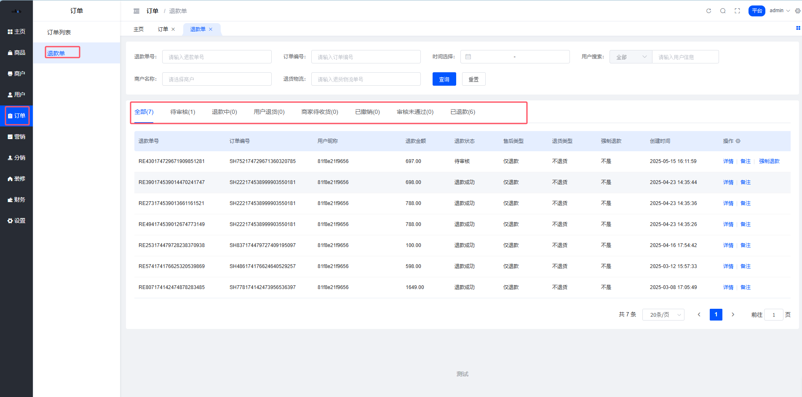
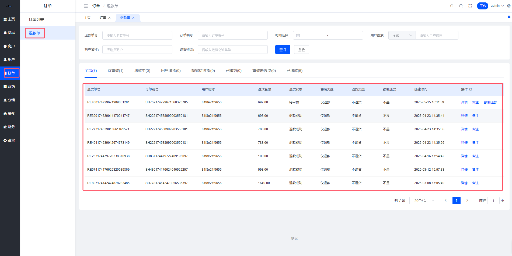
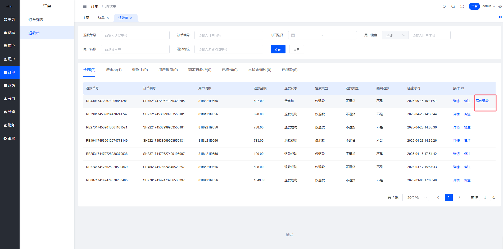
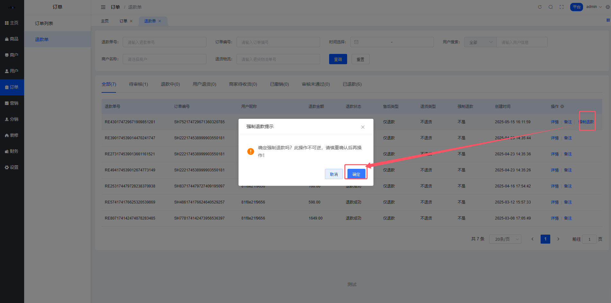

# 🔄 退款管理 - 售后退款全流程

> 👋 Hey！
> 退款是电商必不可少的环节,处理好了能提升用户满意度。
> 这个模块帮你轻松管理所有退款申请,从审核到退钱,一目了然！

## 📋 退款单介绍(这是什么?)

**简单来说:** 用户申请退款后,商家和平台需要审核和处理,这个模块就是管理所有退款申请的地方。

### 🎯 核心功能

- 🔍 **多维筛选** - 按用户、订单号、退款单号快速找到目标
- 📊 **状态追踪** - 实时查看退款进度(退款中/已退款/审核未通过)
- ⚡ **强制退款** - 平台可以直接给用户退款(特殊情况)
- 📝 **操作记录** - 记录每次操作的时间和备注

> **💡 小贴士:** 位置在 平台后台 → 订单管理 → 退款单

---

## 📊 退款单界面

整个退款管理页面分为三大区域,让你一眼就能掌握所有退款信息:



---

## 🔍 筛选区 - 快速定位退款单

可以通过多个条件快速定位退款单:



### 筛选条件说明

| 筛选条件 | 说明 | 使用场景 |
|---------|------|---------|
| 🧑 用户搜索 | 输入用户名/手机号 | 用户投诉时快速查找 |
| 📦 订单编号 | 输入订单号精确查找 | 知道订单号时直接定位 |
| 🧾 退款单号 | 输入退款单号 | 用户提供退款单号时使用 |

> **💡 小贴士:** 筛选条件可以组合使用,比如同时搜索用户和订单号,让查找更精准！

---

## 🏷️ 状态分类导航 - 按状态查看

退款单有不同的状态,可以快速切换查看:



### 退款状态说明

| 状态 | 含义 | 说明 |
|------|------|------|
| 🟡 退款中 | 退款申请审核中 | 商家或平台正在处理 |
| 🟢 已退款 | 退款已完成 | 钱已经退回用户账户 |
| 🔴 审核未通过 | 退款申请被拒绝 | 商家拒绝了退款申请 |

> **⚠️ 注意:** "退款中"的订单需要及时处理,避免用户等待时间过长影响体验

---

## 📝 退款列表 - 详细信息一览

列表展示所有退款单的详细信息:



### 列表字段说明

| 字段 | 说明 |
|------|------|
| 用户信息 | 申请退款的用户昵称/手机号 |
| 订单编号 | 原订单的订单号 |
| 退款单号 | 退款申请的唯一编号 |
| 退款金额 | 需要退给用户的金额 |
| 申请时间 | 用户发起退款的时间 |
| 退款状态 | 当前退款进度 |
| 操作 | 可执行的操作(查看详情/强制退款等) |

---

## ⚡ 强制退款(平台权限)

有时候需要平台直接给用户退款(比如商家不处理),可以用"强制退款"功能:



### 操作步骤

1. ✅ 在退款列表找到对应退款单
2. ✅ 点击"强制退款"按钮
3. ✅ 填写退款原因和备注
4. ✅ 确认后系统自动退款



> **⚠️ 注意:** 强制退款是平台特权,使用时要慎重,确保理由充分

### 什么时候用强制退款?

- 🔸 商家长时间不处理退款申请
- 🔸 商家与用户发生纠纷,需要平台介入
- 🔸 特殊情况需要紧急处理退款
- 🔸 用户投诉升级,需要快速解决

---

## 💰 退款流程说明

**完整的退款处理流程:**

```
用户发起退款申请
    ↓
商家审核退款申请
    ↓
审核通过 → 系统自动退款 → 退款完成
    ↓
审核不通过 → 退款失败 → 用户收到通知
    ↓
(如商家不处理)平台强制退款 → 退款完成
```

> **💡 小贴士:** 退款一般会原路退回,比如微信支付会退到微信零钱,支付宝支付会退到支付宝账户

---

## 📌 常见问题 FAQ

### Q1: 退款需要多久到账?

**A:** 一般退款会在 1-7 个工作日到账,具体时间取决于支付渠道:
- 微信支付: 1-3 个工作日
- 支付宝: 1-3 个工作日
- 银行卡: 3-7 个工作日

### Q2: 为什么退款状态一直是"退款中"?

**A:** 可能是以下原因:
- 商家还没审核
- 退款金额较大需要人工审核
- 支付渠道处理中

如果超过 3 天还是"退款中",建议联系商家或使用"强制退款"。

### Q3: 强制退款后商家会收到通知吗?

**A:** 会的! 平台强制退款后,商家会收到通知,同时退款金额会从商家结算账户扣除。

### Q4: 用户可以撤销退款申请吗?

**A:** 可以! 在退款审核通过前,用户可以在订单详情中撤销退款申请。

---

## 🎓 最佳实践建议

### 给平台管理员的建议

✅ **及时处理:** 每天至少检查一次退款列表,避免退款堆积
✅ **沟通优先:** 使用强制退款前,先联系商家了解情况
✅ **记录完整:** 每次强制退款都要填写详细备注,方便后续追溯
✅ **定期统计:** 定期查看退款率,如果某个商家退款率过高要重点关注

### 常见坑点提醒

⚠️ **不要随意强制退款** - 这会影响商家利益,除非确实必要
⚠️ **注意退款金额** - 确认退款金额是否正确,避免多退或少退
⚠️ **保留沟通记录** - 涉及纠纷的退款,要保留与商家、用户的沟通记录

---

## 🔗 相关文档

- [订单管理](./09_订单管理.md) - 了解订单的完整生命周期
- [用户管理](./04_用户管理.md) - 查看用户的其他订单和退款记录
- [商户管理](./05_商户管理.md) - 查看商家的退款处理能力和评分
