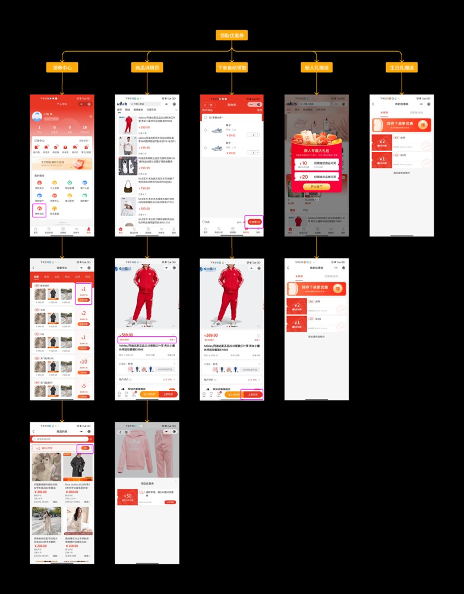
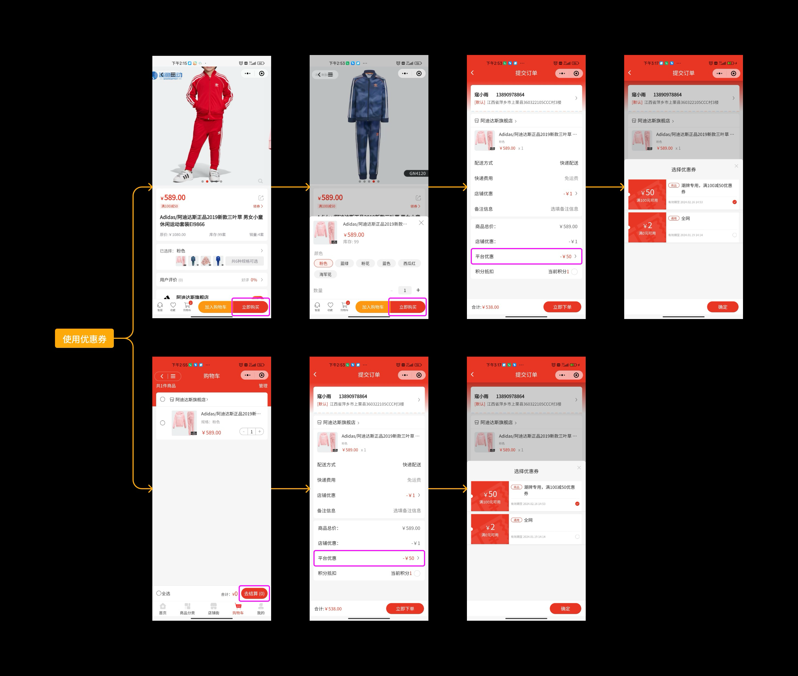
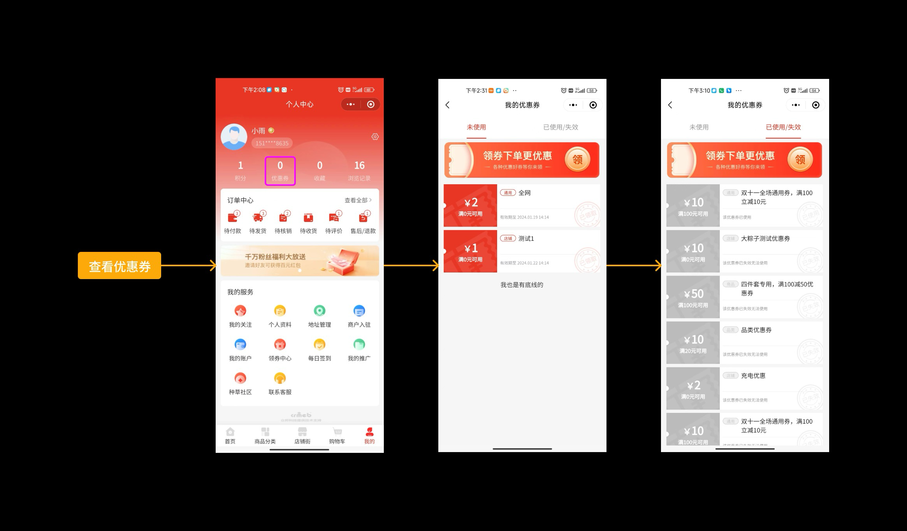

# 🎟️ 优惠券活动 - 让用户薅羊毛的正确姿势

> 👋 嘿！
> 优惠券是电商的"杀手锏"，用得好能拉新、促活、提升复购率。
> 这个模块帮你玩转优惠券营销，从发券到用券，全流程搞定！

---

## 一、优惠券介绍（这是啥？）

说人话，优惠券就是平台给用户发的"代金券"，用户下单时可以用它来抵扣一部分金额。多商户平台的优惠券系统，支持平台和商家分别发券，灵活组合使用。

### 优惠券能带来什么好处？

- 💰 **增加销售额** - 降低购买门槛，促进用户下单
- 🎯 **促进消费** - 设置使用期限，刺激用户尽快下单
- 💕 **提升用户粘性** - 定期发券活动，让用户记住你的平台
- 🎁 **拉新促活** - 新人券、���日券等特殊福利，提升用户好感度

---

## 二、核心功能

### 🎁 5 种券类型，想怎么玩就怎么玩

- **通用券** - 全平台所有��品都能用，力度最大！
- **品类券** - 指定某个品类使用，比如"服装满200减30"
- **商品券** - 只能用在特定商品上，精准营销
- **品牌券** - 指定品牌可用，适合品牌促销
- **跨店券** - 指定店铺可用，帮商家引流

### 🎂 自动发券，躺着也能做营销

系统支持自动发券，无需人工操作：

- **新人礼** - 新用户注册后自动发放，欢迎新朋友
- **生日礼** - 用户生日当天自动送券，增加仪式感

### 📍 4 种领取方式，覆盖所有场景

1. **领券中心** - 用户主动到领券中心领取
2. **商品详情页** - 看商品的时候顺手领券
3. **下单自动领取** - 下单时系统自动选择最优惠的券
4. **系统赠送** - 新人礼/生日礼等直接发到账户

---

## 三、用户怎么用券？

### 第一步：领取优惠券

用户可以通过以下 4 种途径领券：

1. **领券中心** - 展示所有可领取的优惠券，手动领取
2. **商品详情页** - 查看商品时领取该商品可用的券
3. **下单自动领取** - 提交订单时，系统自动选择优惠力度最大的券
4. **系统赠送** - 注册新人、生日当天等自动发放到账户



### 第二步：使用优惠券

用户在结算页面可以选择要使用的优惠券，或者选择不使用。系统会自动计算优惠后的金额。



### 第三步：查看我的优惠券

用户可以在"我的优惠券"页面查看：

- **未使用** - 还没用的券，可以继续使用
- **已使用** - 已经用过的券，查看历史记录
- **已过期** - 超过有效期的券，不能再用了

点击优惠券卡片，还能查看该券可使用的商品列表。



---

## 四、优惠券规则（游戏规则要讲清楚）

### ✅ 可以叠加使用

| 优惠方式 | 是否支持叠加 |
|---------|------------|
| 平台优惠券 + 商家优惠券 | ✅ 支持 |
| 优惠券 + 积分抵扣 | ✅ 支持 |

### ❌ 不能叠加使用

| 商品类型 | 是否支持优惠券 |
|---------|--------------|
| 秒杀商品 | ❌ 不支持 |
| 其他营销活动商品 | ❌ 不支持 |

### 💰 成本由谁承担？

- **平台优惠券** - 优惠金额由平台承担
- **商家优惠券** - 优惠金额由商家承担

### 使用门槛说明

优惠券的使用需要满足最低消费金额：

> **💡 举个例子：**
>
> - 商品价格：100 元
> - 平台券：满 100 减 20
> - 商家券：满 100 减 10
> - 积分抵扣：5 元
>
> **计算过程：**
> 1. 商品原价 100 元
> 2. 使用平台券减 20 元 = 80 元
> 3. 使用商家券减 10 元 = 70 元
> 4. 使用积分抵扣 5 元 = 65 元
>
> **最终只需支付 65 元！**

### 详细规则说明

1. **叠加规则** - 平台优惠券支持与商家优惠券、积分抵扣叠加使用
2. **活动限制** - 秒杀等营销活动不支持使用平台优惠券
3. **成本承担** - 订单中使用的平台优惠券金额由平台承担
4. **门槛判断** - 商品售价需高于平台券和商家券的使用门槛，才能同时使用
5. **计算顺序** - 商品售价先减去平台券和商家券，再计算积分抵扣比例

---

## 五、退券机制

当订单发生退款时，优惠券会怎么处理呢？

```
订单退款成功
    ⬇️
优惠券自动退回
    ⬇️
还在有效期内？
   ╱ ＼
 是   否
  ⬇️   ⬇️
可继续使用 过期失效
```

### 详细规则

**整单退款：**
- 售后订单退款成功后，优惠券自动退回给用户
- 若优惠券还在有效期内，用户可以继续使用
- 若已过期，则优惠券失效

**拆单退款：**
- 订单中使用此优惠券的商品均退款成功后，优惠券自动退回
- 若优惠券还在有效期内，用户可以继续使用
- 若已过期，则优惠券失效

> **💡 温馨提示：**
> 优惠券退回是为了保护用户权益，避免因退款导致优惠券白白浪费。但如果券已经过期了，那就真的没办法啦！

---

## 六、创建优惠券（字段说明）

创建优惠券时，需要设置一些关键字段。下面用表格详细说明每个字段的作用：

| 字段名称 | 字段说明 | 举个栗子 🌰 |
|---------|---------|-----------|
| 优惠券名称 | 展示给用户看的名称，描述优惠券规则 | "双11狂欢券"、"新人专享券" |
| 优惠券面值 | 能抵扣多少钱 | 20 元、50 元、100 元 |
| 使用门槛 | 最低消费金额（0 表示无门槛） | 满 100 元可用、满 200 元可用、无门槛 |
| 领取方式 | 用户如何获得这张券 | 用户手动领取、平台活动自动发放 |
| 领取时间 | 用户可以领券的时间范围 | 2025-12-01 至 2025-12-31 |
| 使用有效期 | 券的有效期设置 | 领取后 7 天内有效、2025-12-01 至 2025-12-31 可用 |
| 发布数量 | 本次活动总共发放多少张券 | 1000 张、不限量 |
| 重复领取 | 用户能否多次领取同一张券 | 可重复领取、不可重复领取 |
| 是否开启 | 是否在用户端展示 | 开启、关闭 |
| 使用范围 | 券的使用范围限制 | 通用券、品类券、商品券、品牌券、跨店券 |

### 字段详细说明

#### 1. 优惠券名称
- 用于用户端优惠券卡片的展示
- 一般描述优惠券的规则，比如"满100减20"
- 最多可以输入 20 个字
- **建议**：名称要简洁明了，让用户一眼看懂

#### 2. 优惠券面值
- 使用此优惠券可以抵扣的金额，单位（元）
- **建议**：根据商品价格设置合理的面值，太小没吸引力，太大成本高

#### 3. 使用门槛
- 优惠券的最低消费金额
- 使用门槛为 0 时指无门槛
- **建议**：门槛设置要合理，一般是面值的 3-5 倍

#### 4. 领取方式
- **用户手动领取** - 用户在领券中心可以进行领取使用的优惠券
- **平台活动使用** - 平台创建其他营销活动时可选择此类型优惠券，用户满足活动条件后直接发放
  - 现发放优惠券的活动有：新人礼、生日有礼、用户列表直接赠送

#### 5. 领取时间
- 用户在领取时间范围内，才能够进行此优惠券的领取
- 一般用于某活动提前创建优惠券
- 未在领取时间范围中的优惠券在用户端不展示
- **建议**：提前创建优惠券，避免活动当天手忙脚乱

#### 6. 使用有效期

有两种设置方式：

- **天数方式** - 领取之后多少天之后失效
  - 举个栗子：设置 7 天，用户领取后 7 天内可用
- **时间段方式** - 在选中的时间段中才能够使用此优惠券
  - 举个栗子：2025-12-01 至 2025-12-31 可用

失效的优惠券将不能使用，过期失效。

#### 7. 发布数量
- 本次活动此优惠券总计发放多少张
- 支持设置不限量
- **建议**：根据活动预算和预期效果设置合理数量

#### 8. 重复领取
- **可重复领取** - 若用户领取该优惠券且使用过后，可以再次领取
- **不可重复领取** - 若用户领取该优惠券无论是否使用，都不可再次领取
- **建议**：常规活动建议不可重复，特殊活动（如每周福利）可设置重复领取

#### 9. 是否开启
- 只有开启的优惠券才在用户端展示
- 只有开启的优惠券才能关联营销活动
- **使用场景**：创建优惠券后先不开启，等活动开始时再开启

#### 10. 使用范围

| 类型 | 说明 | 适用场景 |
|-----|------|---------|
| 通用券 | 全平台所有商品均可使用 | 平台大促、新人礼包 |
| 品类券 | 指定品类可以使用此优惠券 | 品类促销，如"服装满200减30" |
| 商品券 | 指定商品可以使用此优惠券 | 新品推广、清仓特卖 |
| 品牌券 | 指定品牌可以使用此优惠券 | 品牌合作、品牌日活动 |
| 跨店券 | 指定店铺可以使用此优惠券 | 为特定商家引流 |

---

## 七、总结与建议

### 💡 优惠券营销的最佳实践

1. **新人券要大方** - 新用户的第一印象很重要，给个大额无门槛券，让他们感受到诚意
2. **定期发券保活跃** - 每周/每月固定时间发券，培养用户定期来看的习惯
3. **结合场景发券** - 生日、节日、会员日等特殊时间发券，增加仪式感
4. **门槛设置要合理** - 太高没人用，太低亏本，一般是面值的 3-5 倍
5. **有效期不宜太长** - 一般 7-15 天，给用户紧迫感，促进下单
6. **数量控制** - 限量发放增加稀缺感，但也要保证活动效果

### 🎯 常见优惠券组合方案

| 活动场景 | 推荐方案 | 说明 |
|---------|---------|------|
| 新人注册 | 30 元无门槛券 + 满 200 减 50 券 | 先用小券体验，再用大券促进大额消费 |
| 生日福利 | 满 100 减 30 券（品类券） | 根据用户偏好品类发放，提高使用率 |
| 平台大促 | 满 300 减 50（全场通用） | 提升客单价，促进多商品购买 |
| 清仓特卖 | 满 100 减 30（商品券） | 指定商品快速清库存 |
| 会员日 | 满 200 减 40（叠加积分） | 会员专享，增加会员价值感 |

### ⚠️ 注意事项

- 优惠券一旦发放，无法修改规则，请创建前仔细检查
- 定期清理过期优惠券数据，保持系统性能
- 监控优惠券使用数据，及时调整营销策略
- 避免优惠券滥用，合理设置领取限制

---

> **🎉 恭喜你！**
> 现在你已经掌握了优惠券活动的全部玩法。
> 去创建你的第一个优惠券活动吧，让用户开心薅羊毛，平台也能实现营销目标！
