# 🎫 优惠券列表管理

嘿！👋 欢迎来到优惠券列表管理页面！

## 📖 什么是优惠券管理？

说人话就是：这是平台管理员用来创建、编辑和管理各种优惠券的地方。通过优惠券，你可以开展各种营销活动，吸引用户下单购买。

### ✨ 核心功能

- 🎯 **多种类型**：支持全场通用券、品类券、品牌券、商品券、店铺券（支持多店铺）
- ⚙️ **灵活设置**：可设置面值、领取方式（手动领取、平台活动发放）、领取时间、使用时间、发布数量
- 🔒 **安全保障**：系统不支持0元购功能，商品享受其他优惠后的金额必须大于优惠券金额，才可以使用该优惠券

---

## 👀 查看优惠券列表

**操作路径**：营销 > 优惠券管理 > 优惠券列表

### 功能说明

在这里可以查看所有已创建的优惠券，包括优惠券的详细信息。

### 操作步骤

**第一步**：进入优惠券列表页面

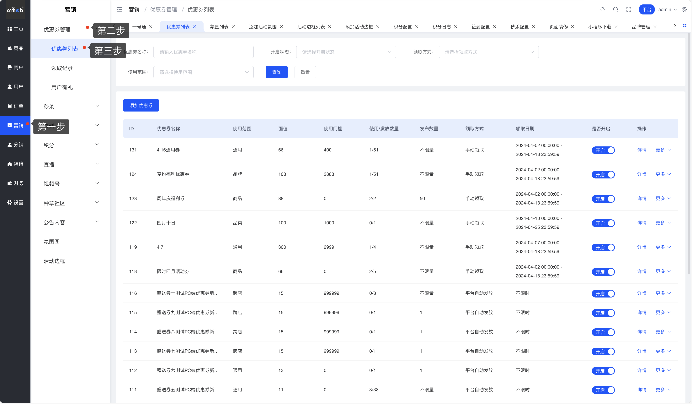

**第二步**：点击【查看】按钮，打开优惠券详情弹窗

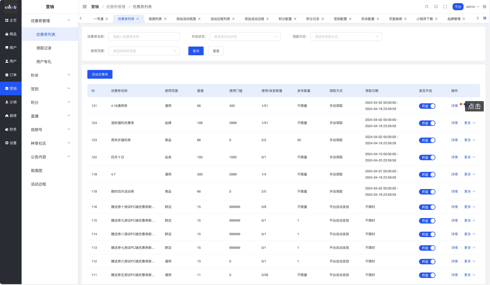

**第三步**：查看优惠券详细信息

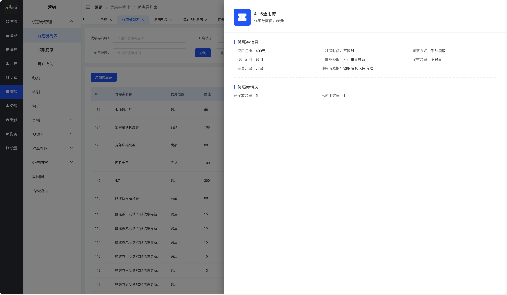

---

## ➕ 添加优惠券

**操作路径**：营销 > 优惠券管理 > 优惠券列表

### 功能说明

当你需要开展营销活动或者在领券中心为用户提供福利时，可以通过这个功能创建新的优惠券。

### 操作步骤

**第一步**：点击【添加优惠券】按钮，打开新增优惠券页面

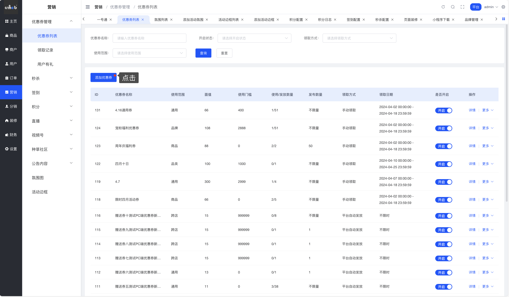

**第二步**：填写优惠券基本信息设置，点击下一步进行优惠券使用范围完善

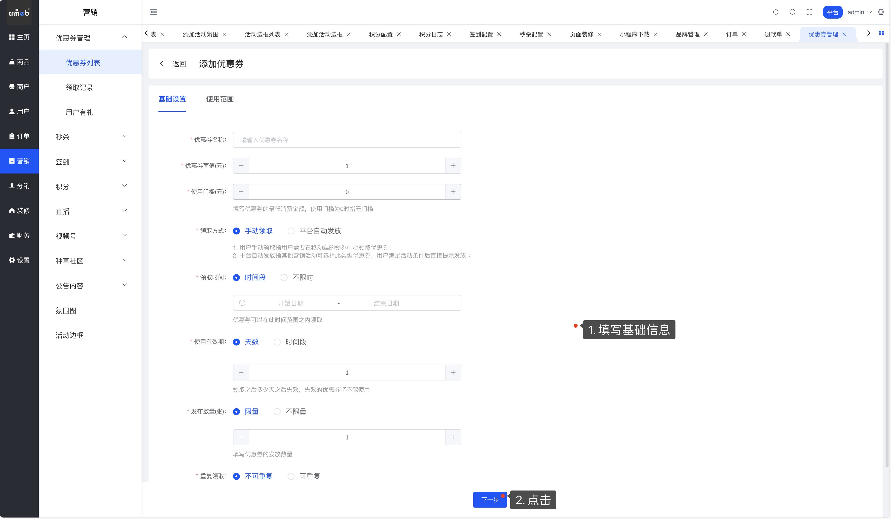

**第三步**：完善优惠券使用范围，并点击【保存】按钮，优惠券添加完成

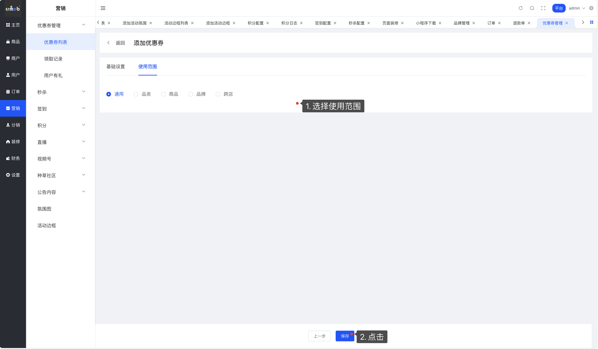

### 📋 字段说明表

简单来说，创建优惠券时需要填写这些内容：

| 字段名称 | 字段说明 |
|---------|---------|
| **优惠券名称** | 用户端优惠券卡片上展示的名称，一般描述优惠券的使用规则，最多可输入20个字 |
| **优惠券面值** | 使用此优惠券可以抵扣的金额，单位：元 |
| **使用门槛** | 优惠券的最低消费金额，为0时表示无门槛 |
| **领取方式** | • **用户领取使用**：用户在领券中心可以主动领取使用 • **平台活动使用**：平台创建营销活动时可选择此类型优惠券，用户满足活动条件后自动发放（如新人礼、生日有礼、用户列表直接赠送等） |
| **领取时间** | 用户只能在此时间范围内领取优惠券，超出时间范围的优惠券在用户端不展示 |
| **使用有效期** | • **天数**：领取后多少天内有效，过期自动失效 • **时间段**：只能在指定时间段内使用，过期失效 |
| **发布数量** | 本次活动此优惠券总计发放多少张，支持设置不限量 |
| **重复领取** | • **可重复领取**：用户使用后可以再次领取 • **不可重复领取**：用户领取后无论是否使用，都不可再次领取 |
| **是否开启** | 只有开启的优惠券才在用户端展示，才能关联营销活动 |
| **使用范围** | • **通用券**：全平台所有商品均可使用 • **品类券**：指定品类可以使用 • **商品券**：指定商品可以使用 • **品牌券**：指定品牌可以使用 • **跨店券**：指定店铺可以使用 |

💡 **小提示**：优惠券名称要简洁明了，让用户一眼就能看懂使用规则哦！

---

## ✏️ 编辑优惠券

**操作路径**：营销 > 优惠券管理 > 优惠券列表

### 功能说明

如果已经创建的优惠券需要修改，可以使用编辑功能。如果编辑功能无法满足你的需求（有些字段不能编辑），可以通过复制功能创建新的优惠券，然后关闭旧的优惠券。

### 可编辑字段

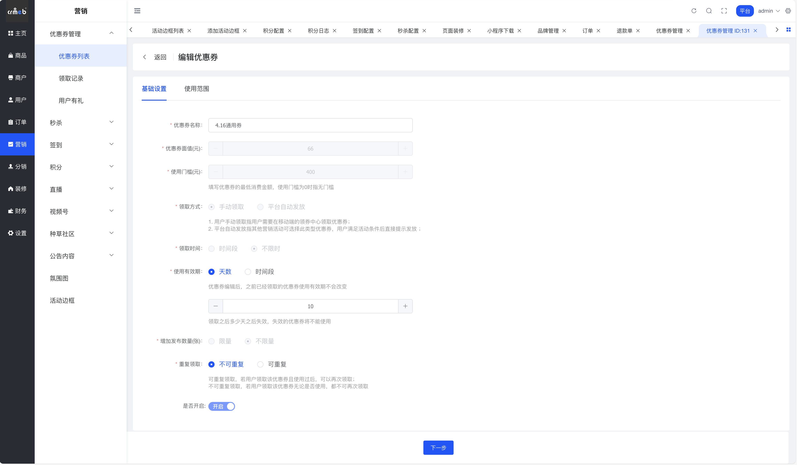

### 📝 编辑规则说明

| 字段 | 编辑规则 | 影响范围 |
|-----|---------|---------|
| **优惠券名称** | 可修改 | 已领取的优惠券将使用新名称 |
| **使用范围** | 类型不可切换，只能编辑商品、店铺内容 | 已领取的优惠券将使用新使用范围 |
| **领取时间** | 时间只能往后延期 | 仅影响未来领取 |
| **使用有效期** | 可修改 | 不影响已领取的优惠券，已领取优惠券使用领取时的有效期 |
| **发布数量** | 是否限量不能编辑，只能增加限量数字 | 仅影响未来发放 |
| **重复领取** | 可修改 | 已领取的用户再次领取时按照新规则 |

⚠️ **注意**：有些字段的编辑会影响已经领取的优惠券，修改前请确认影响范围！

---

## 📑 复制优惠券

**操作路径**：营销 > 优惠券管理 > 优惠券列表

### 功能说明

适用于以下场景：
- 需要创建相似的优惠券
- 编辑功能无法满足修改需求时

### 操作步骤

**第一步**：点击【复制】按钮，打开新增优惠券页面，会自动回显原优惠券的信息

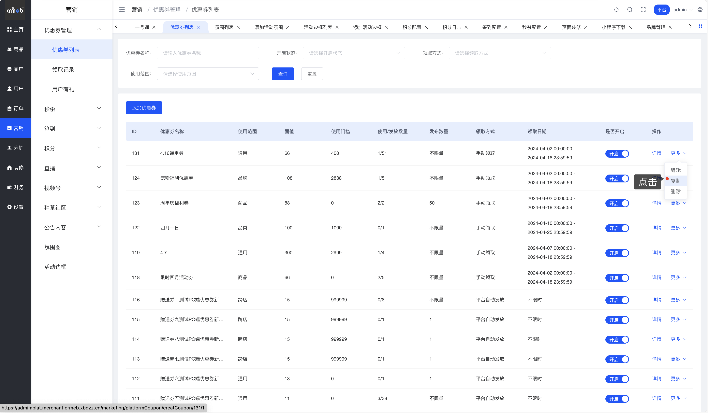

**第二步**：修改优惠券信息

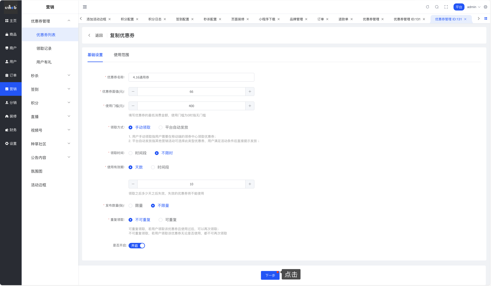

**第三步**：在使用范围标签页下点击【保存】按钮，优惠券复制成功

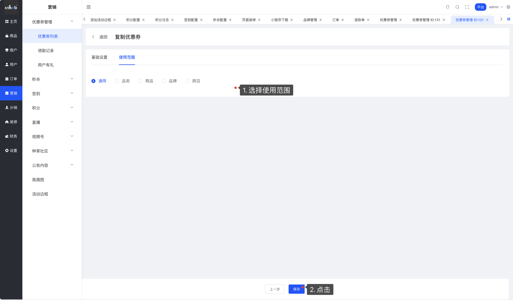

💡 **小技巧**：举个栗子，如果你需要创建一系列面值不同但规则相同的优惠券，用复制功能会特别方便！

---

## 🗑️ 删除优惠券

**操作路径**：营销 > 优惠券管理 > 优惠券列表

### 功能说明

用于处理优惠券发放错误等特殊情况，可以快速删除不需要的优惠券。

### 操作步骤

**第一步**：点击【删除】按钮，打开优惠券删除弹窗

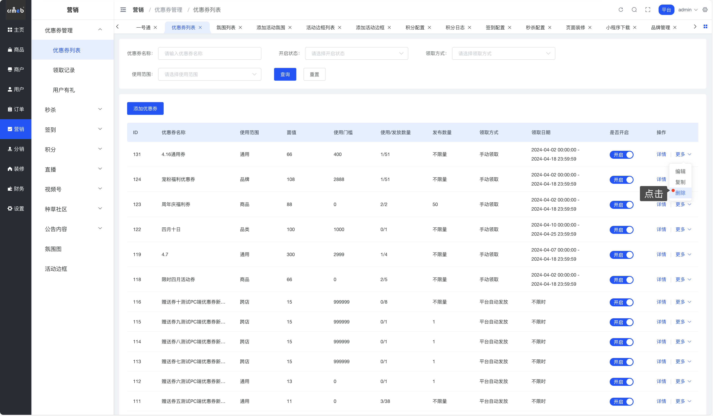

**第二步**：选择已经被领取的优惠券如何处理，然后点击【删除】按钮

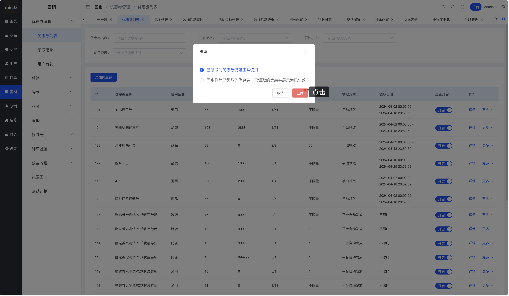

优惠券删除成功后，已发送的优惠券会根据你的选择决定是否作废。

⚠️ **重要提示**：删除操作要谨慎！如果用户已经领取了优惠券，删除时请考虑清楚是否要将已领取的优惠券作废，避免引起用户投诉。

---

## 💡 使用技巧与最佳实践

### 🎯 优惠券命名建议

- **明确优惠内容**：如"满100减20元"、"新人专享50元券"
- **突出使用范围**：如"电子产品专用券"、"全场通用券"
- **标注时效性**：如"周年庆专享"、"双11特惠"

### 📅 时间设置建议

- **领取时间**：建议设置为活动开始前1-2天，让用户有时间领取
- **使用有效期**：根据活动类型设置，一般促销活动建议7-30天

### 🎁 发放策略建议

- **新人券**：建议设置较低门槛或无门槛，面值适中（如20-50元）
- **促销券**：建议设置合理门槛，面值根据客单价设定
- **会员券**：可设置较高面值，提升会员粘性

### 🔄 使用范围建议

- **通用券**：适合大型促销活动，吸引力强
- **品类券/品牌券**：适合清理特定品类库存或推广特定品牌
- **商品券**：适合推广新品或爆款商品
- **跨店券**：适合联合多店铺开展活动

---

好了！👏 现在你已经掌握了优惠券管理的全部操作。快去创建你的第一个优惠券，开启营销之旅吧！
