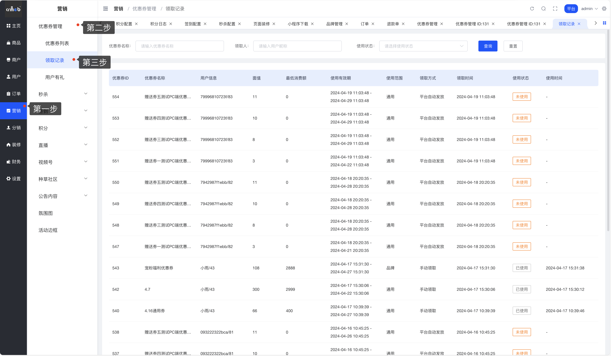

# 📋 优惠券领取记录

嘿！👋

这个功能是用来查看平台优惠券的领取和使用情况的。说人话就是：看看哪些用户领了优惠券,领了多少张,用没用,什么时候用的。

## 👀 能看到什么信息

在优惠券领取记录里,你可以查看以下信息:

| 字段 | 说明 |
|------|------|
| 用户信息 | 领取优惠券的用户是谁 |
| 优惠券名称 | 用户领取的是哪张优惠券 |
| 面值 | 优惠券能抵扣多少钱 |
| 使用门槛 | 满多少钱才能用 |
| 使用有效期 | 优惠券的有效期限 |
| 使用范围 | 可以在哪些商品/店铺使用 |
| 领取方式 | 用户通过什么方式领取的 |
| 领取时间 | 什么时候领取的 |
| 使用状态 | 已使用/未使用/已过期 |
| 使用时间 | 什么时候使用的 |

## 📊 如何查看领取记录

**访问路径:** 营销 > 优惠券管理 > 领取记录

**操作步骤:**

1. 登录平台后台管理系统
2. 点击左侧菜单 **营销** 模块
3. 选择 **优惠券管理**
4. 点击 **领取记录** 菜单

## 💡 使用技巧

简单来说,这个功能可以帮你:

- **查看领取情况:** 了解优惠券的受欢迎程度
- **追踪使用率:** 看看发出去的优惠券有多少被实际使用了
- **分析用户行为:** 哪些用户喜欢领券,哪些用户领了不用
- **优化营销策略:** 根据数据调整优惠券的设置

💡 **小提示:** 可以通过筛选条件快速找到你想查看的记录,比如按时间范围、使用状态等进行筛选。
