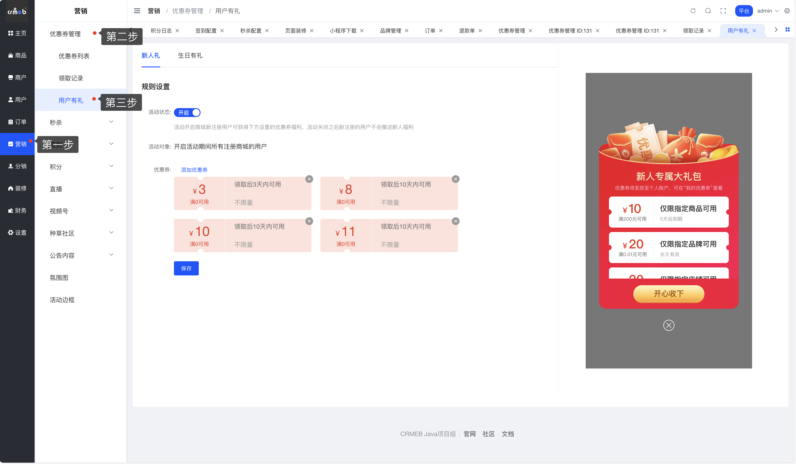
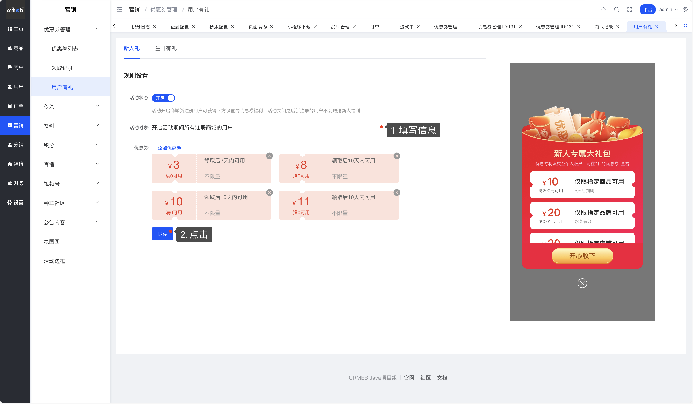
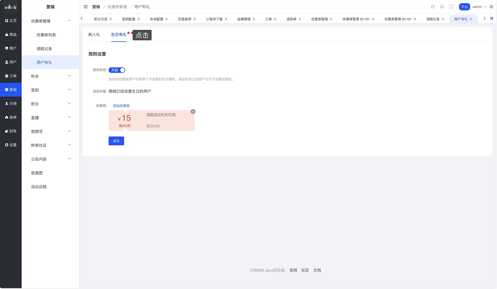
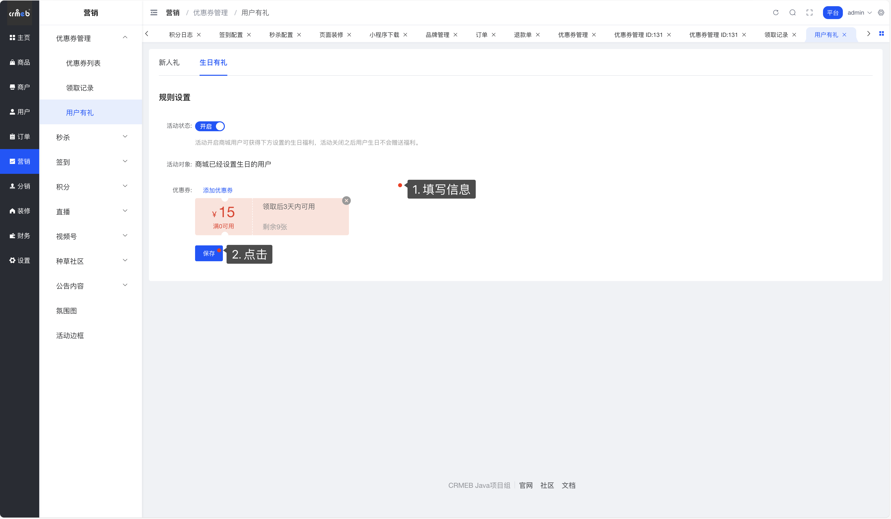
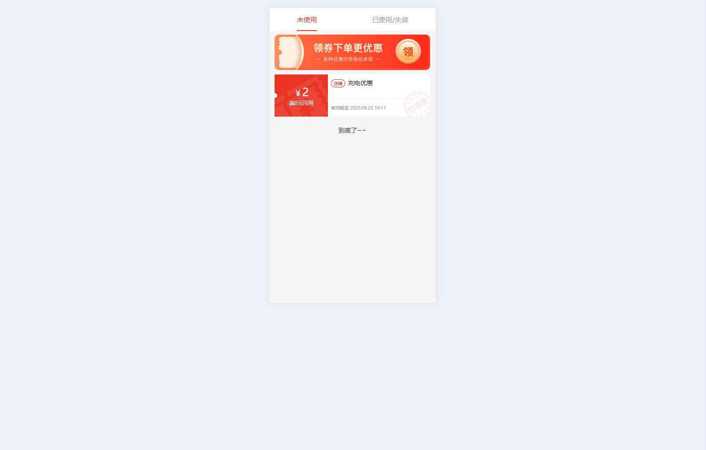

# 🎁 用户有礼

嘿！👋 欢迎来到用户有礼功能说明。

## 📖 什么是用户有礼？

说人话：用户有礼就是给用户送优惠券的自动化功能，主要包括两个场景：

- **🎉 新人礼**：新用户注册时自动送优惠券大礼包
- **🎂 生日有礼**：用户生日当天自动送优惠券福利

简单来说，这些优惠券都是自动发放的，用户无需手动领取，直接到账！新人礼还会有专属的弹窗提示哦。

---

## 🎉 新人礼配置

### 操作路径

营销 > 优惠券管理 > 用户有礼

### 配置步骤

**第一步**：进入新人礼配置页面

**第二步**：填写新人礼设置信息，点击【保存】按钮

### 📋 新人礼字段说明

| 字段名称 | 字段说明 |
|---------|---------|
| **活动状态** | 开启后，新注册用户可自动获得优惠券福利；关闭后，新注册用户不会获得福利 |
| **活动对象** | 开启活动期间，所有注册商城的新用户 |
| **优惠券** | 设置要赠送的优惠券（支持多张） |

⚠️ **注意事项**：
- 只能选择优惠券列表中**已开启**的优惠券
- 领取方式必须为**平台活动发放**
- 领取日期必须**有效**

---

## 🎂 生日有礼配置

### 操作路径

营销 > 优惠券管理 > 用户有礼 > 生日有礼标签页

### 配置步骤

**第一步**：点击【生日有礼】tab标签页

**第二步**：填写生日有礼设置信息，点击【保存】按钮

### 📋 生日有礼字段说明

| 字段名称 | 字段说明 |
|---------|---------|
| **活动状态** | 开启后，用户生日可自动获得优惠券福利；关闭后，用户生日不会获得福利 |
| **活动对象** | 商城中已设置生日的用户 |
| **优惠券** | 设置要赠送的优惠券（支持多张） |

⚠️ **重要提示**：
- 只能选择优惠券列表中**已开启**的优惠券
- 领取方式必须为**平台活动发放**
- 领取日期必须**有效**
- **每个用户一年只能获取一次生日礼**（即使多次修改生日也只能获得一次）

---

## 💝 用户端查看优惠券

### 查看路径

我的 > 优惠券

### 用户体验说明

- **新人礼**：发放时会弹出新人专属大礼包提示窗，用户可以直观看到获得的福利
- **生日礼**：直接发放到用户的优惠券列表中，不会有弹窗提示

用户可以在"我的优惠券"中查看所有获得的优惠券，并进行使用操作。

---

## 💡 使用技巧

**举个栗子**：

1. **新人礼场景**：新用户小明注册了你的商城，系统自动赠送3张优惠券（满100减10、满200减30、满500减80），小明会看到一个精美的新人大礼包弹窗，点击查看后这3张券已经在他的账户里了。

2. **生日礼场景**：老用户小红在个人中心填写了生日是12月25日，到了12月25日当天，系统自动给她发放生日专属优惠券（比如生日专享8折券），小红打开"我的优惠券"就能看到并使用。

💡 **温馨提示**：
- 建议定期检查优惠券池，确保用于赠礼的优惠券状态正常
- 新人礼和生日礼可以同时开启，互不影响
- 优惠券的面额和使用规则要合理设置，既能吸引用户又能控制成本
