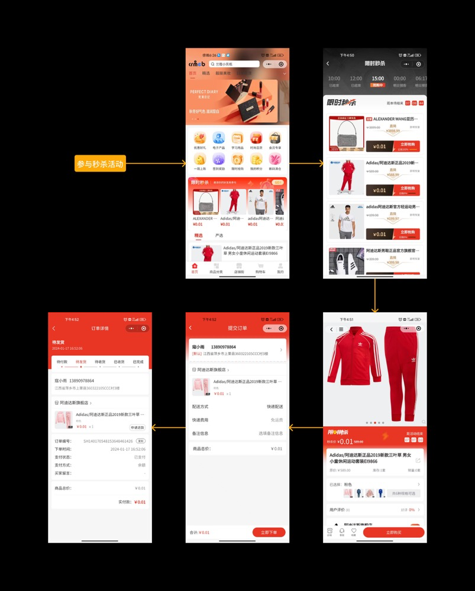
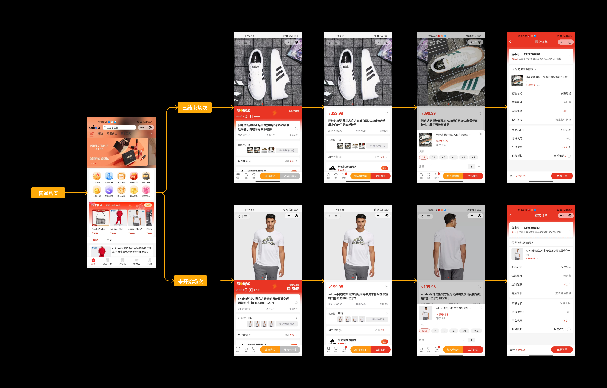

# 秒杀活动说明

嘿！👋 欢迎来到秒杀活动说明文档！让我们一起了解如何玩转秒杀活动吧！

## 活动介绍 ⚡

**说人话**：秒杀活动就是限时抢购！通过超低价格、限量库存的方式，让用户在短时间内完成购买，创造"买到就是赚到"的体验。

系统支持以下核心功能：
- ⏰ 设置多个秒杀场次时段
- 🛒 不同场次添加不同/相同秒杀商品
- ⚙️ 批量设置商品属性（限量、价格、排序）

### 秒杀活动的主要作用

| 作用 | 说明 |
|------|------|
| 🎯 刺激消费 | 激发购买欲望，提高销售额 |
| 📦 清理库存 | 快速周转滞销商品，减少资金占用和库存积压 |
| 🌟 品牌曝光 | 增加品牌曝光度和用户粘性，吸引新老用户关注 |
| ❤️ 提升忠诚度 | 通过特殊的购物体验和优惠价格，增强对品牌的认同和信任 |

## 功能说明 📋

### 1. 参加秒杀活动

用户通过首页秒杀专区参与秒杀活动，专区展示的是**正在进行中**的秒杀场次商品。

**简单来说**：
- ✅ 支持查看不同秒杀场次的商品信息
- 📅 可以看到未开始、进行中、已结束等不同阶段的秒杀场次
- 🛍️ 只能购买正在进行中的秒杀场次商品

💡 **小贴士**：用户可以提前查看未开始的秒杀场次，设置提醒，不错过任何抢购机会！

### 2. 其他场次商品购买

用户通过首页秒杀专区进入秒杀活动后，对于未开始或已结束场次的商品，可以按普通价格购买。

**举个栗子**：
- 某商品原价 ¥100，秒杀价 ¥50
- 秒杀场次已结束，用户仍可按 ¥100 购买
- 可以使用平台优惠券、商家优惠券、积分抵扣等优惠

### 3. 秒杀规则说明 📝

#### 规则概览

| 规则项 | 说明 |
|--------|------|
| 场次时段 | 平台设置不同场次对应的秒杀时段 |
| 活动设置 | 支持设置活动日期、关联场次时段、活动限购、单次限购 |
| 限制条件 | 可对商品范围、商家门槛进行限制 |
| 商品管理 | 平台可直接添加自营店商品，商家可提交商品待审核 |
| 优惠叠加 | 秒杀活动不能与其他优惠活动叠加使用 |

#### 详细说明

**1. 场次和时段设置**
- 平台设置不同场次对应的秒杀时段
- 创建活动时关联秒杀场次时段
- 支持设置活动日期、活动限购、单次限购
- 可对商品范围、商家门槛进行限制

**2. 商品添加方式**
- **平台自营**：平台直接添加参与秒杀活动的商品，设置限量库存、秒杀价
- **商家参与**：符合条件的商家设置秒杀商品，平台审核通过后展示

**3. 优惠规则**
⚠️ **重要提示**：秒杀活动不能与其他优惠活动进行叠加，包括：
- 平台优惠券
- 商家优惠券
- 积分抵扣
- 其他营销活动

💡 **温馨提示**：这样设计是为了保证秒杀活动的优惠力度，避免价格混乱。

## 总结 ✨

秒杀活动是一个强大的营销工具，通过合理的场次设置、商品选择和规则配置，可以有效提升销售额、清理库存、增强用户粘性。记住：秒杀的核心是"快准狠"，让用户感受到抢购的刺激和优惠的实在！
