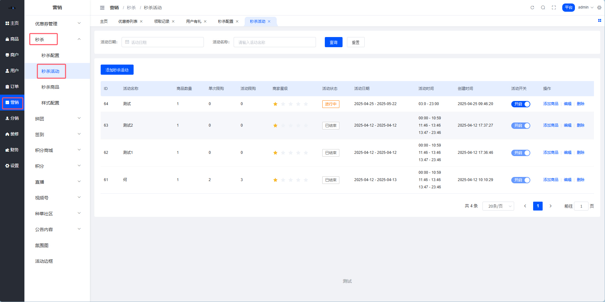
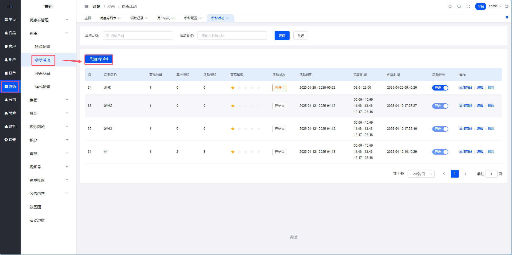
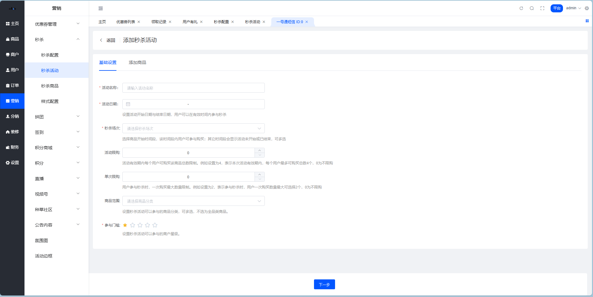
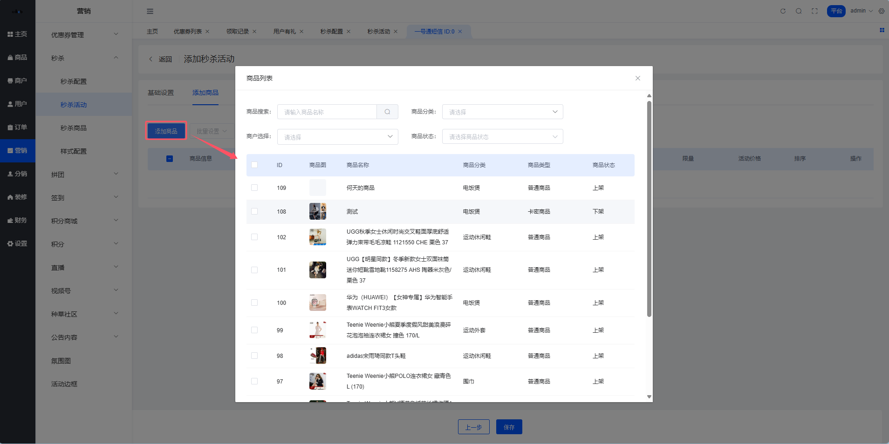
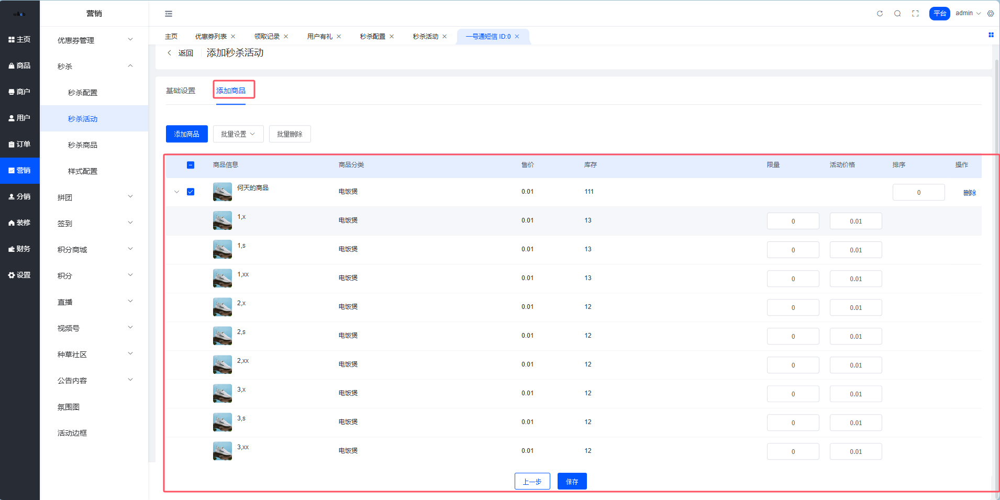
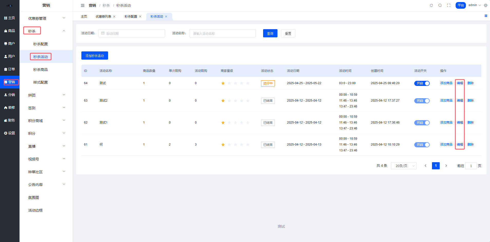
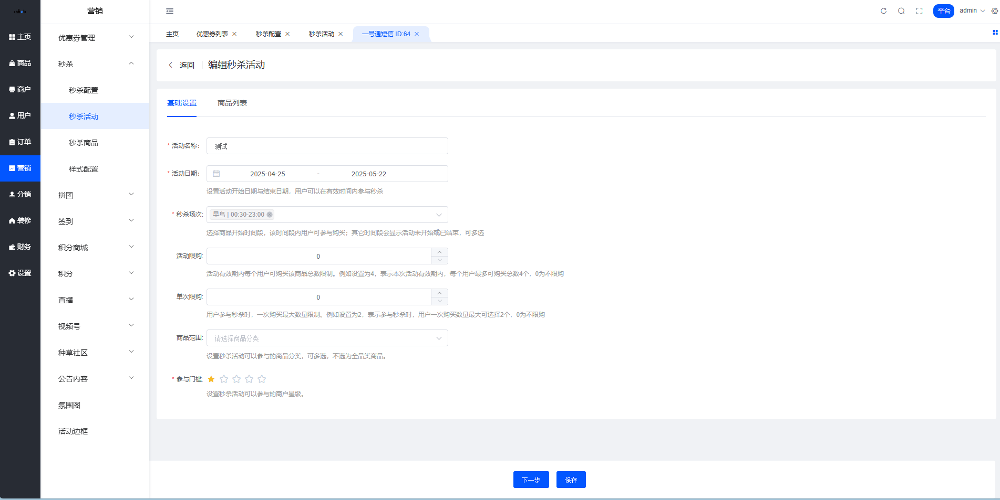
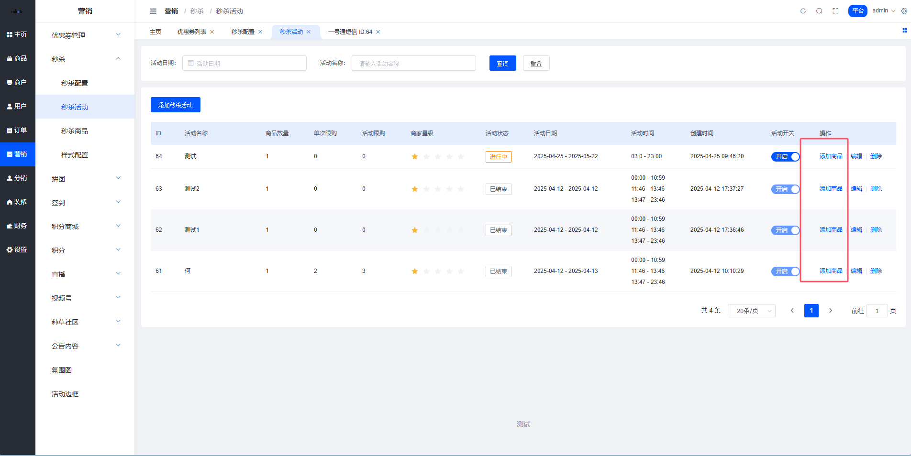
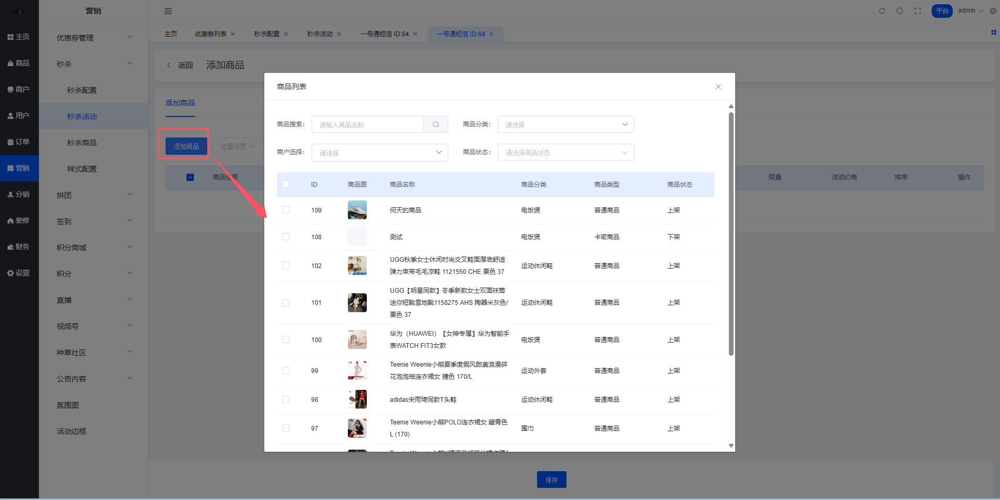

# 秒杀活动管理

嘿！👋 欢迎来到秒杀活动管理文档！这里教你如何在平台后台管理秒杀活动。

## 平台端秒杀活动管理 ⚙️

### 1. 秒杀活动列表

**说人话**：这里可以查看所有秒杀活动，包括正在进行中的、未开始的和已结束的。

**位置**：平台后台 → 营销 → 秒杀 → 秒杀活动

#### 列表功能

| 功能 | 说明 |
|------|------|
| 📋 查看列表 | 显示所有秒杀活动的基本信息 |
| ✏️ 编辑活动 | 修改活动基本信息 |
| ➕ 添加商品 | 为已创建的活动添加秒杀商品 |
| 🔍 筛选搜索 | 按状态、时间等条件筛选活动 |
| 🗑️ 删除活动 | 删除不需要的活动 |

### 2. 添加秒杀活动

**位置**：平台后台 → 营销 → 秒杀 → 秒杀活动 → 添加秒杀活动

#### 活动信息设置

**简单来说**：设置活动的基本信息，包括名称、时间、限购等规则。

**配置项说明**：

| 配置项 | 说明 | 示例 |
|--------|------|------|
| 活动名称 | 秒杀活动的名称 | "双11超级秒杀" |
| 活动时间 | 活动开始和结束时间 | 2024-11-11 00:00 ~ 23:59 |
| 秒杀场次 | 关联的秒杀时段 | 10:00-12:00、14:00-16:00 |
| 活动限购 | 每个用户在整个活动期间可购买的总数量 | 每人限购5件 |
| 单次限购 | 每次下单可购买的数量 | 每次限购1件 |
| 商品范围 | 限制参与活动的商品类型 | 指定分类或全部商品 |
| 商家门槛 | 限制参与活动的商家条件 | 指定商家或全部商家 |

💡 **小贴士**：合理设置限购数量，既能保证更多用户参与，又能防止黄牛囤货！

#### 活动商品设置

**举个栗子**：
1. 点击"添加商品"按钮
2. 选择要参与秒杀的商品
3. 设置每个商品的秒杀价格
4. 设置限量库存
5. 设置商品排序

⚠️ **注意**：这里可以批量设置活动商品的限量和活动价以及排序，非常方便！

**商品设置说明**：

| 设置项 | 说明 | 建议 |
|--------|------|------|
| 秒杀价格 | 商品的秒杀优惠价格 | 设置为原价的5-7折，吸引力更强 |
| 限量库存 | 秒杀活动的库存数量 | 不宜过多，营造稀缺感 |
| 商品排序 | 在秒杀页面的显示顺序 | 把热门商品排在前面 |

### 3. 编辑秒杀活动

**位置**：秒杀活动列表 → 操作 → 编辑

⚠️ **重要提示**：编辑功能只能修改秒杀活动的基本信息，不能修改已添加的商品信息。

**可编辑项**：
- ✅ 活动名称
- ✅ 活动时间
- ✅ 秒杀场次
- ✅ 限购规则
- ✅ 商品范围
- ✅ 商家门槛

**不可编辑项**：
- ❌ 已添加的商品列表
- ❌ 商品的秒杀价格
- ❌ 商品的限量库存

💡 **小贴士**：如需修改商品信息，请使用"添加秒杀商品"功能进行调整。

### 4. 添加秒杀商品（已创建的活动）

**说人话**：活动创建后，还可以继续添加更多秒杀商品。

**位置**：秒杀活动列表 → 操作 → 添加秒杀商品

**操作流程**：
1. 🔍 在活动列表找到目标活动
2. 🖱️ 点击"添加秒杀商品"按钮
3. 📦 选择要添加的商品
4. 💰 设置秒杀价格和限量库存
5. 🔢 设置商品排序
6. ✅ 保存设置

**使用场景**：

| 场景 | 说明 |
|------|------|
| 补充商品 | 活动开始后，部分商品售罄，需要补充新商品 |
| 调整策略 | 根据销售情况，动态调整商品组合 |
| 分批上架 | 采用分批上架策略，保持活动热度 |

💡 **温馨提示**：建议在活动进行中实时监控销售情况，及时补充热门商品，保持活动热度！

## 操作技巧 ✨

### 快速配置秒杀活动

**举个栗子**：双11大促活动配置
1. **第一步**：创建活动，设置活动名称为"双11超级秒杀"
2. **第二步**：设置多个场次（0点、10点、14点、20点）
3. **第三步**：设置限购规则（每人限购3件，每次限购1件）
4. **第四步**：批量添加商品，设置秒杀价为5折
5. **第五步**：设置热门商品排在前面

### 批量设置技巧

⚡ **效率提升技巧**：
- 使用批量设置功能，一次性设置多个商品的价格和库存
- 按商品类型分组设置，如电子产品6折，服装5折
- 利用排序功能，把利润率高的商品排在前面

### 活动监控要点

📊 **重点关注**：
- 实时监控库存消耗速度
- 关注用户参与度和转化率
- 及时补充热门商品
- 调整冷门商品的秒杀价格

## 常见问题 ❓

### Q1：活动已开始，还能修改吗？
**A**：可以修改活动基本信息（如时间、限购规则），但不能修改已添加商品的价格和库存。建议在活动开始前仔细检查所有设置。

### Q2：如何提高秒杀活动的参与度？
**A**：
- 选择热门商品参与秒杀
- 设置有吸引力的价格（建议5-7折）
- 合理设置限量库存，营造稀缺感
- 提前预热，让用户提前了解活动信息

### Q3：秒杀商品库存设置多少合适？
**A**：建议根据商品价值和预期参与人数设置，一般热门商品设置50-100件，普通商品设置20-50件。

### Q4：可以同时进行多个秒杀活动吗？
**A**：可以，但建议不要时间重叠，避免分散用户注意力。

## 总结 🎯

秒杀活动管理的核心是：
1. ⏰ **合理设置场次**：根据用户活跃时段设置秒杀场次
2. 📦 **精选商品**：选择有吸引力的商品参与秒杀
3. 💰 **定价策略**：设置有竞争力的秒杀价格
4. 📊 **实时监控**：关注活动数据，及时调整策略
5. 🔄 **持续优化**：根据活动效果不断优化配置

记住：好的秒杀活动不仅能提升销售额，还能增强用户粘性和品牌影响力！
