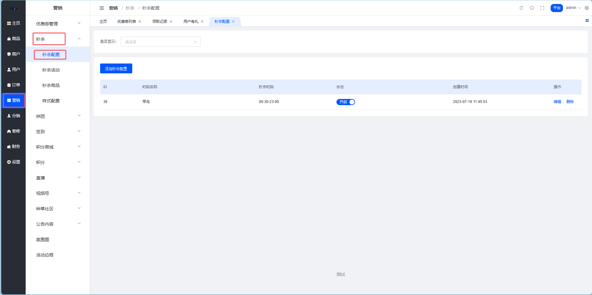
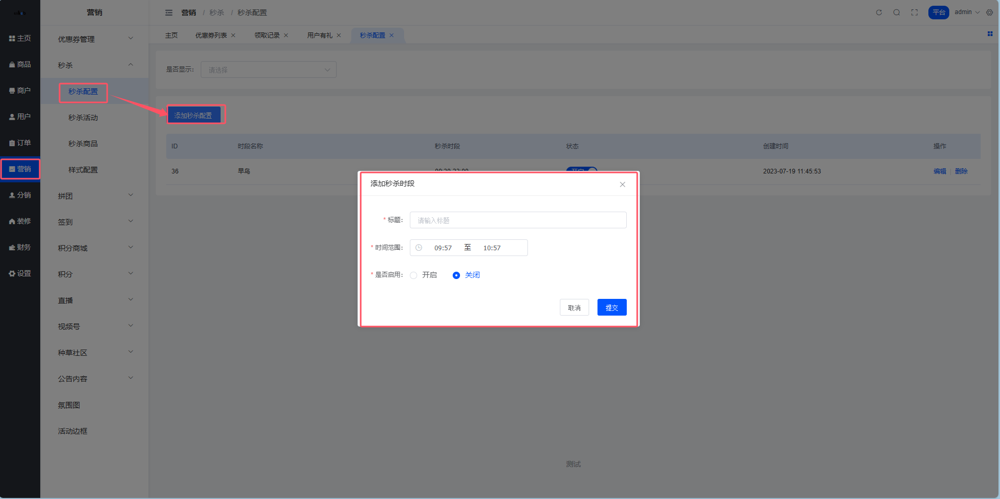

# 秒杀配置

嘿！👋 欢迎来到秒杀配置指南。

## 什么是秒杀配置？⚡

**说人话**：秒杀配置就是设置秒杀活动的时间段。比如你想在每天10点、14点、20点做秒杀，就需要在这里配置这些时间段。

**简单来说**：这里配置的是秒杀时段，在创建秒杀活动时，需要选择秒杀活动进行的时段（可以多选）。

⚠️ **重要提示**：添加秒杀配置时间段不能重复、重叠！

## 秒杀配置列表⏰

**位置**：平台后台 → 营销 → 秒杀 → 秒杀配置

### 功能说明

| 功能 | 说明 |
|------|------|
| 查看列表 | 查看所有已配置的秒杀时间段 |
| 添加配置 | 新增秒杀时间段 |
| 编辑配置 | 修改已有的时间段设置 |
| 删除配置 | 删除不需要的时间段 |

## 添加秒杀配置⚙️

**位置**：平台后台 → 营销 → 秒杀 → 秒杀配置 → 添加秒杀配置

### 配置参数说明

| 参数 | 说明 | 示例 |
|------|------|------|
| 秒杀时段名称 | 给这个时段起个名字 | "上午场"、"下午场" |
| 开始时间 | 秒杀开始的时间 | 10:00 |
| 结束时间 | 秒杀结束的时间 | 12:00 |
| 状态 | 是否启用这个时段 | 开启/关闭 |

### 举个栗子🌰

如果你想设置三个秒杀时段：
- **上午场**：10:00 - 12:00
- **下午场**：14:00 - 16:00
- **晚间场**：20:00 - 22:00

就需要分别添加三个配置，每个配置设置对应的时间段。

💡 **小贴士**：
- 时间段不要重叠，比如不能同时有 10:00-12:00 和 11:00-13:00
- 建议根据用户活跃时间来设置秒杀时段
- 可以先设置少量时段测试效果，后续再调整优化
