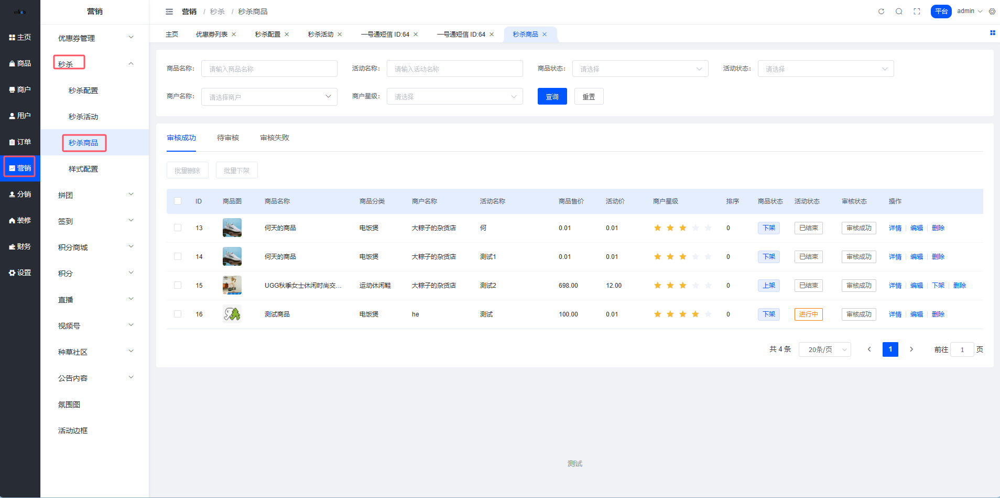
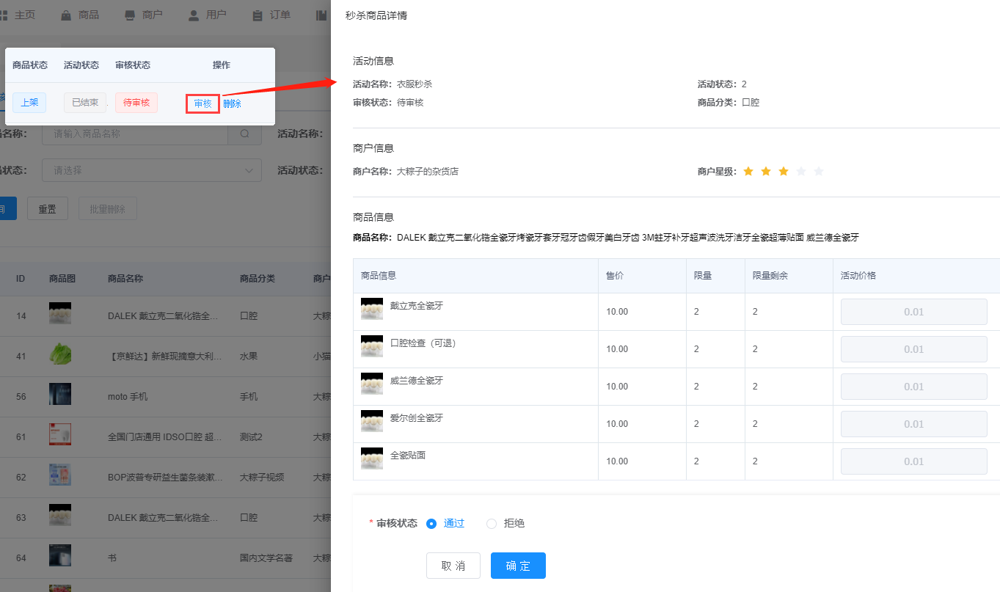
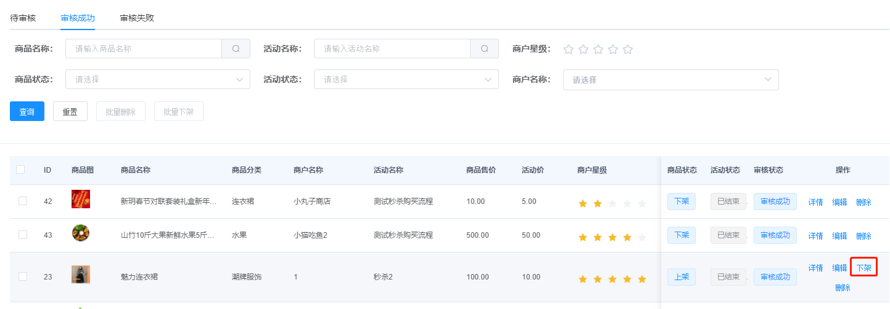
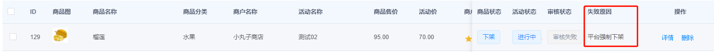
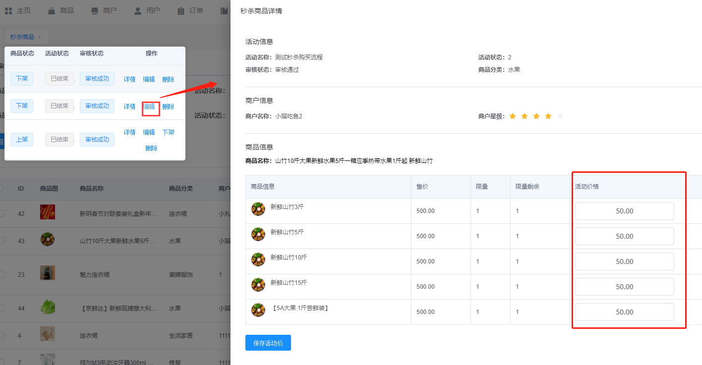
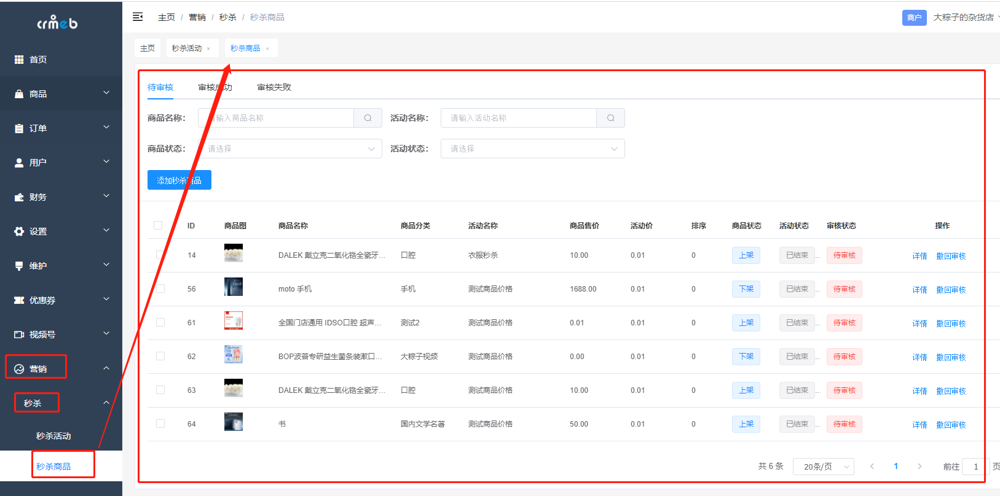
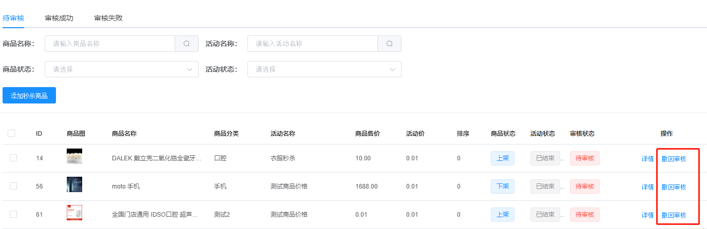
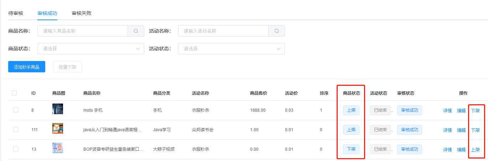
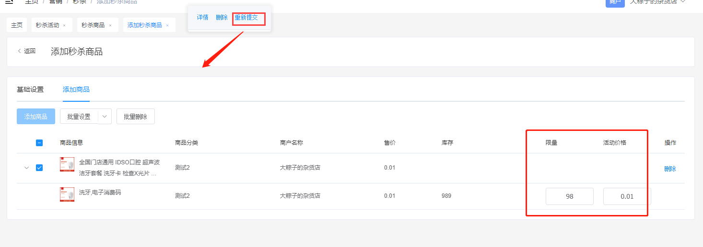
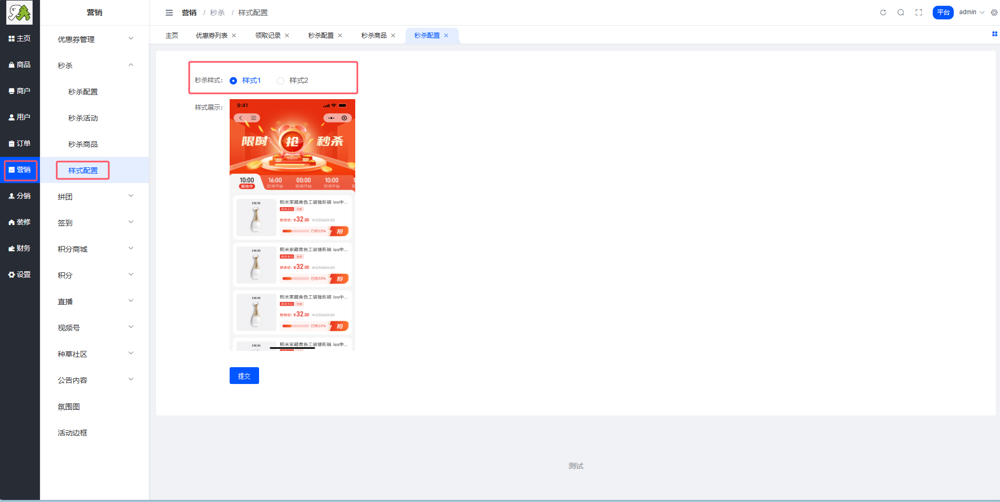

# 秒杀商品

嘿！👋 欢迎来到秒杀商品管理指南。

## 什么是秒杀商品？🛍️

**说人话**：秒杀商品就是参与秒杀活动的商品，以超低价格限时限量销售。

⚠️ **重要提示**：创建成功的秒杀商品，会从原始商品中分出对应的库存，在秒杀活动结束后，针对秒杀剩余库存对原始商品进行补充。

## 平台端秒杀商品管理📋

### 秒杀商品列表

**位置**：平台后台 → 营销 → 秒杀 → 秒杀商品

### 商品状态说明

平台的秒杀商品列表分为三个状态：

| 状态 | 说明 |
|------|------|
| **待审核** | 商户提交的参与秒杀商品，等待平台审核 |
| **审核成功** | 平台添加的秒杀商品 + 审核通过的商户秒杀商品 |
| **审核失败** | 审核未通过的商户秒杀商品 |

### 待审核商品⏰

对商户提交的秒杀商品进行审核：

**可执行操作**：
- ✅ 审核通过
- ❌ 审核拒绝

### 审核成功商品✨

对已审核通过的商品进行管理：

#### 1️⃣ 强制下架

**说明**：这里的下架是强制下架，强制下架的商品会进入审核失败列表中。

⚠️ **注意**：强制下架会影响商户的秒杀活动，请谨慎操作！

#### 2️⃣ 编辑商品

**可编辑内容**：只能编辑商品的活动价

💡 **小贴士**：平台可以调整商品的秒杀价格，确保价格合理性。

## 商户端秒杀商品管理🏪

### 秒杀商品列表

**位置**：商户后台 → 营销 → 秒杀 → 秒杀商品

### 商品状态说明

商户的秒杀商品列表分为三个状态：

| 状态 | 说明 |
|------|------|
| **待审核** | 商户提交的参与秒杀商品 |
| **审核成功** | 平台添加的商户秒杀商品 + 审核通过的秒杀商品 |
| **审核失败** | 审核未通过的秒杀商品 |

### 待审核商品⏰

**可执行操作**：撤回审核

💡 **使用场景**：商户发现提交的商品信息有误，可以撤回重新编辑。

### 审核成功商品✅

**可执行操作**：

#### 1️⃣ 上下架

**说明**：下架的商品不会在移动商城中展示

| 操作 | 效果 |
|------|------|
| 上架 | 商品在秒杀活动中展示 |
| 下架 | 商品暂时隐藏，不参与展示 |

#### 2️⃣ 编辑

编辑功能同平台端，只能修改活动价。

### 审核失败商品❌

**可执行操作**：重新提交

**重新提交流程**：
1. 重新设置活动价
2. 重新设置限量
3. 提交平台审核

### 举个栗子🌰

**商户提交秒杀商品流程**：
1. 商户后台选择商品
2. 设置秒杀价格和库存
3. 提交平台审核
4. 等待审核结果
5. 审核通过后，商品上架参与秒杀

💡 **小贴士**：
- 秒杀价格建议设置在成本价以上，避免亏损
- 秒杀库存不宜过多，营造稀缺感
- 审核失败后可以重新调整价格提交
- 及时关注审核状态，确保活动顺利进行

---

## 秒杀样式配置🎨

### 什么是样式配置？

**说人话**：样式配置就是设置秒杀活动在移动端的展示样式，让秒杀页面更吸引人。

**简单来说**：秒杀头部样式增加一种选项，让客户可以二选一，秒杀的素材都有预置，根据平台上的选项来渲染。

### 样式配置入口⚙️

**位置**：平台后台 > 营销 > 秒杀 > 样式配置

### 配置说明📝

#### 样式选择

系统提供了两种预置样式供选择：

| 样式 | 说明 |
|------|------|
| 样式一 | 第一种预置的秒杀头部样式 |
| 样式二 | 第二种预置的秒杀头部样式 |

#### 展示效果

配置后将在移动端进行展示，用户在移动端访问秒杀活动时，会看到您选择的样式效果。

### 使用场景💡

**举个栗子🌰**：

如果你的商城风格是：
- **简约风**：选择简洁大方的样式
- **活泼风**：选择色彩丰富的样式

根据商城整体风格选择合适的秒杀样式，让页面更协调。

### 操作步骤📋

1. 进入样式配置页面
2. 查看两种预置样式的效果
3. 选择适合的样式
4. 保存配置
5. 在移动端查看效果

💡 **样式配置小贴士**：
- 建议选择与商城整体风格一致的样式
- 配置后可以在移动端预览效果
- 样式会影响用户的购买体验，请谨慎选择
- 可以根据节日活动切换不同样式，增加新鲜感
