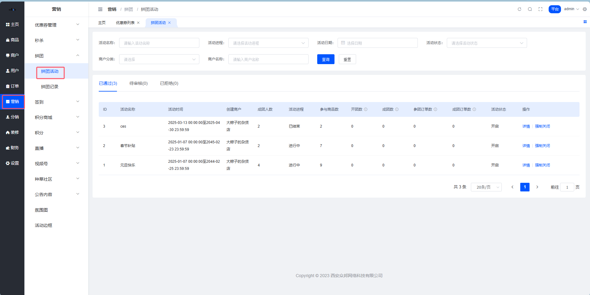
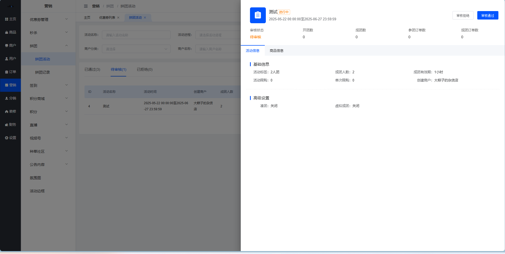
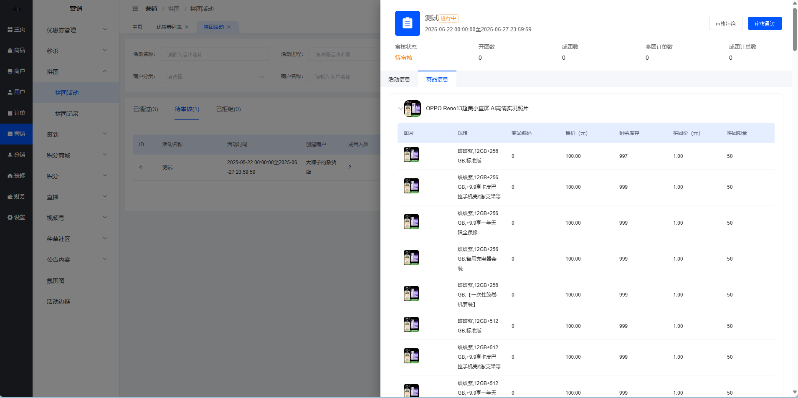

# 拼团活动管理

嘿！👋 这里是拼团活动管理的完整指南！

## 一、功能简述

平台端拼团活动列表展示全平台店铺创建的拼团活动，拼团活动经平台审核通过拼团商品才能够在用户端展示，支持平台对已经审核通过的拼团活动进行强制关闭处置。

**功能点包括：**
- 📋 查看拼团活动列表
- 🔍 拼团活动列表搜索
- ✅ 审核拼团活动
- 👀 查看拼团活动详情
- 🚫 强制关闭拼团活动

## 二、拼团活动列表

### 2.1 页面入口

**操作路径：** 平台端 > 营销 > 拼团 > 拼团活动

### 2.2 列表展示

**列表数据说明：**

展示所有店铺已提审的拼团活动数据（不含已删除），tab后边的数字同分页中的条数，根据筛选条件的变化而变化。

### 2.3 Tab状态说明

| 状态 | 说明 |
|------|------|
| ⏳ 待审核 | 展示店铺已提审，但是平台暂未审核的活动数据 |
| ✅ 已通过 | 展示平台已经审核通过的活动数据 |
| ❌ 已拒绝 | 展示平台已经审核拒绝的活动数据 |

**列表排序：**
- 待审核：根据提审时间倒序排序
- 已通过及已拒绝：根据审核时间倒序排序

### 2.4 列表字段说明

| 字段名称 | 字段说明 |
|---------|----------|
| ID | 根据添加拼团活动的顺序，系统自动生成ID，ID不能够重复 |
| 活动名称 | 创建/编辑拼团活动时填写的活动名称展示，展示最新数据 |
| 活动时间 | 创建/编辑拼团活动时填写的活动时间展示，开始时间至结束时间精确到秒，展示最新数据 |
| 创建商户 | 此拼团活动的创建商户名称，展示实时查询数据 |
| 成团人数 | 创建/编辑拼团活动时填写的成团人数展示，展示最新数据 |
| 活动进程 | 根据活动时间与此刻做比较： - 结束时间早于当前时间：**已结束** - 开始时间晚于当前时间：**未开始** - 否则：**进行中** |
| 参与商品数 | 现阶段该拼团活动添加的商品数量，列表加载时实时查询 |
| 开团数 | 此拼团活动用户开团的次数统计，列表加载时实时查询 |
| 成团数 | 此拼团活动用户已经拼团成功的团次数统计，列表加载时实时查询 |
| 参团订单数 | 此拼团活动用户开团的所有订单数统计（不包含未支付的订单数据），列表加载时实时查询 |
| 成团订单数 | 此拼团活动用户已经拼团成功的所有成功订单数统计（不包含未支付的订单数据），列表加载时实时查询 |
| 活动状态 | 展示此拼团活动的开启状态，列表加载时实时查询 |
| 拒绝原因 | 展示平台审核拒绝时候填写的原因，只有已拒绝状态展示此字段，展示最新数据 |

**💡 图标提示说明：**

- **开团数：** 此拼团活动用户开团的次数统计
- **成团数：** 此拼团活动用户已经拼团成功的团次数统计
- **参团订单数：** 此拼团活动用户开团的所有订单数统计（不包含未支付的订单数据）
- **成团订单数：** 此拼团活动用户已经拼团成功的所有成功订单数统计（不包含未支付的订单数据）

⚠️ **注意：** 未开始以及已结束的活动商品不在用户端展示。

### 2.5 搜索条件

| 字段名称 | 字段说明 |
|---------|----------|
| 活动名称 | 文本框，模糊搜索，支持根据活动名称关键字进行搜索，回车/失去焦点触发搜索，清空也会触发搜索，刷新列表数据 |
| 活动进程 | 下拉单选，默认为空（即展示全部数据），支持选择：未开始、进行中、已结束，下拉选择之后直接触发搜索，刷新列表数据 |
| 活动日期 | 日期选择器，根据选中的时间对活动时间进行检索，注意包含活动日期边界值，选择完成之后直接触发搜索，刷新列表数据 |
| 活动状态 | 下拉单选，默认为空（即展示全部数据），支持选择：开启、关闭，下拉选择之后直接触发搜索，刷新列表数据 |
| 商户分类 | 下拉单选，默认为空（即展示全部数据），支持选择平台维护的商户分类，支持根据分类名称模糊搜索选项，下拉选择之后直接触发搜索，刷新列表数据 |
| 商户名称 | 文本框，模糊搜索，支持根据商户名称关键字进行搜索，回车/失去焦点触发搜索，清空也会触发搜索，刷新列表数据 |

## 三、操作说明

### 3.1 基础操作

| 操作 | 说明 |
|------|------|
| 🔍 搜索 | 根据选中的搜索条件，触发搜索，刷新列表数据 |
| 🔄 重置 | 将搜索条件重置为默认值，触发搜索，刷新列表数据 |

### 3.2 详情查看

**操作：** 点击"详情"按钮

**功能：** 打开「拼团活动详情」侧滑，支持查看拼团活动的活动信息、商品信息及开团记录

### 3.3 审核活动

**操作：** 点击"审核"按钮（仅待审核状态显示）

**功能：** 打开「拼团活动审核」弹窗，支持选中同意或拒绝

⚠️ **注意：**
- 拒绝必须填写拒绝原因
- 审核按钮只会在待审核状态出现

### 3.4 强制关闭

**操作：** 点击"强制关闭"按钮（仅已通过状态显示）

**功能：** 打开【二次确认】弹窗，弹窗中提示「您确定要将此活动强制关闭吗？」

**说人话：** 强制关闭就是紧急下架活动，类似于审核拒绝。

**强制关闭后的影响：**

| 项目 | 说明 |
|------|------|
| 审核状态 | 数据流转展示为"已拒绝"状态 |
| 用户端展示 | 下架此拼团活动商品数据 |
| 已下订单 | 不会影响已经下单的商品记录信息及开团记录 |
| 已有团 | 其他用户通过之前的活动邀请不可以进行参团，提示"活动已失效" |
| 后续操作 | 商家可以编辑之后重新提审 |

⚠️ **重要提示：** 只有已通过状态支持强制关闭操作。

## 四、活动详情

### 4.1 活动信息

**字段说明：**

- 展示已经维护进系统的拼团活动信息，展示最新数据（数据值为空展示 `--`）
- **活动标签：** 根据成团人数展示为"N人团"
- 其他字段说明同拼团活动列表

**举个栗子：** 如果成团人数设置为3人，活动标签就会显示"3人团"。

### 4.2 商品信息

**字段说明：**

展示已经维护进系统的商品信息，展示最新数据（数据值为空展示 `--`）

⚠️ **特殊提示：**

拼团商品关联的普通商品由于重新编辑下架（非免审），或者被平台强制下架时，会进行提示：

> 「该商品已下架，无法进行拼团购买」

## 五、常见问题 ❓

**Q1: 拼团活动最多可以添加几个商品？**
A: 单个活动商品上限为10个。

**Q2: 审核拒绝后商家能否重新提交？**
A: 可以，商家可以根据拒绝原因进行修改后重新提审。

**Q3: 强制关闭和审核拒绝有什么区别？**
A: 强制关闭是针对已通过的活动进行的紧急下架操作，关闭后状态会变为"已拒绝"，效果类似于审核拒绝。

**Q4: 活动进行中可以修改活动信息吗？**
A: 已审核通过且进行中的活动不支持修改，如需调整需要先强制关闭后重新编辑提审。

**Q5: 活动结束后用户还能看到吗？**
A: 活动结束后不会在用户端展示，但已经开团的记录不受影响。

---

💡 **小贴士：**
- 定期检查待审核活动，及时处理商家提交的拼团申请
- 对于违规活动要及时强制关闭，并说明原因
- 关注活动数据（开团数、成团数等），了解平台拼团活动的运营情况
