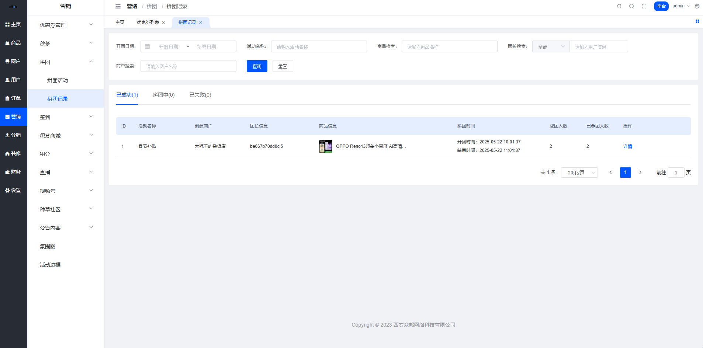
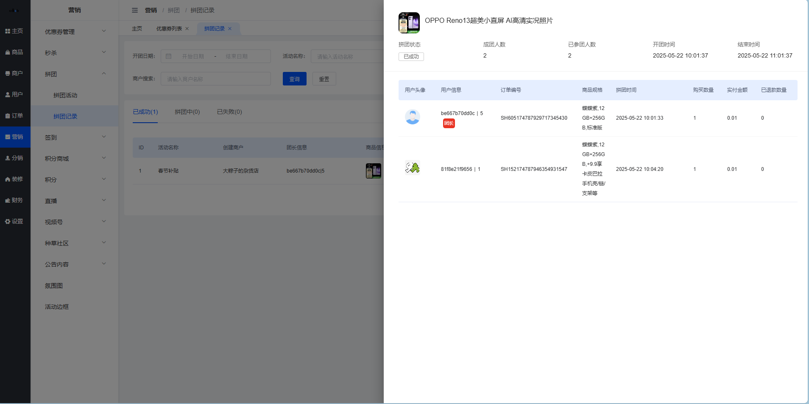

# 拼团记录

嘿！👋 这里可以查看所有的拼团记录哦！

## 一、功能简述

平台端开团记录支持查看全平台所有店铺的拼团活动列表，用户每发起一次拼团为一条活动数据。

**功能点包括：**
- 📋 查看开团记录列表
- 🔍 开团记录列表搜索
- 👀 查看开团记录详情

**说人话：** 就是查看所有用户发起的拼团，看看谁开了团、成没成功。

## 二、开团记录列表

### 2.1 页面入口

**操作路径：** 平台端 > 营销 > 拼团 > 开团记录

### 2.2 列表展示

**列表数据说明：**

全平台用户发起拼团活动的开团记录，用户每发起一次拼团为一条活动数据；tab后边的数字同分页中的条数，根据筛选条件的变化而变化。

### 2.3 Tab状态说明

| 状态 | 说明 | 标识 |
|------|------|------|
| 已成功 | 参团人数在有效时间内达到成团人数的开团记录 | ✅ |
| 进行中 | 拼团还在有效期中，参团人数暂未达到成团人数的开团记录 | ⏳ |
| 已失败 | 拼团已经过了有效期，参团人数仍未达到成团人数的开团记录 | ❌ |

**列表排序：** 根据开团时间倒序排序

### 2.4 列表字段说明

| 字段名称 | 字段说明 |
|---------|----------|
| ID | 根据添加商品的顺序，系统自动生成商品ID，ID不能够重复 |
| 活动名称 | 展示此拼团商品对应的活动名称，活动名称为记录数据 |
| 创建商户 | 此拼团活动的创建商户名称，展示实时查询数据 |
| 团长信息 | 展示开团用户的昵称以及ID数据，昵称根据ID实时查询 |
| 商品信息 | 展示商品封面图以及商品名称，商品名称过长在列表中折行展示两行，还是过长展示…，鼠标悬浮展示完整的商品信息 |
| 拼团时间 | 展示拼团的开始时间及结束时间 - 开始时间：团长下单时间 - 结束时间：根据团长参团时对应的成团有效期进行计算展示 拼团时间为记录数据 |
| 成团人数 | 展示此拼团商品对应的拼团活动成团人数，成团人数为记录数据 |
| 已参团人数 | 展示此团已经参与拼团付款的人数 |

**举个栗子：**
- 团长"张三"在12月1日10:00开团，成团人数3人，有效期24小时
- 拼团时间显示：2025-12-01 10:00:00 至 2025-12-02 10:00:00
- 如果在有效期内有3人参团（包括团长），状态为"已成功" ✅
- 如果现在还没到期但只有2人，状态为"进行中" ⏳
- 如果过期了还不足3人，状态为"已失败" ❌

### 2.5 搜索条件

| 字段名称 | 字段说明 |
|---------|----------|
| 开团日期 | 日期范围选择器，根据选中的时间范围对开团时间进行检索，注意包含日期范围选中的开始/结束日期边界值，选择完成之后直接触发搜索，刷新列表数据 |
| 活动名称 | 文本框，模糊搜索，支持根据活动名称关键字进行搜索，回车/失去焦点触发搜索，清空也会触发搜索，刷新列表数据 |
| 商品搜索 | 文本框，模糊搜索，支持根据商品名称或者商品关键字进行搜索，回车/失去焦点触发搜索，清空也会触发搜索，刷新列表数据 |
| 团长搜索 | 回车/失去焦点触发搜索，清空也会触发搜索，刷新列表数据  **搜索类型：** - **全部：** 文本框，模糊搜索，支持根据UID、手机号、用户昵称进行搜索 - **UID：** 文本框，精准搜索，支持根据UID进行搜索 - **手机号：** 文本框，模糊搜索，支持根据手机号进行搜索 - **用户昵称：** 文本框，模糊搜索，支持根据用户昵称进行搜索 |
| 商户搜索 | 文本框，模糊搜索，支持根据商户名称搜索，回车/失去焦点触发搜索，清空也会触发搜索，刷新列表数据 |

💡 **搜索小贴士：**
- 想找某个用户的开团记录？用"团长搜索"，输入昵称、手机号或UID都可以
- 想看某个商品的拼团情况？用"商品搜索"，输入商品名称关键字即可
- 想查看某个时间段的开团？用"开团日期"，选择起止时间

### 2.6 操作说明

| 操作 | 说明 |
|------|------|
| 详情 | 点击之后打开「开团记录详情」侧滑，支持查看此团参与者已经支付的订单信息 |

## 三、开团记录详情

### 3.1 详情展示

支持查看全平台每个拼团活动对应的参与人与订单，支持点击「详情」查看此订单的订单详情操作（调取订单详情侧滑弹窗）。

### 3.2 字段说明

**顶部信息：**

| 字段名称 | 字段说明 |
|---------|----------|
| 商品信息 | 展示商品封面图以及商品名称，商品名称过长在列表中展示…，鼠标悬浮展示完整的商品信息 |
| 拼团状态 | 同开团记录列表的Tab状态（已成功/进行中/已失败） |
| 成团人数 | 同开团记录列表 |
| 已参团人数 | 同开团记录列表 |
| 开团时间 | 同开团记录列表 |
| 结束时间 | 同开团记录列表 |

**参团列表字段：**

| 字段名称 | 字段说明 |
|---------|----------|
| 用户头像 | 展示下单用户的头像，实时查询 |
| 用户信息 | 展示下单用户的昵称以及ID数据，昵称根据ID实时查询 |
| 所属商户 | 此商品所属的商户名称，展示实时查询数据 |
| 商品规格 | 购买商品规格展示，记录数据 |
| 订单编号 | 展示用户下单生成的订单编号数据，记录数据 |
| 购买数量 | 展示用户下单的商品数量，记录数据 |
| 实付金额 | 展示用户下单实际支付的金额，记录数据 |
| 已退款数量 | 展示此订单关联的退款单的已退款商品数量 |

**举个栗子：**

假设"张三"开了一个3人团：

| 序号 | 用户 | 角色 | 实付金额 | 状态 |
|------|------|------|----------|------|
| 1 | 张三 | 团长👑 | 99元 | 已付款 |
| 2 | 李四 | 团员 | 99元 | 已付款 |
| 3 | 王五 | 团员 | 99元 | 已付款 |

拼团成功后，这三个订单都会流转到"待发货"状态。

## 四、数据分析与应用 📊

### 4.1 通过记录了解运营情况

**查看成功率：**
- 已成功的团数 / 总开团数 = 拼团成功率
- 成功率高说明活动设置合理，用户参与度高

**分析失败原因：**
- 成团人数设置过高？
- 有效期设置过短？
- 商品吸引力不够？

### 4.2 优化建议

| 问题 | 优化方向 |
|------|----------|
| 成功率低 | 适当降低成团人数，或延长有效期 |
| 开团少 | 加大活动推广力度，优化商品选择 |
| 参团不积极 | 检查价格优势是否明显，商品是否符合需求 |

## 五、常见问题 ❓

**Q1: 为什么有些拼团记录已参团人数等于成团人数，但还是显示"进行中"？**
A: 可能是有人下单但还未支付，系统只计算已支付的订单。

**Q2: 拼团失败后订单怎么处理？**
A: 系统会自动发起退款，订单状态变为"已退款"，款项原路退回。

**Q3: 可以手动修改拼团状态吗？**
A: 不可以，拼团状态由系统根据参团人数和有效期自动判断。

**Q4: 团长可以取消拼团吗？**
A: 团长下单后不能主动取消，只能等待拼团失败后自动退款。

**Q5: 同一个用户可以参加同一个商品的多个拼团吗？**
A: 可以，每个拼团都是独立的，用户可以同时参与多个团。

---

💡 **运营小贴士：**
- 定期查看拼团记录，了解哪些商品受欢迎
- 关注失败率高的活动，及时调整策略
- 分析成功的拼团案例，总结经验复制到其他商品
- 鼓励商家合理设置成团人数和有效期，提高拼团成功率

⏰ **温馨提示：**
拼团记录是了解用户行为和活动效果的重要数据，建议定期导出分析，为运营决策提供依据。
