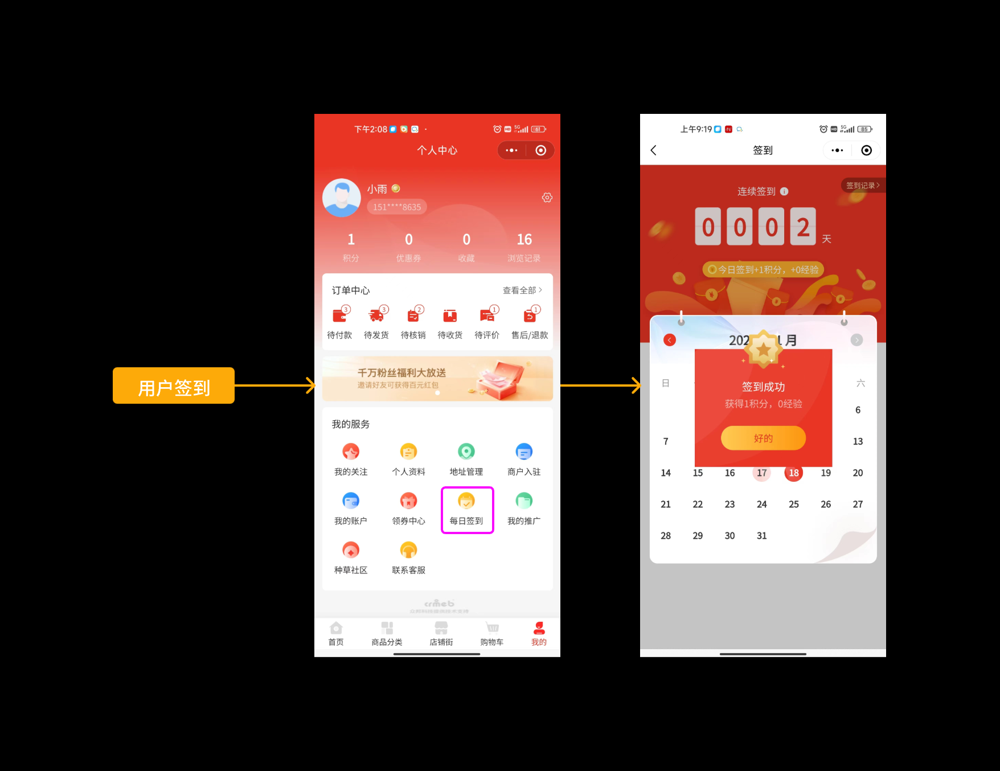
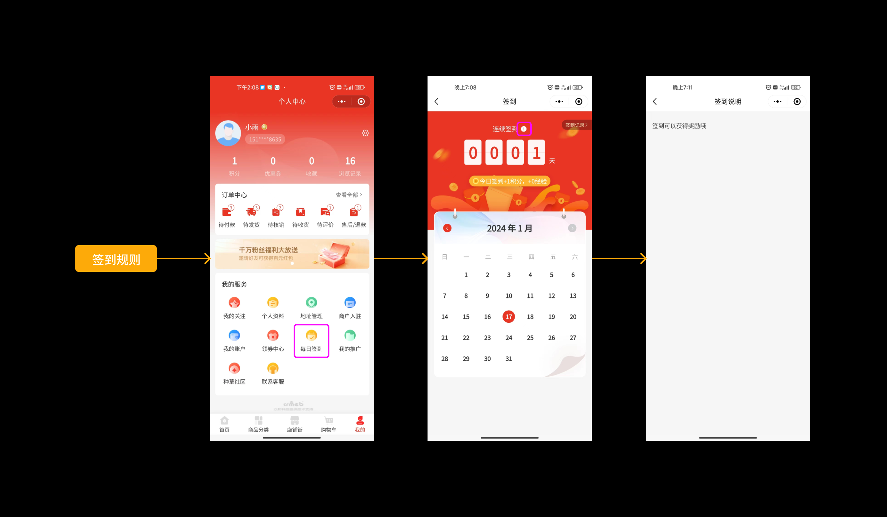

# 签到活动说明

嘿！👋 想知道签到活动是怎么回事吗？让我来给你讲讲！

## 一、活动介绍 🎯

**说人话**：签到活动就是鼓励用户每天来商城打个卡，就像上班打卡一样！

商城签到活动的主要目的：

| 目的 | 说明 |
|------|------|
| 💪 增加用户粘性 | 每日签到送积分、经验值，让用户养成每天来逛逛的习惯 |
| 🎁 连续奖励 | 连续签到天数越多，奖励越丰厚！ |
| 📊 数据支持 | 帮助商家了解用户活跃情况，为精准营销提供数据 |
| 🎯 促进转化 | 积分可以抵扣下单金额，经验值可以提升会员等级 |

**简单来说**：通过每日签到送好处，让用户多来多看，增加购买机会！

---

## 二、功能说明 📋

### 2.1 用户签到 ✅

用户登录商城后，可以通过每日签到入口进入签到页面。

**签到可以获得什么？**

- ✨ **积分奖励**：可用于下单时金额抵扣
- 🌟 **经验值奖励**：提升会员等级
- 🎁 **连续签到额外奖励**：连续签到天数越多，奖励越多！



💡 **小提示**：连续签到的奖励是在每日固定奖励基础上叠加的哦！

---

### 2.2 查看签到说明 📖

用户在签到页面可以查看平台设置的签到规则说明。

**说明内容包括**：
- 签到可以获得多少积分和经验值
- 连续签到的额外奖励规则
- 积分和经验值的使用方法



---

### 2.3 查看签到记录 📅

用户可以随时查看自己的签到历史记录。

**记录包含信息**：

| 信息项 | 说明 |
|--------|------|
| 📅 签到时间 | 具体哪天签到的 |
| 🎁 奖励积分 | 本次签到获得的积分数量 |
| 🌟 奖励经验值 | 本次签到获得的经验值数量 |
| 🔢 连续天数 | 当前连续签到的天数 |


---

### 2.4 签到配置规则 ⚙️

平台管理员可以根据实际业务需求灵活配置签到规则：

#### 📌 基础规则

- ✅ 支持自定义每日签到可获取的积分数量
- ✅ 支持自定义每日签到可获取的经验值数量
- ✅ 支持根据连续签到天数设置额外奖励

#### 📌 连续签到规则

| 规则 | 说明 | 举个栗子 🌰 |
|------|------|------------|
| 连续天数设置 | 必须设置连续的天数（不能间隔） | 第1天、第2天、第3天... |
| 达到最大天数后 | 继续签到按最后一天配置发放奖励 | 如设置到第7天，第8天开始都按第7天奖励 |
| 中断签到 | 某天未签到，再次签到从第1天重新开始 | 连续签到3天后断签，下次签到重新从第1天算起 |
| 达到连续天数 | 立即获得连续签到额外奖励 | 设置第7天额外奖励10积分，第7天签到立即获得 |

#### 💡 配置示例

**举个栗子**：
```
每日固定奖励：1积分 + 1经验值
连续签到第2天：额外 1积分 + 1经验值
连续签到第7天：额外 5积分 + 5经验值

那么用户第7天签到会获得：
1（固定）+ 5（连续奖励）= 6积分 + 6经验值
```

---

## ⚠️ 注意事项

1. **连续签到规则**
   - 必须每天都签到才能保持连续，哪怕一天不签都要重新开始
   - 连续天数从第1天开始累计

2. **奖励发放**
   - 签到后奖励立即到账
   - 可以在积分日志和经验值记录中查看

3. **奖励使用**
   - 积分可在下单时抵扣金额（具体抵扣规则查看积分配置）
   - 经验值用于提升会员等级（查看会员等级说明）

---

## 📊 用户体验流程

```
用户登录商城
    ↓
进入签到页面
    ↓
点击签到按钮
    ↓
获得奖励（积分+经验值）
    ↓
查看签到记录和连续天数
    ↓
期待明天继续签到获得更多奖励！
```

---

💡 **温馨提示**：合理设置签到奖励可以有效提升用户活跃度，建议根据商城实际情况设置吸引力的奖励！
