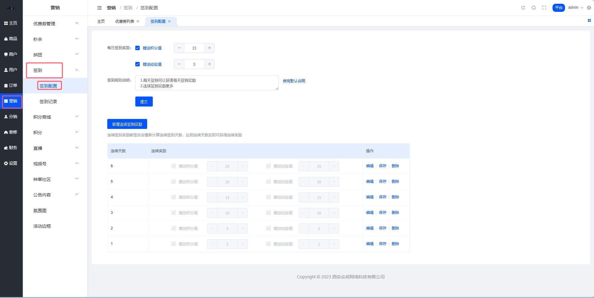

# 签到配置

嘿！👋 来学习如何配置签到活动吧！

## 一、签到配置规则 ⚙️

平台可以根据实际业务场景灵活配置签到奖励，让活动更有吸引力！

### 📌 配置规则说明

| 配置项 | 说明 |
|--------|------|
| ✅ 每日签到奖励 | 自定义每日固定签到可获取的积分数量和经验值数量 |
| 🎁 连续签到奖励 | 根据连续签到天数设置额外奖励 |
| 📝 签到说明 | 撰写签到规则说明，展示给用户看 |

---

### 🎯 重要规则

#### 1️⃣ 连续签到天数设置

⚠️ **注意**：连续签到天数必须设置为连续的天数（间隔设置可能会出现逻辑问题）

**正确示例**：
```
✅ 第1天、第2天、第3天、第4天、第5天、第6天、第7天
```

**错误示例**：
```
❌ 第1天、第3天、第7天（中间有间隔）
```

---

#### 2️⃣ 达到最大天数后的规则

到达系统设置的连续签到最大天数后，继续签到按照**最后一天的配置数据**进行积分、经验值赠送。

**举个栗子** 🌰：
```
如果设置了连续签到最多到第7天，配置如下：
- 第1天：1积分 + 1经验值
- 第2天：2积分 + 2经验值
- ...
- 第7天：7积分 + 7经验值

那么用户第8天、第9天...继续签到，都会获得第7天的奖励：7积分 + 7经验值
```

---

#### 3️⃣ 中断签到的规则

若中途某天未签到，再次签到时连续签到从**第一天重新开始**计算连续签到天数。

**举个栗子** 🌰：
```
用户连续签到了3天
    ↓
第4天忘记签到了（中断）
    ↓
第5天再次签到
    ↓
连续天数重新从第1天开始计算
```

达到连续天数后即可再次获得连续奖励！

---

#### 4️⃣ 奖励选择规则

- 如果**每日签到奖励不进行选中**，则不进行赠送
- 如果**连续签到奖励不进行选中**，则不进行赠送

💡 **简单来说**：你勾选了哪个奖励，就发放哪个奖励；不勾选就不发放。

---

## 二、签到配置操作 📋

### 🔧 操作路径

平台端 > 营销 > 签到 > 签到配置

---

### 📝 配置说明



---

### ⚙️ 配置项详解

#### 1️⃣ 每日签到奖励

填写每日固定的签到奖励额度：

| 配置项 | 说明 | 示例 |
|--------|------|------|
| 💎 积分奖励 | 每次签到固定获得的积分数量 | 1 积分 |
| 🌟 经验值奖励 | 每次签到固定获得的经验值数量 | 1 经验值 |

💡 **提示**：这是基础奖励，所有签到都会获得！

---

#### 2️⃣ 签到规则说明

用于撰写签到相关规则描述，用户在签到时可以查看此处撰写的说明。

**建议撰写内容**：
- ✅ 每日签到可以获得多少积分和经验值
- ✅ 连续签到的额外奖励规则
- ✅ 积分和经验值的用途说明
- ✅ 签到时间和次数限制

**示例文案**：
```
📅 每日签到奖励
每天签到可获得1积分+1经验值

🎁 连续签到额外奖励
连续签到2天：额外1积分+1经验值
连续签到7天：额外5积分+5经验值

💎 奖励说明
- 积分可用于下单时抵扣金额
- 经验值可提升会员等级
- 每天只能签到一次
```

---

#### 3️⃣ 连续签到天数配置

到达配置的连续签到天数，会在**固定签到奖励的基础上**，额外赠送连续签到奖励。

**配置表格示例**：

| 连续天数 | 额外积分奖励 | 额外经验值奖励 | 总奖励（含每日固定） |
|---------|------------|--------------|-------------------|
| 第1天 | 0 | 0 | 1积分 + 1经验值 |
| 第2天 | 1 | 1 | 2积分 + 2经验值 |
| 第3天 | 1 | 1 | 2积分 + 2经验值 |
| 第7天 | 5 | 5 | 6积分 + 6经验值 |

**举个栗子** 🌰：

假设配置如下：
- 每日签到固定奖励：**1积分 + 1经验值**
- 连续签到第2天额外奖励：**1积分 + 1经验值**

那么用户第2天签到会获得：
```
1（每日固定）+ 1（连续奖励）= 2积分
1（每日固定）+ 1（连续奖励）= 2经验值
```

---

## 三、配置建议 💡

### 🎯 新手商城配置建议

| 配置项 | 建议值 | 说明 |
|--------|--------|------|
| 每日签到 | 1-2积分 + 1-2经验值 | 不要设置太高，保持稳定 |
| 连续7天 | 额外5-10积分 + 5-10经验值 | 鼓励用户坚持一周 |
| 连续30天 | 额外50-100积分 + 50-100经验值 | 奖励长期忠实用户 |

---

### 🎯 成熟商城配置建议

| 配置项 | 建议值 | 说明 |
|--------|--------|------|
| 每日签到 | 根据商品价格设定 | 考虑积分抵扣比例 |
| 连续签到 | 阶梯式递增 | 第3天、第7天、第15天、第30天 |
| 特殊活动 | 双倍积分日 | 节日或促销期间可临时调整 |

---

### ⚠️ 配置注意事项

1. **积分价值平衡**
   - 签到积分不宜过高，避免影响商城正常利润
   - 建议积分抵扣金额不超过订单金额的30%

2. **经验值设置**
   - 与会员等级体系配合设置
   - 确保用户通过签到可以稳步提升等级

3. **连续天数设置**
   - 建议设置3天、7天、15天、30天等关键节点
   - 每个节点奖励要有吸引力

4. **规则说明撰写**
   - 语言简洁明了，避免过于复杂
   - 突出重点奖励，吸引用户持续参与

---

## 四、配置流程 📊

```
登录平台端
    ↓
进入营销管理
    ↓
选择签到管理
    ↓
点击签到配置
    ↓
设置每日签到奖励
    ↓
配置连续签到天数和奖励
    ↓
撰写签到规则说明
    ↓
保存配置
    ↓
完成！✅
```

---

💡 **温馨提示**：配置完成后，建议先测试一下签到流程，确保奖励发放正常再正式上线！
