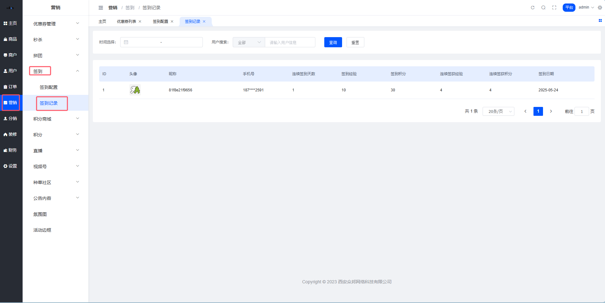

# 签到记录

嘿！👋 来看看如何查看用户的签到记录吧！

## 一、功能描述 📋

查看平台用户签到的记录情况，帮助你全面了解用户的活跃度和签到参与情况。

### 📊 可以看到什么信息？

| 信息项 | 说明 |
|--------|------|
| 👤 签到用户 | 哪个用户进行了签到 |
| 📅 签到时间 | 具体的签到日期和时间 |
| 💎 积分奖励 | 本次签到获得的积分数量 |
| 🌟 经验值奖励 | 本次签到获得的经验值数量 |
| 🔢 连续天数 | 当前连续签到的天数 |

**说人话**：就是一个签到流水账，记录了谁、什么时候、签到获得了什么奖励！

---

## 二、操作路径 🔧

### 📍 如何进入签到记录页面

```
平台端 > 营销 > 签到 > 签到记录
```

---

## 三、签到记录界面 📱



---

## 四、记录信息详解 📖

### 📋 记录列表包含字段

| 字段 | 说明 | 用途 |
|------|------|------|
| 用户信息 | 用户昵称、头像、用户ID | 快速识别是哪个用户 |
| 签到时间 | 年-月-日 时:分:秒 | 了解用户签到的具体时间 |
| 获得积分 | 本次签到获得的积分数 | 查看积分发放是否正确 |
| 获得经验值 | 本次签到获得的经验值数 | 查看经验值发放是否正确 |
| 连续天数 | 当前连续签到的天数 | 了解用户的活跃程度 |
| 是否额外奖励 | 是否获得连续签到额外奖励 | 确认连续奖励发放情况 |

---

## 五、记录查询功能 🔍

### 🎯 常用查询方式

#### 1️⃣ 按用户查询
- 搜索特定用户的签到记录
- 了解某个用户的签到习惯

**适用场景**：
- 用户反馈签到奖励问题时核查
- 查看VIP用户的活跃情况

---

#### 2️⃣ 按时间范围查询
- 查看某个时间段的签到情况
- 统计特定时期的用户活跃度

**适用场景**：
- 查看活动期间的签到参与情况
- 月度/季度签到数据统计

---

#### 3️⃣ 按连续天数筛选
- 查看连续签到天数较高的用户
- 识别活跃用户群体

**适用场景**：
- 寻找忠实用户进行精准营销
- 分析用户留存情况

---

## 六、数据应用场景 📊

### 💡 如何利用签到记录数据

#### 1️⃣ 用户活跃度分析

**查看指标**：
- 📈 每日签到人数趋势
- 🔥 连续签到用户数量
- 📉 签到中断用户分析

**举个栗子** 🌰：
```
发现周末签到人数明显下降
    ↓
可以在周末推出双倍签到积分活动
    ↓
提升周末用户活跃度
```

---

#### 2️⃣ 奖励配置优化

**分析方式**：
- 查看大部分用户的连续签到天数
- 如果很少用户达到某个连续天数，可能奖励设置不够吸引人

**举个栗子** 🌰：
```
发现95%的用户连续签到不超过3天
    ↓
说明第4天及以后的奖励吸引力不足
    ↓
可以调整第4-7天的奖励额度
    ↓
提升用户持续签到的动力
```

---

#### 3️⃣ 精准营销

**应用方式**：
- 筛选连续签到7天以上的用户
- 这些是高活跃度、高忠诚度用户
- 可以推送专属优惠券或VIP活动

**举个栗子** 🌰：
```
筛选出连续签到30天的用户
    ↓
给他们发送专属感谢券
    ↓
"感谢您30天的坚持，这是给您的专属8折券！"
    ↓
提升用户忠诚度和品牌好感
```

---

#### 4️⃣ 问题排查

**适用场景**：
- 用户反馈签到奖励未到账
- 用户反馈连续天数计算错误

**处理流程**：
```
用户反馈问题
    ↓
查询该用户的签到记录
    ↓
核对签到时间和奖励发放
    ↓
确认问题原因
    ↓
解决问题并回复用户
```

---

## 七、记录统计分析 📈

### 📊 关键数据指标

| 指标 | 计算方式 | 意义 |
|------|---------|------|
| 日均签到人数 | 总签到次数 ÷ 天数 | 衡量用户活跃度 |
| 签到参与率 | 签到人数 ÷ 总用户数 | 衡量签到活动吸引力 |
| 平均连续天数 | 所有用户连续天数总和 ÷ 签到人数 | 衡量用户粘性 |
| 长期活跃用户比例 | 连续签到≥7天人数 ÷ 总签到人数 | 衡量用户忠诚度 |

---

### 💡 数据分析建议

#### ✅ 健康的签到数据

- 日均签到率 > 30%
- 平均连续签到天数 > 3天
- 连续签到≥7天的用户占比 > 20%

#### ⚠️ 需要优化的情况

- 日均签到率 < 10% → 奖励吸引力不足
- 平均连续天数 < 2天 → 连续奖励设置有问题
- 第2天签到率大幅下降 → 需要增加第2天的奖励

---

## 八、注意事项 ⚠️

### 📌 记录保存时间

- 签到记录会永久保存
- 方便后续数据分析和用户问题追溯

### 📌 数据导出

- 支持导出签到记录数据
- 可用于制作详细的数据分析报表

### 📌 隐私保护

- 查看签到记录需要相应的管理权限
- 注意保护用户隐私信息

---

## 九、常见问题 ❓

### Q1：如果用户反馈签到奖励没到账怎么办？

**A：** 按以下步骤排查：
1. 在签到记录中查找该用户当天的签到记录
2. 确认签到时间和奖励发放情况
3. 查看积分日志和经验值记录，确认是否已发放
4. 如确实未发放，联系技术人员处理

---

### Q2：如何知道签到活动的效果？

**A：** 可以从以下维度评估：
- 对比活动前后的日均签到人数变化
- 查看连续签到天数分布情况
- 统计签到用户的转化率（签到后是否下单）
- 分析签到活跃用户的客单价

---

### Q3：记录太多，查询速度慢怎么办？

**A：** 建议：
- 使用时间范围筛选，缩小查询范围
- 使用用户ID或昵称精确查询
- 定期导出历史数据进行归档

---

## 十、使用流程 📊

```
登录平台端
    ↓
进入营销管理
    ↓
选择签到管理
    ↓
点击签到记录
    ↓
设置查询条件（可选）
    ↓
查看签到记录列表
    ↓
分析数据并优化配置
    ↓
完成！✅
```

---

💡 **温馨提示**：定期查看签到记录并分析数据，可以帮助你更好地优化签到活动配置，提升用户活跃度！
