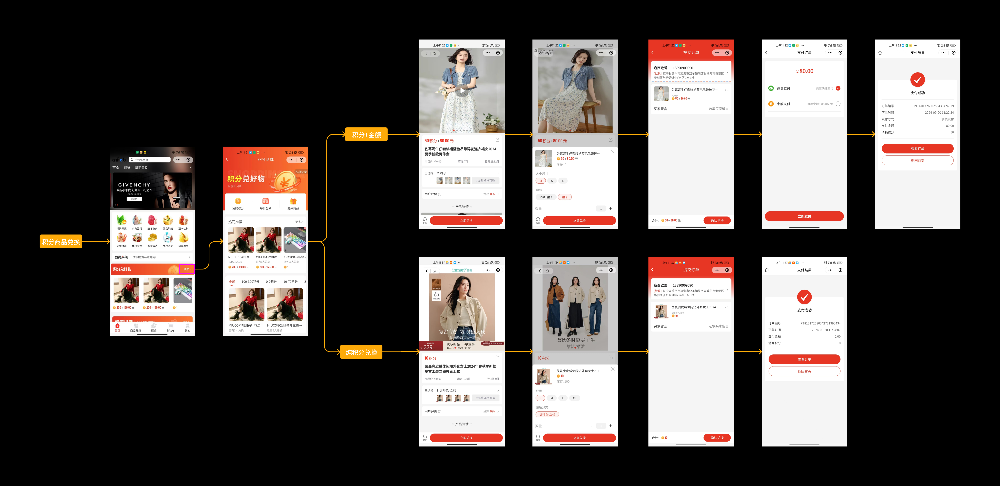
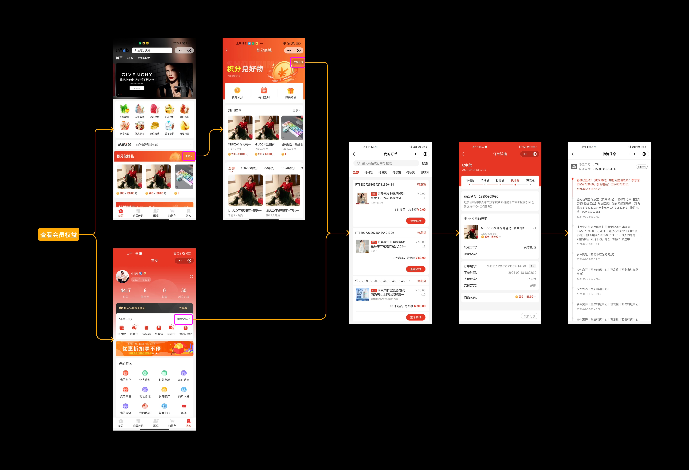
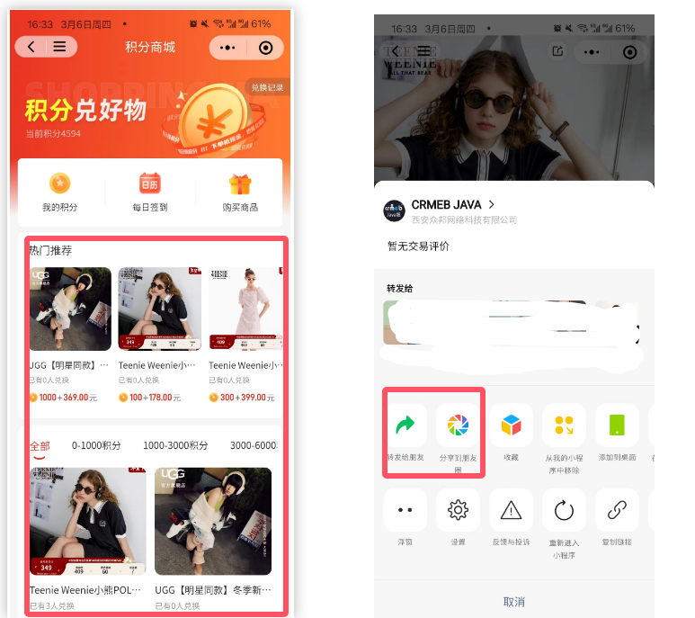

# 💰 积分商城说明

嘿👋 这里是积分商城的完整指南！

## 一、功能简介

### 应用场景

积分商城通过提供积分兑换机制，有效激励用户参与平台活动。这样可以：

- 增强用户粘性与忠诚度
- 促进用户活跃度
- 为商家创造更多商业机会
- 提升品牌形象

### 核心特性

积分商城的商品由平台进行创建及维护：

- 商品支持根据SKU维护兑换金额 + 兑换积分
- 兑换积分不能为0，兑换金额支持设置0.00
- 积分商品兑换必须使用设置的积分数量才能兑换
- 积分不足情况下不支持兑换操作

### 发货与流转

用户下单兑换支付之后，由平台端进行发货：

- 支持快递配送、无需发货、商家送货
- 商家发完货等待用户确认收货
- 根据系统配置的自动收货时间进行流转
- 确认收货后根据自动完成订单时间流转

⚠️ 积分商城商品不支持售后以及评价操作

### 说人话

- 💡 积分商城不分账、不参与分销
- 🔗 商品分享可以绑定上下级分销关系
- 0️⃣ 商品兑换不送积分

## 二、功能说明

### 2.1 积分兑换业务流转图

### 2.2 平台端功能

积分商城平台端包括3个菜单：

| 菜单项 | 说明 |
|--------|------|
| 商品管理 | 用于维护积分商城中的商品相关信息，包括基本信息、价格、库存等 |
| 积分区间 | 用于维护用户端展示的积分区间筛选 |
| 积分订单 | 展示用户通过积分商城兑换的商品订单信息，支持发货相关操作 |

详细说明见对应文档。

### 2.3 积分商品兑换

支持用户使用积分进行商品兑换，用户必须使用等量的积分才能够进行积分商品兑换，积分不足的情况下不支持兑换。

### 2.4 查看积分商品兑换记录

支持用户查看自己已经使用积分兑换的订单记录，支持查看积分订单的发货情况及运输进程。

### 2.5 分享积分商城

