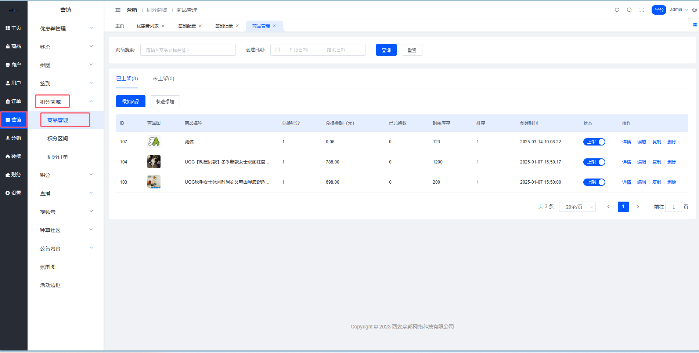
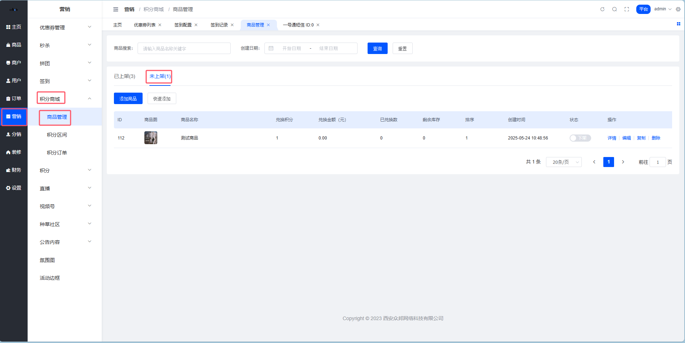
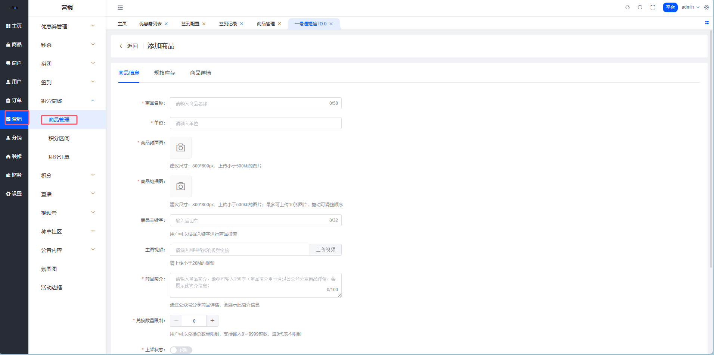
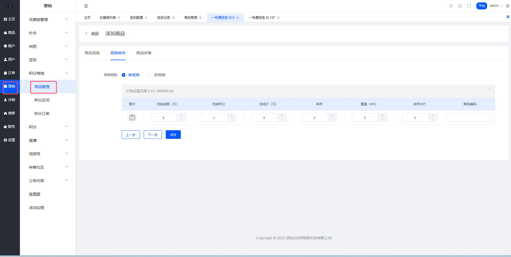
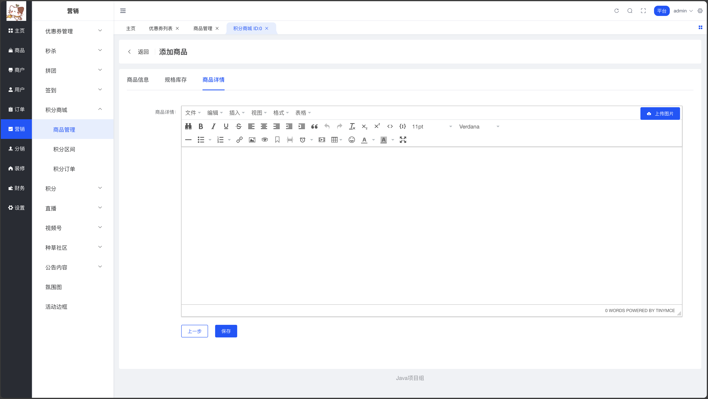
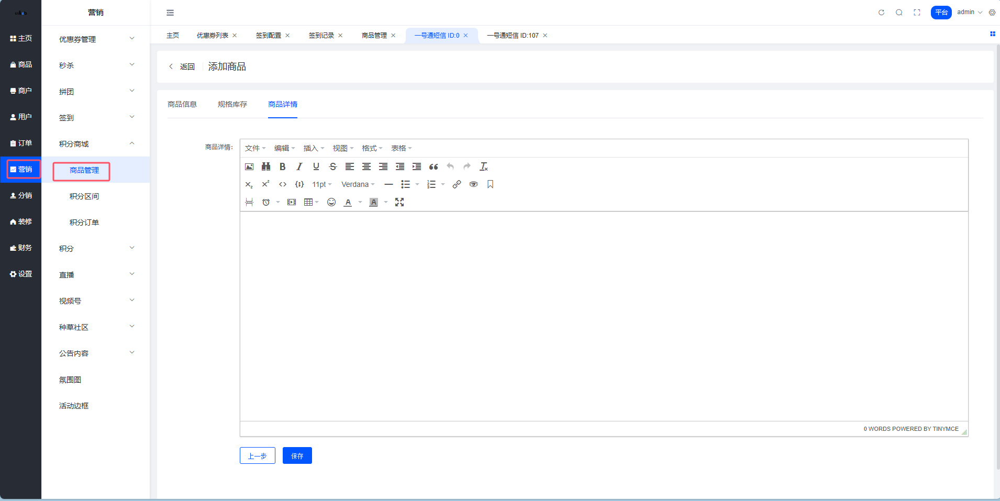
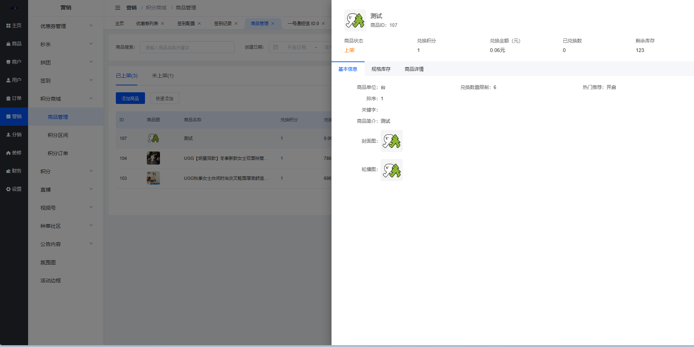
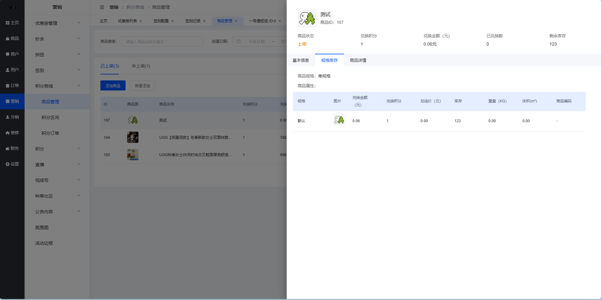

# 🛒 积分商品管理

嘿👋 积分商品的统一管理中心！

## 功能简述

积分商品管理主要用于维护积分兑换商品的商品信息以及对应的兑换金额与兑换积分。

功能点包括：

- 查看商品列表
- 商品列表搜索
- 添加商品
- 快速添加商品
- 查看商品详情
- 编辑商品信息
- 删除商品
- 复制商品信息
- 商品上/下架

## 商品列表

**路径:** 平台端 > 营销 > 积分商城 > 商品管理

**商品列表-已上架**

列表数据：通过新增商品/快速添加/复制商品添加的商品数据，只展示上架状态为已上架的商品数据；tab后边的数字同分页中的条数，根据筛选条件的变化而变化；
列表排序：根据商品信息中的排序倒序展示，排序数值一致，按照创建时间倒序排序；

列表字段：

字段名称
字段说明

ID
根据添加商品的顺序，系统自动生成商品ID，ID不能够重复

商品信息
展示商品封面图以及商品名称，商品名称过长在列表中折行展示两行，还是过长展示…，鼠标悬浮展示完整的商品信息

兑换积分
展示商品所有SKU中，最低的兑换积分

兑换金额
展示商品所有SKU中，最低的兑换积分对应SKU的兑换金额，若多个规格的兑换积分均最低，则展示最低的兑换金额

已兑换数
展示用户已经下单兑换的商品件数，将同一商品所有SKU兑换件数求和展示

剩余库存
同一商品所有SKU剩余库存求和展示

排序
该商品信息中的排序数值展示

上架状态
开关，操作之后提示操作成功，切换改变此商品的上架状态为上/下架，并刷新列表数据，已经下架的商品不在用户端积分商城中进行展示

创建时间
展示创建商品时，保存提交操作的时间记录

搜索条件：
● 商品搜索：文本框，模糊搜索，支持根据商品名称或者商品关键字进行搜索，回车/失去焦点触发搜索，清空也会触发搜索，刷新列表数据
● 创建日期：日期范围选择器，根据选中的时间范围对商品创建时间进行检索，注意包含日期范围选中的开始/结束日期边界值，选择完成之后直接触发搜索，刷新列表数据

操作说明：

字段名称
字段说明

商品管理菜单
点击商品管理菜单进入商品列表，默认选中 已上架 的数据进行展示（不含已删除）

搜索
根据选中的搜索条件，触发搜索，刷新列表数据

重置
将搜索条件重置为默认值，触发搜索，刷新列表数据

未上架/已上架 tab
点击之后切换列表数据，根据商品上架状态进行筛选后对应展示

添加商品
点击之后打开「添加商品」页面，填写需要添加的商品对应的信息数据

快速添加
点击之后打开「选择商品」弹窗，支持选中一个商品确定后，将此商品信息回显在「添加商品」页面，快速进行商品信息数据录入

详情
点击之后打开「商品详情」侧滑，支持查看商品的基础信息、规格库存及商品详情

编辑
点击之后打开「编辑商品」页面，可对现有的商品信息进行修改更正操作，编辑不会影响已经下单的商品记录信息

复制
点击之后打开「添加商品」页面，将选中商品的数据信息回填至「添加商品」页面，可对回显的商品信息进行修改更正操作，提交之后是一条新的商品数据

删除
点击之后打开【二次确认】弹窗，弹窗中提示「您确定要删除此积分商品吗？」，确定之后删除此商品数据；此删除为逻辑删除，删除不会影响已经下单的商品记录信息

**商品列表-未上架**

列表数据：通过新增商品/快速添加/复制商品添加的商品数据，只展示上架状态为未上架的商品数据；tab后边的数字同分页中的条数，根据筛选条件的变化而变化；
列表排序、列表字段、搜索条件、操作说明均同商品列表-已上架。

## 2. 添加商品在商品列表中，点击【添加商品】按钮进入添加商品页面，积分商品默认为平台配置，全国包邮。

**添加商品-基础信息**

字段说明：

字段名称
字段说明

商品名称
文本框，必填，最多50个字，用于用户端及管理端商品信息中名称展示，管理端可根据商品名称搜索

单位
文本框，必填，最多16个字，用于用户端及管理端库存、销量等相关数据后的单位展示

商品封面图
必填，支持上传1张图片，小于500KB，建议尺寸：800*800PX，通过素材库进行上传存储，用于用户端及管理端所有商品主图展示

商品轮播图
必填，支持最多上传10张图片，小于500KB，建议尺寸：800*800PX，通过素材库进行上传存储，用于用户端商品详情页面中轮播图展示

商品关键字
非必填，文本框，最多50个字，最多可以添加20个关键字，回车触发保存，用户端及管理端可根据商品关键字搜索

主图视频
非必填，支持上传1个视频，小于20M，支持从本地上传视频，或者填写MP4格式的视频链接

商品简介
必填，文本域，最多250个字，用于通过公众号分享商品详情，会展示此简介信息

兑换数量限制
必填，计步器，默认0，支持输入0～9999的整数，用于用户可以兑换总数量限制，填0代表不限制

上架状态
开关，用于此商品的上架状态控制，已下架的商品在用户端商品推荐中不展示，收藏记录中会展示为已下架状态

热门推荐
开关，开启之后该商品会在用户端积分商城热门推荐模块进行展示

排序
非必填，计步器，默认0，支持输入0～999999的整数，用于商品的推荐权重展示，数字越大代表权重越高，此商品的排序越靠前

操作说明：

字段名称
字段说明

返回
点击之后页面跳转至「商品列表」页面，列表无需刷新

下一步
点击之后页面切换至「规格库存」tab下，此按钮需要做「基础信息」tab中的必填项校验

提交
点击之后数据库添加数据，跳转至「商品列表」页面，刷新列表数据，此按钮需要做「添加商品」页面所有tab中的必填项校验，以及兑换积分不能为0，商品规格唯一等规则校验

tab切换
点击tab之后也可进行内容切换，且无需做相关校验

**添加商品-规格库存**
积分商城设置价格时，支持设置兑换金额+兑换积分的形式，兑换金额支持为0；

字段说明：

● 商品规格：单选按钮组，支持选择单规格/多规格商品；用于实际商品的SKU维护录入
  ○ 选中单规格只需要填写碎影的兑换积分、兑换金额、库存等数据

字段名称
字段说明

图片
必填，支持上传1张图片，小于500KB，建议尺寸：800*800PX，通过素材库进行上传存储，用于用户端及管理端所有商品SKU图展示

兑换金额(元)
必填，数字类型文本框，2位小数，默认0.00，支持输入0.00～999999.99的数字，用于积分商品需要支付的金额设置

兑换积分
必填，数字类型文本框，默认1，支持输入1～999999的整数，用于积分商品需要抵扣的积分设置

市场价(元)
必填，数字类型文本框，默认0.00，2位小数，支持输入0.00～999999.99的数字，用于用户端积分商品的市场价参考展示

库存
必填，数字类型文本框，默认0，支持输入0～999999的整数，用户积分商品现有库存的维护

商品编号
非必填，文本框，最多250个字，用于第三方对接等预留字段，商品编号需要做唯一值校验

重量(KG)
非必填，数字类型文本框，默认0，支持输入0～999999的整数，用于商品重量记录，辅助运费计算

体积(立方米)
非必填，数字类型文本框，默认0，支持输入0～999999的整数，用于商品重量记录，辅助运费计算

  ○ 选中多规格支持添加规格及对应的规格值，系统生成SKU表之后根据各个SKU维护兑换积分、兑换金额、库存等数据，多规格商品支持批量设置兑换积分、兑换金额、库存等数据

字段名称
字段说明

添加规格
维护多规格商品的规格数据，规格名称一般是颜色等，对应的规格值则是白色、黑色等

SKU商品属性表
根据添加的商品规格系统自动生成SKU商品属性表，属性表的填写同单规格商品

批量设置
填写所有规格可以统一设置的字段值，例如：兑换积分、市场价等，点击【批量添加】完成之后，SKU商品属性表中所有SKU对应的字段均根据批量设置回显；若是有差异的字段不能进行批量设置，则此字段留空，就不会影响之前已经维护至SKU商品属性表中的信息

删除
若SKU商品属性表的某SKU，实际中并无此规格的库存，则可进行删除操作

操作说明：

字段名称
字段说明

返回
点击之后页面跳转至「商品列表」页面，列表无需刷新

上一步
点击之后页面切换至「基础信息」tab下，此按钮需要做「规格库存」tab中的必填项校验

下一步
点击之后页面切换至「商品详情」tab下，此按钮需要做「规格库存」tab中的必填项校验

提交
点击之后数据库添加数据，跳转至「商品列表」页面，刷新列表数据，此按钮需要做「添加商品」页面所有tab中的必填项校验，以及兑换积分不能为0，商品规格唯一等规则校验

tab切换
点击tab之后也可进行内容切换，且无需做相关校验

**添加商品-商品详情**

字段说明：
● 富文本：支持上传图片，支持编辑文字，支持上传视频，支持调整文字、图片格式；富文本可以为空
操作说明：
● 返回：点击之后页面跳转至「商品列表」页面，列表无需刷新
● 上一步：点击之后页面切换至「规格库存」tab下
● 提交：点击之后数据库添加数据，跳转至「商品列表」页面，刷新列表数据，此按钮需要做「添加商品」页面所有tab中的必填项校验，以及兑换积分不能为0，商品规格唯一等规则校验
● tab切换：点击tab之后也可进行内容切换，且无需做相关校验

## 3. 快速添加商品在商品列表中，点击【快速添加】按钮打开选择商品弹窗，支持选中一个商品进行快速添加操作；快速添加只是会回显选中商品对应的字段值，积分商城的库存与普通商品库存是分开管理维护的，积分商城商品没有运费 默认包邮，积分商城不支持到店自提，不支持售后；

** 选择商品弹窗 **

列表数据：全平台所有审核通过商品数据（不含已删除商品）；
列表排序：根据商城商品信息中的排序倒序展示，排序数值一致，按照创建时间倒序排序；

列表字段：

字段名称
字段说明

ID
展示商城商品信息对应的ID

商品信息
展示商品封面图以及商品名称，商品名称过长在列表中折行展示两行，还是过长展示…，鼠标悬浮展示完整的商品信息

商品分类
展示商品对应平台商品分类内容

商品类型
展示商品对应的商品类型，包括：普通商品、虚拟商品、云盘商品、卡密商品

商品状态
展示商品的上下架状态

搜索条件：

字段名称
字段说明

商品搜索
文本框，模糊搜索，支持根据商品名称或者商品关键字进行搜索，回车/失去焦点触发搜索，清空也会触发搜索，刷新列表数据

商品分类
下拉级联单选，支持选择商品平台分类，支持根据关键字搜索下拉中的选项，下拉选择之后直接触发搜索，刷新列表数据

商户选择
下拉单选，支持选择平台中的所有店铺，支持根据关键字搜索下拉中的选项，下拉选择之后直接触发搜索，刷新列表数据

商品状态
下拉单选，支持选择商品对应的上架状态，默认上架，包括：全部、上架、下架，下拉选择之后直接触发搜索，刷新列表数据

操作说明：

字段名称
字段说明

搜索
根据选中的搜索条件，触发搜索，刷新列表数据

重置
将搜索条件重置为默认值，触发搜索，刷新列表数据

选择商品
选中一个商品之后，跳转「添加商品」页面，并将选中的商品信息进行回显，保存之后生成一条新的积分商品数据；对应字段值在「添加商品」页面一一对应回显，配送方式仅支持平台配送，运费前端不展示，后端计算为默认全国包邮，无购买赠送优惠券功能；选中卡密/云盘商品也是为了快速维护商品信息，并不会自动发货，还是需要平台发货时选中对应的发货方式进行发货操作（虚拟商品一般选中无需发货，在发货备注中填写对应的网盘地址/卡密信息）

关闭
隐藏关闭当前弹窗

## 4. 商品详情在「商品列表」中，点击商品详情支持查看商品的基础信息、规格库存、商品详情信息。

** 商品详情-基础信息 **

** 商品详情-规格库存 **

** 商品详情-商品详情 **

