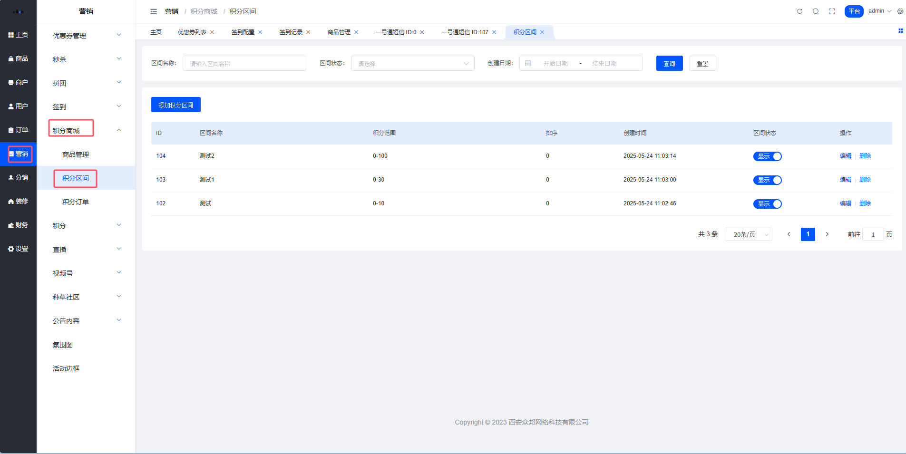
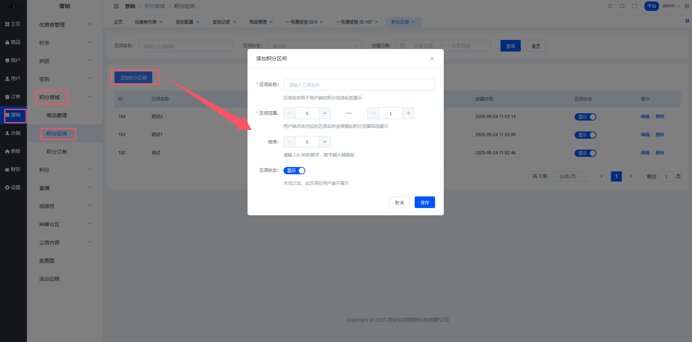

# ⚙️ 积分配置（积分区间）

嘿👋 这是积分系统的配置中心！

## 一、功能简述

积分区间用于用户端积分区间tab值的自定义维护。用户端根据积分商城商品设置的兑换积分进行筛选，若同一商品多个规格属于不同的积分区间，则按照最低的区间进行展示。

### 功能点

- 查看积分区间列表
- 积分区间列表搜索
- 添加积分区间
- 编辑积分区间
- 删除积分区间
- 状态开启/关闭

## 二、功能说明

**路径:** 平台端 > 营销 > 积分商城 > 积分区间

### 2.1 积分区间列表

列表数据：通过新增积分区间添加的积分区间数据；
列表排序：根据积分区间信息中的排序倒序展示，排序数值一致，按照创建时间倒序排序；

列表字段：

字段名称
字段说明

ID
根据添加积分区间的顺序，系统自动生成ID，ID不能够重复

区间名称
展示积分区间添加/编辑时填写的区间名称数据

积分范围
展示积分区间添加/编辑时填写的积分范围数据

排序
该积分区间信息中的排序数值展示

状态
开关，操作之后提示操作成功，切换改变此积分区间的状态为开启/关闭，并刷新列表数据

创建时间
展示创建积分区间时，保存提交操作的时间记录

搜索条件：

字段名称
字段说明

区间名称
文本框，模糊搜索，支持根据区间名称搜索，回车/失去焦点触发搜索，清空也会触发搜索，刷新列表数据

区间状态
下拉列表，单选，默认为空（即展示全部数据），支持选择：开启、关闭，下拉选择之后直接触发搜索，刷新列表数据

创建日期
日期范围选择器，根据选中的时间范围对积分区间创建时间进行检索，注意包含日期范围选中的开始/结束日期边界值，选择完成之后直接触发搜索，刷新列表数据

操作说明：

字段名称
字段说明

积分区间菜单
点击积分区间菜单进入积分区间列表，默认展示所有数据（不含已删除）

搜索
根据选中的搜索条件，触发搜索，刷新列表数据

重置
将搜索条件重置为默认值，触发搜索，刷新列表数据

添加积分区间
点击之后打开「添加积分区间」弹窗，填写需要添加的区间对应的信息数据

编辑
点击之后打开「编辑积分区间」弹窗，可对现有的积分区间信息进行修改更正操作

删除
点击之后打开【二次确认】弹窗，弹窗中提示「您确定要删除此积分区间吗？」；此删除为逻辑删除

### 2.2 添加积分区间在商品列表中，点击【添加积分区间】按钮打开添加积分区间弹窗，积分区间的范围设置支持重复，积分区间名称需要唯一。

** 添加积分区间弹窗 **

字段说明：

字段名称
字段说明

区间名称
文本框，必填，最多16个字，必须唯一；用于用户端积分商城积分筛选标签展示，管理端可根据区间名称搜索

区间范围
必填，计步器，默认空，支持输入0～999999的整数，需要校验后边的结束值大于开始值；用于用户端积分商城积分筛选实际的积分区间范围

排序
非必填，计步器，默认0，支持输入0～99的整数，用于区间的推荐权重展示，数字越大代表权重越高，此积分区间的排序越靠前

区间状态
开关，用于此积分区间的开启/关闭状态控制，已关闭的区间在用户端不展示

操作说明：不做特殊说明的弹窗交互均是如此

字段名称
字段说明

关闭/取消
隐藏关闭当前弹窗，数据不进行提交

确定
隐藏关闭当前弹窗，数据提交数据库进行保存，并刷新列表数据