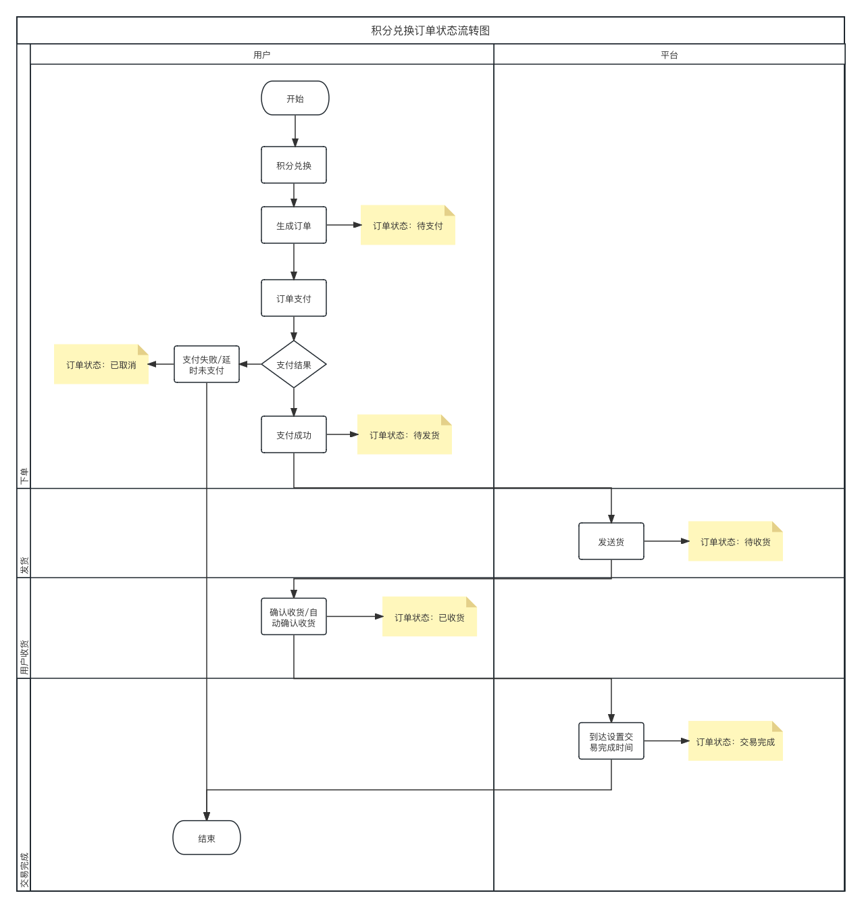
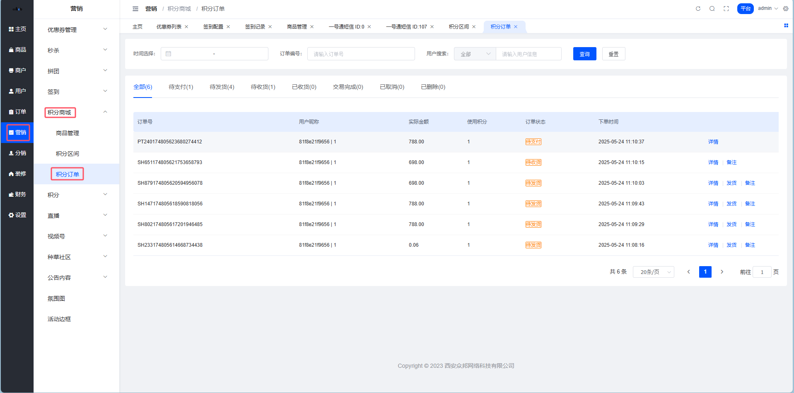
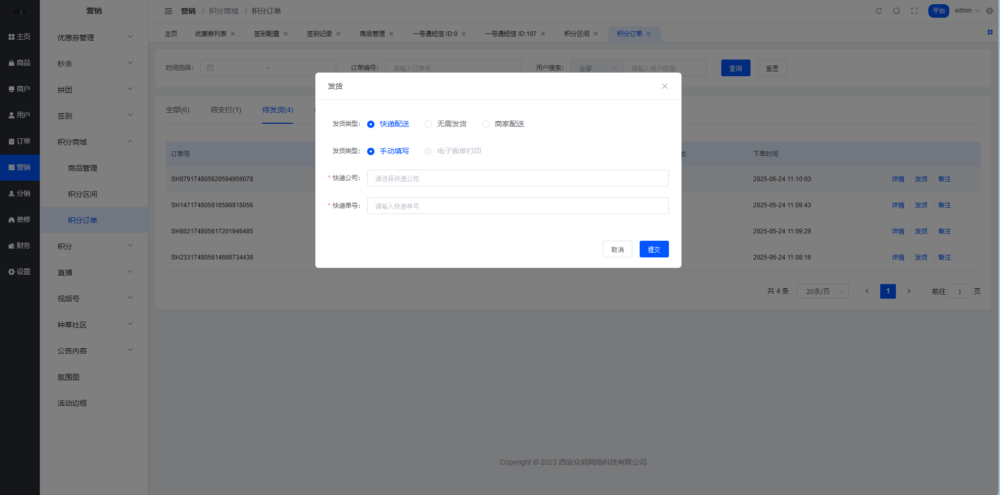
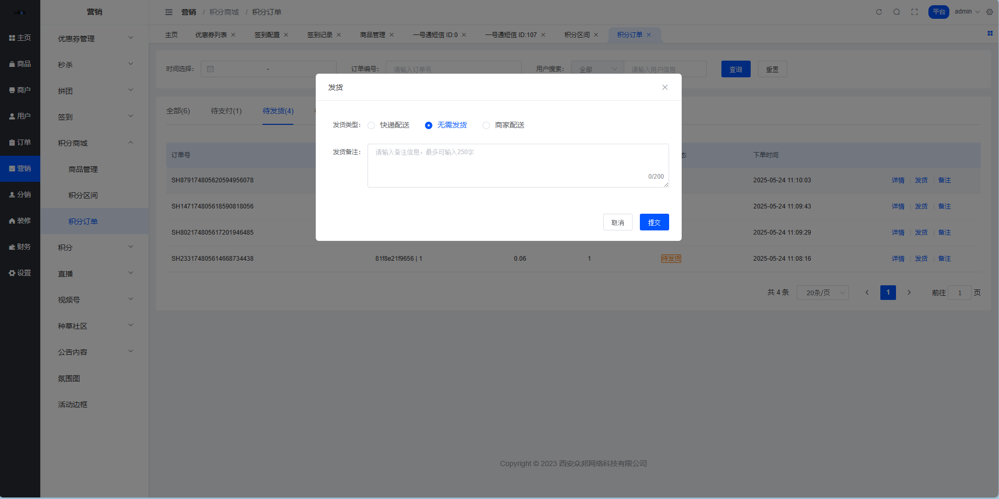
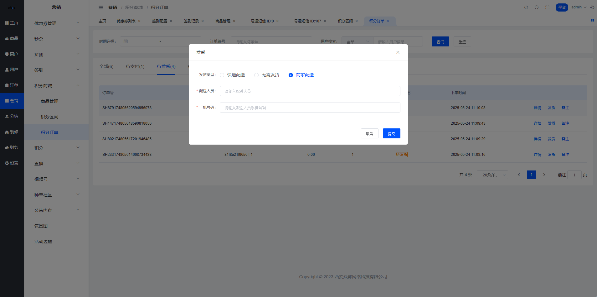
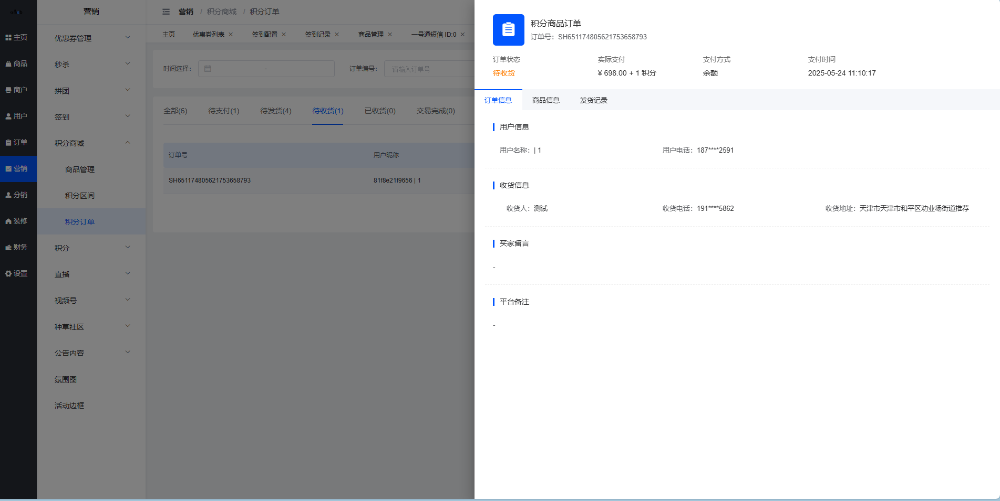
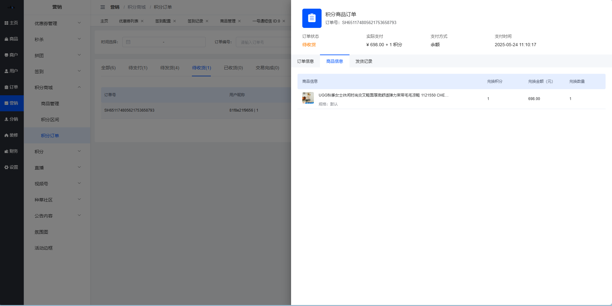
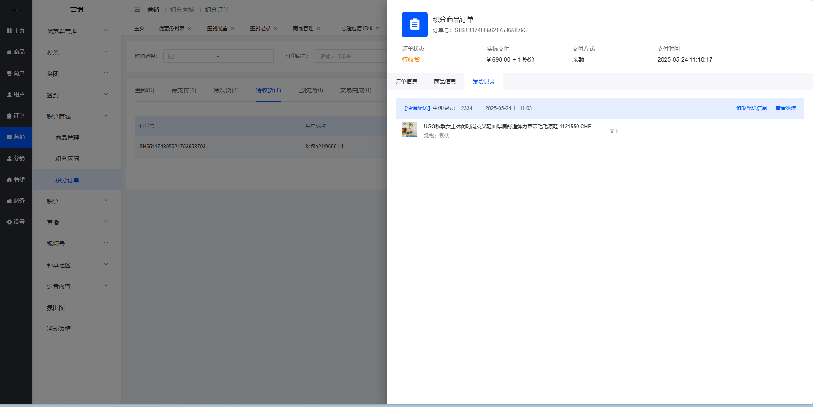
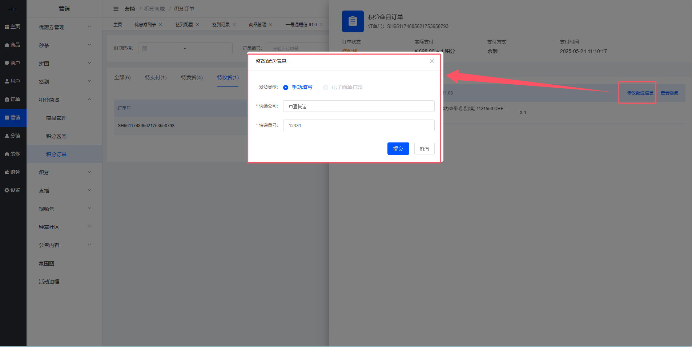

# 📋 积分订单

嘿👋 积分订单管理平台！

## 一、功能简述

用户在积分商城进行兑换操作之后，会生成对应的积分兑换订单数据。平台积分订单可以看到商城中所有的积分兑换订单数据。

⚠️ 积分兑换订单不支持售后相关操作

### 功能点

- 查看积分订单列表
- 积分订单列表搜索
- 查看积分订单详情
- 商品发货
- 订单备注
- 导出订单
- 修改配送信息
- 查看物流

## 二、功能说明

**路径:** 平台端 > 营销 > 积分商城 > 积分订单

### 2.1 积分订单列表积分兑换业务流转图如下：

** 订单列表 **

列表数据：用户进行积分商品兑换操作产生的订单数据，用户点击【立即兑换】进入订单提交页面，即生成积分兑换订单-待支付数据；tab后边的数字同分页中的条数，根据筛选条件的变化而变化；

tab列表数据说明：

字段名称
字段说明

全部
展示用户进行积分商品兑换操作产生的所有订单数据

待支付
展示订单状态为待支付的订单数据

待发货
展示订单状态为待发货的订单数据

待收货
展示订单状态为待收货的订单数据

已收货
展示订单状态为已收货的订单数据

交易完成
展示订单状态为交易完成的订单数据

已取消
展示订单状态为已取消的订单数据

已删除
展示订单状态为已删除的订单数据，用户删除的已取消、交易完成的订单，标识已删除状态展示在已删除中

列表排序：根据下单时间倒序展示；

列表字段：

字段名称
字段说明

订单编号
制定积分兑换订单的订单编号规则，原则上是订单生成时系统制定的订单编号不允许重复，必须唯一

用户昵称｜ID：展示下单用户的昵称以及ID数据，昵称根据ID实时查询

商品信息
展示此订单对应的商品主图（封面图）、商品名称、规格值、下单数量；商品主图、商品名称、规格值、下单数量均为订单中的记录数据

支付金额
展示用户下单时的结算金额，支付金额为订单记录数据

使用积分
展示用户下单时的使用积分数量，使用积分为订单记录数据

订单状态
展示此订单的当前状态

下单时间
展示用户兑换下单时的操作时间，下单时间为订单记录数据

搜索条件：

字段名称
字段说明

订单编号
文本框，模糊搜索，支持根据订单编号搜索，回车/失去焦点触发搜索，清空也会触发搜索，刷新列表数据

下单日期
日期范围选择器，根据选中的时间范围对下单时间进行检索，注意包含日期范围选中的开始/结束日期边界值，选择完成之后直接触发搜索，刷新列表数据

用户搜索
回车/失去焦点触发搜索，清空也会触发搜索，刷新列表数据； 全部：文本框，模糊搜索，支持根据UID、手机号、用户昵称进行搜索；UID：文本框，精准搜索，支持根据UID进行搜索；手机号：文本框，模糊搜索，支持根据手机号进行搜索；用户昵称：文本框，模糊搜索，支持根据用户昵称进行搜索

操作说明：

字段名称
字段说明

积分订单菜单
点击积分订单菜单进入积分订单列表，默认展示所有数据

搜索
根据选中的搜索条件，触发搜索，刷新列表数据

重置
将搜索条件重置为默认值，触发搜索，刷新列表数据

详情
点击之后打开「订单详情」侧滑弹窗，支持查看订单详情数据，订单详情中支持发货、备注操作，同列表中的发货、备注操作一致

发货
点击之后打开「发送货」弹窗，支持选择配送方式（快递配送/无需发货/商家送货），填写对应的发货信息之后，订单状态流转为待收货；平台发货之后根据不同的发货方式在用户端/平台端的订单详情中展示不同的内容，快递物流可查看物流信息，无需物流可查看发货备注，商家送货可查看配送人员信息（配送人员姓名+手机号码）；只有待发货状态会展示「发货」按钮，仅支持整单发货（一次性发完所有商品，不支持分包裹/分多次发货），发完货之后状态直接流转为待收货

### 2.2 积分订单发送货在积分订单列表中，点击【发货】按钮打开积分发送货弹窗，进行发货操作；配送方式支持根据实际业务场景选择快递配送、无需发货、商家送货，快递物流可查看物流信息，无需物流可查看发货备注，商家送货可查看配送人员信息（配送人员姓名+手机号码）。

** 配送方式-快递配送 **

字段说明：

字段名称
字段说明

配送方式
单选按钮组，支持选择快递配送、无需发货、商家送货；快递配送：使用快递物流发货的订单商品；无需发货：不需要发货信息的订单商品；商家送货：商家自行配送的订单商品

物流公司
下拉单选，必填，支持选中平台已经同步的物流公司名称，支持根据关键字搜索选项

快递单号
文本框，必填，最多50个字，输入此订单的物流包裹单号，用户端及平台端可根据此单号进行物流进度查询

** 配送方式-无需发货 **

字段说明：

字段名称
字段说明

发货备注
文本域，非必填，最多250个字，输入此订单商品的发货备注信息，用户端及及平台端在订单详情中支持查看发货备注

** 配送方式-商家送货 **

字段说明：

字段名称
字段说明

配送人员
文本框，必填，最多16个字，输入配送人员姓名，用户端及及平台端在订单详情中支持查看配送人员信息

手机号码
文本框，必填，最多11个字，输入配送人员手机号码，用户端及及平台端在订单详情中支持查看配送人员信息

### 2.3 查看订单详情订单详情支持查看订单信息、商品信息、发货记录，在待支付、待发货状态不展示 发货记录 tab。

** 订单详情-订单信息 **

字段说明：（数据值为空展示- -）

字段名称
字段说明

实时查询字段
用户昵称、用户电话、平台备注、订单当前状态

订单记录字段
订单号、实际支付金额+积分、支付方式、支付时间、收货人、收货电话、收货地址、买家留言

操作说明：
● 支持订单备注及发货操作，交互说明同订单列表

** 订单详情-商品信息 **

字段说明：用户下单时的记录信息，非实时查询

** 订单详情-发货记录 **

字段说明：

字段名称
字段说明

表头蓝色文字
配送方式类型

表头黑粗文字
快递配送展示快递公司与物流包裹单号，商家配送展示配送人员及手机号码（最新数据记录）

表头时间
展示 发货 操作保存提交的系统时间记录

商品信息
展示发货选择的商品数据记录，包括商品封面图、商品名称、规格、发货数量

发货备注
无需配送方式展示发货时填写的备注信息记录（最新数据记录）

操作说明：

字段名称
字段说明

查看物流
点击之后打开查看物流弹窗，同普通商品查看物流弹窗一致，实时查询物流数据；仅快递配送类型展示此按钮

修改配送信息
点击之后打开对应的修改配送信息弹窗，仅支持修改对应的发货记录字段，不支持修改配送方式，弹窗中的字段说明同发货弹窗

### 2.4 修改配送信息** 修改配送信息 **

修改错误的配送信息数据，保存之后对应更新用户端的配送记录信息。

