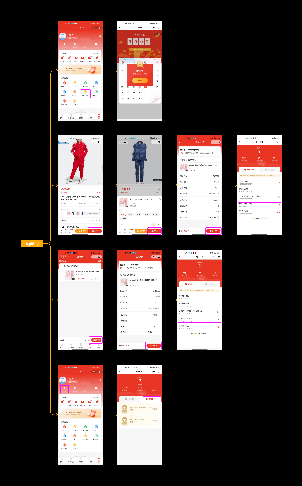
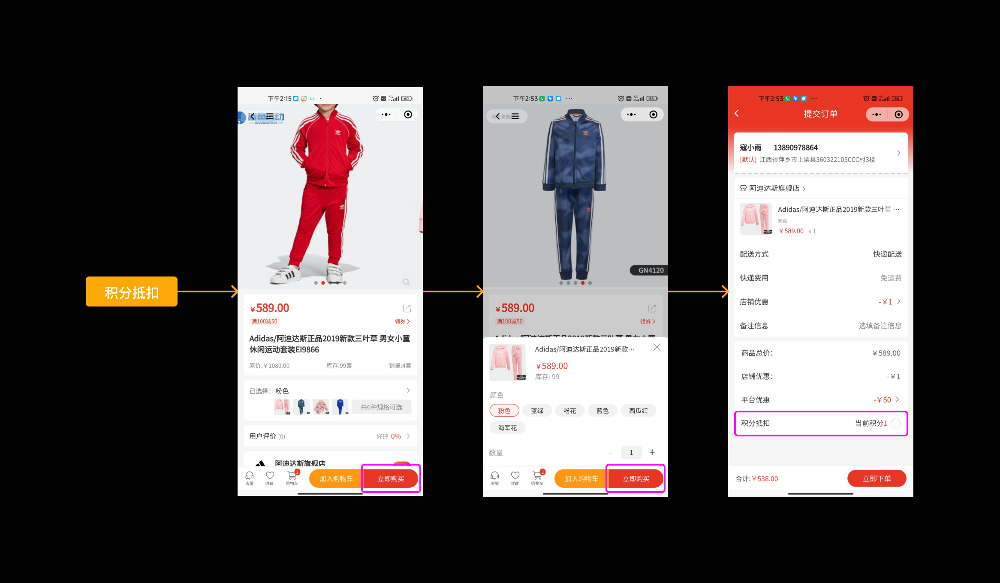
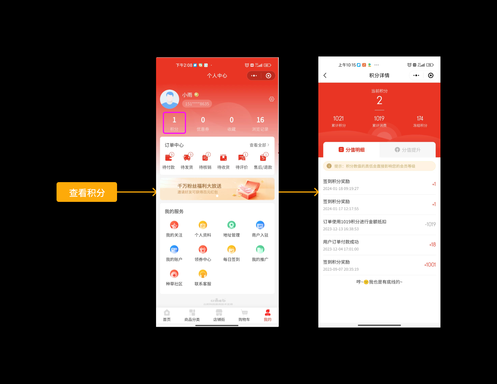
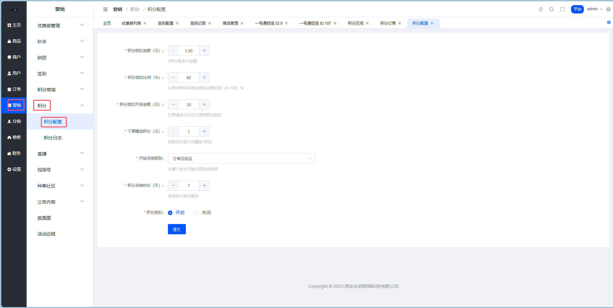
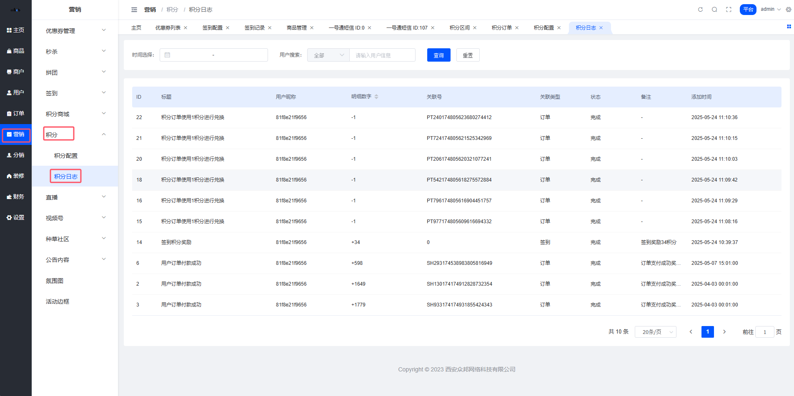

# 平台积分管理

> 积分这玩意儿，说白了就是商城里的「虚拟货币」—— 用户攒着爽，花着更爽，平台看着数据涨也爽。三赢。

## 积分是个啥？

积分系统就像游戏里的经验值，用户通过签到、购物等行为积累，然后在下单时用来抵扣现金。本质上是一套用户激励机制，让用户产生「我不买点啥，这积分不就浪费了」的心理。

运营老司机都懂：**让用户觉得占便宜，比真让他占便宜更重要。**

## 积分从哪来？

目前支持两个积分获取渠道：

### 签到得积分

每日签到打卡，积少成多。具体能拿多少积分，去 [签到配置](/03_使用手册/23_签到配置) 里设置。

### 下单送积分

用户付款后，根据实际支付金额按比例送积分。但这个积分不是立刻到账的——会先进入「冻结期」，等订单稳定了（没退款没售后）才解冻。

> 为什么要冻结？防止有人「薅完积分就退款」啊，这波操作我们早就料到了。

## 积分怎么花？

很简单：**下单抵现金**。

用户结算时勾选使用积分，直接减少实付金额。就这么朴实无华。

## 积分明细

用户可以在个人中心查看：
- 当前积分余额
- 累计获得积分
- 累计消费积分
- 每一笔积分的来龙去脉

## 积分抵扣的门道

这里有几条规则需要了解：

| 规则 | 说明 |
| --- | --- |
| 可叠加使用 | 积分抵扣可以和平台券、商家券一起用，但秒杀等营销活动不行 |
| 平台买单 | 积分抵扣的钱，由平台承担，不从商家那扣 |
| 有门槛 | 订单金额（扣完券后）要达到设定的开启金额才能用积分 |
| 有上限 | 积分最多抵扣订单金额的 X%，这个比例平台自己定 |
| 冻结机制 | 送出去的积分先冻着，过了冻结期才真正到账 |

::: tip 关于售后退款
- 冻结期内退款：冻结积分直接收回，没毛病
- 解冻后再退款：已解冻的积分不收回，这部分损失平台自己扛
:::

## 积分配置

**路径**：平台后台 → 营销 → 积分 → 积分配置

### 配置项详解

| 字段 | 这是干嘛的 |
| --- | --- |
| 积分抵扣金额 | 1积分 = 多少钱？比如设成0.01，那100积分抵1块 |
| 积分抵扣比例 | 订单最多能用多少比例的积分抵扣，0-100% 随便设 |
| 积分抵扣开启金额 | 订单满多少钱才能用积分，设个门槛 |
| 下单赠送积分 | 花多少钱送1积分？比如设成10，那花100块得10积分 |
| 开始冻结规则 | 从哪个节点开始算冻结期：支付后 / 收货后 / 完成后 |
| 积分冻结时间 | 冻结多少天，过了这个时间积分才解冻 |
| 积分抵扣开关 | 总开关，关了就全站不能用积分抵扣 |

::: warning 划重点
积分抵扣的钱是平台出的，不是商家出的。所以设置比例的时候悠着点，别把自己玩进去了。
:::

## 积分日志

**路径**：平台后台 → 营销 → 积分 → 积分日志

这里记录了所有用户的积分流水，谁得了多少、谁花了多少、什么时候冻结什么时候解冻，一目了然。

运营同学查数据、排查问题就靠它了。

