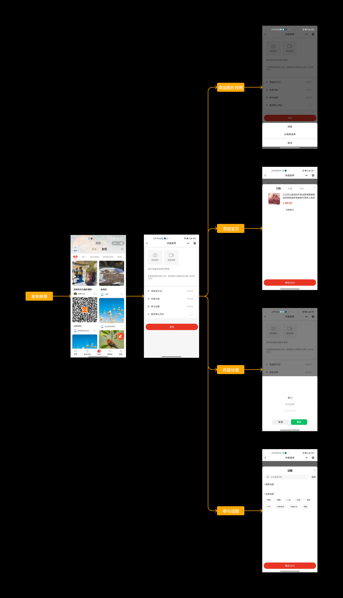
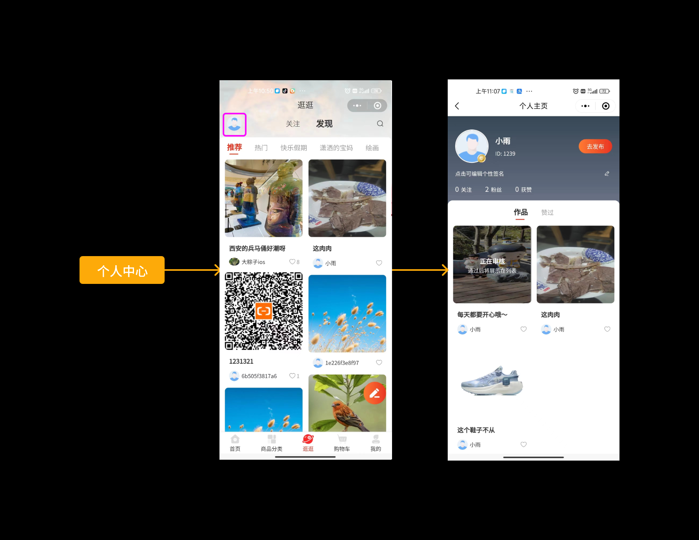
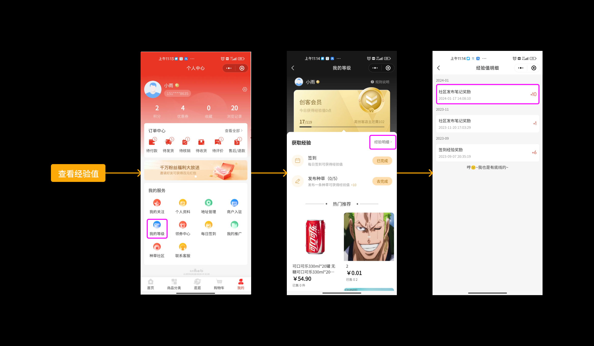
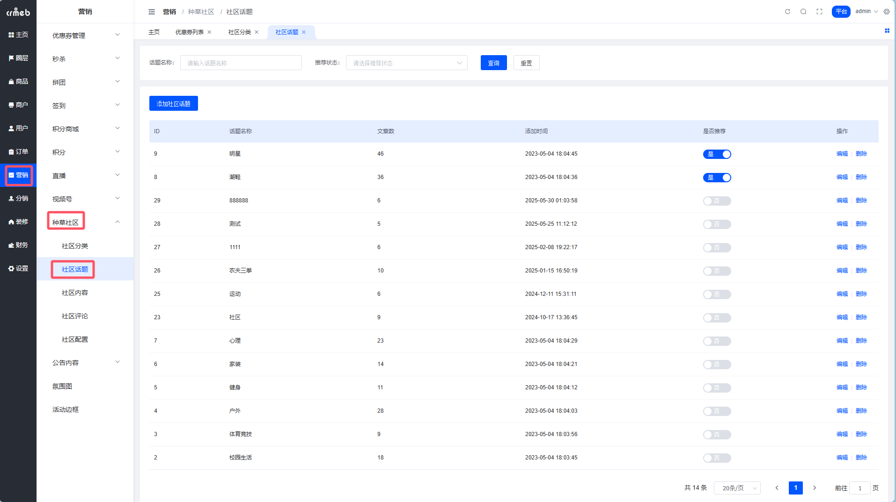
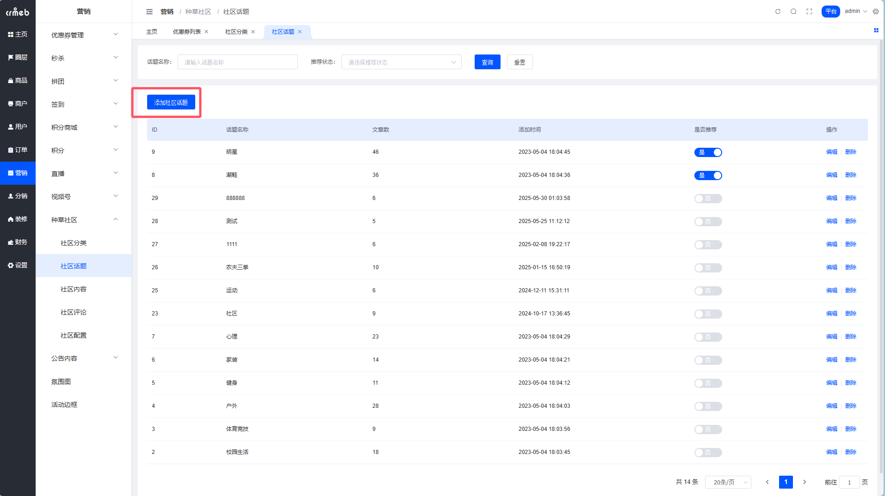
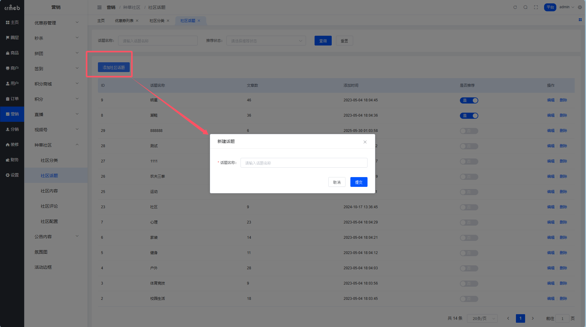
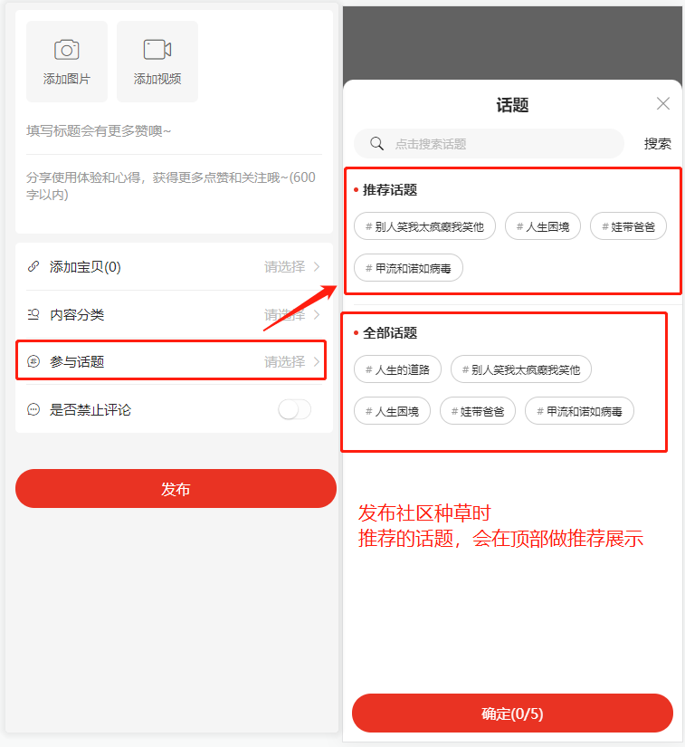
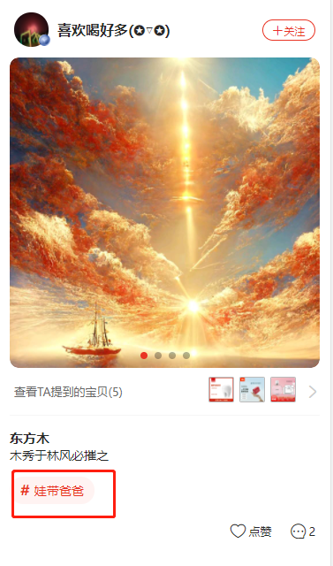
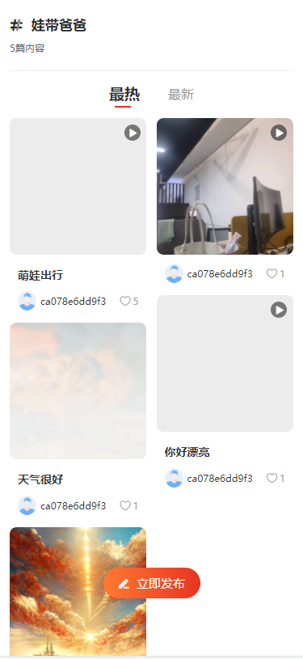
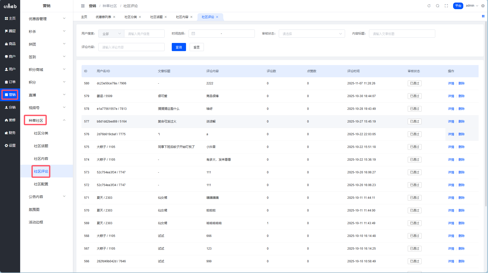

# 种草社区

> 没有什么是一篇好的种草笔记解决不了的。如果有，那就两篇。

## 这是个啥？

种草社区 = 商城内置的小红书。

用户在这里分享购物心得、使用体验、护肤日记、穿搭灵感... 本质上就是 UGC 内容社区，但有个核心区别：**可以直接带货**。

用户看完种草内容，觉得「这东西不错诶」，顺手就能点进关联商品下单。从种草到拔草，一气呵成，转化链路短得可怕。

系统支持：
- 图文 / 视频两种发布形式
- 内容可关联商品、话题、分类
- 发布后需审核才能公开（防止乱七八糟的内容上线）
- 平台可删内容、删评论、关评论

## 用户能干嘛？

### 发种草

支持发图文或视频，可以 @ 商城里的商品。读者看到商品链接，点进去就能买。

这就是内容电商的精髓：**让用户帮你卖货，还不用付工资。**

### 管理自己的作品

发布后的内容会先进入审核队列。用户可以在个人中心看到：
- 自己发布的内容（审核中 / 已通过 / 被拒绝）
- 自己点赞过的内容

### 发内容还能赚经验

对，发种草不白发，能拿经验值。平台可以设置：
- 每篇内容送多少经验
- 每天最多能通过发内容获得多少经验

激励用户持续产出内容，形成正向循环。

## 社区话题

话题 = 内容的标签。一篇种草可以打多个话题标签，用户点击话题可以看到该话题下的所有内容。

**路径**：平台后台 → 社区 → 社区话题

### 添加话题

两步搞定：

**Step 1**：点【添加社区话题】

**Step 2**：输入话题名称，提交

### 话题的一些细节

- 设为「推荐」的话题，用户发布时会优先展示
- 用户可以通过话题页发现更多相关内容

### 移动端长这样

发布时选话题：

文章里展示话题标签：

话题聚合页：

## 社区评论

**路径**：平台后台 → 社区 → 社区评论

这里可以看到所有评论，管理员可以删评论、审核待审评论。

### 评论开关的优先级

评论这块有三层开关，优先级从高到低：

| 优先级 | 开关 | 说明 |
| --- | --- | --- |
| 1 | 平台总开关 | 关了全站都不能评论 |
| 2 | 平台强制关闭 | 针对某篇内容强制关评论，作者也没法开 |
| 3 | 作者自己设置 | 作者可以选择自己这篇开不开评论 |

### 评论审核

开启评论审核后，用户发的评论需要管理员过审才能显示。

> 虽然增加了运营工作量，但能有效避免「评论区变战场」的尴尬局面。
