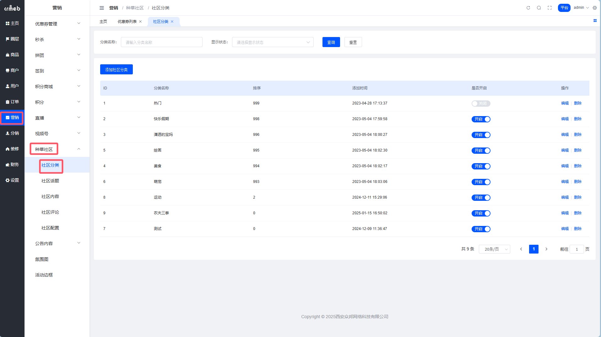
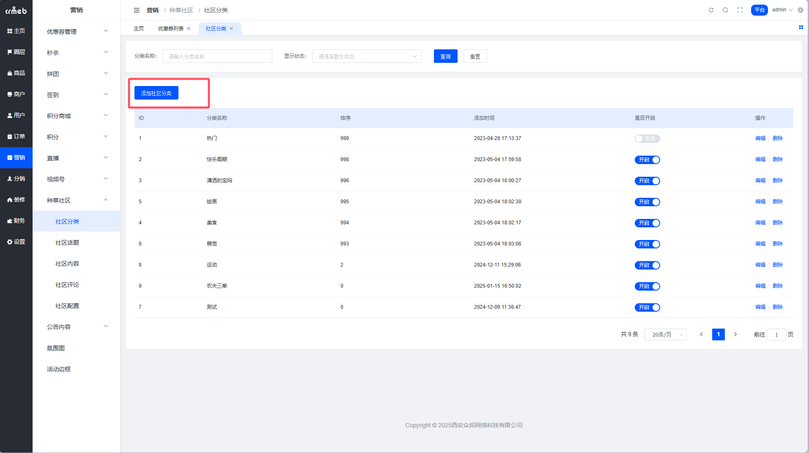
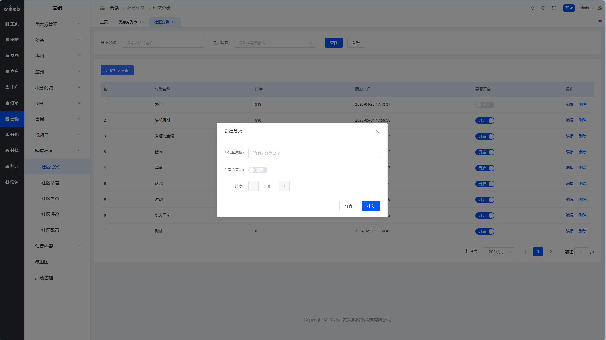
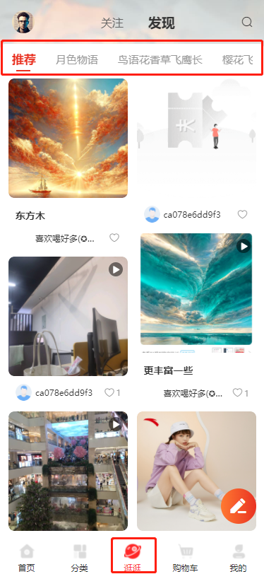
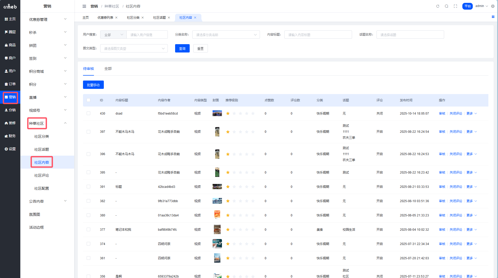
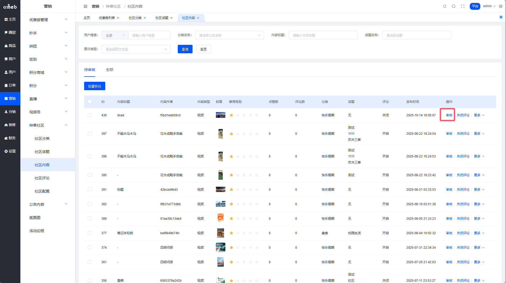
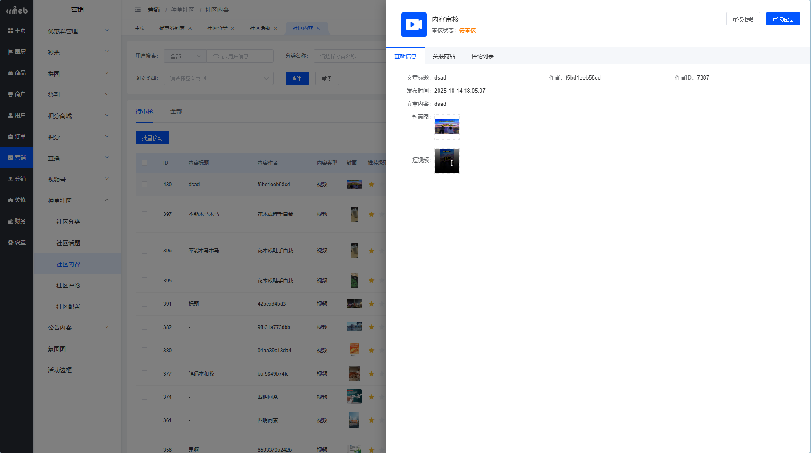
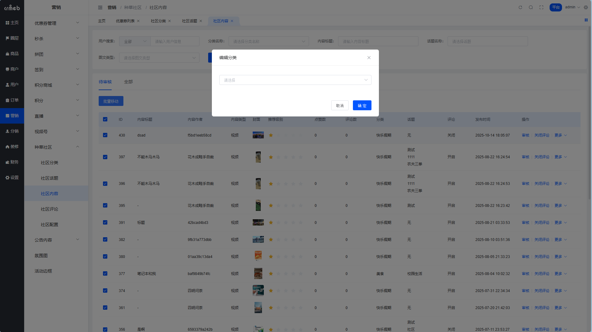
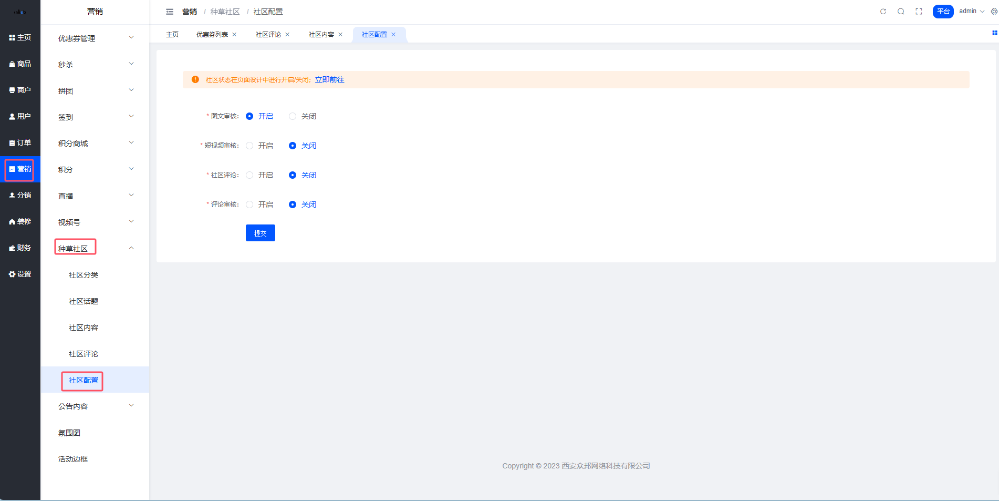

# 种草社区管理

> 内容运营三件套：分类、审核、配置。掌握了这仨，社区就稳了。

## 社区分类

分类是种草内容的「必填项」，相当于给内容贴个大标签，方便用户按分类浏览。

**路径**：平台后台 → 营销 → 种草社区 → 社区分类

### 添加分类

**Step 1**：点击【添加社区分类】

**Step 2**：填写分类名称，提交搞定

### 分类的几个细节

- 分类只有一级，没有子分类（保持简单）
- 隐藏分类后，用户发布时看不到这个选项，前端分类栏也不展示
- 删除分类前，必须先把分类下的内容清空或移走

### 移动端效果

## 社区内容管理

这里是内容审核的主战场，所有用户发布的种草都会汇总到这里。

**路径**：平台后台 → 社区 → 社区内容

### 内容审核

分「待审核」和「全部」两个 Tab。待审核列表里的内容，审核通过后用户端才能看到。

**审核流程**：

1. 点击【审核】按钮，打开侧边栏

2. 预览内容，选择【审核通过】或【审核拒绝】

审核结果：
- 通过 → 内容上线，全员可见
- 拒绝 → 内容打回，用户可以修改后重新提交

**用户端看到的效果**：

### 更多操作

#### 强制关闭评论

遇到容易引战的内容？直接关评论。强制关闭后，作者自己也开不了。

#### 调整星级

星级越高，排序越靠前。想让某篇内容置顶？把星级拉满就行。

#### 批量移动分类

选中多篇内容，一键移到另一个分类。批量操作，效率翻倍。

#### 强制下架

发现违规内容？强制下架。下架后用户想重新上线，必须重新提交审核。

> 这招专治「先发后改」的小聪明。

## 社区配置

社区的全局开关都在这里。

**路径**：平台后台 → 营销 → 种草社区 → 社区配置

### 配置项说明

| 配置项 | 干嘛用的 |
| --- | --- |
| 图文免审核 | 开了之后图文直接上线，不用审核（信任用户的话可以开） |
| 短视频免审核 | 同上，视频类内容免审 |
| 评论审核 | 评论要不要过审？开了就要 |
| 评论开关 | 全局评论开关，关了全站都不能评论 |
| 社区状态 | 在页面设计里控制社区入口的显示/隐藏 |

::: tip 建议
新上线的社区建议先开审核，等内容生态稳定了再考虑免审。不然一上来就放飞，容易翻车。
:::
