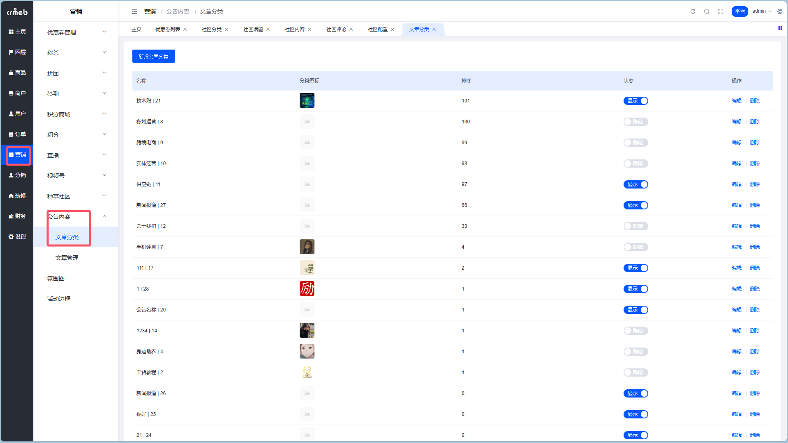
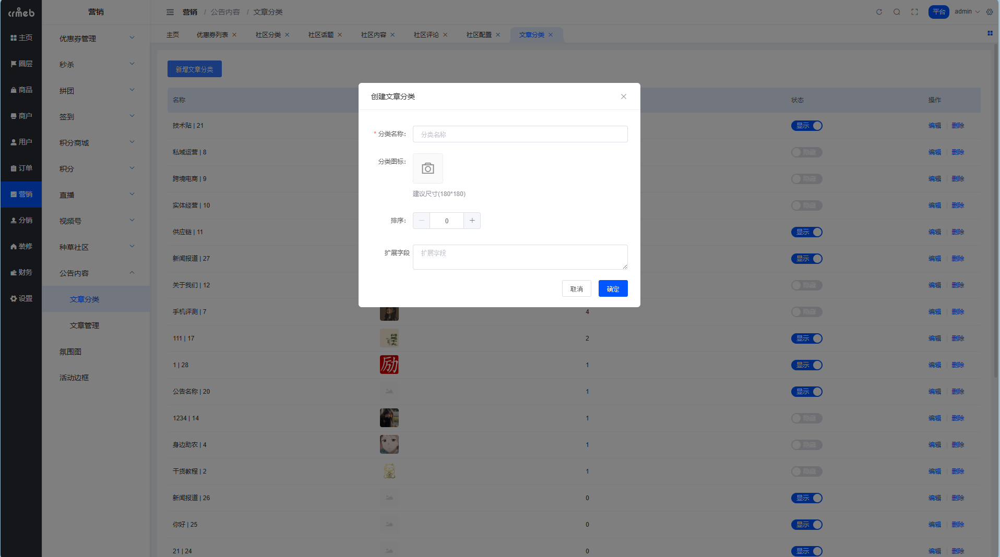
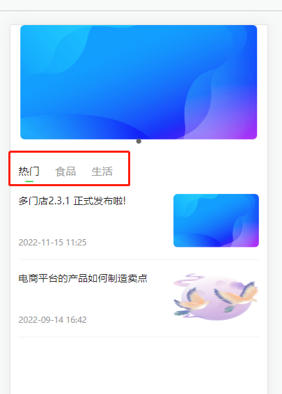
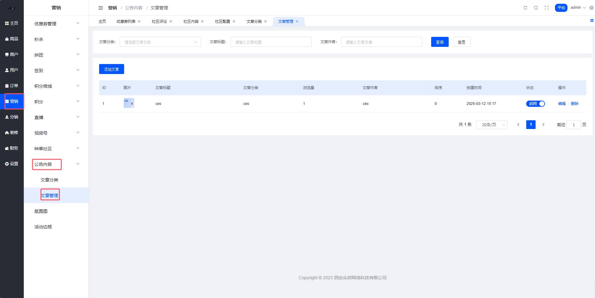
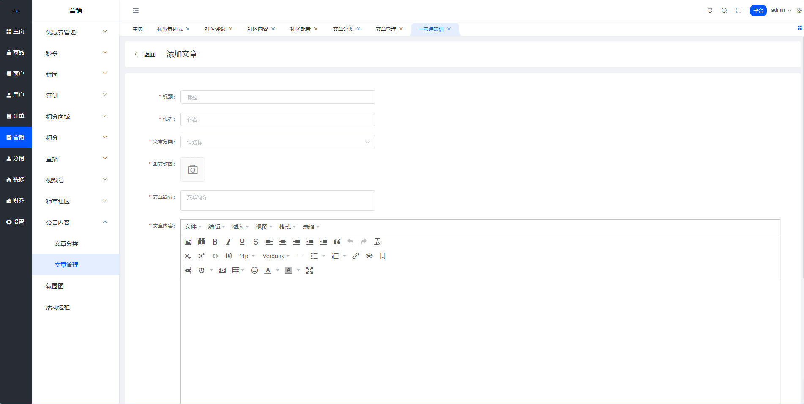

# 文章管理

> 种草归种草，正经内容还得靠文章。公告、资讯、帮助中心... 都在这儿管。

## 文章分类

文章分类就是给文章打标签，让用户能按分类找内容。

**路径**：平台后台 → 内容 → 文章分���

### 操作说明

- 新增分类：填个名字就行
- 编辑：改名、调排序
- 删除：分类下没文章才能删
- 显示/隐藏：控制前端是否展示这个分类

::: tip 设计思路
文章分类只有一级，没搞多级嵌套。简单粗暴，够用就行。
:::

### 移动端入口

路由：`/pages/goods/news_list/index`

## 文章内容

这里管理商城的资讯类内容，比如公告、活动说明、使用指南等。

**路径**：平台后台 → 营销 → 公告内容 → 文章管理

### 能干啥

- 新增文章：标题 + 内容 + 封面图 + 选分类
- 编辑：随时改随时发
- 删除：不要了就删
- 显示/隐藏：控制是否在前端展示

::: warning 文章 vs 种草
- **文章**：平台官方发布，单向输出，用户只能看
- **种草**：用户 UGC 内容，可以互动评论

两者是互补关系，不是替代关系。
:::
