# 氛围图与活动边框

## 活动氛围图

### 一、功能介绍

活动氛围图是添加在商品详情主图上的一种渲染活动气氛与效果的图，是运营的好工具，在平台后台设置，移动端和PC端商品详情页商品主图展示效果。

**路径**：平台端 > 营销 > 氛围图

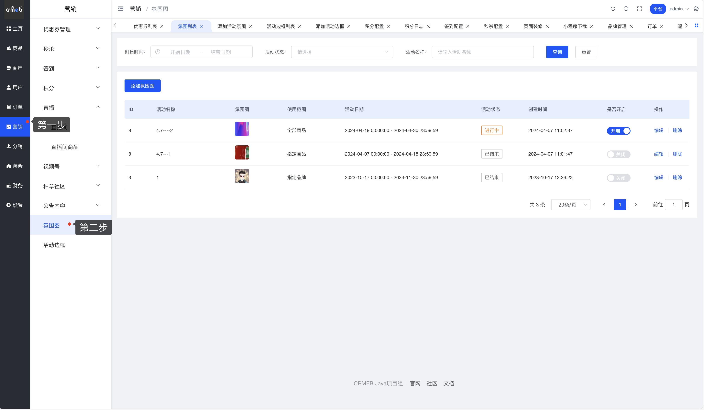

### 二、操作流程

**第一步**：添加活动氛围图

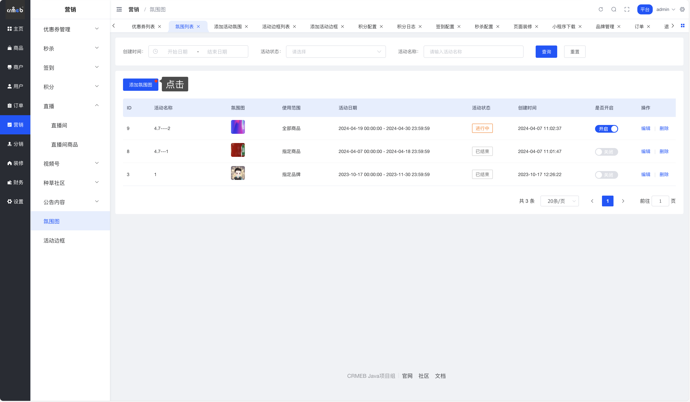

**第二步**：设置活动名称、氛围图展示时间、添加氛围图

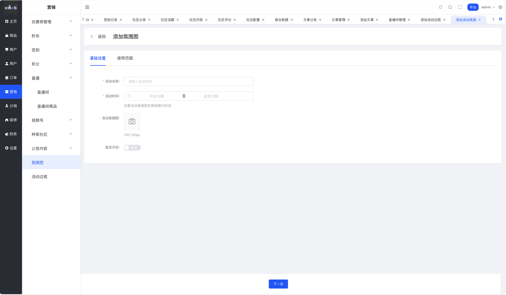

**第三步**：选择需要展示氛围图的商品

说明：可选择全部商品、可指定选择某个商品、可按商品分类选择、可选择指定商户参与、可指定品牌参与

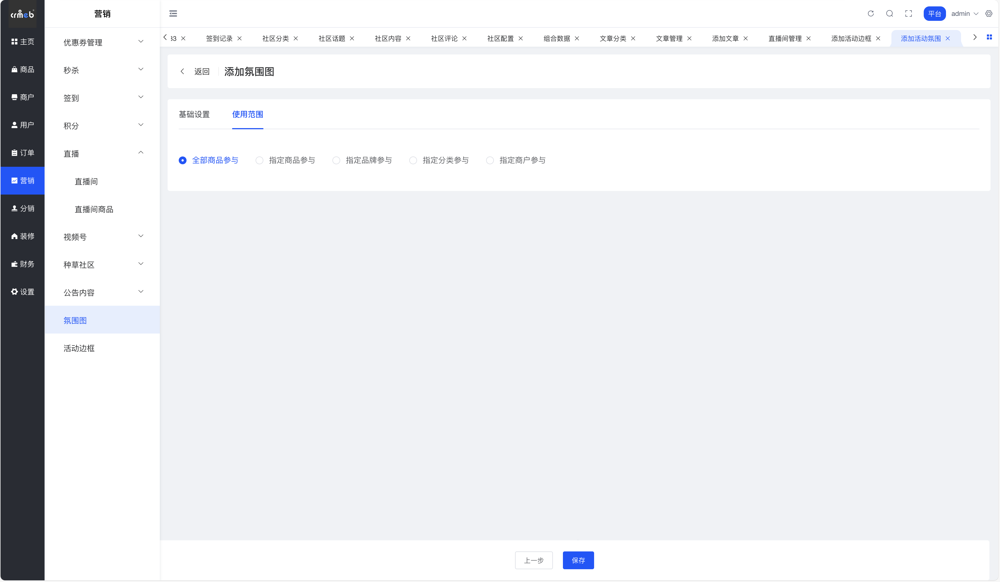

### 三、移动端展示

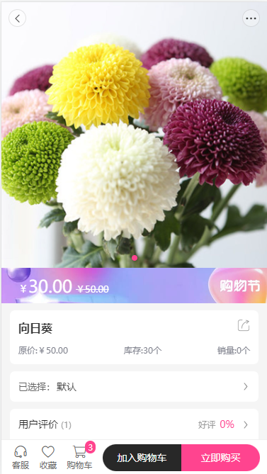

### 四、PC商城展示

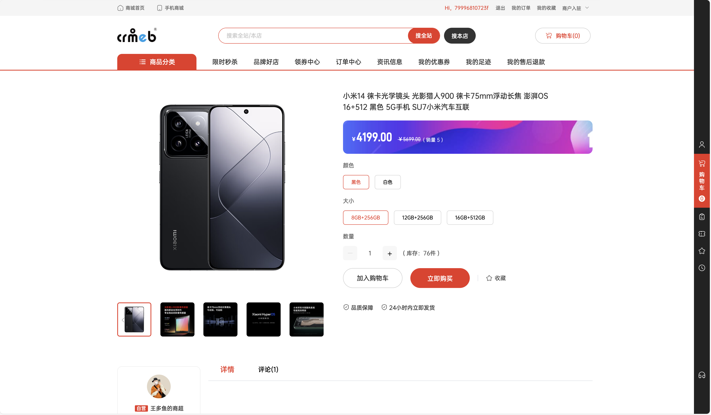

## 活动边框图

### 一、功能介绍

活动边框图是在商品列表的商品图上添加的一种渲染活动气氛与效果的边框图，增加商城节日活动气氛，在平台后台设置，移动端和PC端商品列表页展示效果。

**路径**：平台端 > 营销 > 活动边框

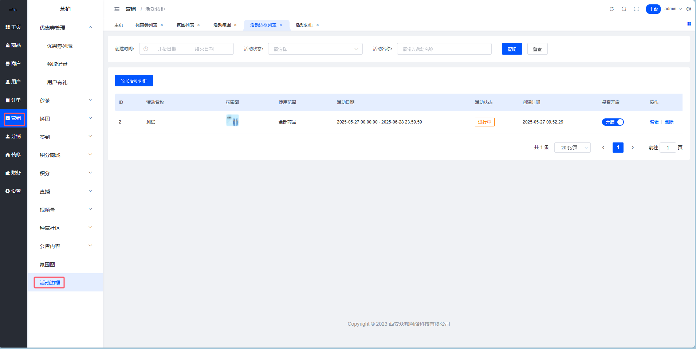

### 二、操作流程

**第一步**：添加边框图

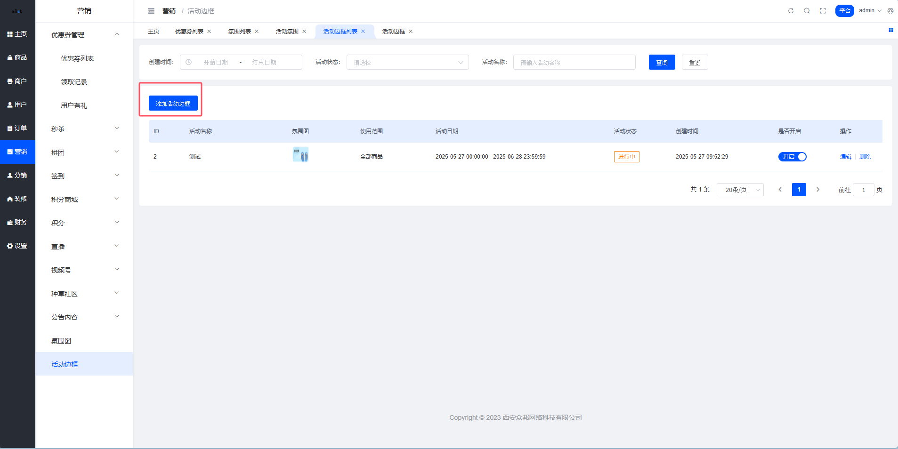

**第二步**：设置活动名称、活动边框图展示时间、添加活动边框图

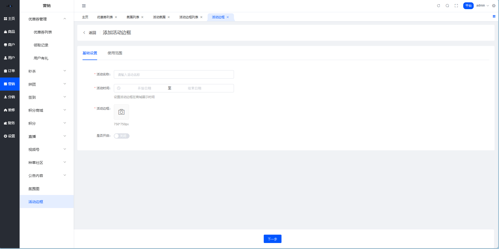

**第三步**：选择需要展示边框图的商品

说明：可选择全部商品、可指定选择某个商品、可按商品分类选择、可选择指定商户参与、可指定品牌参与

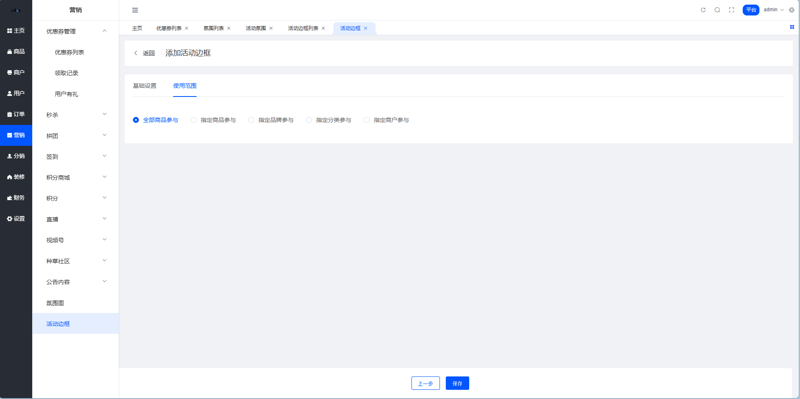

### 三、移动端展示

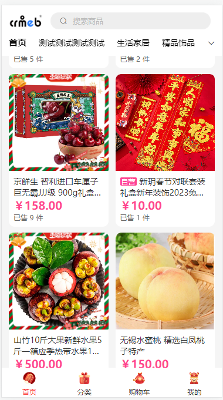

### 四、PC商城展示

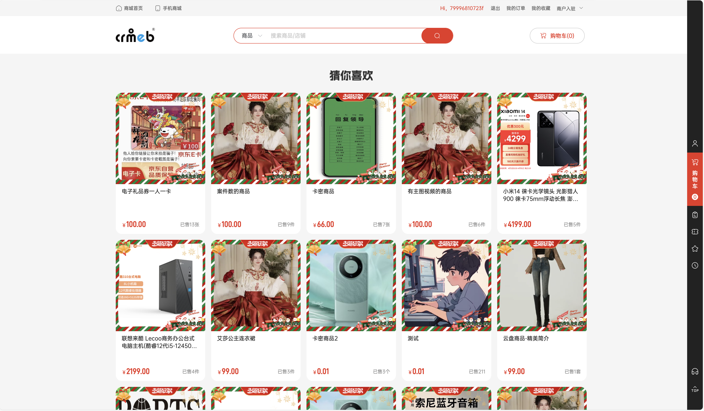
