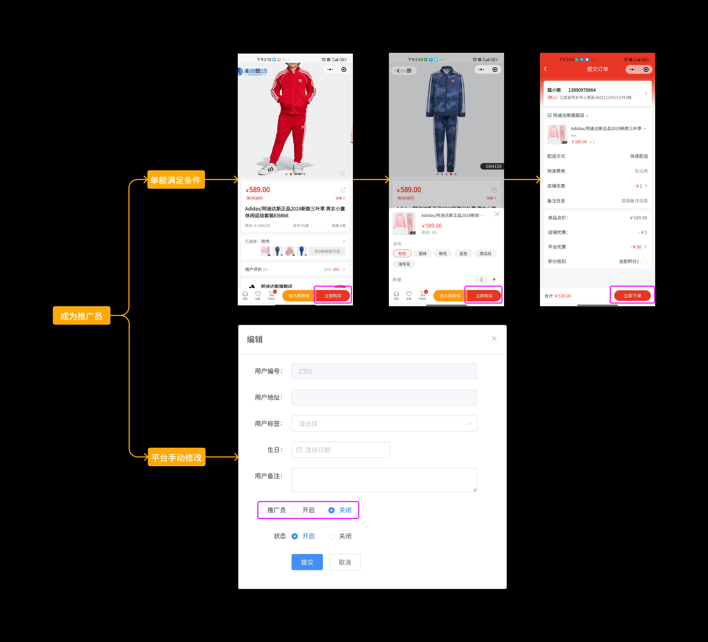
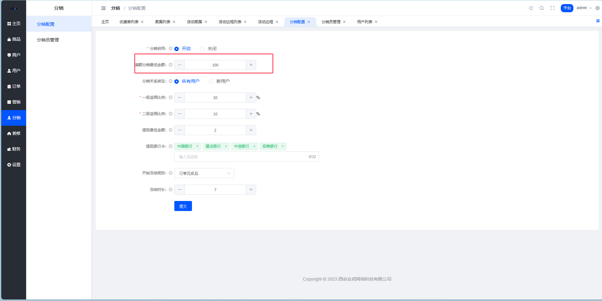
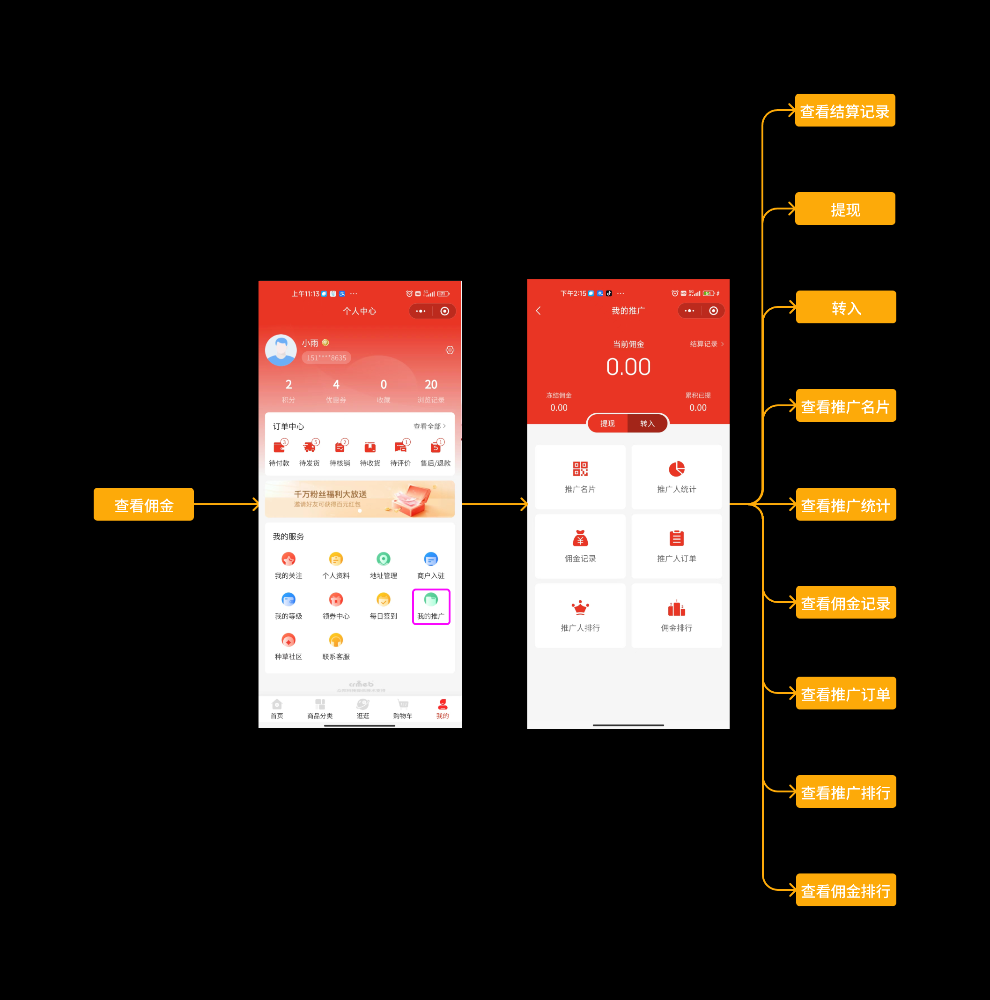
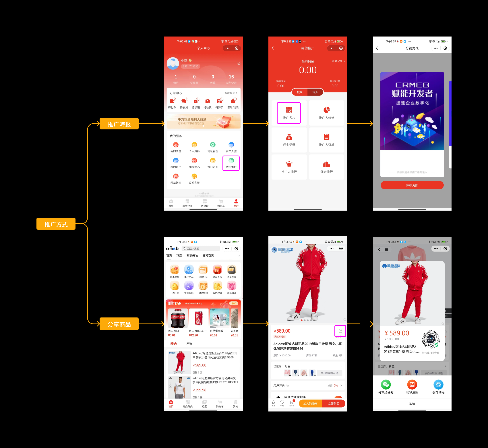
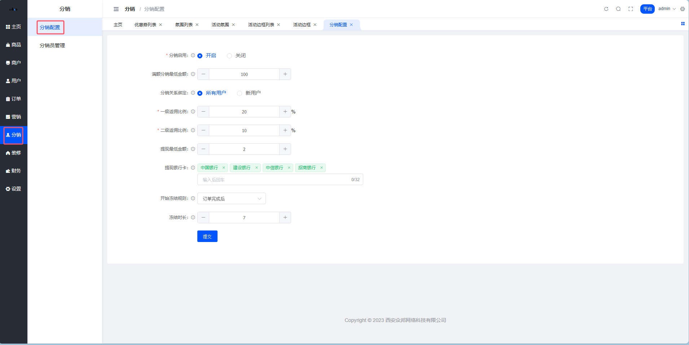
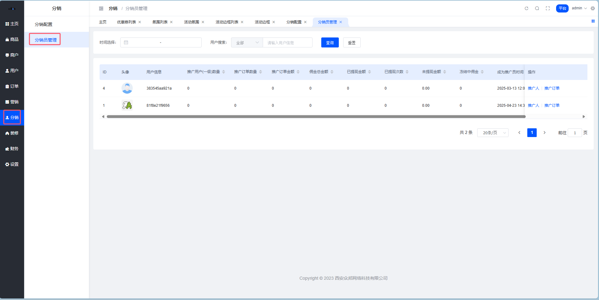
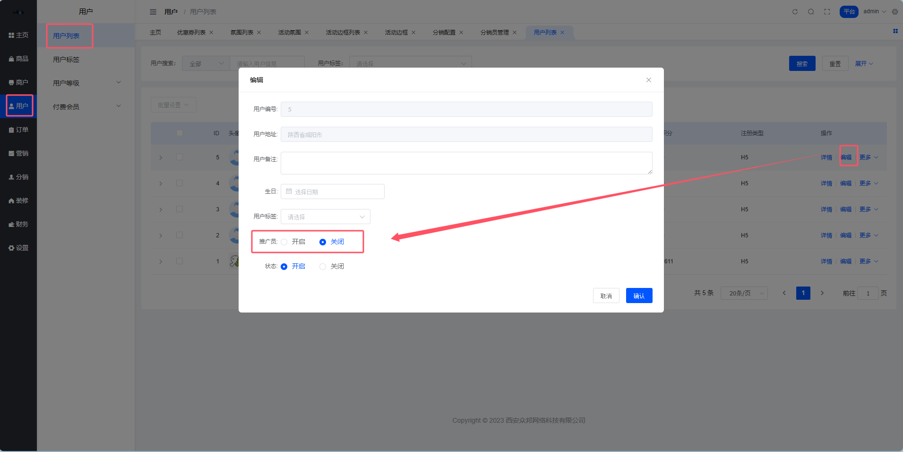
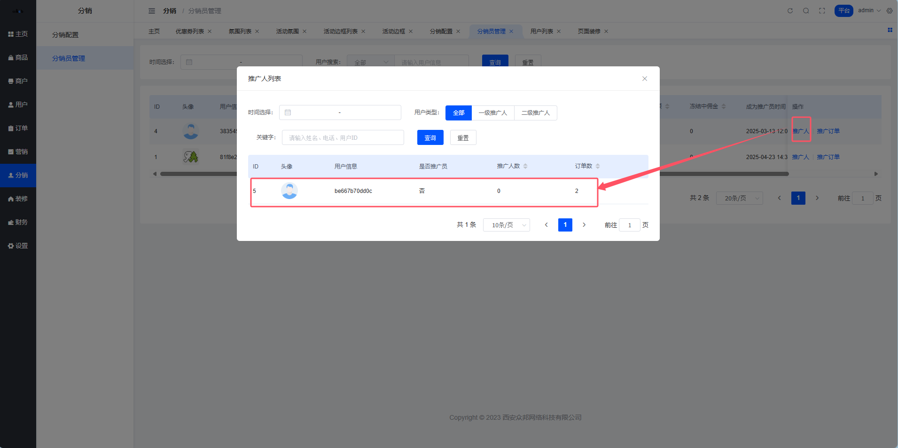
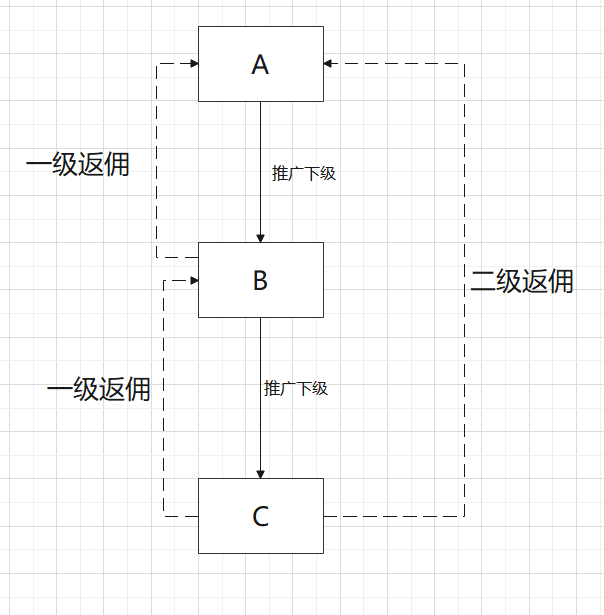

# 分销管理

> 让用户帮你卖货，还心甘情愿。这不是 PUA，这是分销。

## 分销是个啥？

分销的核心逻辑很简单：**你帮我卖货，我给你分钱。**

用户成为推广员后，分享商品给朋友，朋友下单了，推广员就能拿到佣金。这套玩法能让商城的销售网络像病毒一样扩散（当然是好的那种病毒）。

系统支持**二级分销**：
- 一级：你直接发展的人买东西，你拿一级佣金
- 二级：你发展的人再发展的人买东西，你拿二级佣金

> 别想了，三级以上涉及传销，系统不支持，法律也不允许。



## 用户怎么成为推广员？

两种途径：

### 平台直接开通

管理员在后台手动给用户开推广员权限，简单粗暴。适合邀请 KOL、大客户这种精准人群。

### 自动触发

用户下单金额达到设定门槛，自动升级为推广员。比如设置「消费满 100 元自动成为推广员」，用户买完东西发现自己还能赚佣金，惊喜感拉满。



## 推广员能干嘛？

### 查看推广数据

看看自己发展了多少下线、赚了多少佣金、还有多少在冻结中。



### 分享赚钱

- 生成专属推广海报，发朋友圈
- 分享商品详情页，带上自己的推广参数
- 新用户 / 未绑定上级的用户扫码后，自动绑定推广关系



## 分销配置

**路径**：平台后台 → 分销 → 分销配置



### 配置项详解

| 参数 | 这是干嘛的 |
| --- | --- |
| 分销开关 | 总开关，关了全站分销停摆 |
| 满额分销最低金额 | 消费满多少自动成为推广员。设成 -1 表示关闭自动开通，只能手动分配 |
| 分销关系绑定 | 「所有用户」= 没上级的都能被发展；「新用户」= 只有新注册的能被发展 |
| 一级返佣比例 | 直推用户下单，返多少个点。5 = 返 5% |
| 二级返佣比例 | 间推用户下单，返多少个点 |
| 提现最低金额 | 攒够多少才能提 |
| 提现银行卡 | 支持哪些银行提现 |
| 冻结规则 | 从哪个节点开始算冻结期：支付后 / 收货后 / 完成后 |
| 冻结时间 | 冻结多少天，过了才能提现 |

::: danger 敲黑板
一级 + 二级返佣比例之和 + 商户手续费，加起来不能超过 100%。不然钱从哪儿来？
:::

## 分销员管理

**路径**：平台后台 → 分销 → 分销员管理



### 开通分销员

**方式一**：后台直接开

在用户列表里找到用户，打开分销开关。



**方式二**：满额自动开

用户下单达到门槛，系统自动开通。


### 查看分销数据

点击推广人数，可以看到这个分销员发展了哪些下线、团队结构是怎样的。



::: tip 关于改绑
修改用户的上级推广人后，只影响之后的订单。之前的订单佣金归属不变。
:::

## 分销规则详解

### 返佣逻辑

假设 A 推广了 B，B 推广了 C：

| 谁下单 | A 拿什么 | B 拿什么 |
| --- | --- | --- |
| A 买东西 | 自己买不返佣 | — |
| B 买东西 | 一级佣金 | 自己买不返佣 |
| C 买东西 | 二级佣金 | 一级佣金 |



### 什么情况不返佣？

- 用户不是推广员（指定分销模式下）
- 商品售价为 0
- 拼团、砍价、秒杀等营销活动商品
- 买了但还没确认收货

### 商品返佣两种模式

**默认返佣**：全站统一比例
```
一级佣金 = 成交价 × 一级比例
二级佣金 = 成交价 × 二级比例
```

**商品单独返佣**：某些商品想设置不同的佣金比例，可以在商品详情里单独配置。单独设置的优先级更高。

### 佣金冻结机制

佣金不是即时到账的，要先冻结一段时间：
- 冻结期从获得佣金时开始计算
- 过了冻结期才能提现
- 冻结期设为 0 = 不冻结，立即可提

> 为什么要冻结？防止「买了就退」薅佣金。冻结期内退款，佣金直接收回。

### 推广关系怎么绑定？

| 渠道 | 绑定方式 |
| --- | --- |
| 公众号 / 小程序 | 扫推广海报二维码、打开分享的商品链接 |
| H5 商城 | 扫海报、打开分享链接 |

绑定条件：
- 用户必须授权登录（H5 需注册）
- 用户没有上级
- 用户自己不是推广员

> 老用户之前没上级？现在扫码也能绑。

### 解除推广关系

上下级关系解除后：
- 之前产生的推广订单记录保留
- 之后这个下线买东西，就跟你没关系了

::: warning 总结一句话
分销的核心是利益分配。设计好佣金比例、冻结规则、绑定逻辑，剩下的就交给用户自己玩去吧。
:::
