# 页面装修

> 不会写代码也能搭页面？没错，拖拖拽拽就完事了 🎨

## 这玩意儿能干嘛？

页面装修 = **可视化页面搭建工具**。

你可以像搭积木一样，把各种组件拖到页面上，调调样式、改改内容，一个商城首页就出来了。不用写一行代码，运营同学也能玩得转。

系统支持两种页面装修：
- **商城首页 DIY**：用户进来第一眼看到的页面
- **微页面 DIY**：自定义的落地页，可以用在活动、专题等场景

## 谁会用到这个？ 🤔

### 对技术人员

省去了从零搭页面的体力活，专注业务逻辑就行。页面改版？让运营自己折腾去吧（划掉）

### 对运营人员

终于不用求着开发改页面了！活动上线、首页调整、Banner 更换... 自己动手，丰衣足食。

### 平台装修 vs 店铺装修

| 类型 | 谁来装修 | 装修范围 |
| --- | --- | --- |
| 平台装修 | 平台运营 | 商城首页、平台级微页面 |
| 店铺装修 | 商家自己 | 店铺首页、店铺级微页面 |

## DIY 组件大全 🧩

### 怎么用？

直接从左边组件列表 **拖拽** 到中间画布区域，就这么简单。

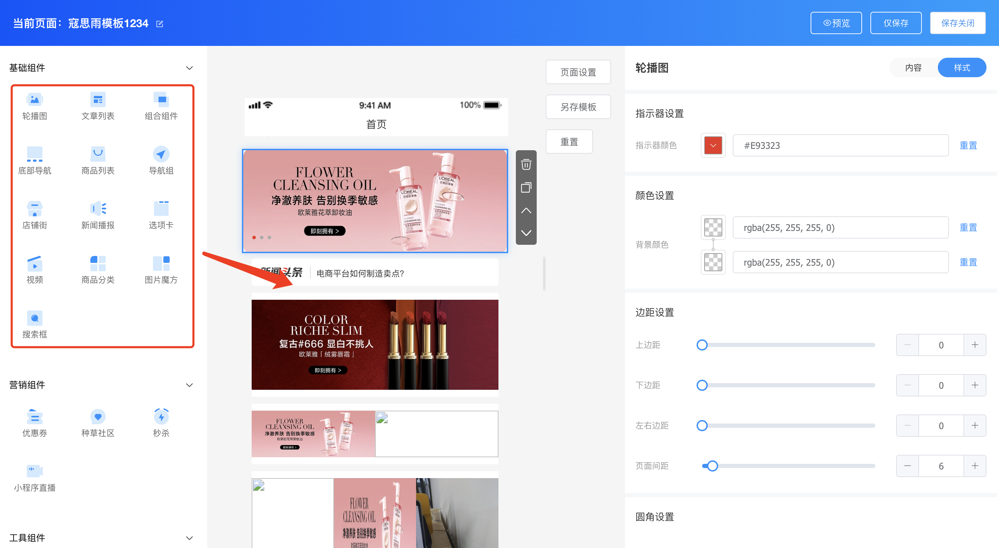

### 组件设置

每个组件都有两个设置维度：

| 维度 | 能设置啥 |
| --- | --- |
| 内容 | 组件展示什么数据、链接到哪里 |
| 样式 | 颜色、边距、圆角等视觉效果 |

### 平台端组件清单

| 类型 | 包含组件 |
| --- | --- |
| 基础组件 | 轮播图、文章列表、头部组件、底部导航、商品列表、导航组、店铺街、新闻播报、选项卡、视频、商品分类、图片魔方、搜索框、热区 |
| 营销组件 | 优惠券、种草社区、秒杀、小程序直播、拼团 |
| 工具组件 | 标题、辅助空白、辅助线、富文本 |

### 商家端组件清单

| 类型 | 包含组件 |
| --- | --- |
| 基础组件 | 轮播图、头部组件、底部导航、商品列表、导航组、选项卡、视频、图片魔方、搜索框、热区 |
| 营销组件 | 优惠券、秒杀、拼团 |
| 工具组件 | 标题、辅助空白、辅助线、富文本 |

> 商家端比平台端少了一些组件，比如店铺街、种草社区这些平台级功能。

## 开始装修 🛠️

**路径**：装修 → 页面装修

### 首页装修

**Step 1**：点击【装修】按钮，进入 DIY 编辑页面

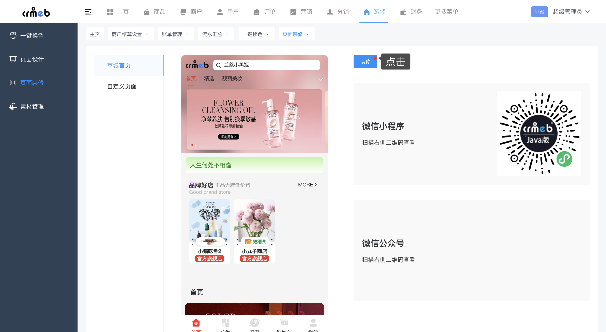

**Step 2**：左边选组件 → 拖到中间画布 → 右边调设置

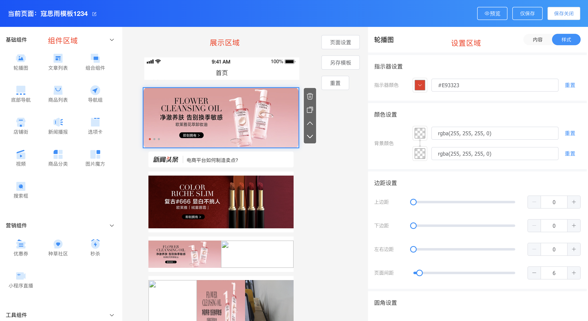

就这么简单，所见即所得 ✨

### 微页面装修

微页面 = 自定义落地页。做活动、做专题、做会员中心... 都可以用微页面。

**Step 1**：点击【添加】或【编辑】按钮

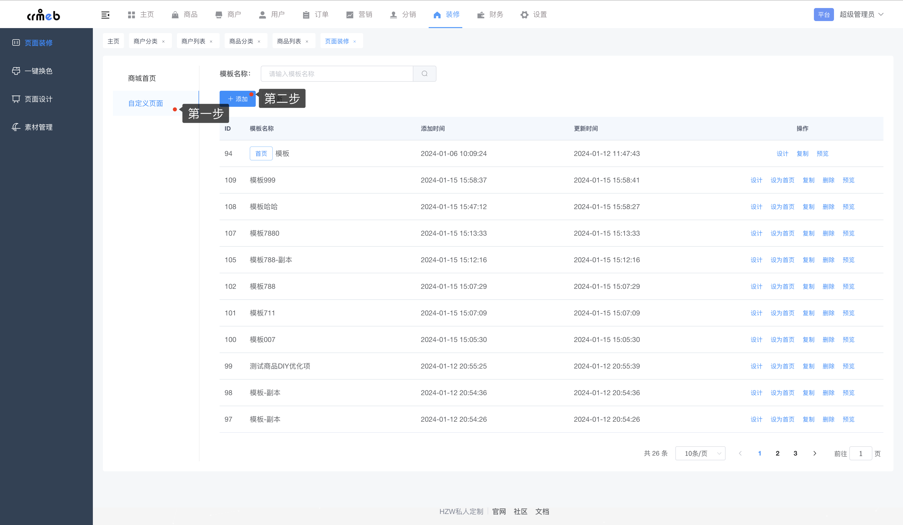

**Step 2**：操作方式和首页装修一毛一样

### 顶部按钮都是干嘛的？

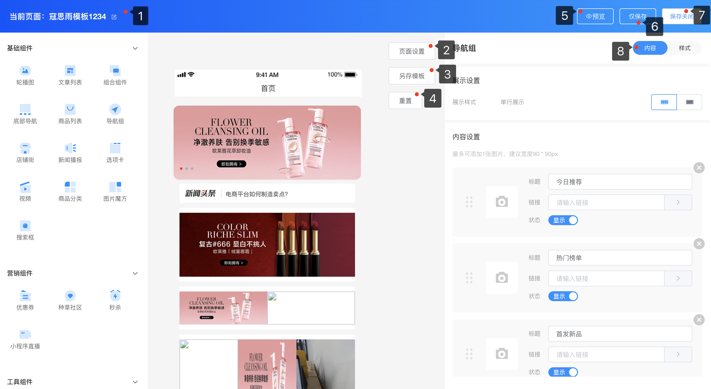

| 按钮 | 功能 |
| --- | --- |
| 当前页面编辑 | 改模板名称 |
| 页面设置 | 设置页面整体属性 |
| 另存模版 | 复制一份新模板出来 |
| 重置 | 恢复到上次保存的状态（后悔药💊） |
| 预览 | 扫码用手机看效果 |
| 仅保存 | 保存但不关闭编辑器 |
| 保存关闭 | 保存并关闭 |
| 内容/样式 | 切换组件的内容设置和样式设置 |

## 热区：图片也能点 🔥

热区是个神奇的组件：一张图片上可以设置多个点击区域，每个区域跳转到不同的页面。

适合做：活动主图、楼层导航、品牌墙...

### 怎么设置？

**Step 1**：拖拽「热区」组件到画布

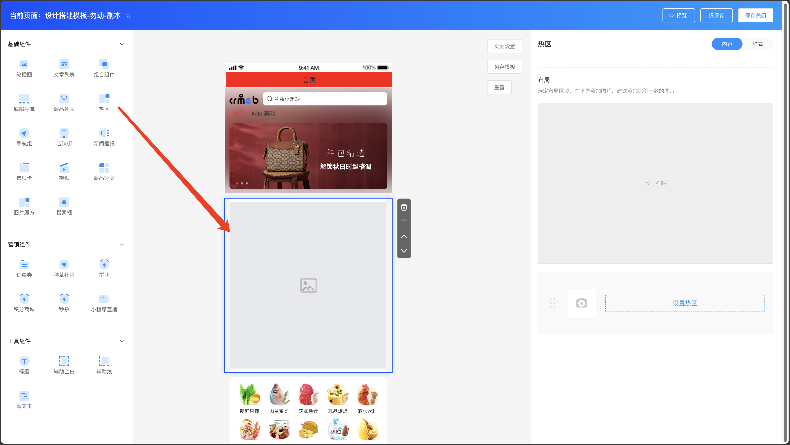

**Step 2**：上传一张图片

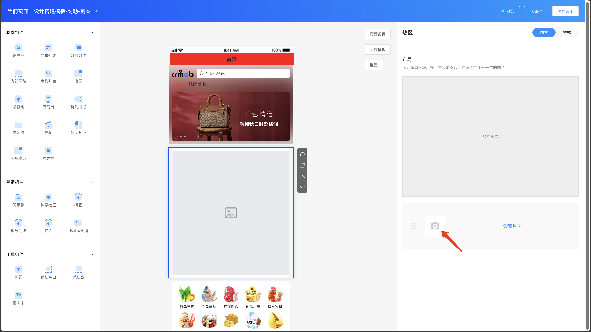

**Step 3**：点击【设置热区】

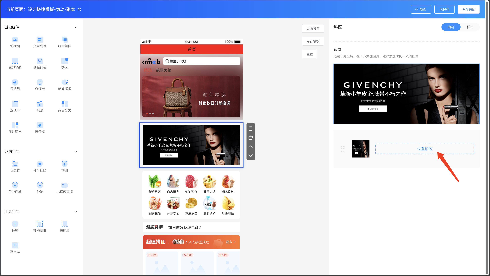

**Step 4**：在图片上用鼠标框选点击区域

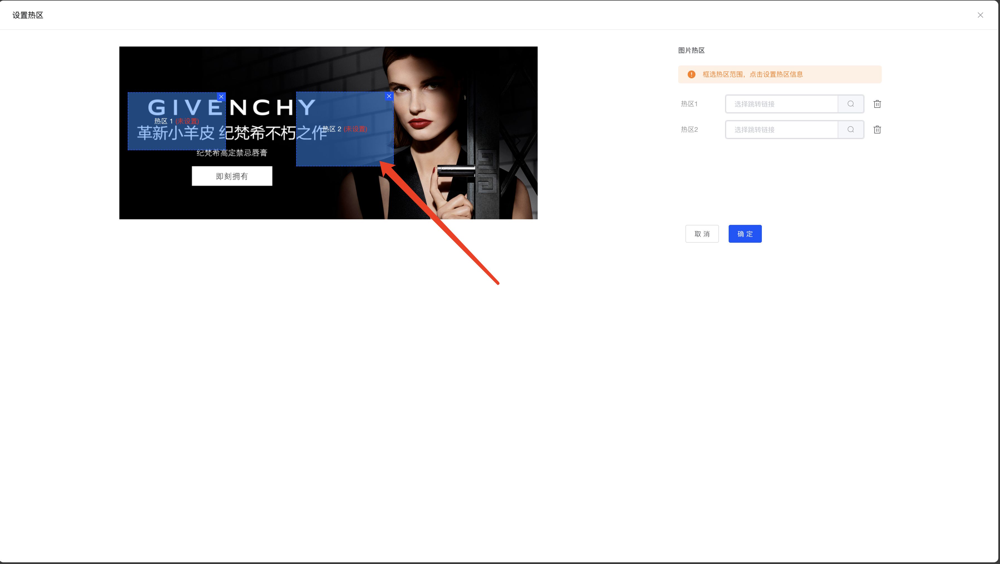

**Step 5**：设置这个区域要跳转到哪里

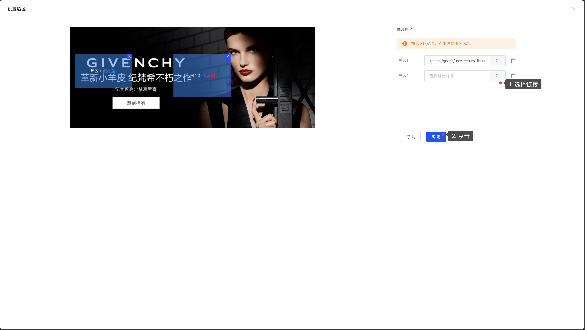

搞定！用户点击这个区域就会跳转到指定链接。

## 组件颜色自定义 🎨

DIY 组件的颜色默认跟随主题色，但你也可以单独设置。

**支持自定义颜色的组件**：

| 组件 | 可自定义的颜色 |
| --- | --- |
| 轮播图 | 指示器颜色 |
| 头部组件 | 指示器颜色 |
| 商品列表 | 商品价格颜色 |
| 选项卡 | 选中颜色、价格颜色 |
| 商品分类 | 选中颜色 |
| 优惠券 | 金额颜色、领取按钮、背景色 |
| 拼团 | 价格、标签、按钮颜色 |
| 秒杀 | 价格颜色 |
| 积分商城 | 价格颜色 |
| 底部导航 | 选中颜色 |
| 店铺街 | 标签背景、价格颜色 |

**示例**：轮播图颜色设置

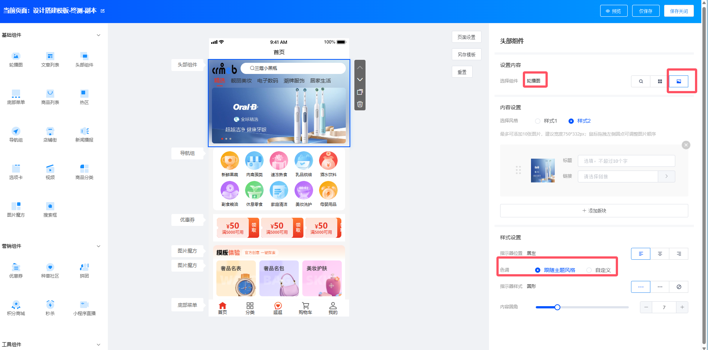

## 头部组件圈层 👑

头部组件支持根据用户圈层展示不同内容，VIP 用户看到的和普通用户不一样。

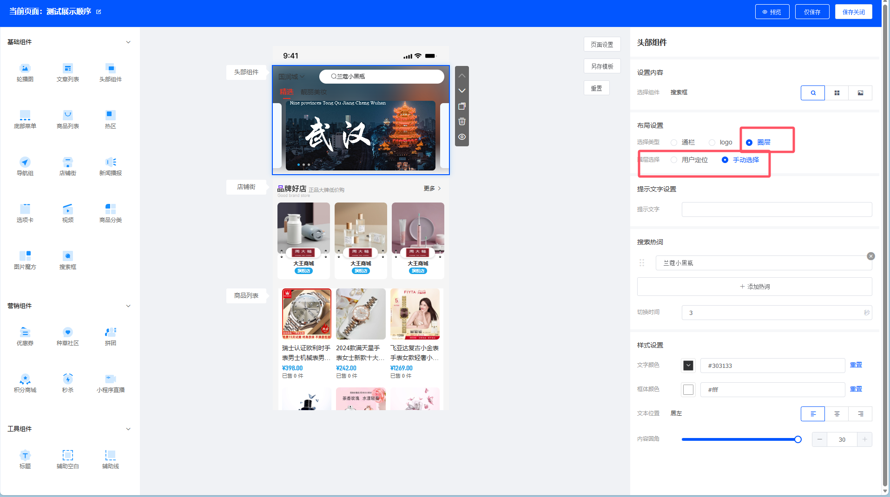

**商户端轮播图示例**：

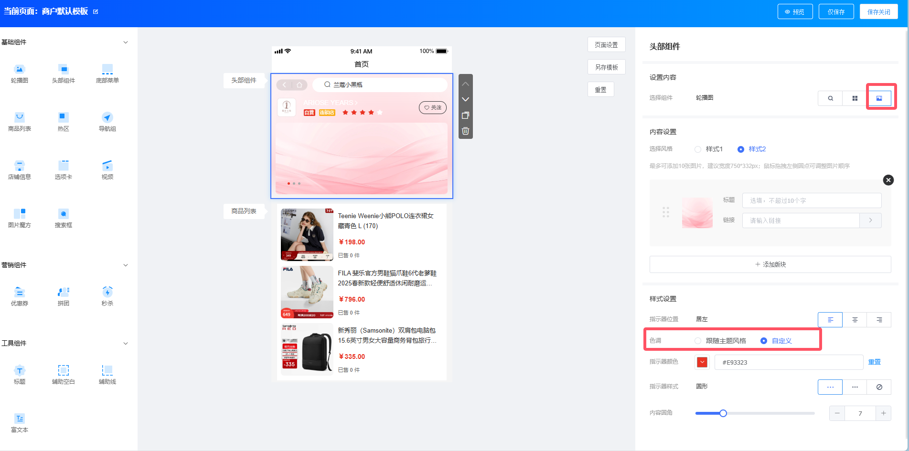

::: tip 小技巧
- 装修前先想好页面结构，别上来就拖组件
- 善用「预览」功能，手机上看看实际效果
- 重大改动前先「另存模版」，留条后路
:::
