# 装修工具箱

> 换个颜色换个心情，商城也要有点仪式感 🎨

## 一键换色

商城主题色一成不变？太无聊了！

一键换色让你的商城秒变「变色龙」—— 双11 用红色、618 用橙色、春节用金色... 配合节日氛围，转化率都能高一截。

**路径**：平台后台 → 装修 → 一键换色

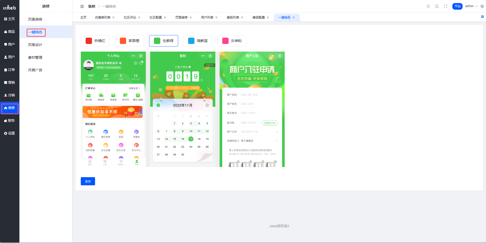

### 系统内置 5 套配色 🌈

选一个，保存，H5/小程序刷新一下就生效了。

**热情红** —— 大促必备，刺激消费

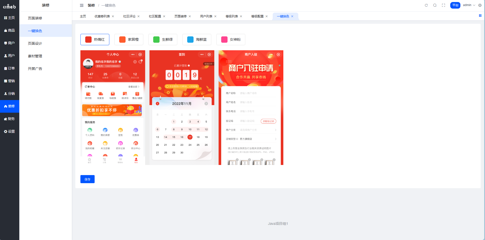

**家居橙** —— 温馨居家风

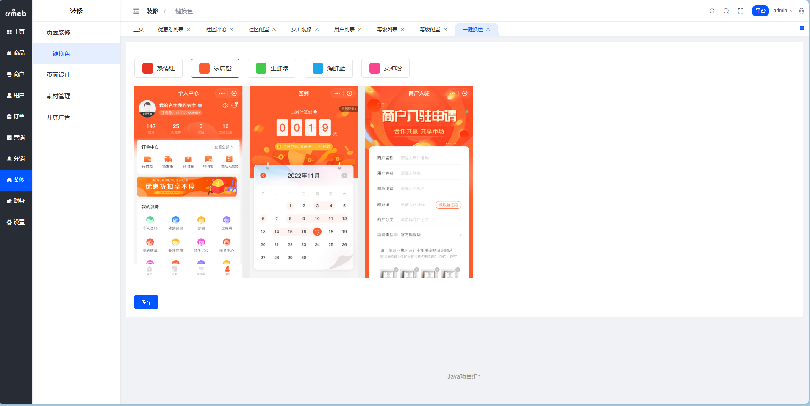

**生鲜绿** —— 健康、新鲜、有机

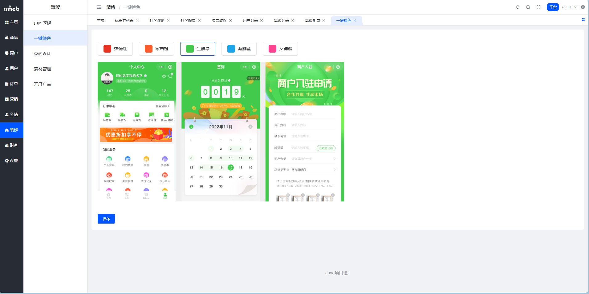

**海鲜蓝** —— 清新、海洋、水产

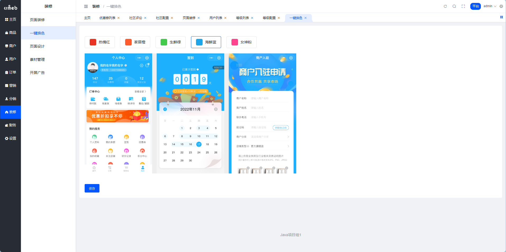

**女神粉** —— 美妆、母婴、少女心

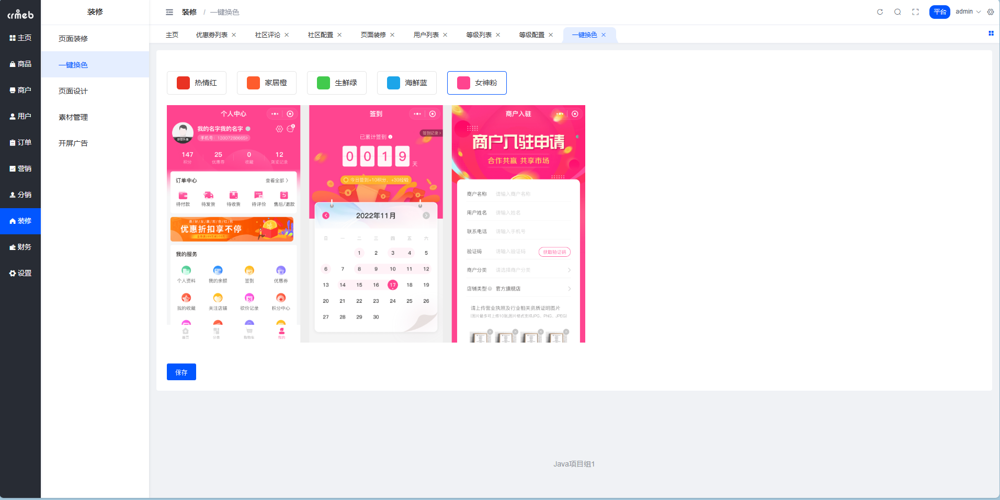

::: tip 小技巧
不同行业用不同色系：生鲜用绿、美妆用粉、3C 用蓝... 这是有心理学依据的 🧠
:::

## 页面设计

这个功能不是 DIY，而是**快捷设置入口**。

把一些常用的页面配置（底部菜单、个人中心轮播图、我的服务入口等）做成了可视化界面，不用去组合数据里翻来翻去了。

**路径**：平台后台 → 设置 → 页面管理 → 页面设计

### 能配置啥？

| 模块 | 说明 |
| --- | --- |
| 底部菜单 | 首页、分类、购物车、我的... 这些 Tab |
| 个人中心轮播图 | 「我的」页面顶部的 Banner 位 |
| 我的服务入口 | 订单、优惠券、收藏等快捷入口 |

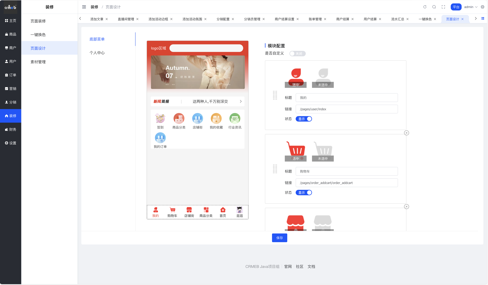

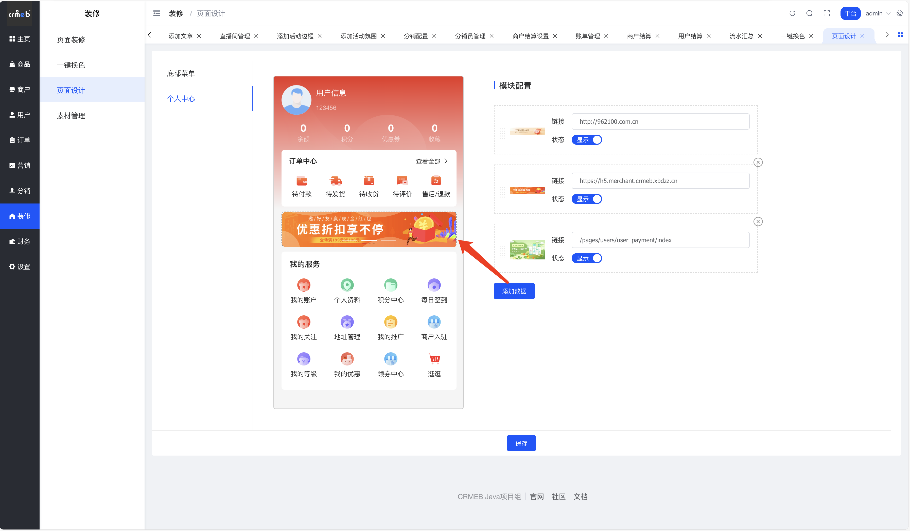

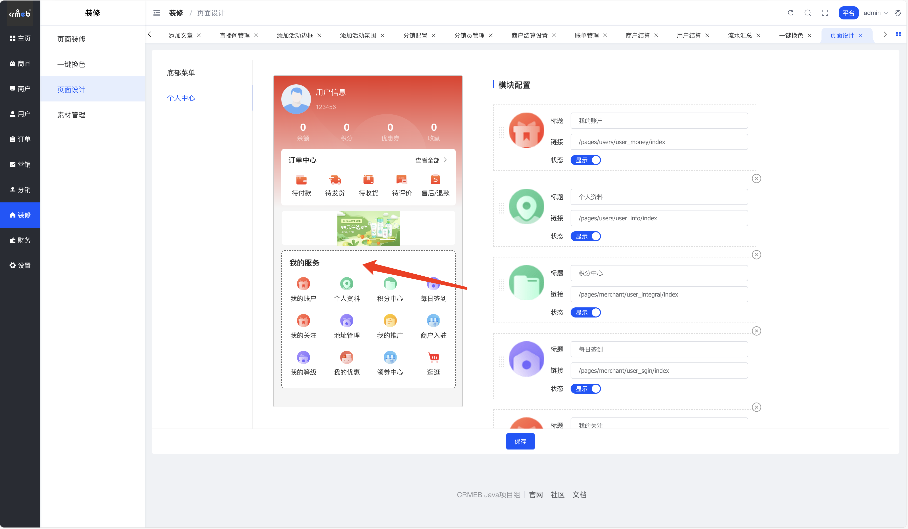

::: warning 注意
页面设计里嵌入的是真实移动端页面，能点能跳，但**不建议在这里下单**—— 这是给你预览用的，不是给你购物用的 😅
:::

## 素材管理

系统里上传的图片都在这里管理。相当于商城的「相册」。

### 平台端

**路径**：平台后台 → 装修 → 素材管理

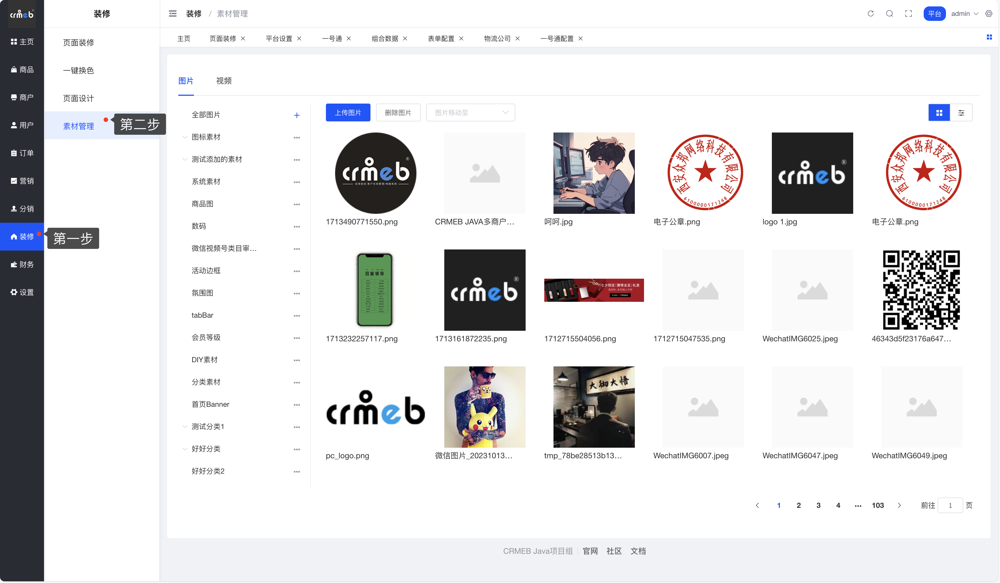

### 商户端

**路径**：商户后台 → 维护 → 素材管理

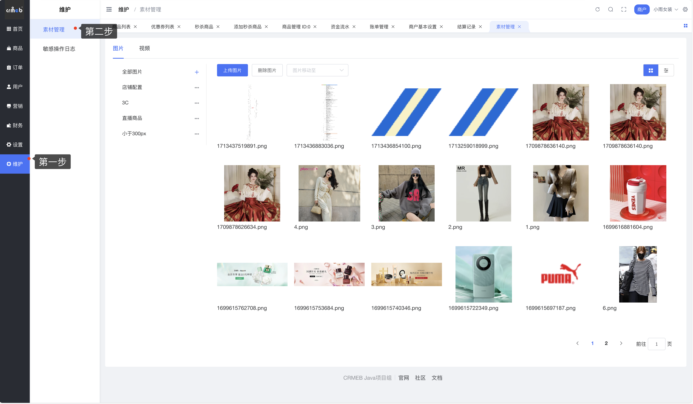

### 能干嘛？

- 📁 分类管理：给图片建文件夹，不然一堆图找起来头疼
- 🖼️ 上传图片：支持批量上传
- 🗑️ 删除图片：不要的图片清理掉
- 📦 移动分类：图片放错文件夹了？拖过去就行

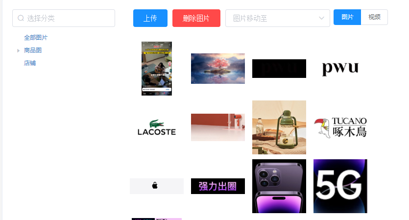

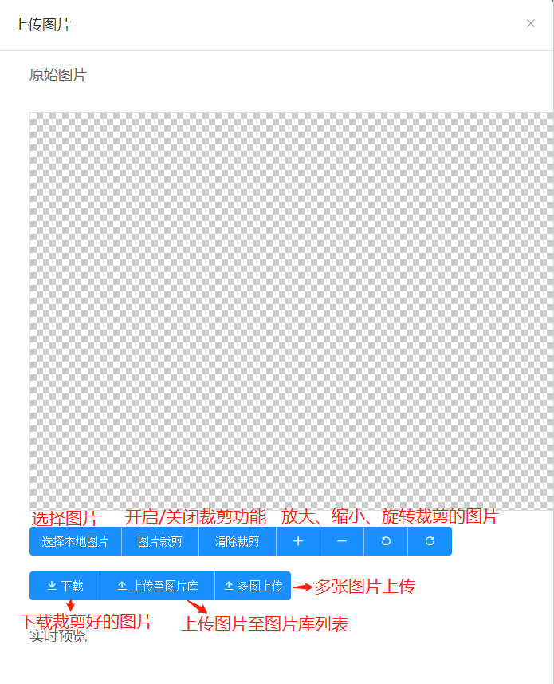

::: tip 建议
- 按用途建分类：Banner、商品图、活动图、图标...
- 定期清理不用的图片，别让「相册」变成「垃圾场」
:::

## 开屏广告

用户打开 App/小程序，第一眼看到的就是开屏广告。黄金位置，必须安排上！

**路径**：平台后台 → 装修 → 开屏广告

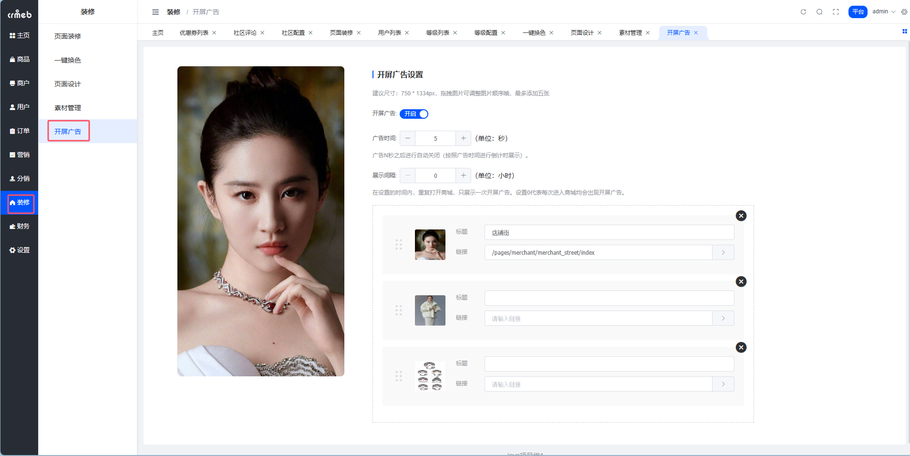

### 配置说明

| 参数 | 这是干嘛的 |
| --- | --- |
| 广告图片 | 支持静态图和动图（GIF），尺寸建议 750×1334 |
| 展示间隔 | 多久展示一次？比如设 24 小时，那用户一天内重复打开只看一次 |
| 广告时间 | 广告展示几秒？会有倒计时，用户也可以点「跳过」 |

### 用户端效果

用户打开商城，先看广告，倒计时结束自动进入首页。着急的用户可以点右上角「跳过」。

::: warning 别太贪心
- 广告时间别设太长，5 秒差不多了，用户没那么多耐心
- 展示间隔别设太短，不然用户会觉得烦
- 广告内容要有吸引力，不然这几秒就白费了
:::
