# 结算管理

> 做生意嘛，最后都要落到一个字：钱 💰

## 这是个啥？

结算管理 = **把该给的钱给出去**。

系统里有两类人需要结算：
- **商户**：卖了货，要从平台拿钱
- **用户（分销员）**：推广了商品，要提佣金

两边的流程差不多：申请 → 审核 → 打款。平台作为中间人，负责审核和转账。

## 商户结算设置 ⚙️

在商户申请提现之前，平台需要先设置好规则。

**路径**：平台后台 → 财务 → 商户结算设置

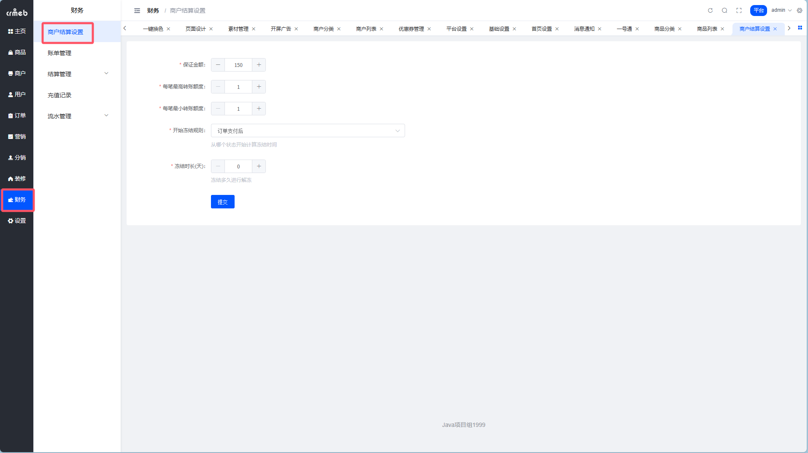

### 配置项说明

| 参数 | 这是干嘛的 |
| --- | --- |
| 保证金额 | 商户余额必须大于这个数才能提现，而且这笔钱提不走（相当于押金） |
| 每笔最高转账额度 | 单次提现上限，防止一次提太多 |
| 每笔最低转账额度 | 单次提现下限，太少的话就别折腾了 |
| 开始冻结规则 | 从哪个节点开始算冻结期：订单支付后 / 收货后 / 完成后 |
| 冻结时长 | 冻结多少天，过了才能提现 |

::: warning 关于保证金
保证金是平台的「安全垫」。万一商户跑路或者有售后纠纷，这笔钱可以用来兜底。金额设多少，根据业务风险自己定。
:::

## 商户结算流程 🏪

### Step 1：商户填写结算信息

商户要先在自己后台配置好收款账户，不然钱打给谁？

**路径**：商户后台 → 设置 → 商户基本设置 → 结算信息

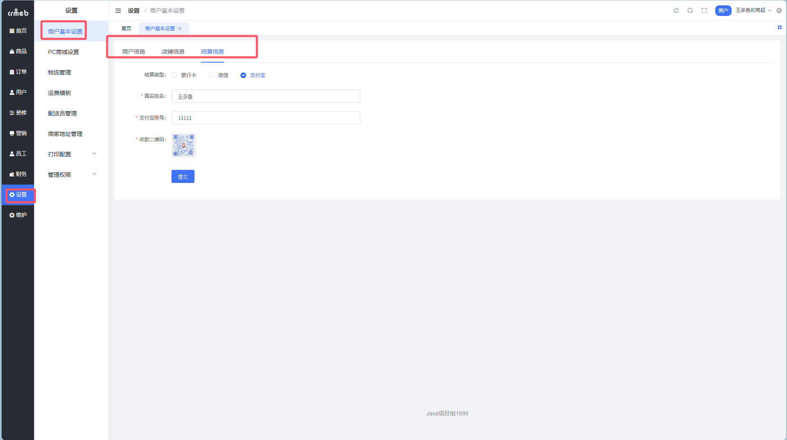

支持三种结算方式：
- 💳 银行卡
- 💚 微信
- 🔵 支付宝

### Step 2：商户申请结算

余额够了、冻结期过了，商户就可以申请提现了。

**路径**：商户后台 → 财务 → 结算记录 → 申请结算

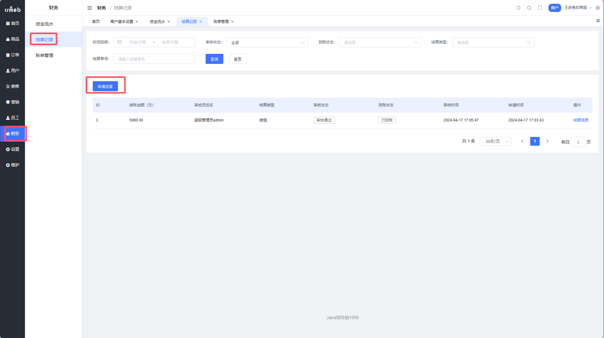

点击申请，填写提现金额：

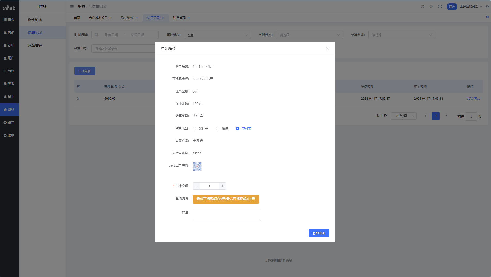

提交后可以在列表里看到申请记录，状态会显示「待审核」。

### Step 3：平台审核

商户申请后，平台这边会收到审核请求。

**路径**：平台后台 → 财务 → 结算管理 → 商户结算

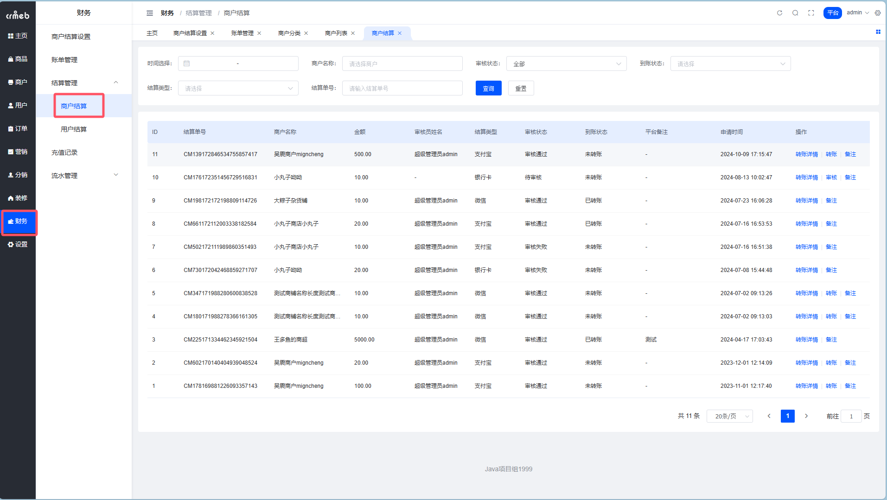

审核操作：

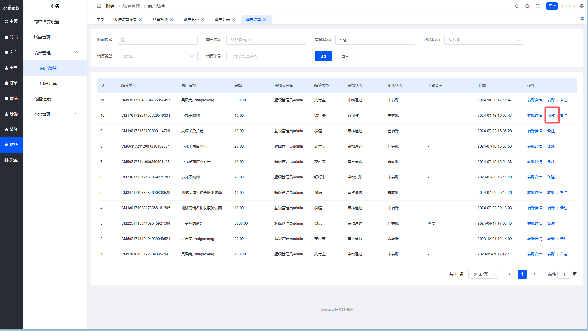

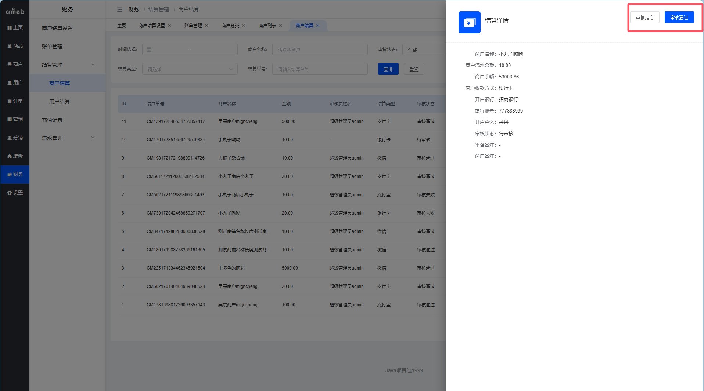

### Step 4：平台转账

审核通过后，平台需要手动转账给商户（线下操作），然后在系统里确认转账完成。

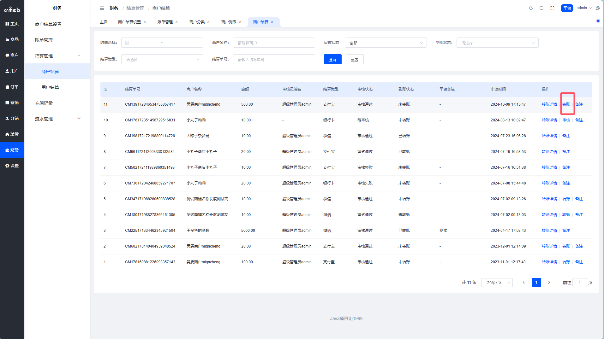

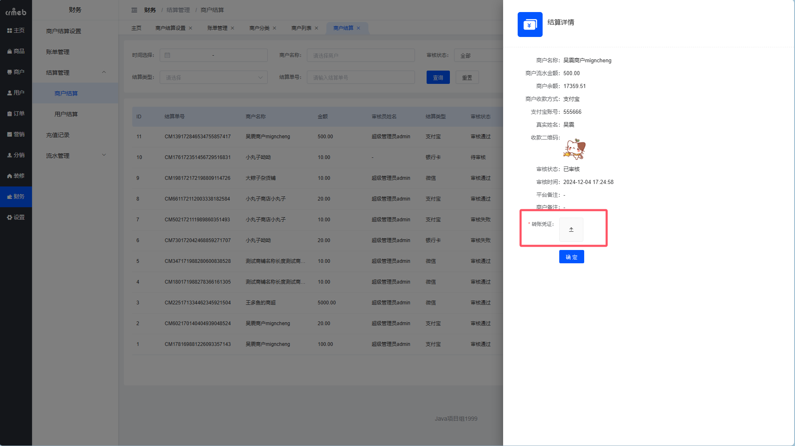

转账确认后，这笔结算就完成了 ✅

## 用户结算（分销佣金提现）👤

用户结算 = 分销员提佣金。推广赚的钱，终于可以拿出来了！

### 结算设置

用户结算的设置在分销配置里。

**路径**：平台后台 → 分销 → 分销配置

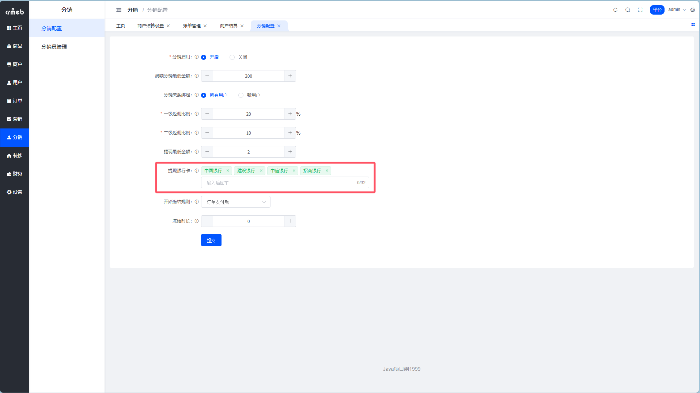

相关配置：
- **提现最低金额**：攒够多少才能提
- **提现银行卡**：支持哪些银行

### Step 1：用户申请提现

分销员在移动端申请。

**路径**：移动端 → 个人中心 → 我的推广 → 提现

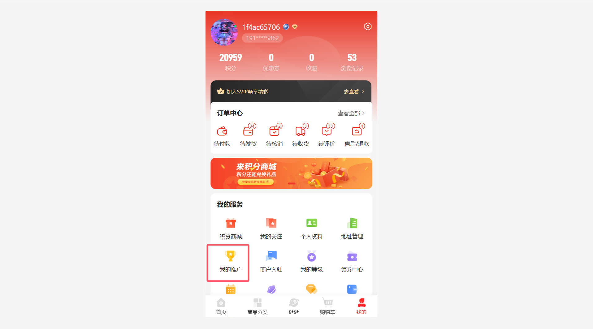

选择提现方式：
- 💳 银行卡
- 💰 余额（提到商城余额，可以继续购物）
- 💚 微信
- 🔵 支付宝

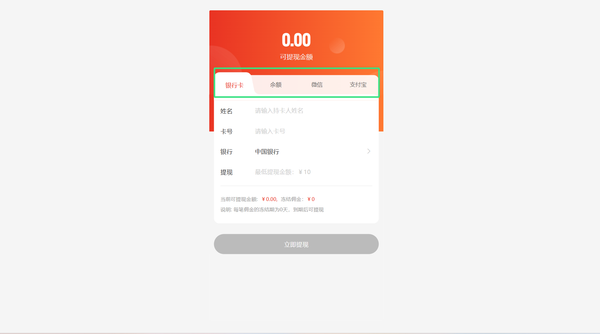

### Step 2：平台审核

用户提交后，平台收到审核请求。

**路径**：平台后台 → 财务 → 结算管理 → 用户结算

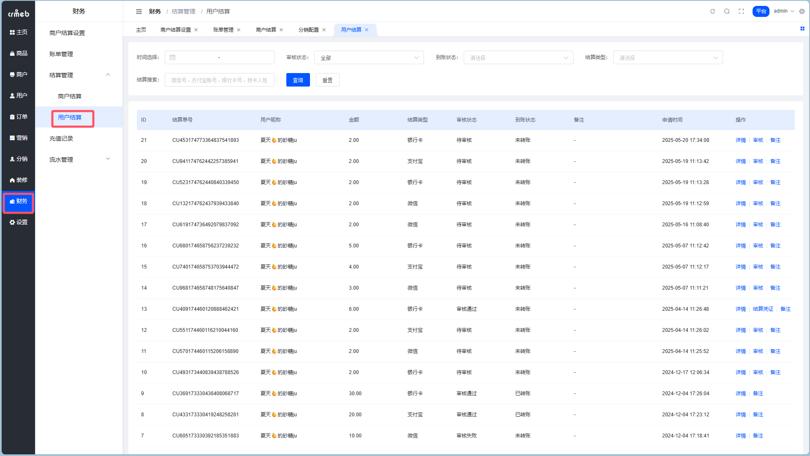

审核操作：

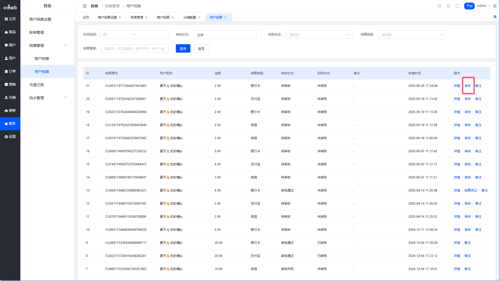

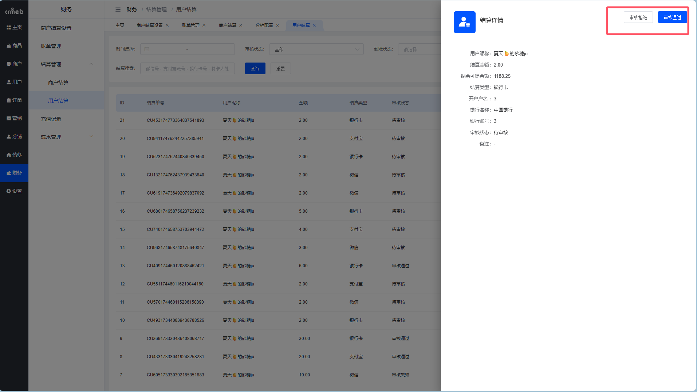

### Step 3：平台转账

审核通过后，转账给用户。

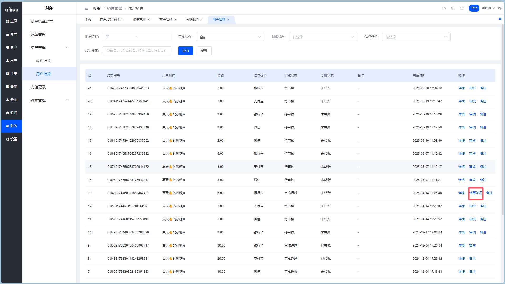

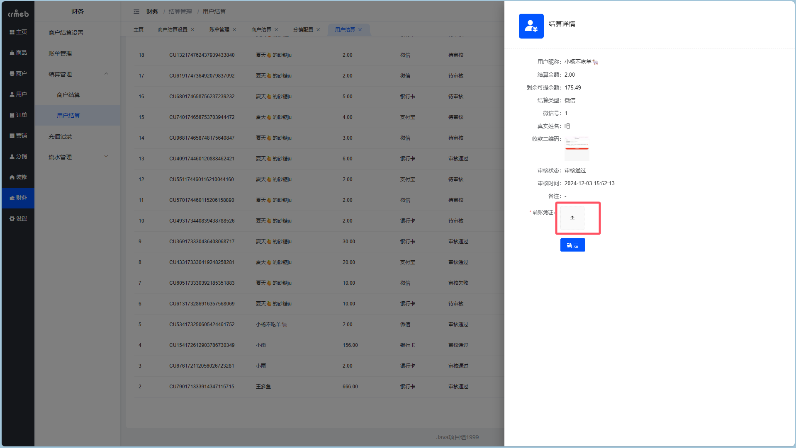

转账确认后，用户结算完成 ✅

## 小结 📋

| 结算类型 | 谁申请 | 谁审核 | 钱从哪来 |
| --- | --- | --- | --- |
| 商户结算 | 商户 | 平台 | 商户在平台的销售收入 |
| 用户结算 | 分销员 | 平台 | 分销佣金 |

::: tip 财务小贴士
- 审核要及时，别让人家等太久
- 转账记得核对账户信息，打错了很麻烦
- 建立固定的结算周期（比如每周二、周五），运营更规范
:::
