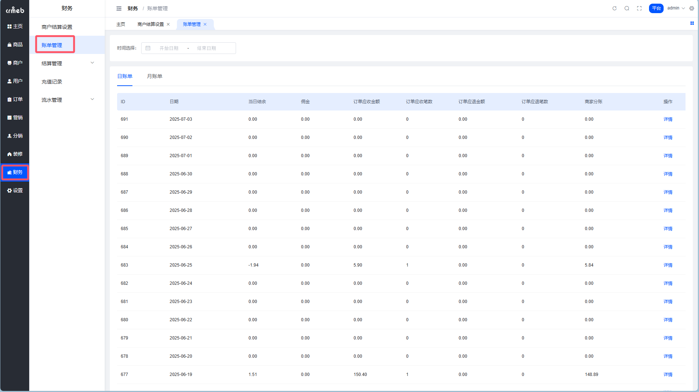
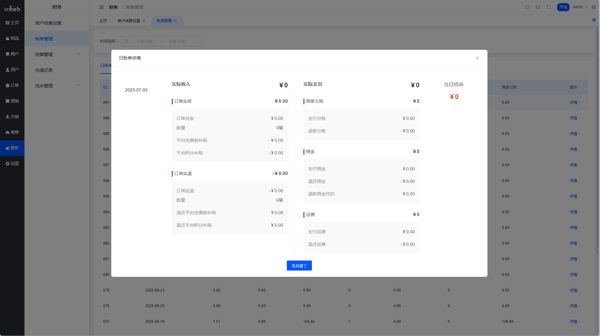
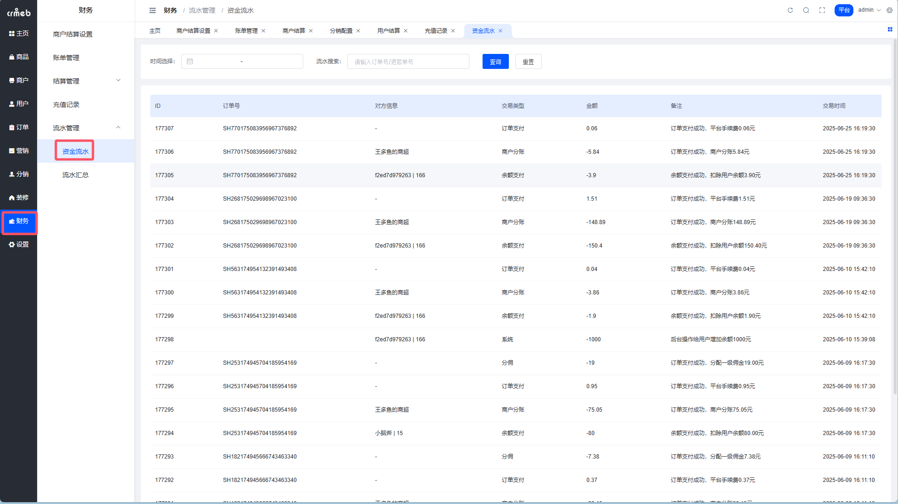
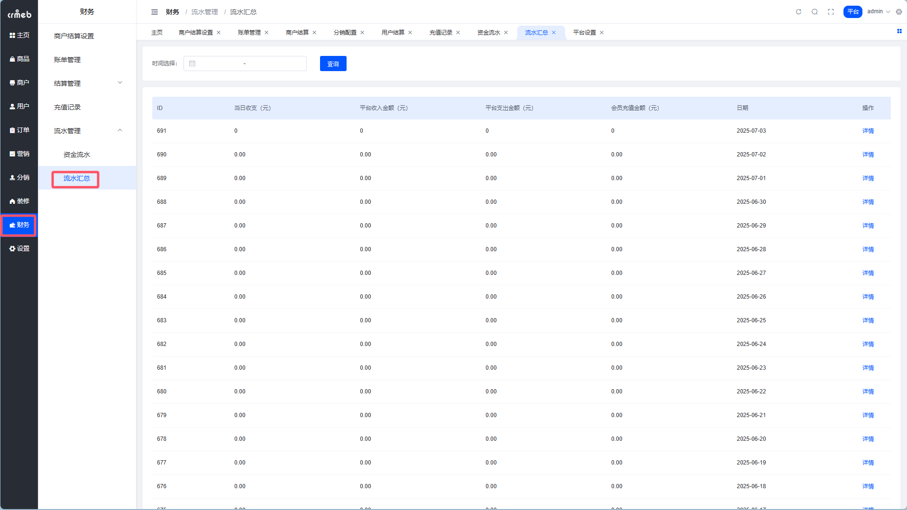
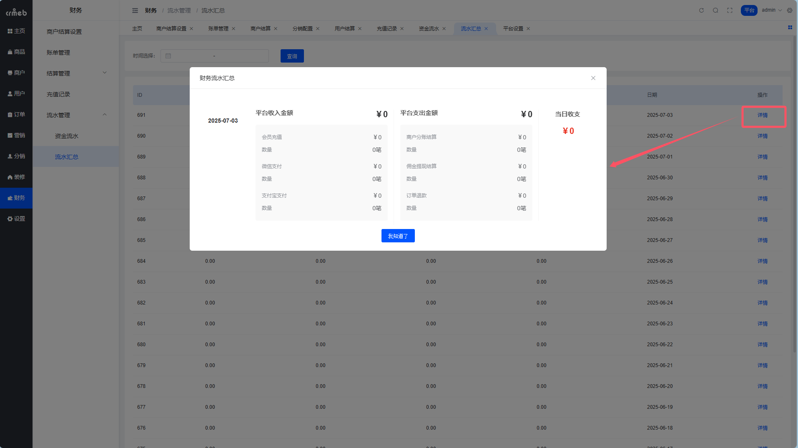
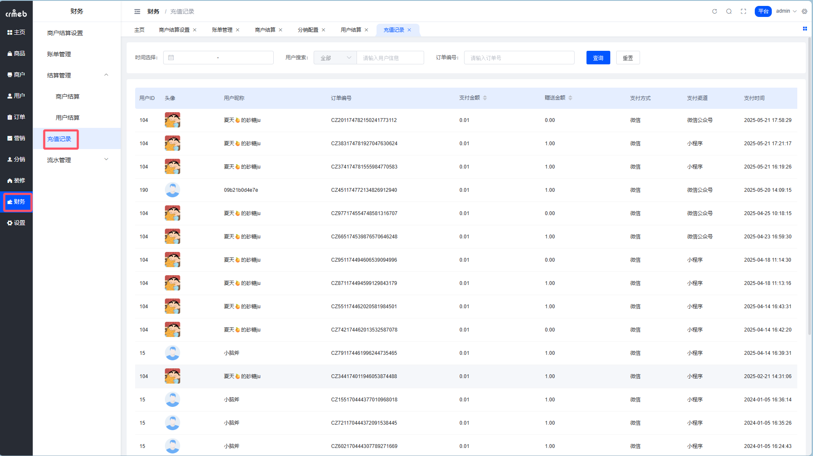

# 财务流水

> 钱去哪儿了？这里全都记着呢 📒

## 账单管理

账单 = 每天/每月的「收支账本」。

系统会自动统计每天、每月的收入和支出，财务对账就靠它了。

**路径**：平台后台 → 财务 → 账单管理



### 账单维度

| 维度 | 说明 |
| --- | --- |
| 按归属 | 平台账单、商户账单 |
| 按时间 | 日账单、月账单 |

### 账单详情

点开账单可以看到详细的收支明细：



### 账单计算公式 🧮

看起来有点复杂，但逻辑很清晰：

**实际收入** = 订单实收 + 订单应退（退款记负数）

```
订单实收 = 订单应收 - 平台优惠券补贴 - 平台积分补贴

其中：
• 订单应收 = 商品售价 - 商家优惠券 + 运费
• 平台优惠券补贴 = 所有订单使用的平台券金额
• 平台积分补贴 = 所有订单使用的积分抵扣金额
```

**实际支出** = 商家分账 + 佣金

```
商家分账 = 支付分账 + 退款分账（退款记负数）

其中：
• 支付分账 = 订单应付 - 佣金 - 平台手续费 - 运费
• 佣金 = 所有订单的一二级分销佣金
```

**当日结余** = 实际收入 - 实际支出

::: tip 看不懂？
简单说就是：**收了多少钱 - 分出去多少钱 = 今天赚了多少钱**
:::

## 资金流水 💸

资金流水 = 每一笔钱的进出记录。

账单是汇总，流水是明细。要查某一笔具体的钱是怎么来的、怎么走的，就看这里。

**路径**：平台后台 → 财务 → 流水管理 → 资金流水



每一条记录都会显示：
- 流水类型（充值、支付、退款、提现...）
- 金额
- 关联订单/用户
- 发生时间

## 流水汇总 📊

流水汇总 = 每日收支的统计报表。

和账单不同，流水汇总更侧重于**现金流**角度，按支付方式分类统计。

**路径**：平台后台 → 财务 → 流水管理 → 流水汇总



### 收支分类



| 类型 | 包含内容 |
| --- | --- |
| 收入 | 会员充值、订单支付（按支付方式分：微信/支付宝/余额等） |
| 支出 | 商户分账结算、佣金提现、订单退款 |

### 计算逻辑

```
平台收入 = 会员充值 + 非余额订单支付
平台支出 = 商户分账结算 + 佣金提现 + 订单退款
当日收支 = 平台收入 - 平台支出
```

::: warning 注意
如果用户把佣金直接转入余额（而不是提现），这笔钱不会出现在「佣金提现」支出里，也不会出现在「会员充值」收入里。因为钱没有真正进出平台账户，只是在系统内部流转。
:::

## 充值记录 🔋

记录所有用户的充值明细。

**路径**：平台后台 → 财务 → 充值记录



可以看到：
- 谁充的
- 充了多少
- 什么时候充的
- 用什么方式充的

::: tip 财务对账小技巧
1. **日常对账**：看「流水汇总」，快速了解当日收支
2. **详细核对**：看「资金流水」，逐笔核对
3. **月度汇报**：看「账单管理」的月账单，一目了然
4. **用户问题**：查「充值记录」，快速定位用户充值情况
:::
