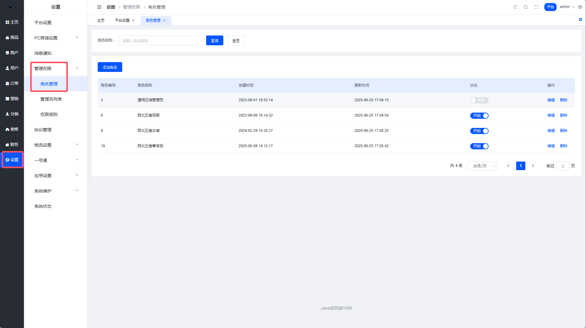
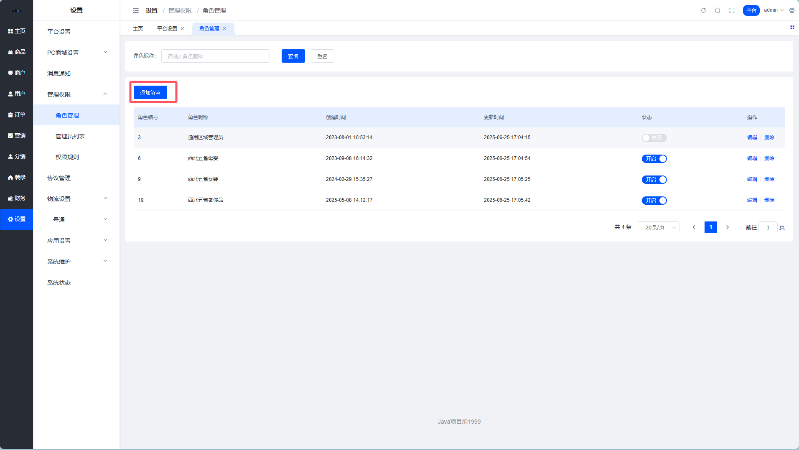
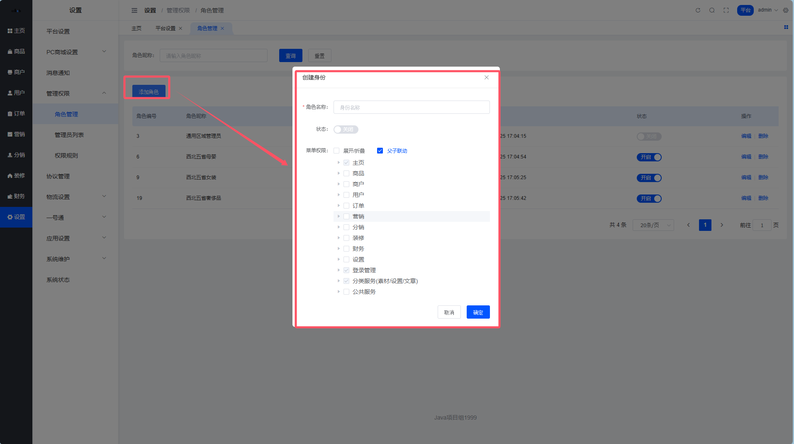
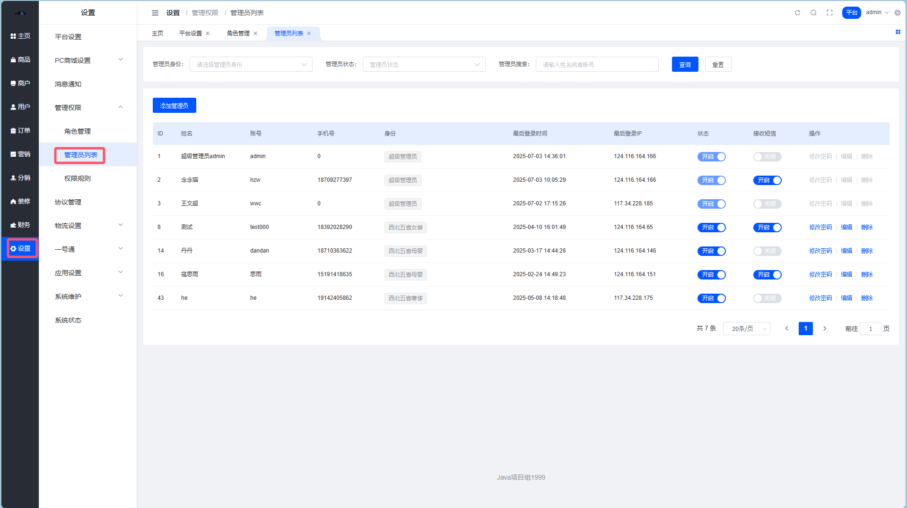
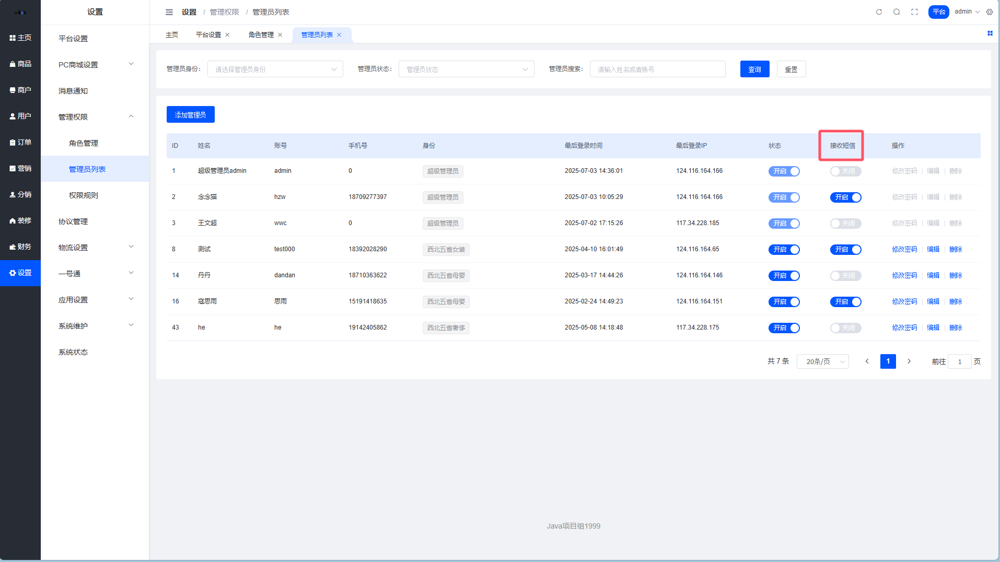
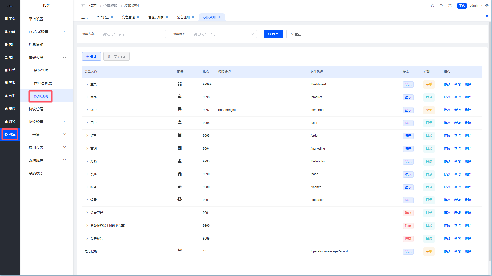
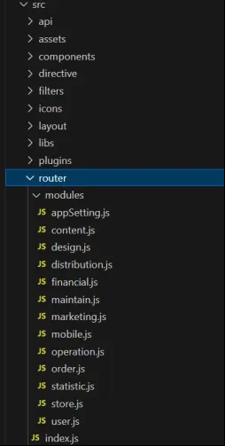
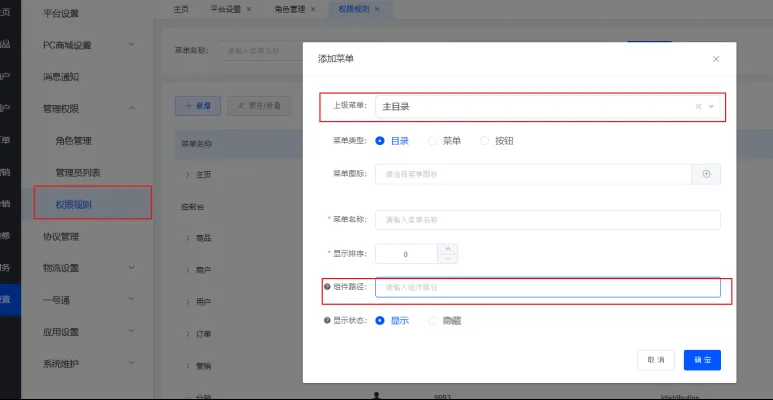
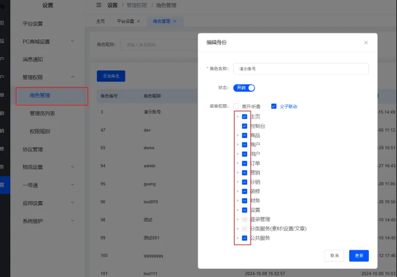

# 权限管理

> 谁能看什么、谁能改什么，这里说了算 🔐

## 权限体系概览

系统的权限管理遵循经典的 **RBAC 模型**（基于角色的访问控制）：

```
权限规则 → 角色 → 管理员
   ↓         ↓        ↓
 能干啥    权限打包   具体的人
```

简单说就是：
1. 先定义有哪些「权限」（菜单、按钮、接口）
2. 把权限打包成「角色」（运营、财务、客服...）
3. 给管理员分配「角色」

这样管理起来就清晰多了，不用给每个人单独配权限。

## 角色管理 👥

角色 = 权限的集合。比如「运营角色」可以看数据、发活动，但不能改系统配置。

**路径**：平台后台 → 设置 → 管理权限 → 角色管理



### 创建角色

点击添加，填写角色名称：



### 分配权限

勾选这个角色能访问的菜单和功能：



::: warning 注意事项
- 删除角色会同时清空该角色的所有权限配置
- **超级管理员**角色是系统内置的，不能创建也不能编辑
- 权限变更后，对应的管理员需要**重新登录**才能生效
:::

## 管理员列表 👤

管理员 = 实际登录系统的账号。每个管理员绑定一个角色，就拥有了对应的权限。

**路径**：平台后台 → 设置 → 管理权限 → 管理员列表



### 添加管理员



| 字段 | 说明 |
| --- | --- |
| 账号 | 登录用的用户名 |
| 密码 | 登录密码 |
| 角色 | 选择一个已创建的角色 |
| 是否接收短信 | 开启后，用户下单、商户入驻会短信通知这个管理员 |

::: tip 操作顺序
先创建角色 → 再添加管理员。没有角色可选的话，管理员就没法分配权限。
:::

## 权限规则 📋

权限规则 = 系统里所有可控制的「功能点」。

**路径**：平台后台 → 设置 → 管理权限 → 权限规则



这里主要是开发同学用的，用来配置菜单和按钮权限。运营同学一般不用动。

### 二开：如何添加新的菜单页面？ 🛠️

这是给开发同学看的，如果你要给后台加新功能：

**Step 1**：在前端 `router` 目录下创建路由文件

仿照现有的路由写法，记得在 `index.js` 里引入。



**Step 2**：在权限规则里添加对应菜单

选择目录层级，组件路径要和代码里的路由路径一致。



**Step 3**：给角色分配新菜单的权限



> 如果菜单没刷出来，退出重新登录试试。超级管理员（admin）不需要单独配权限，自动拥有所有权限。

## 小结 📝

| 概念 | 作用 | 操作频率 |
| --- | --- | --- |
| 权限规则 | 定义系统有哪些可控功能 | 开发时配置，平时不动 |
| 角色 | 把权限打包，方便复用 | 偶尔调整 |
| 管理员 | 实际登录的账号 | 人员变动时操作 |

::: tip 最佳实践
- 按职能划分角色：运营、财务、客服、技术...
- 遵循「最小权限原则」：只给需要的权限，不多给
- 离职员工及时禁用账号，别只是删角色
:::
