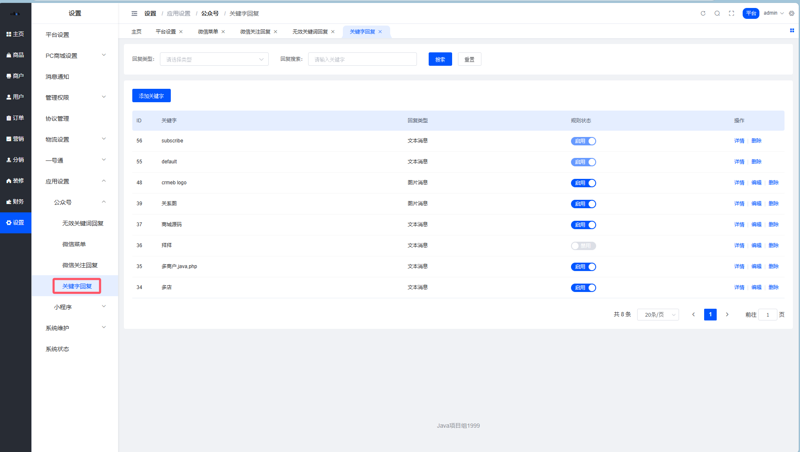
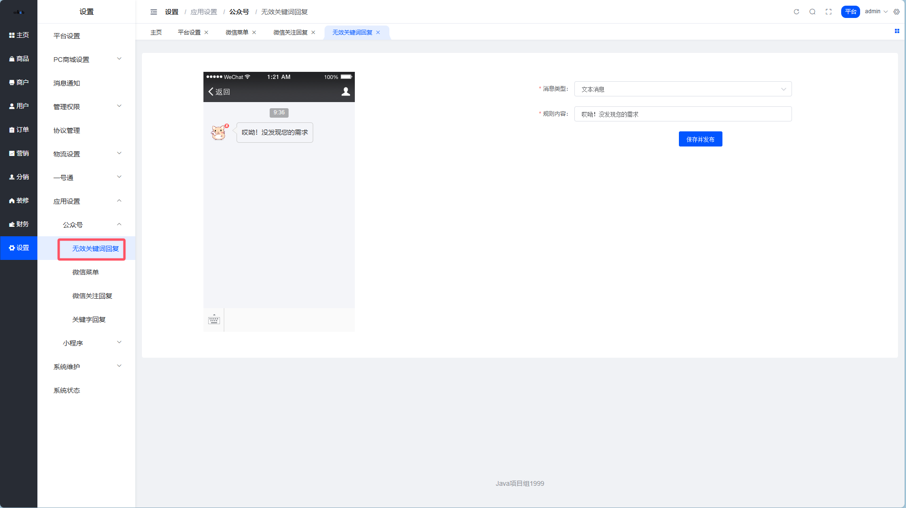
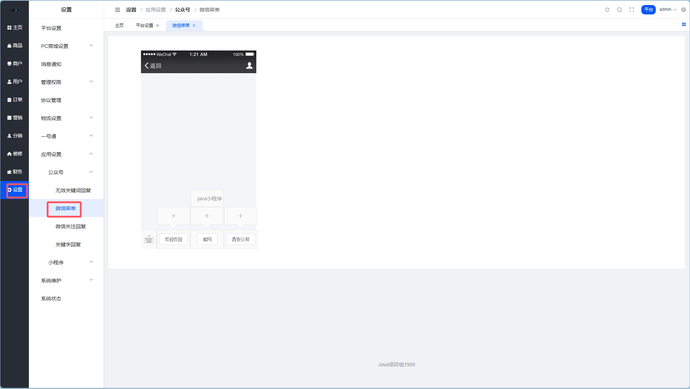
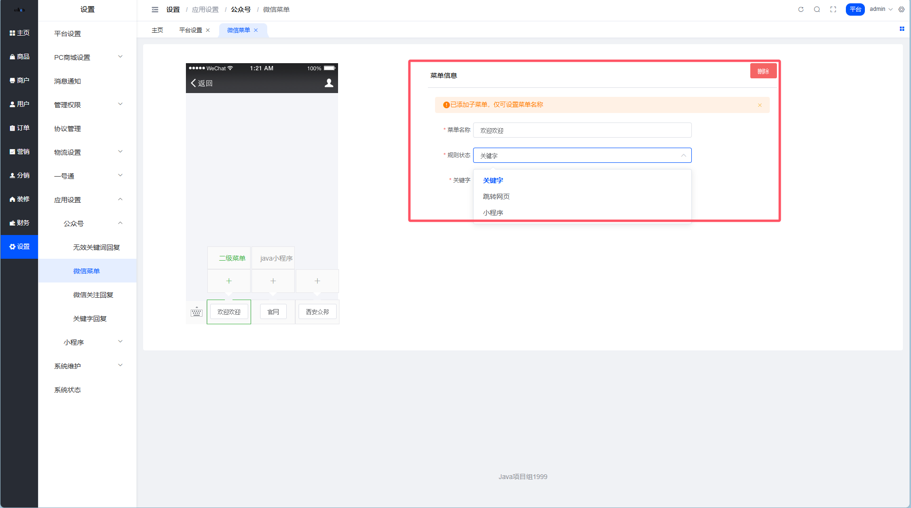

# 公众号设置

> 公众号就像你的「24小时在线客服」，设置好了能自动回复、引导用户，让你躺着也能运营 🎯

## 这是个啥？

公众号设置模块让你可以自定义微信公众号的各种自动化行为：
- **关注回复**：用户一关注就自动打招呼
- **关键字回复**：用户发特定词，自动回复对应内容
- **无效关键词回复**：用户瞎发消息时的兜底回复
- **微信菜单**：公众号底部的导航菜单

**路径**：平台后台 → 应用 → 公众号

---

## 微信关注回复

> 第一印象很重要，别让新粉丝受冷落 ❄️

### 这是干嘛的？

用户关注公众号后，系统**自动发送**的欢迎消息。


::: tip 小技巧
欢迎语可以放商城链接、客服二维码、新人优惠券领取入口，趁热打铁把用户拉进商城！
:::

---

## 关键字回复

> 设置好关键字，让公众号秒变智能客服 🤖

### 这是干嘛的？

用户在公众号发送**特定关键词**时，自动回复预设内容。

比如用户发「优惠」，自动回复当前活动信息；发「客服」，自动回复客服联系方式。



::: tip 常用关键字推荐
- `优惠` / `活动` → 回复当前促销信息
- `客服` / `人工` → 回复客服联系方式
- `地址` / `物流` → 回复物流查询指引
:::

---

## 无效关键词回复

> 用户乱发消息怎么办？得有个兜底方案 🎣

### 这是干嘛的？

用户在公众号发送的消息**没有匹配到任何关键字**时，系统自动回复的默认内容。



::: warning 注意
这个回复别设置得太敷衍，可以引导用户查看菜单或联系客服。
:::

---

## 微信菜单

> 公众号底部那排按钮，用户点了去哪儿，全看你怎么设置 📱

### 这是干嘛的？

设置公众号底部的导航菜单，支持三种跳转规则：
- **关键字**：点击触发关键字回复
- **URL网页跳转**：直接打开网页
- **小程序**：跳转到小程序指定页面



### 配置限制

| 限制项 | 数值 |
| --- | --- |
| 大栏目数量 | 最多 **3** 个 |
| 子菜单数量 | 每个大栏目最多 **5** 个 |
| 菜单名称长度 | 最多 **7** 个字 |

### 参数说明

| 参数 | 这是干嘛的 |
| --- | --- |
| 菜单名称 | 发布后公众号底部菜单显示的名称 |
| 规则状态 | 用户点击该菜单触发的跳转规则 |



::: danger 注意事项
1. 菜单设置后，微信公众号自己会有缓存，想快速看到效果，可**重新关注公众号**
2. 跳转小程序必须满足：小程序和公众号的**主体一致**，并且已**绑定**
:::

---

## 最佳实践

### 菜单布局推荐

```
├── 🛒 商城入口
│   ├── 首页
│   ├── 分类
│   └── 我的订单
├── 🎁 优惠活动
│   ├── 限时秒杀
│   ├── 领券中心
│   └── 新人专享
└── 👤 我的
    ├── 个人中心
    ├── 联系客服
    └── 商家入驻
```

::: tip 运营小贴士
定期更新菜单内容，配合营销活动调整，让菜单成为引流利器！
:::
