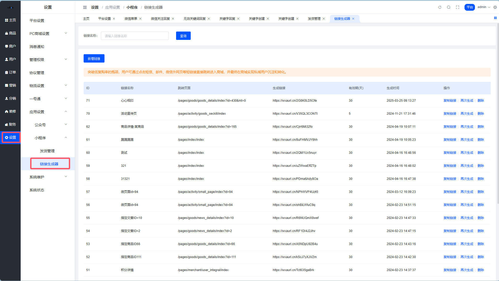
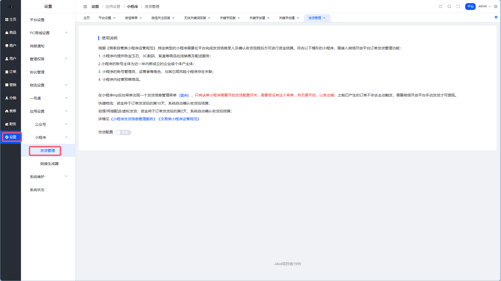
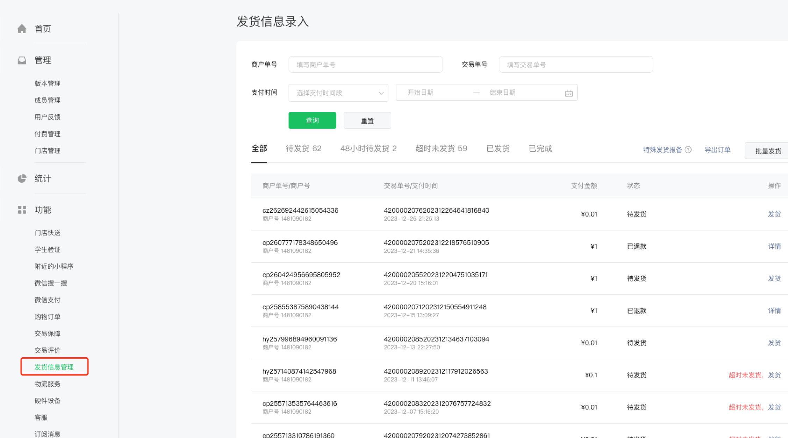

# 小程序应用设置

> 小程序不只是个壳子，链接生成器和发货管理才是让它活起来的关键 🚀

## 链接生成器

> 突破微信生态的「围城」，让用户从短信、邮件也能一键跳进你的小程序 🔗

### 这是干嘛的？

突破低复购率的瓶颈！用户可通过点击短信、邮件、微信外网页等**短链接直接跳转**进入商城，最终实现私域用户沉淀和转化。

**路径**：平台后台 → 应用 → 小程序 → 链接生成器

::: warning 注意
生成的链接**有效期只有 30 天**，过期需要重新生成！
:::

### 使用场景

| 场景 | 说明 |
| --- | --- |
| 短信营销 | 发促销短信时附带链接，用户点击直达商城 |
| 邮件推广 | EDM 邮件中嵌入链接，引流到小程序 |
| 外部网页 | 官网、H5 落地页等微信外渠道引流 |

::: tip 运营小技巧
配合短信营销使用效果最佳，比如「您有一张 50 元优惠券即将过期，点击领取→」
:::

---

## 小程序发货管理

> 微信爸爸的新规矩：特定类目必须录入发货信息，不然钱提不出来 💰

### 这是干嘛的？

根据《商家自营类小程序运营规范》，特定类型的小程序需要在平台完成**发货信息录入及确认收货流程**后方可进行资金结算。

**路径**：平台后台 → 应用 → 小程序 → 发货管理

### 哪些小程序需要开启？

符合以下任一情形的小程序，必须接入微信开放平台订单发货管理功能：

| 情形 | 说明 |
| --- | --- |
| 特定类目 | 小程序内提供**珠宝玉石、3C数码、盲盒**等商品在线销售及配送服务 |
| 新主体 | 账号主体为**近一年内新成立**的企业或个体户 |
| 关联风险 | 小程序的管理员、运营者等角色，与其它高风险小程序存在关联 |
| 预售商品 | 小程序内经营**预售商品** |

### 如何判断是否需要开启？

在小程序 MP 后台查看是否出现「发货信息管理」菜单：

::: danger 重要提醒
- ✅ 有这个菜单 → 需要开启发货配置开关
- ❌ 没有这个菜单 → **无需开启**，以免出错
- ⚠️ 之前已产生的订单不会主动触发，需要在微信开放平台**手动发货**才可提现
:::

### 资金结算时间

| 发货方式 | 结算时间 |
| --- | --- |
| 快递物流 | 订单发货后第 **10** 天，系统自动确认收货后结算 |
| 自提 / 同城配送 / 虚拟发货 | 订单发货后第 **2** 天，系统自动确认收货后结算 |

### 相关规范文档

- [《小程序发货信息管理服务》](https://developers.weixin.qq.com/miniprogram/dev/platform-capabilities/business-capabilities/order-shipping/order-shipping.html)
- [《交易类小程序运营规范》](https://developers.weixin.qq.com/miniprogram/product/jiaoyilei/)

::: tip 灵魂拷问
你的小程序钱提不出来？先看看是不是没开这个功能 😅
:::
