# 商户端商品管理

> 商品是店铺的灵魂，管好商品才能卖好货 🛍️

## 这是个啥？

商户端商品管理是商家维护自己店铺商品的核心模块，支持**普通商品、云盘商品、卡密商品、预约商品**四种类型，覆盖实物销售到虚拟服务的全场景。

**路径**：商户后台 → 商品 → 商品管理

---

## 商品列表

> 一眼看清店里所有商品的状态 👀

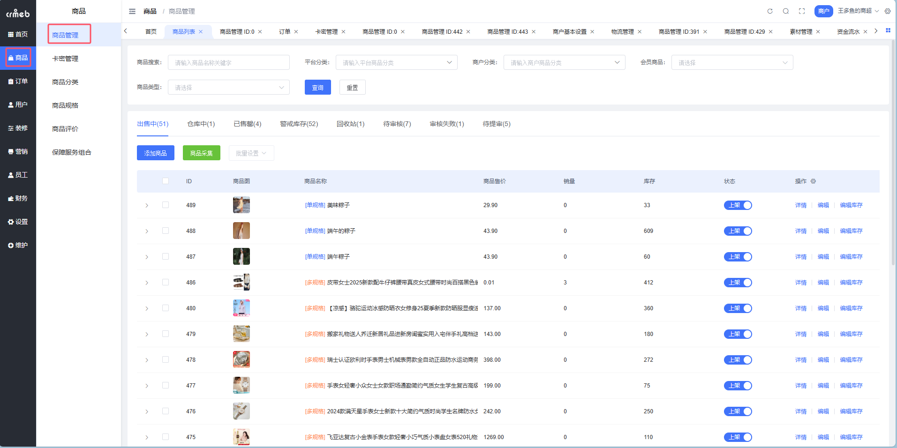

### 商品状态说明

| 状态 | 说明 | 支持操作 |
| --- | --- | --- |
| 出售中 | 审核通过且已上架 | 详情、编辑（需先下架）、编辑库存、下架 |
| 仓库中 | 审核通过且已下架 | 详情、编辑、免审编辑、回收站、上架、设置运费/佣金/回馈券 |
| 已售罄 | 审核通过且库存为0 | 根据上下架状态不同，操作同上 |
| 警戒库存 | 库存低于警戒值 | 根据上下架状态不同，操作同上 |
| 回收站 | 已加入回收站 | 详情、恢复、删除 |
| 待提审 | 添加成功等待提审 | 详情、编辑、提审、回收站 |
| 待审核 | 已提审待平台审核 | 详情、回收站 |
| 审核未通过 | 平台审核未通过 | 详情、编辑、回收站 |

::: tip 库存小贴士
- **云盘商品**：库存显示为 `--`（无限量）
- **卡密商品**：库存 = 未出售的卡号数量（每卖/删一个卡号，库存 -1）
:::

---

## 添加商品

> 给店铺上架第一个商品，从这里开始 🚀

### 添加前的准备工作

| 准备项 | 是否必须 | 说明 |
| --- | --- | --- |
| 平台商品分类 | ✅ 必须 | 找平台管理员配置 |
| 平台品牌 | ✅ 必须 | 找平台管理员配置 |
| 商户商品分类 | ✅ 必须 | 自己在商户后台配置 |
| 运费模板 | ✅ 必须 | 系统默认有一条全国包邮模板 |
| 平台保障服务 | 可选 | 增加商品可信度 |
| 商户优惠券 | 可选 | 可设置买赠券 |

### 操作步骤

**Step 1**：进入商品管理列表页面

**Step 2**：点击【添加商品】按钮，选择商品类型

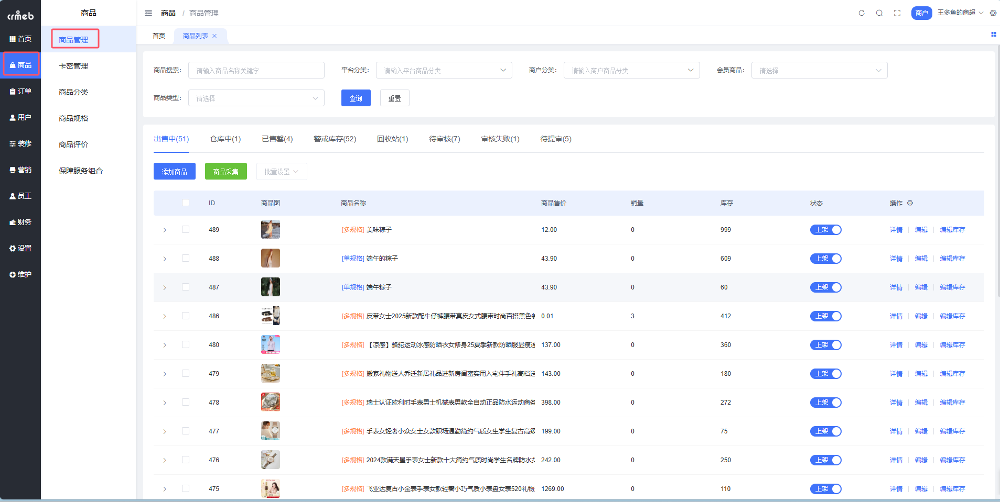

**Step 3**：填写商品信息

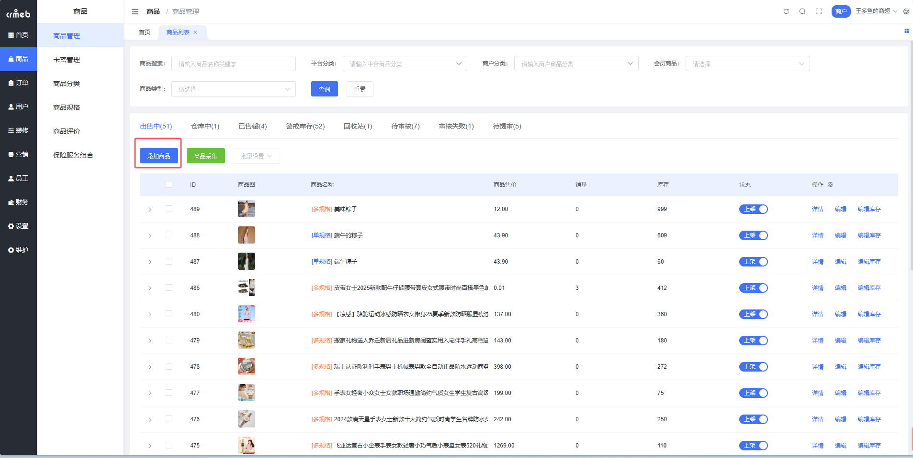

**Step 4**：设置规格库存

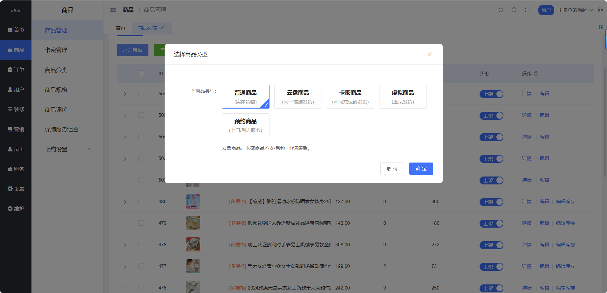

**Step 5**：编辑商品详情

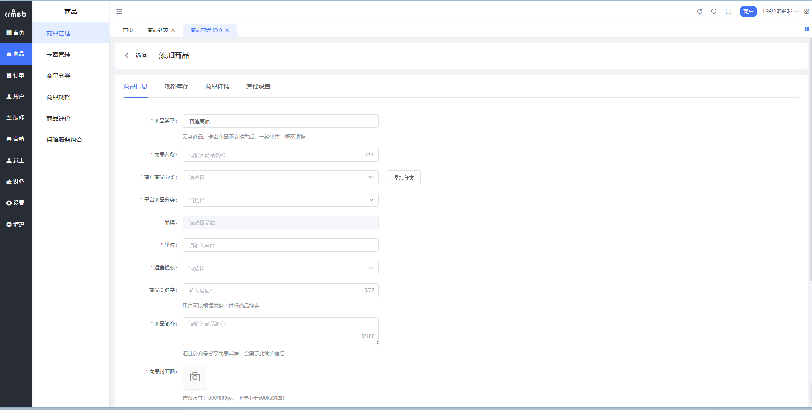

**Step 6**：其他设置，点击【提交】

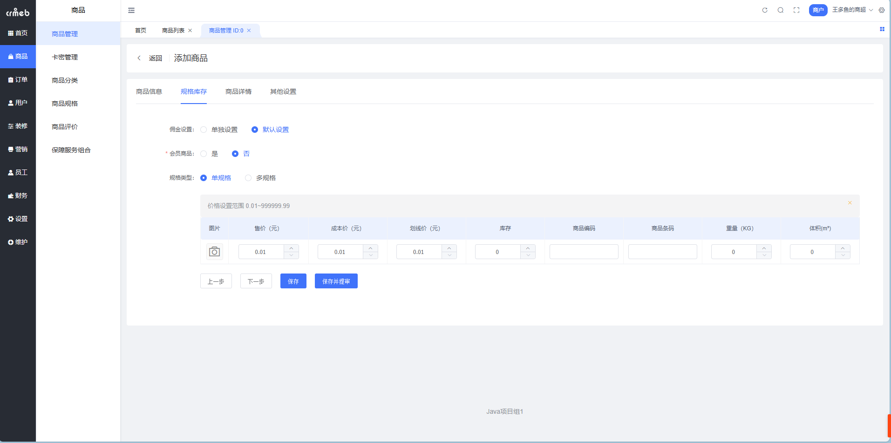

---

## 商品类型详解

### 四种商品类型对比

| 类型 | 适用场景 | 发货方式 | 售后支持 |
| --- | --- | --- | --- |
| **普通商品** | 实体货物 | 物流/自提 | ✅ 支持 |
| **云盘商品** | 教程、资料 | 自动发送云盘链接 | ❌ 仅商家主动退款 |
| **卡密商品** | 激活码、充值卡 | 自动发送卡号密码 | ❌ 仅商家主动退款 |
| **预约商品** | 服务类（美容、维修等） | 核销 | 按预约规则 |

::: warning 注意
商品类型一经选定，**不可修改**！请谨慎选择。
:::

---

## 商品字段说明

### 基础信息

| 字段 | 说明 |
| --- | --- |
| 商品名称 | 限制 50 字，可加属性词和促销词提高搜索曝光 |
| 商户商品分类 | 支持多选，用户可在店铺内按分类筛选 |
| 平台商品分类 | 只能单选三级分类，用于平台首页分类筛选 |
| 品牌 | 单选，关联所选平台分类的品牌 |
| 单位 | 自定义，如：件、个、套 |
| 保障服务 | 多选，展示在商品详情增加信任感 |

### 图片与媒体

| 字段 | 建议 |
| --- | --- |
| 商品封面图 | 800×800px，< 500KB，展示在商品列表 |
| 商品轮播图 | 800×800px，最多 10 张，可拖动排序 |
| 主图视频 | 10-30 秒，< 20MB，展示在轮播图第一位 |

### 规格设置

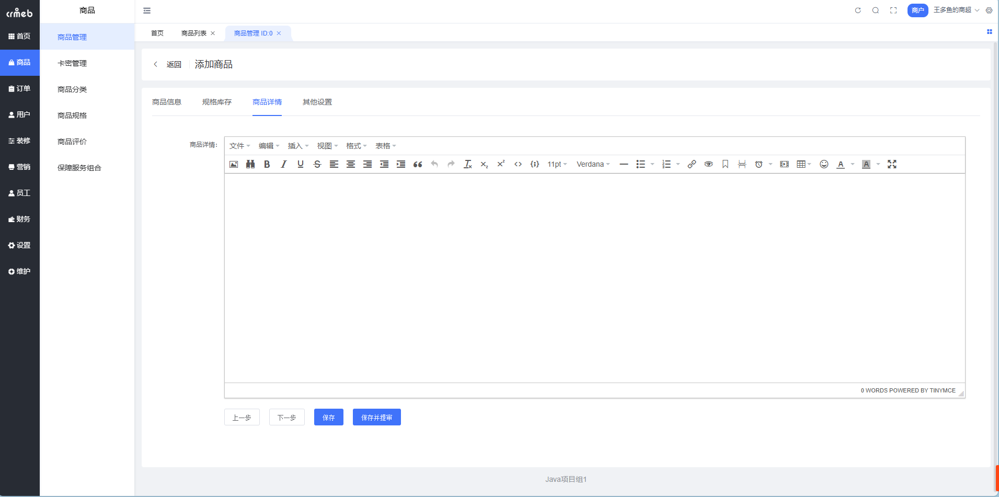

**单规格**：商品只有一种规格，建议在商品名称中描述规格信息

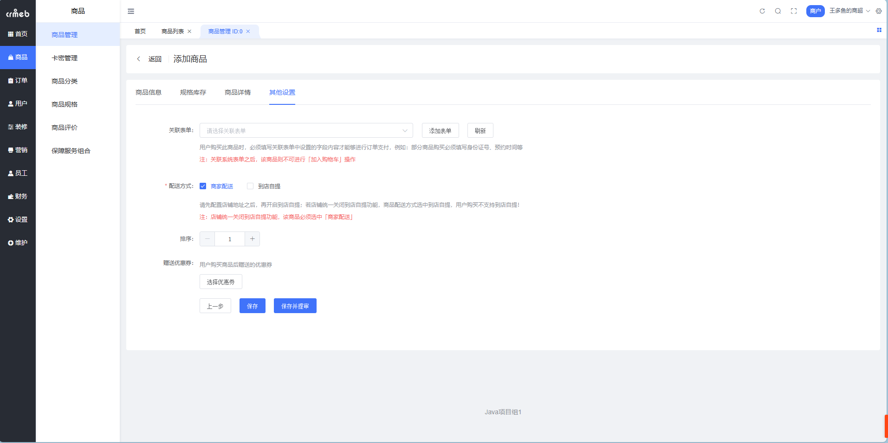

**多规格**：需要先选择规格模板，支持批量设置

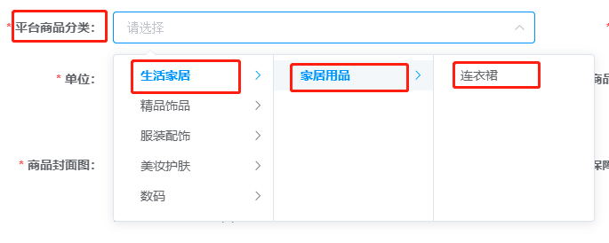

### 规格属性表字段

| 字段 | 说明 |
| --- | --- |
| 商品规格图 | 用户选规格时展示的图片 |
| 售价 | 实际销售价格 |
| 成本价 | 仅记录用，不展示给用户 |
| 划线价 | 商品详情展示的原价（划掉的那个） |
| 库存 | 卡密商品由卡密库决定，不能手动填 |
| 商品编号 | SKU 编号，可用于第三方对接 |
| 重量/体积 | 用于运费计算（虚拟商品自动隐藏） |

### 佣金设置

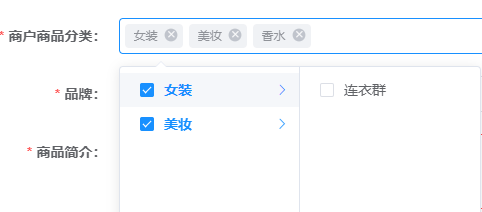

| 模式 | 说明 |
| --- | --- |
| 默认设置 | 按平台统一返佣比例计算 |
| 单独设置 | 可针对此商品单独设置一二级分佣比例 |

::: tip
一二级佣金比例之和必须 **< 35%**，都设为 0 则不分佣
:::

---

## 配送方式设置

### 商家配送 vs 到店自提

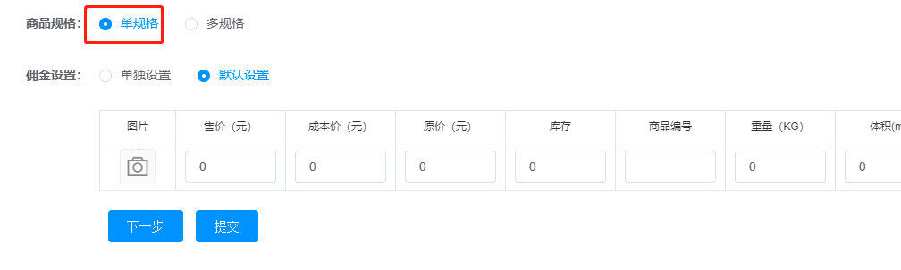

- 商品可勾选【商家配送】和/或【到店自提】
- 店铺「自提开关」与商品配送方式**不联动**
- 若店铺关闭自提，但商品仅选了自提，用户将无法购买

::: danger 避坑指南
先配置店铺地址，再开启到店自提！否则用户下单会报错。
:::

### 用户端限制逻辑

| 场景 | 表现 |
| --- | --- |
| 购物车内商品配送方式不一致 | 提示「部分商品配送方式不一致，请单独下单」 |
| 店铺没配置地址但商品仅支持自提 | 提示「{店铺名称}没有配置店铺地址，请联系客服」 |
| 店铺关闭自提但商品仅支持自提 | 提示「此商品配送方式设置错误，请联系客服」 |

---

## 商品规格图

> 让用户选规格时能看到对应的图片 🖼️

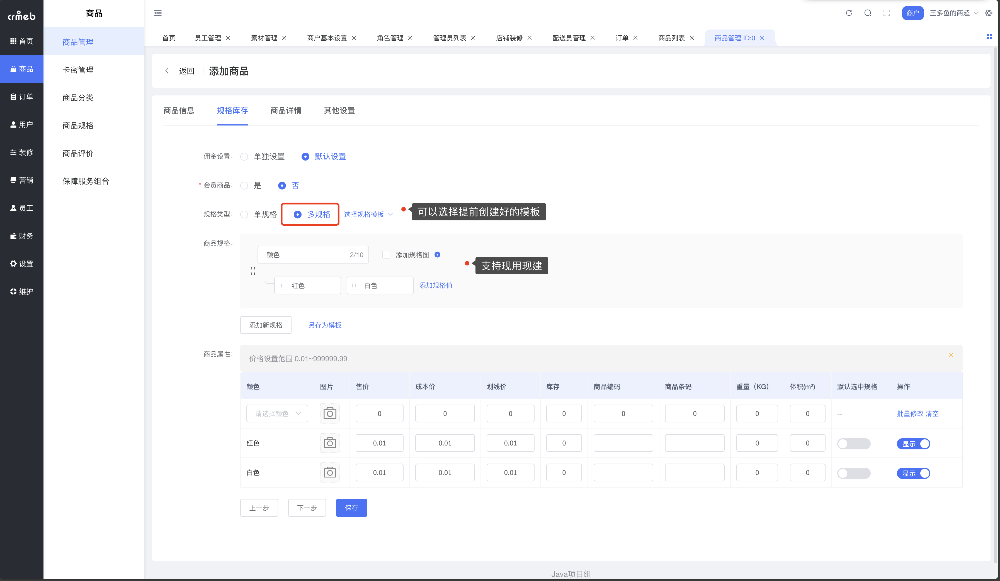

- 只能选**一个规格**添加规格图
- 选中后该规格所有值的图片**必填**
- 支持同步到规格属性列表

---

## 买赠优惠券

> 买完商品送张券，提高复购率 🎫

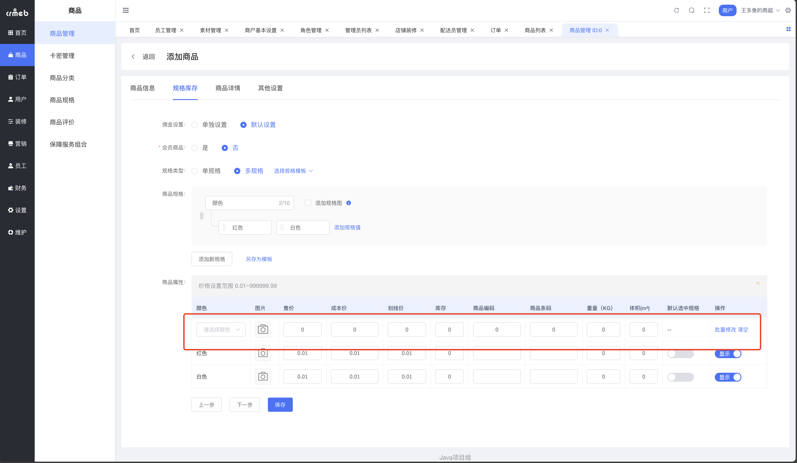

::: warning 注意
只能选择**优惠券类型为「商品买赠券」**且在有效期内的优惠券
:::

---

## 保存与提审

### 按钮逻辑

| 店铺类型 | 点击【保存】 | 点击【保存并提审】 |
| --- | --- | --- |
| 免审店铺 | 弹窗询问是否自动上架 | - |
| 需审核店铺 | 进入待提审状态 | 弹窗询问审核通过后是否自动上架 |

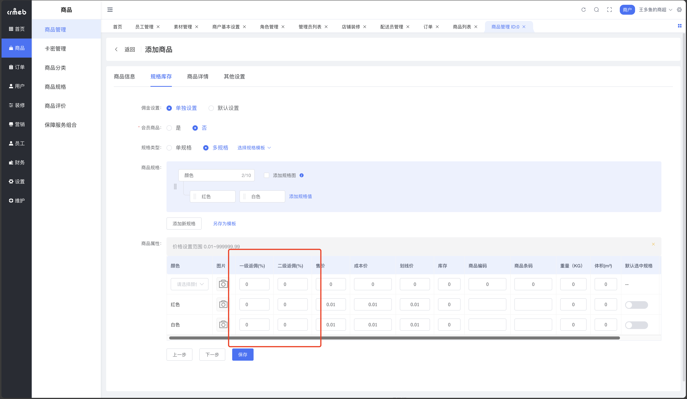

---

## 卡密管理

> 卖激活码、充值卡？卡密管理帮你自动发货 🔐

### 这是干嘛的？

卡密管理用于维护卡密商品的**卡号和密码**。商家维护好卡密库后，系统自动给买家发送卡号密码，一码一卖，售完即止。

**路径**：商户后台 → 商品 → 卡密管理

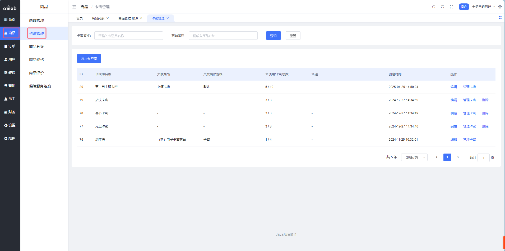

### 卡密库列表字段

| 字段 | 说明 |
| --- | --- |
| 卡密库名称 | 如：爱奇艺一个月会员卡密库 |
| 关联商品 | 此卡密库关联的商品名称 |
| 关联商品规格 | 此卡密库关联的规格 |
| 未使用/卡密总数 | 剩余库存/总库存 |

### 添加卡密库

**Step 1**：点击【添加卡密库】

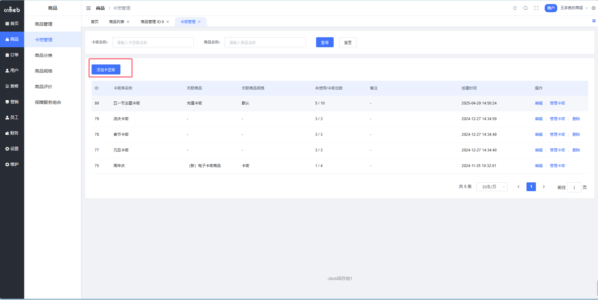

**Step 2**：填写卡密库名称和备注，点击【确定】

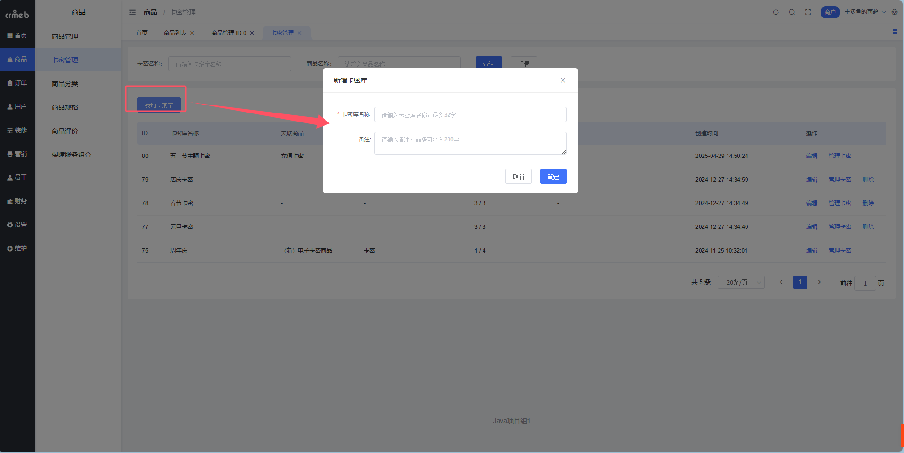

### 管理卡密 - 手动添加

**Step 1**：点击【管理卡密】进入卡密管理页面

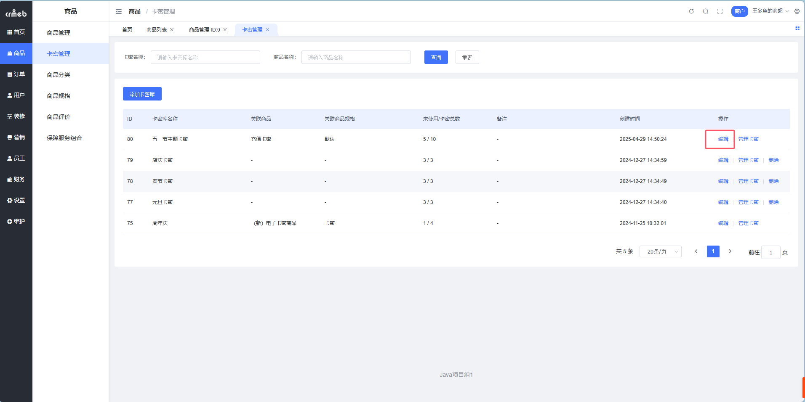

**Step 2**：点击【添加卡密】，填写卡号和密码

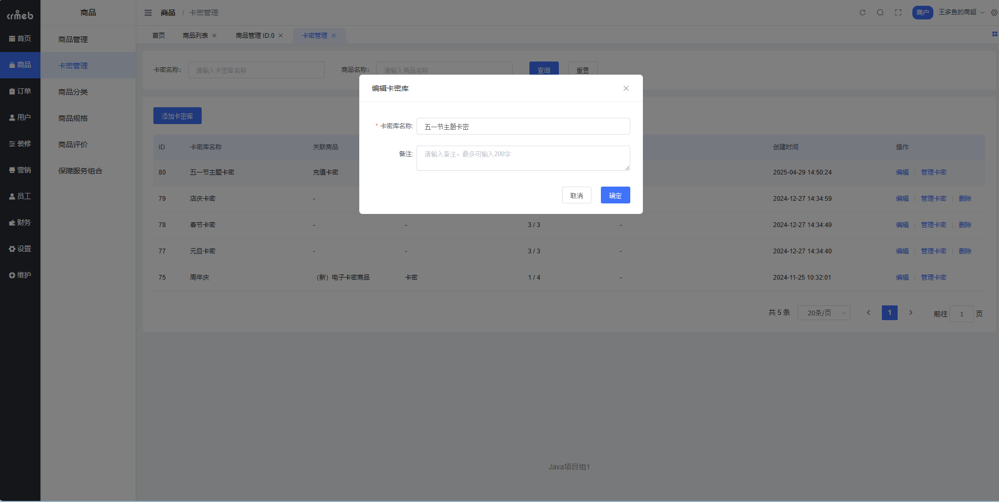

::: tip
支持点击「添加行」一次添加多个卡密，同一卡密库卡号不能重复
:::

### 管理卡密 - 批量导入

**Step 1**：点击【下载模板】获取 Excel 模板

**Step 2**：在 Excel 中填写卡号、密码

**Step 3**：点击【导入卡密】上传文件

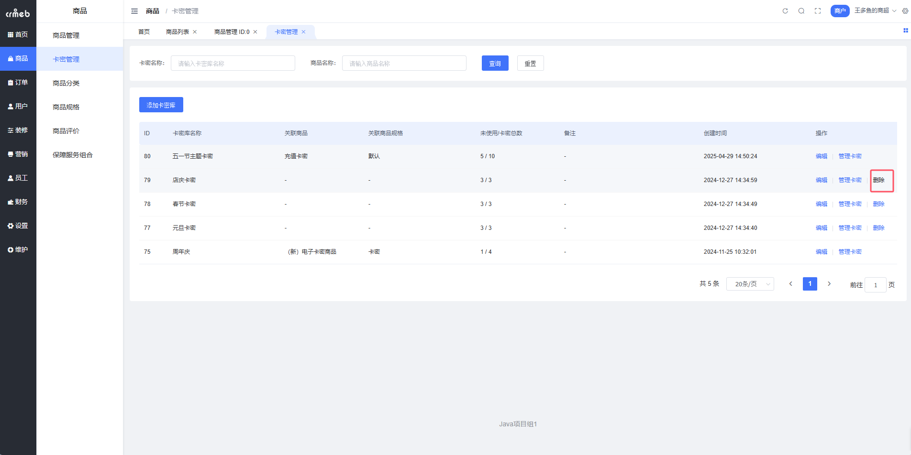

### 编辑/删除卡密

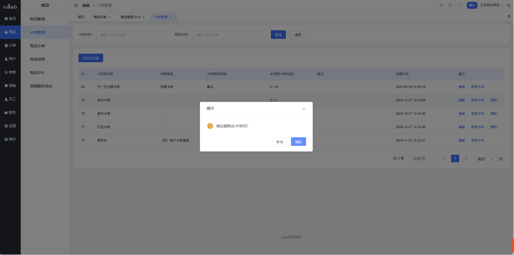

::: warning
只能编辑/删除**未出售**的卡密！已出售的改不了。
:::

---

## 商品采集

> 不想手动填？从其他平台采集商品信息 🎣

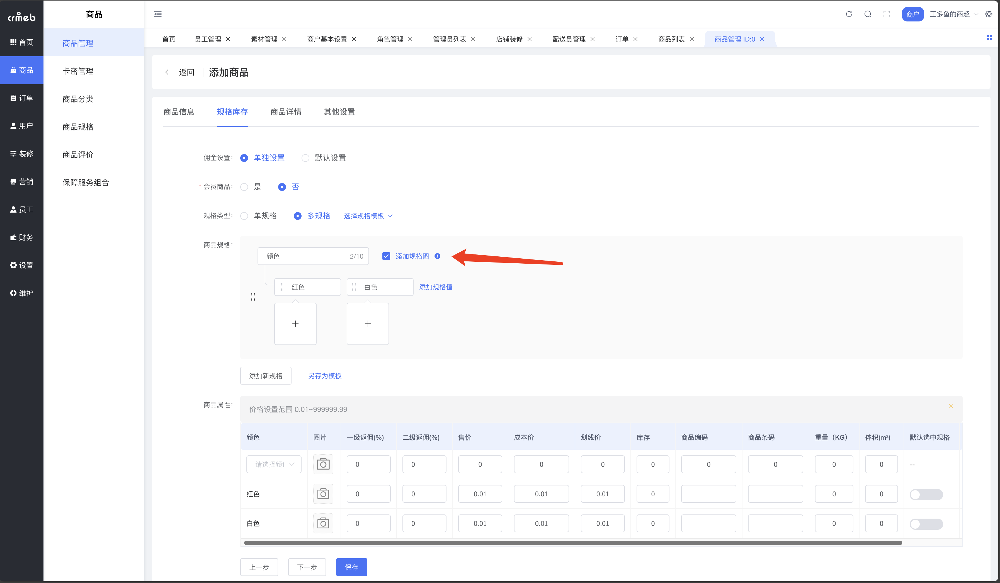

虚拟商品采集会获取：
- ✅ 商品基本信息
- ✅ 规格信息
- ✅ 商品详情
- ❌ 不包含：链接、卡密内容、运费

---

## 灵魂拷问

> 你的商品为啥卖不动？

1. 商品标题有没有加热门关键词？
2. 封面图是不是太丑了？
3. 规格设置清不清晰？
4. 详情页有没有好好写？
5. 价格有没有竞争力？

::: tip 爆款公式
好标题 + 好图片 + 好详情 + 好价格 = 💰
:::
