# 商户端分类与规格

> 分类是商品的「户口本」，规格是商品的「身份证」，管好了才能井井有条 📋

## 商品分类

> 给商品分门别类，让用户一眼找到想要的 🏷️

### 这是干嘛的？

商户商品分类是**店铺内部**的商品分类���系，用户可以在店铺主页按分类筛选商品。

**路径**：商户后台 → 商品 → 商品分类

::: tip 与平台分类的区别
- **平台商品分类**：全平台统一的分类，用于商城首页筛选
- **商户商品分类**：单店铺的分类，用于店铺内筛选
:::

### 分类结构

商户商品分类为**三级分类**结构：

```
├── 一级分类（大类）
│   ├── 二级分类（中类）
│   │   └── 三级分类（小类）
```

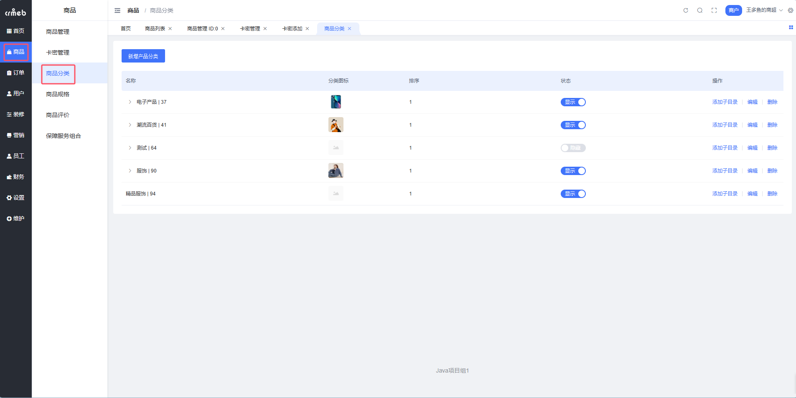

---

### 添加分类

**Step 1**：进入商品分类页面，点击【新增产品分类】

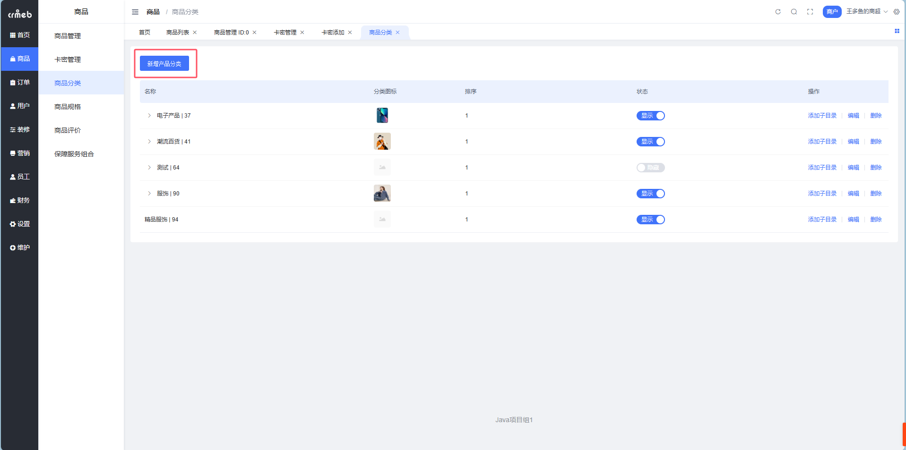

**Step 2**：填写分类信息，点击【确定】

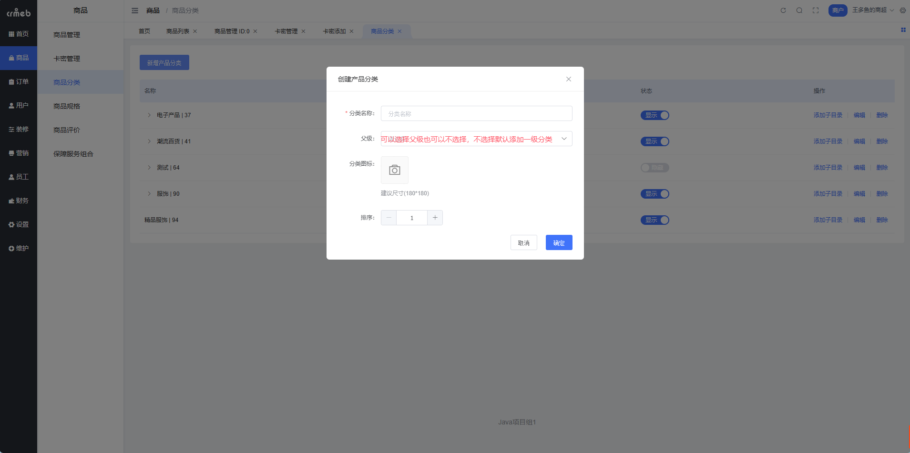

#### 字段说明

| 字段 | 说明 |
| --- | --- |
| 分类名称 | 用于用户端展示，最多 **8** 个字 |
| 父级 | 指定父级分类，建立层级关系 |
| 分类图标 | 可选，目前用户端暂不展示 |
| 排序 | 数字越大越靠前 |

---

### 编辑分类

点击【编辑】按钮，修改分类信息后保存即可。

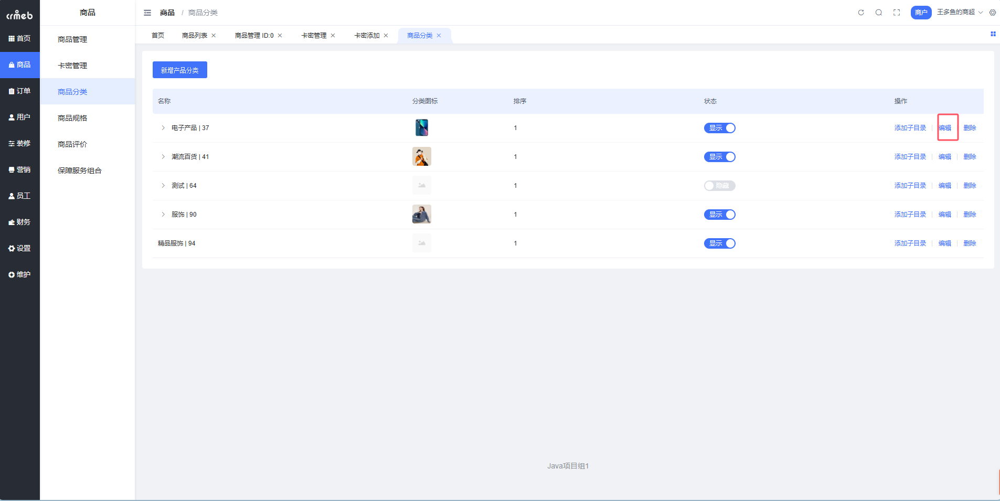

---

### 删除分类

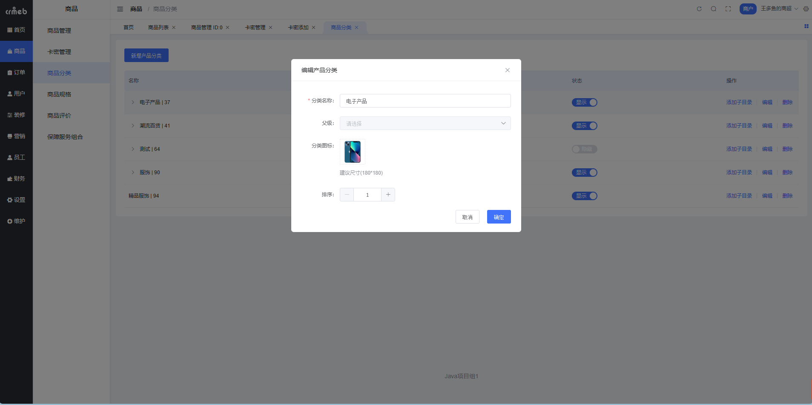

::: danger 注意
分类下有商品或子分类时，**无法直接删除**！需要先清空子分类和商品。
:::

---

### 隐藏分类

> 不想删但又不想展示？隐藏它！

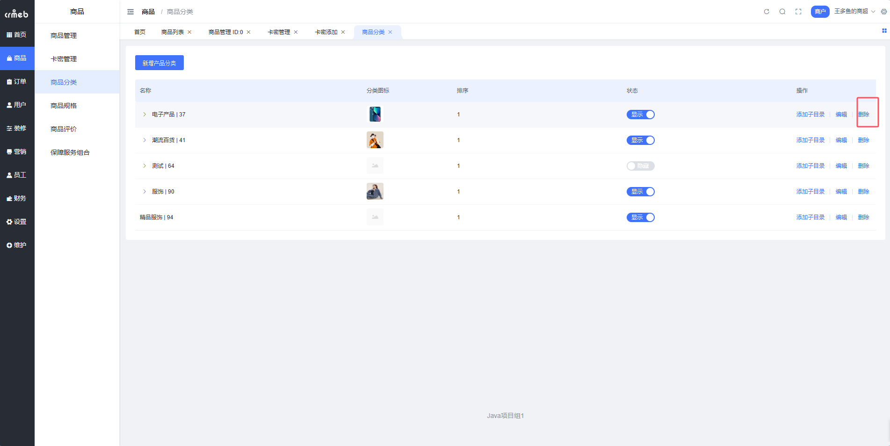

**使用场景**：
- 特殊原因暂时不想展示某分类
- 小程序提交微信审核时，快速隐藏敏感分类

---

### 用户端展示效果

#### 移动端

**平台商品分类**：

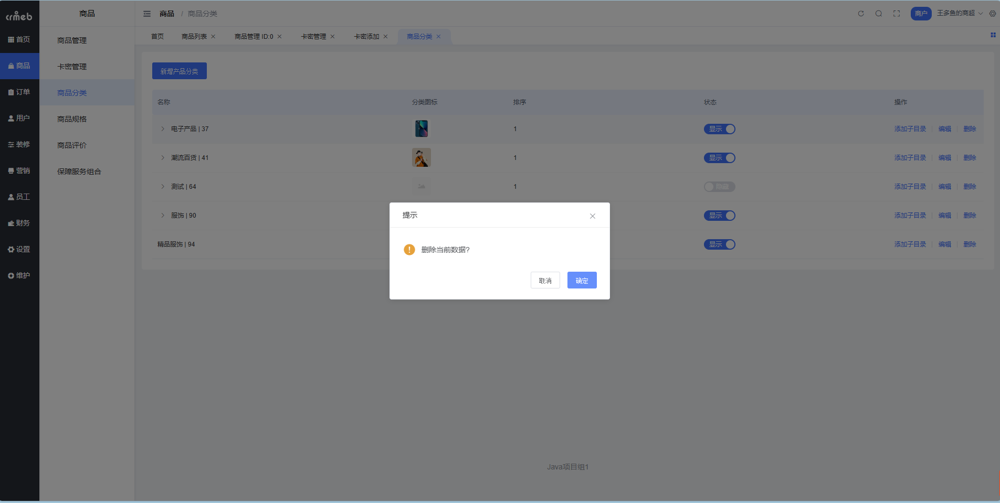

**商户商品分类**：

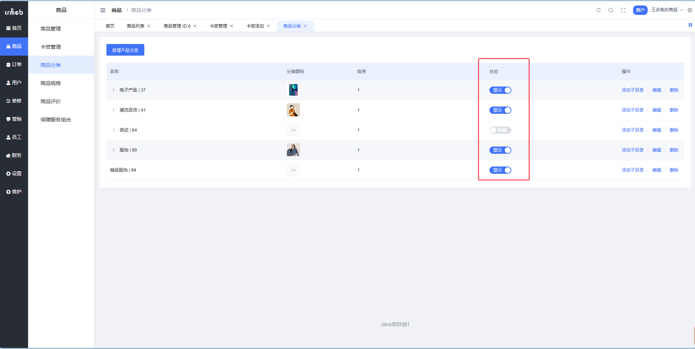

#### PC商城

**平台商品分类**：

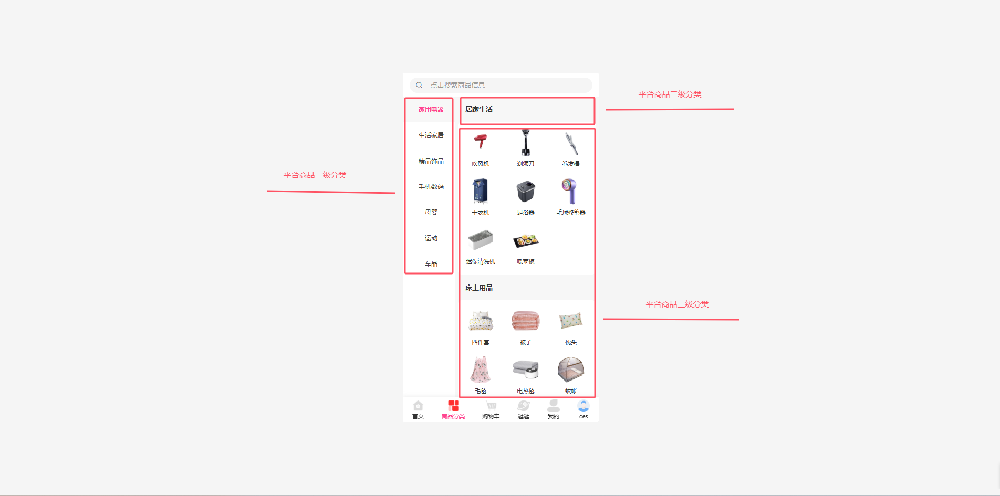

**商户商品分类**：

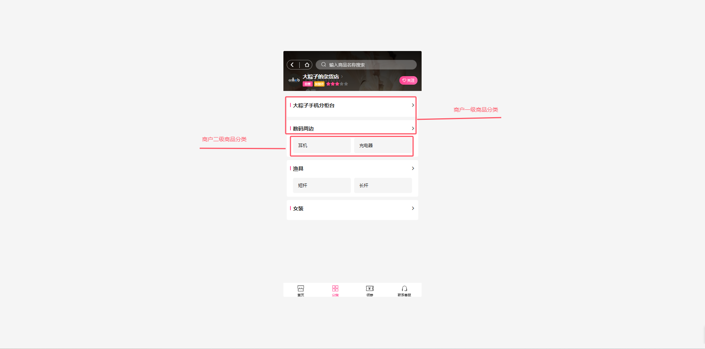

---

## 商品规格

> 提前设好规格模板，添加商品时一键复用，效率拉满 ⚡

### 这是干嘛的？

商品规格是商品的**属性维度**，比如颜色、尺码、型号等。预设好规格模板后，添加同类商品时可以直接复用，不用重复维护。

**路径**：商户后台 → 商品 → 商品规格

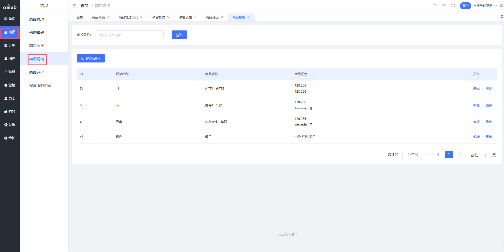

::: tip 举个例子
卖鞋的商家可以预设：
- **颜色**：白色、黑色、灰色
- **尺码**：38、39、40、41、42、43

添加任何鞋子商品时，直接选这个规格模板就行了 👟
:::

---

### 添加规格

**Step 1**：点击【添加商品规格】

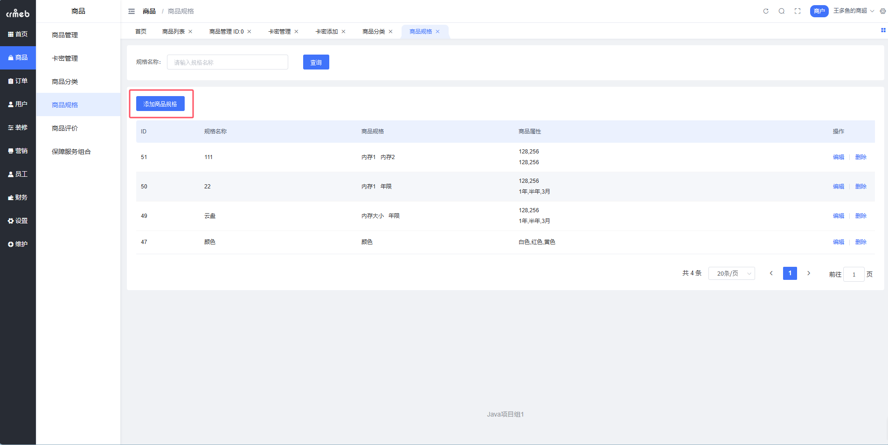

**Step 2**：填写规格名称和规格值

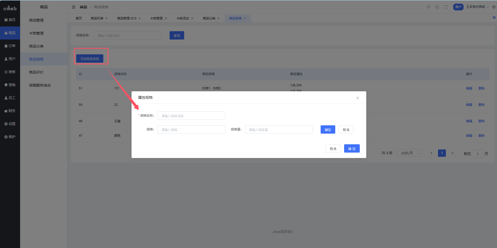

**Step 3**：点击【确定】，完成添加

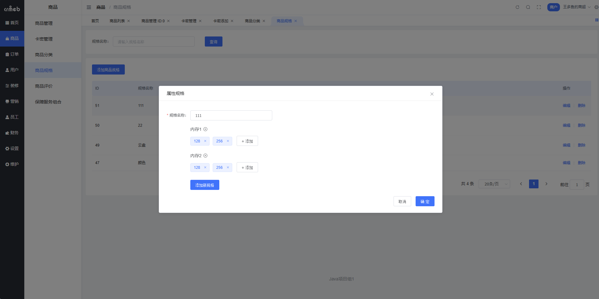

#### 字段说明

| 字段 | 说明 | 示例 |
| --- | --- | --- |
| 规格名称 | 规格模板的名称，便于识别 | 服装通用规格 |
| 规格 | 商品的属性维度 | 颜色、尺码 |
| 规格值 | 每个维度的具体选项 | 白色、黑色、S、M、L、XL |

---

### 编辑规格

点击【编辑】按钮修改规格信息。

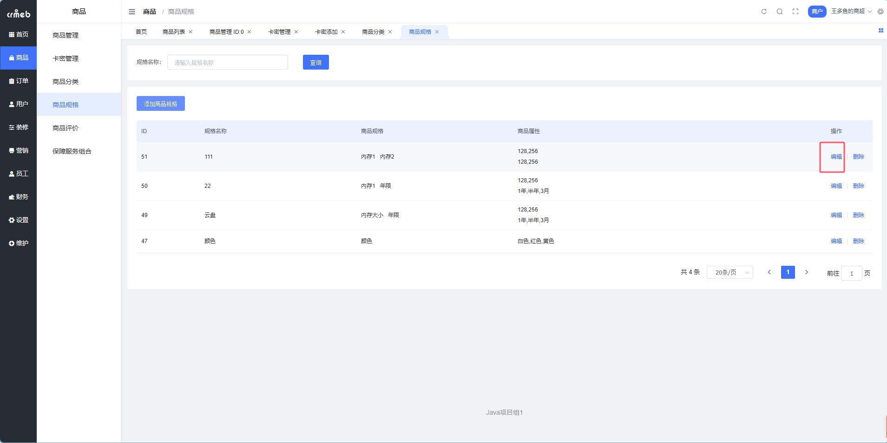

::: tip
修改规格后，**已使用此规格的商品不受影响**，商品保留的是规格值快照。
:::

---

### 删除规格

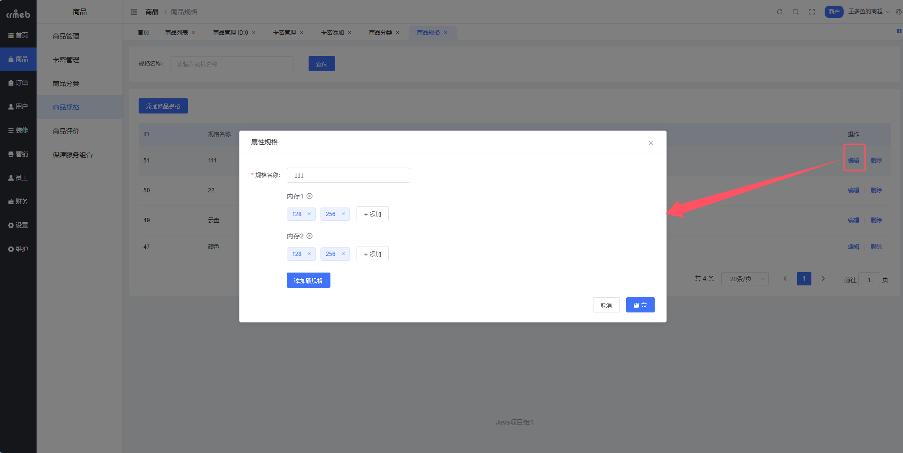

::: warning 注意
即使规格已被商品使用，也可以直接删除。删除后已使用的商品不受影响。
:::

---

## 最佳实践

### 分类设计建议

```
├── 🥤 饮品
│   ├── 奶茶
│   ├── 咖啡
│   └── 果茶
├── 🍰 甜点
│   ├── 蛋糕
│   └── 面包
└── 🍟 小食
    ├── 薯条
    └── 鸡块
```

### 规格设计建议

| 商品类型 | 推荐规格 |
| --- | --- |
| 服装 | 颜色、尺码 |
| 数码 | 颜色、内存、版本 |
| 食品 | 口味、规格（大/中/小） |
| 家具 | 颜色、材质、尺寸 |

::: tip 效率小技巧
1. 先规划好分类结构再添加商品
2. 同类商品先建规格模板再批量添加
3. 善用隐藏功能应对临时调整
:::
