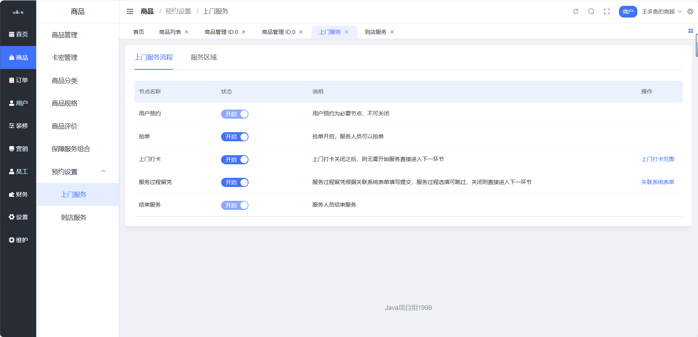
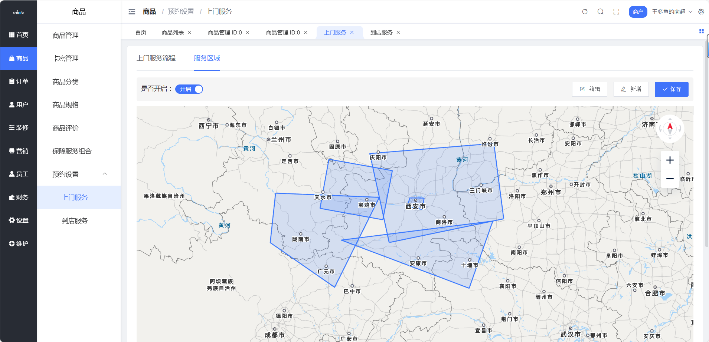
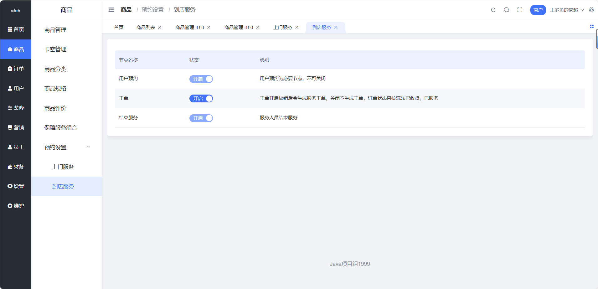

# 商户端预约服务

> 上门还是到店？预约服务让服务类商品也能在线卖 🏠

## 这是个啥？

预约服务是针对**服务类商品**的配套功能，支持两种服务模式：
- **上门服务**：服务人员去客户那里（如家政、维修）
- **到店服务**：客户来店里消费（如美容、餐饮）

**路径**：商户后台 → 商品 → 预约设置

---

## 上门服务

> 师傅上门，全程可追踪 🚗

### 功能特点

| 功能 | 说明 |
| --- | --- |
| 抢单模式 | 支持开关，开启后服务人员可抢单 |
| 打卡定位 | 可设置距离客户多少米内才能打卡 |
| 打卡备注 | 打卡时支持填写备注、拍照留证 |
| 服务留凭 | 支持自定义表单，记录服务过程 |
| 电子围栏 | 设置服务区域，用户地址在范围内才能下单 |

**路径**：商户后台 → 商品 → 预约设置 → 上门服务



### 配置项说明

| 配置项 | 这是干嘛的 |
| --- | --- |
| 抢单模式开关 | 开启后服务人员可自主抢单，关闭则由商家指派 |
| 打卡距离 | 服务人员需要在距离客户 X 米内才能打卡签到 |
| 服务区域 | 画电子围栏，限定服务覆盖范围 |
| 服务凭证表单 | 自定义服务完成后需要填写的内容 |



::: tip 使用场景
- 🔧 家电维修
- 🧹 家政保洁
- 💆 上门按摩
- 🐕 宠物上门服务
:::

---

## 到店服务

> 客户到店，核销完成 🏪

### 功能特点

| 功能 | 说明 |
| --- | --- |
| 核销开关 | 开启后生成服务工单，需核销完成 |
| 关闭核销 | 不生成工单，订单直接流转为已收货 |

**路径**：商户后台 → 商品 → 预约设置 → 到店服务



### 核销模式对比

| 模式 | 流程 | 适用场景 |
| --- | --- | --- |
| 开启核销 | 下单 → 到店 → 核销 → 完成 | 需要现场确认的服务 |
| 关闭核销 | 下单 → 自动完成 | 简单预约、无需确认 |

::: tip 使用场景
- 💇 美容美发
- 🍽️ 餐饮预约
- 🏋️ 健身课程
- 🎬 电影/演出票务
:::

---

## 服务流程对比

### 上门服务流程

```
用户下单 → 商家接单/抢单 → 服务人员出发 → 到达打卡 → 开始服务 → 填写服务凭证 → 完成
```

### 到店服务流程

```
用户下单 → 预约时间到店 → 员工核销 → 完成
```

---

## 最佳实践

### 上门服务配置建议

| 行业 | 打卡距离 | 抢单模式 |
| --- | --- | --- |
| 家政保洁 | 100-200米 | 建议开启 |
| 家电维修 | 50-100米 | 建议开启 |
| 上门按摩 | 50米 | 看团队规模 |

### 电子围栏设置技巧

1. **城区服务**：按行政区划分围栏
2. **社区服务**：精确到小区范围
3. **全城服务**：设置多个围栏覆盖

::: warning 注意事项
- 上门服务务必设置电子围栏，避免接到超远订单
- 打卡距离别设太小，GPS 有误差
- 服务凭证表单要简洁，别让师傅填半天
:::
