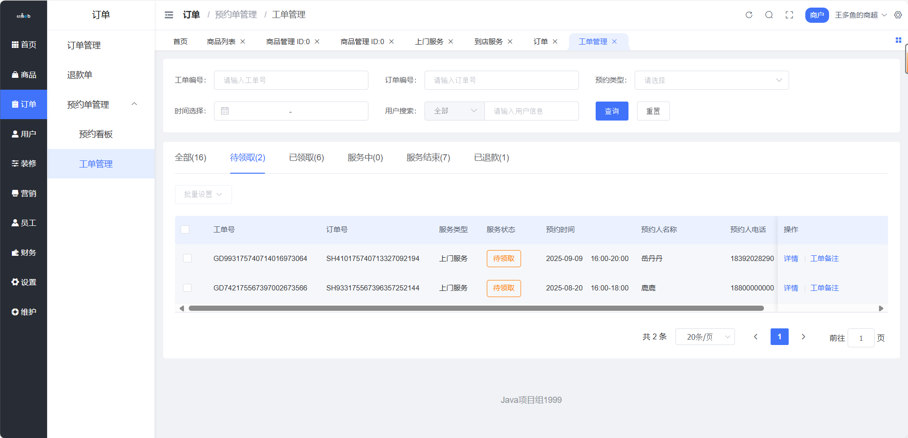
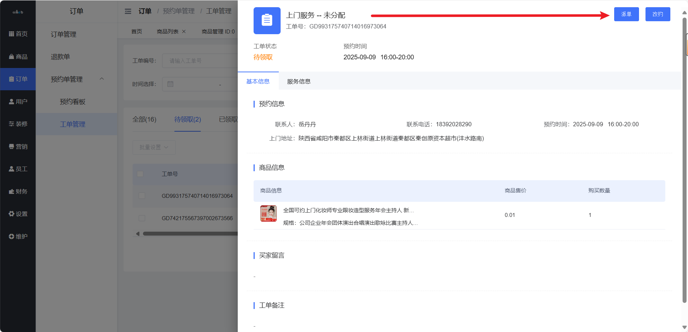
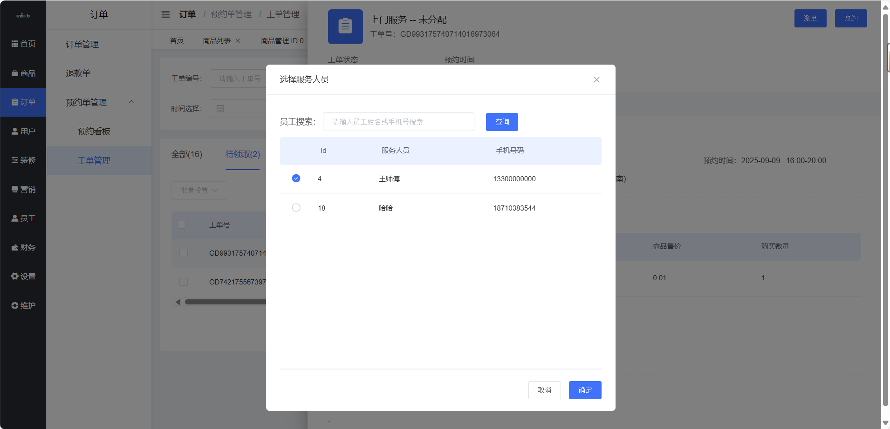
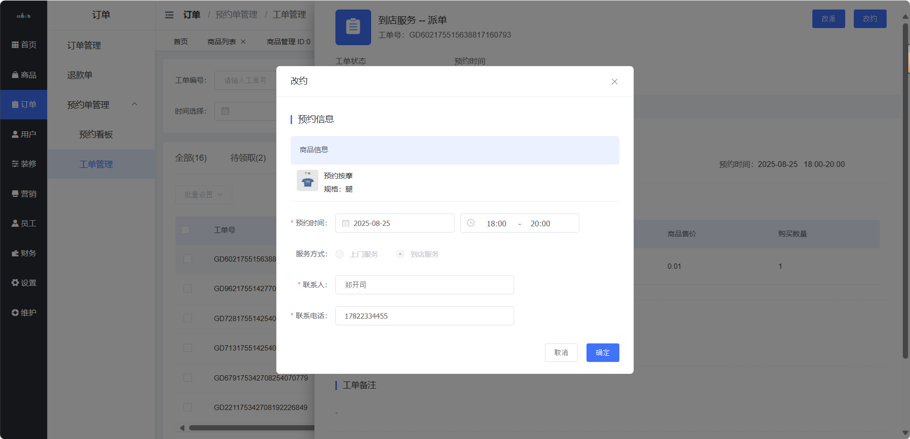
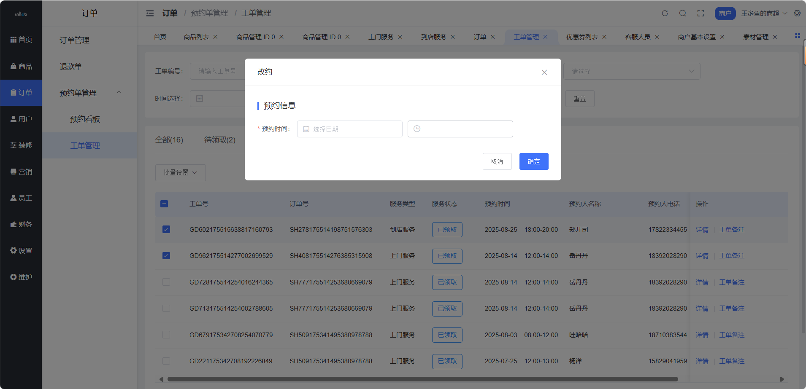
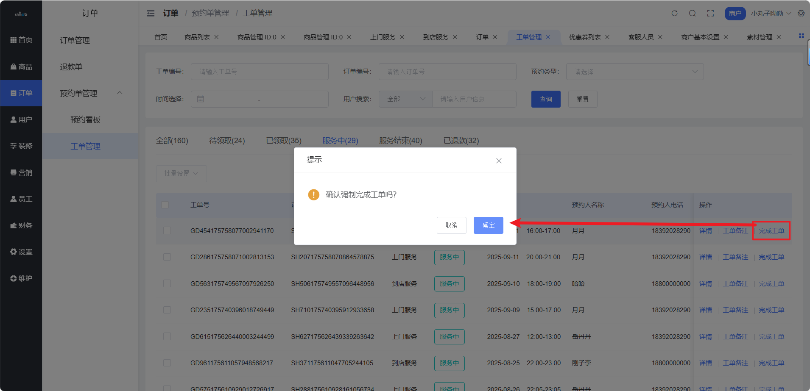
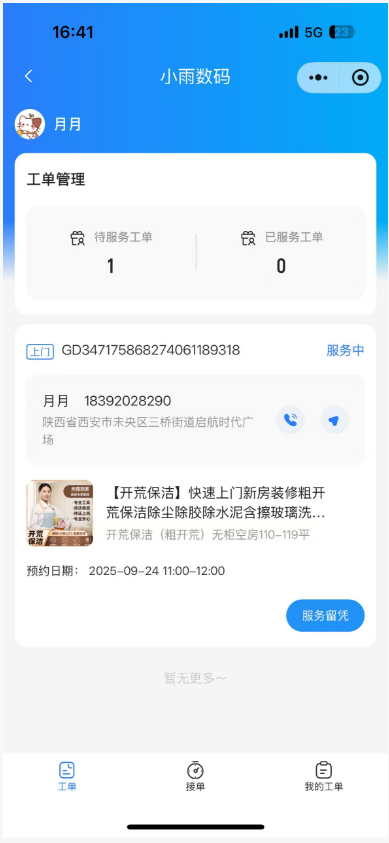
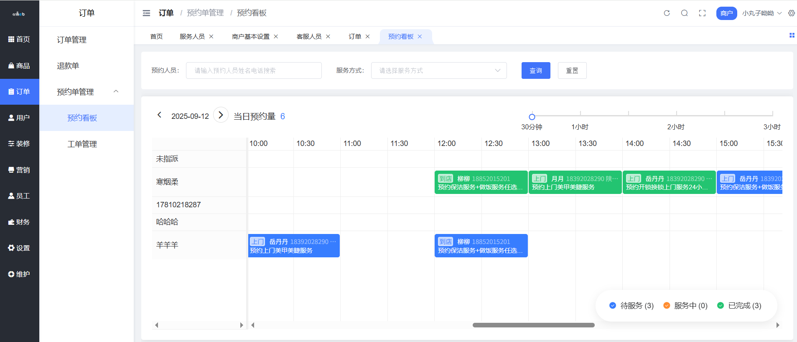
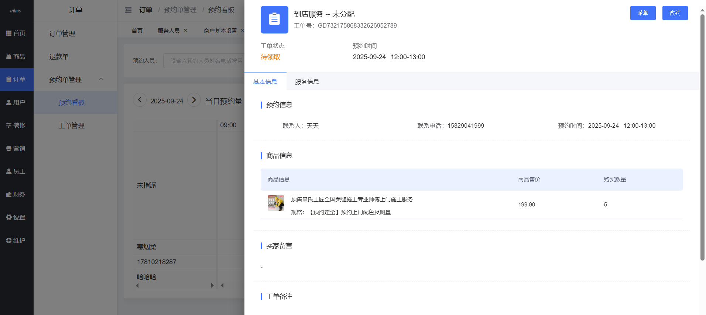

# 商户端工单管理

> 预约订单拆成工单，派单抢单一目了然 📋

## 这是个啥？

工单是预约订单的「执行单元」，一个预约订单可能产生多个工单。商家通过工单管理来调度服务人员、跟踪服务进度。

**路径**：商户后台 → 订单 → 预约单管理 → 工单管理

### 工单生成规则

| 服务类型 | 工单生成时机 |
| --- | --- |
| 上门服务 | 预约订单创建后自动拆分 |
| 到店服务 | 开启工单的前提下，订单核销后生成 |

---

## 工单首页

以工单状态维度统计数据，一眼看清所有工单情况。



---

## 派单

> 把工单分配给服务人员 👷

### 适用场景

- 未分配的工单
- 待领取的工单

**Step 1**：在工单列表点击【派单】



**Step 2**：选择服务人员



::: tip 批量派单
待领取工单列表支持批量派单，一次分配多个工单。
:::

---

## 改派

> 换个人来服务 🔄

### 适用场景

- 待服务（已领取）的工单
- 服务中的工单

操作方式同派单，支持批量改派。



---

## 改约

> 用户要改时间？没问题 📅

### 适用场景

- 待服务（待领取）的工单
- 待服务（已领取）的工单

| 操作方式 | 可修改内容 |
| --- | --- |
| 单个工单改约 | 预约信息（时间、地址等） |
| 批量工单改约 | 仅可修改预约时间 |



---

## 强制完成工单

> 特殊情况，商家直接完结工单 ⚡

### 适用场景

- 服务中的工单
- 服务已完成但系统未更新
- 异常情况需要手动关闭



---

## 服务人员端操作

### 抢单

> 开启抢单模式后，服务人员可以自主抢单 🏃

**前提条件**：商家开启抢单模式 + 开通服务人员



用户下单后，未分配的工单会进入待抢单池，服务人员可自主接单。

### 我的工单

服务人员在移动端管理自己的工单：


支持操作：
- ✅ 上门打卡
- ✅ 服务留凭
- ✅ 服务完成

---

## 移动端商家管理

商家也可以在移动端管理工单：


支持操作：
- 派单
- 改派
- 强制完成

---

## 预约看板

> 日历视图，一眼看清每天的预约情况 📆

**路径**：商户后台 → 订单 → 预约单管理 → 预约看板



### 功能特点

- 📅 按日期查看预约时段
- 👀 直观展示每天的预约订单
- 🔧 支持给未指派订单派单
- 📝 支持改约操作



---

## 工单状态流转

```
未分配 → 待领取 → 已领取(待服务) → 服务中 → 已完成
   │         │           │            │
   └── 派单 ──┘     改派 ←┘      强制完成
```

---

## 最佳实践

### 派单策略

| 场景 | 建议 |
| --- | --- |
| 订单量小 | 商家手动派单，精准匹配 |
| 订单量大 | 开启抢单模式，让服务人员自主接单 |
| 技术型服务 | 按服务人员技能手动派单 |
| 区域型服务 | 按服务人员负责区域派单 |

### 工单管理技巧

1. **及时派单**：订单生成后尽快分配，避免用户等待
2. **合理排班**：参考预约看板安排服务人员班次
3. **异常处理**：遇到问题及时改派或改约
4. **服务留凭**：要求服务人员拍照留证，减少纠纷

::: tip 效率提升
善用预约看板，提前规划每天的服务人员调度！
:::
