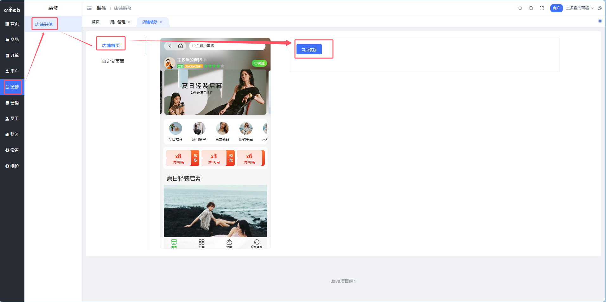
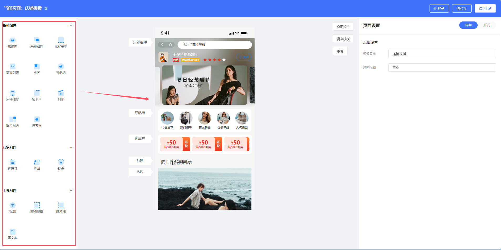
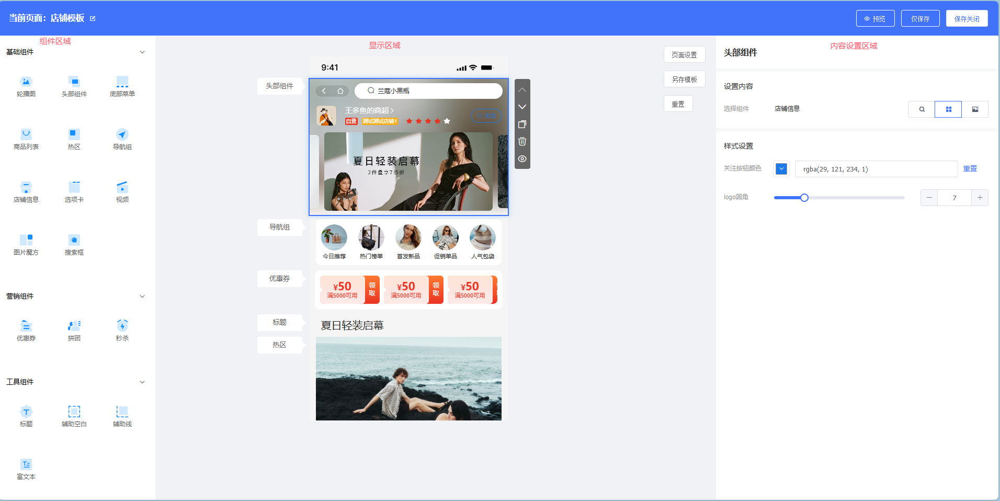
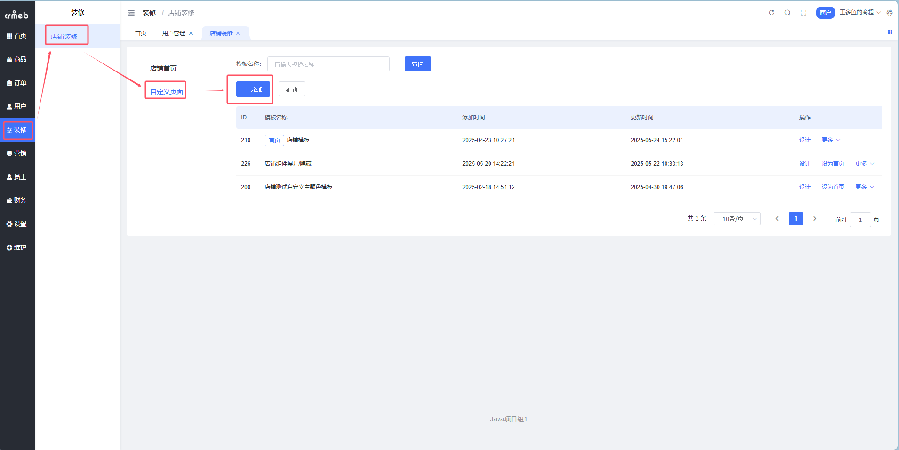
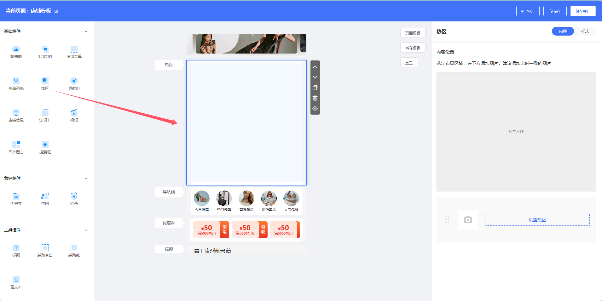
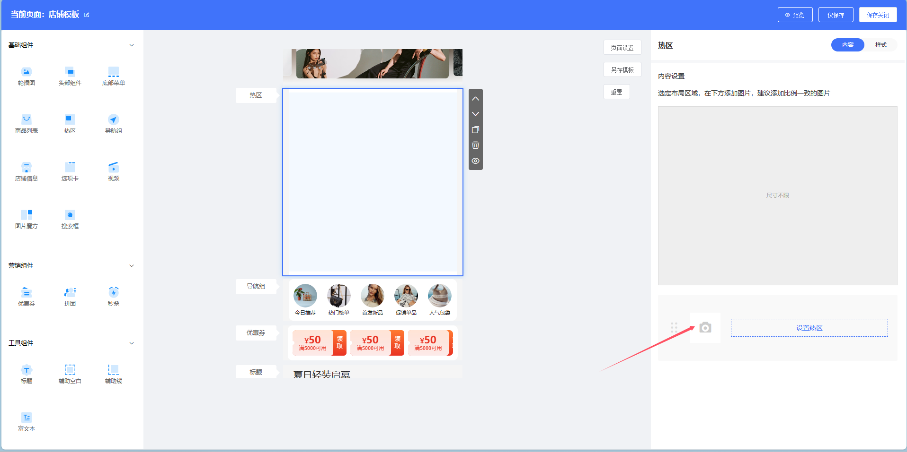
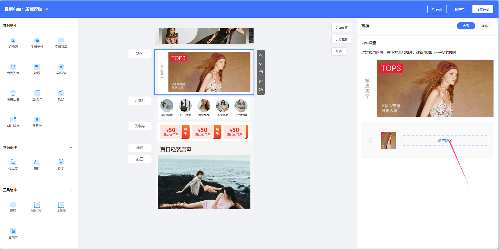
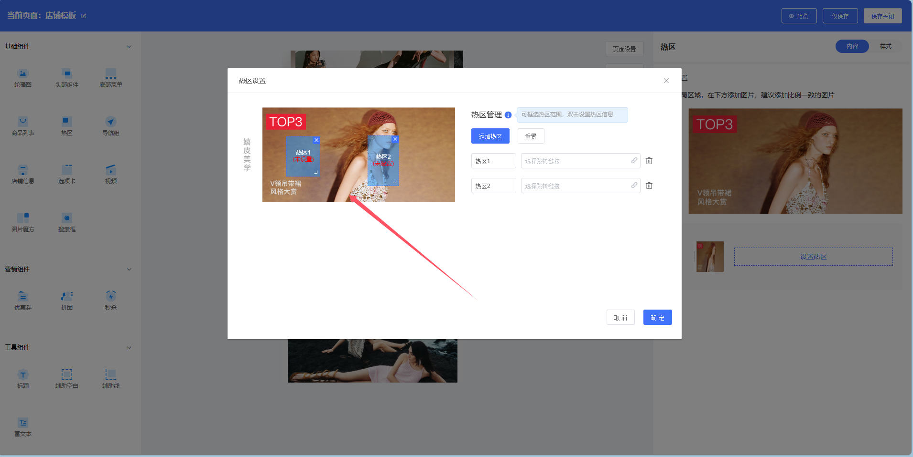
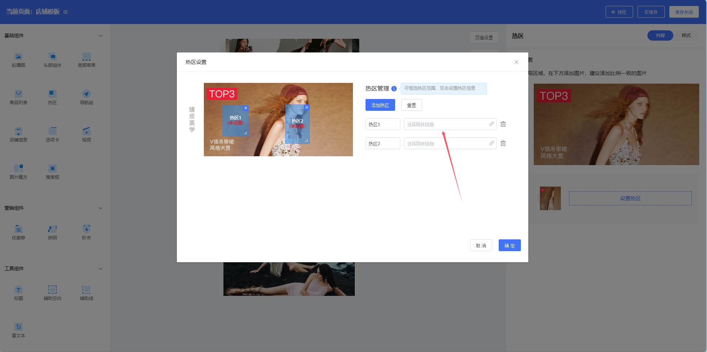

# 商户端店铺装修

> 店铺门面全靠装修，拖拖拽拽就能搭出高颜值页面 🎨

## 这是个啥？

店铺装修是商家自定义店铺页面的可视化工具，通过**拖拽组件**的方式快速搭建店铺首页和微页面，无需写代码！

**路径**：商户后台 → 装修 → 店铺装修

### 能解决什么问题？

| 角色 | 痛点 | 解决方案 |
| --- | --- | --- |
| 技术人员 | 每次改页面都要写代码 | 拖拽式搭建，专注业务逻辑 |
| 运营人员 | 不会代码也想改页面 | 可视化编辑，所见即所得 |
| 商家老板 | 想要品牌化展示 | 自由定制风格和内容 |

---

## DIY 组件库

### 组件分类

| 分类 | 组件 | 用途 |
| --- | --- | --- |
| **基础组件** | 轮播图、头部组件、底部导航、商品列表、导航组、选项卡、视频、图片魔方、搜索框、热区 | 页面基础框架搭建 |
| **营销组件** | 优惠券、秒杀、拼团 | 营销活动展示 |
| **工具组件** | 标题、辅助空白、辅助线、富文本 | 页面细节调整 |

### 组件使用方式

**拖拽到内容区域即可！**



### 组件设置

每个组件都支持两个维度的设置：

| 维度 | 设置内容 |
| --- | --- |
| **内容** | 组件展示的数据、框架结构 |
| **样式** | 颜色、边距、圆角等外观设置 |



---

## 店铺首页装修

> 店铺的「脸面」，用户进店第一眼看到的 👀

**路径**：商户后台 → 装修 → 店铺装修 → 店铺首页

**Step 1**：点击【首页装修】进入 DIY 编辑页面



**Step 2**：从左侧拖拽组件到中间内容区域

**Step 3**：在右侧设置组件的内容和样式



---

## 微页面装修

> 除了首页，还能创建更多自定义页面 📄

### 什么是微页面？

微页面是独立于首页的自定义页面，可以用于：
- 活动专题页
- 品牌故事页
- 新品专区
- 会员专属页面

### 如何创建微页面？

**Step 1**：点击【添加】按钮创建新微页面



**Step 2**：操作方式同首页装修

::: tip 微页面链接
创建的微页面可以通过「导航组」等组件设置跳转链接
:::

---

## 热区组件

> 一张图片，多个点击区域，各自跳转不同页面 🎯

### 什么是热区？

热区允许你在**一张图片**上划定**多个可点击区域**，每个区域跳转到不同的页面。

### 设置步骤

**Step 1**：拖拽「热区」组件到内容区域

**Step 2**：选择要展示的图片



**Step 3**：点击【设置热区】按钮

**Step 4**：在图片上按住鼠标左键，框选点击范围



**Step 5**：为每个热区设置跳转链接，点击【确定】



::: tip 使用场景
- 一张大促海报，不同商品区域点击跳转不同商品
- 店铺导航图，点击不同区域进入不同分类
:::

---

## 组件颜色自定义

> 不想用默认主题色？每个组件都能单独设颜色 🎨

### 支持自定义颜色的组件

| 组件 | 可自定义颜色 |
| --- | --- |
| 轮播图 | 指示器颜色 |
| 头部组件 | 指示器颜色 |
| 商品列表 | 商品价格颜色 |
| 选项卡 | 选中颜色、价格颜色 |
| 优惠券 | 优惠金额、领取按钮颜色、优惠券背景 |
| 拼团 | 拼团价格、标签颜色、按钮颜色 |
| 秒杀 | 价格颜色 |
| 底部导航 | 选中颜色 |



::: tip
默认读取主题色，自定义后可覆盖主题色设置
:::

---

## 最佳实践

### 首页布局推荐

```
┌─────────────────────────┐
│      搜索框             │
├─────────────────────────┤
│      轮播图             │
├─────────────────────────┤
│      导航组（分类入口）  │
├─────────────────────────┤
│   营销组件（优惠券/秒杀） │
├─────────────────────────┤
│      商品列表           │
├─────────────────────────┤
│      底部导航           │
└─────────────────────────┘
```

### 装修技巧

| 技巧 | 说明 |
| --- | --- |
| 保持简洁 | 组件不要堆太多，用户会审美疲劳 |
| 突出重点 | 把核心商品/活动放在首屏 |
| 统一风格 | 颜色、字体保持一致 |
| 善用留白 | 适当使用辅助空白组件 |
| 定期更新 | 配合活动调整页面内容 |

### 常见组合

| 场景 | 推荐组件组合 |
| --- | --- |
| 新店开业 | 轮播图 + 优惠券 + 商品列表 |
| 大促活动 | 热区(海报) + 秒杀 + 拼团 |
| 品牌店铺 | 视频 + 图片魔方 + 商品列表 |
| 服务类店铺 | 导航组 + 富文本(介绍) + 选项卡 |

::: warning 注意事项
装修完成后记得**保存**并**发布**，否则用户端看不到变化！
:::
