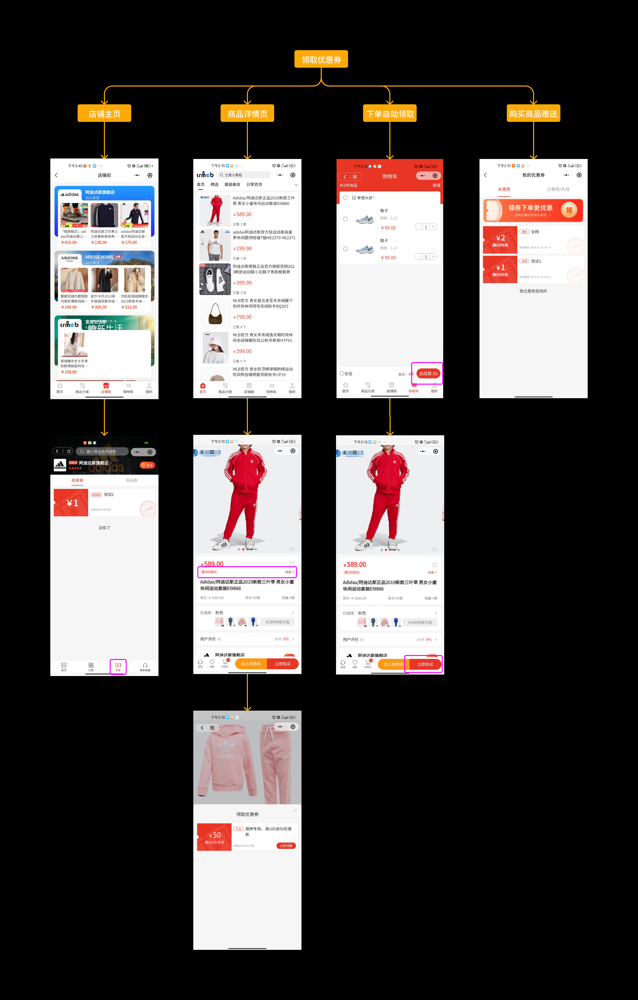
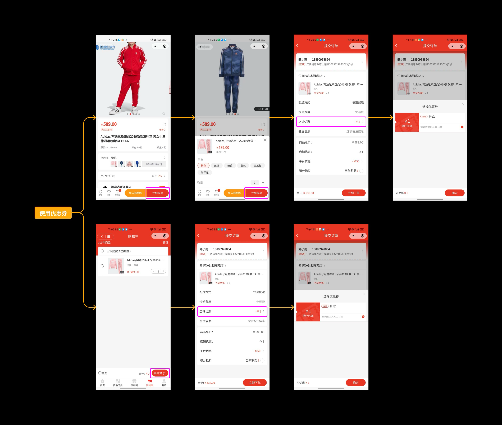
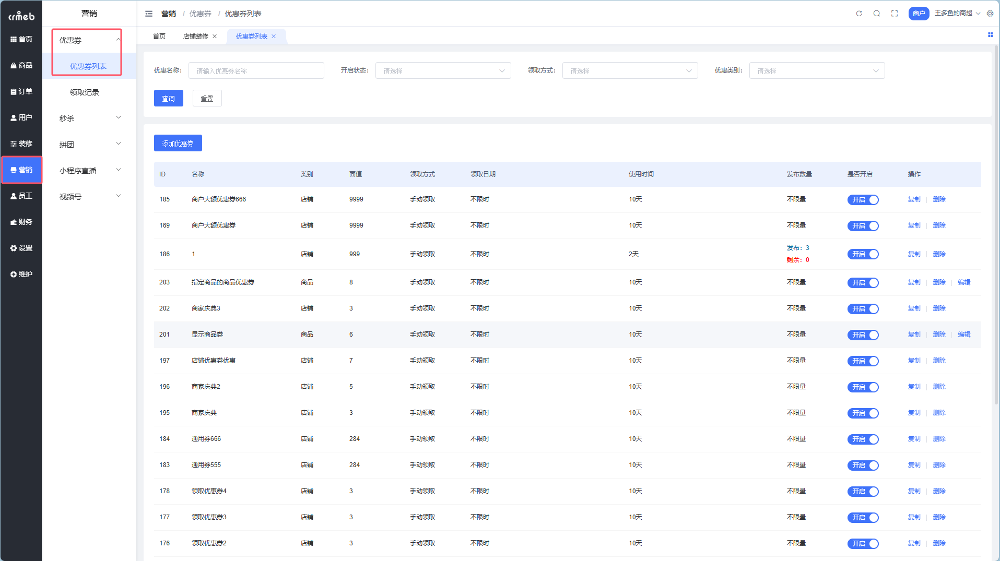
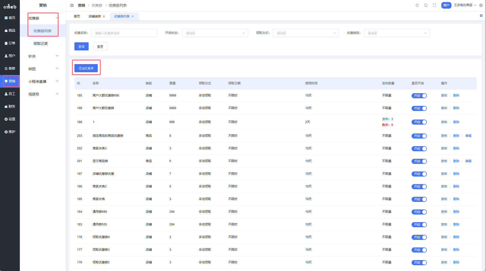
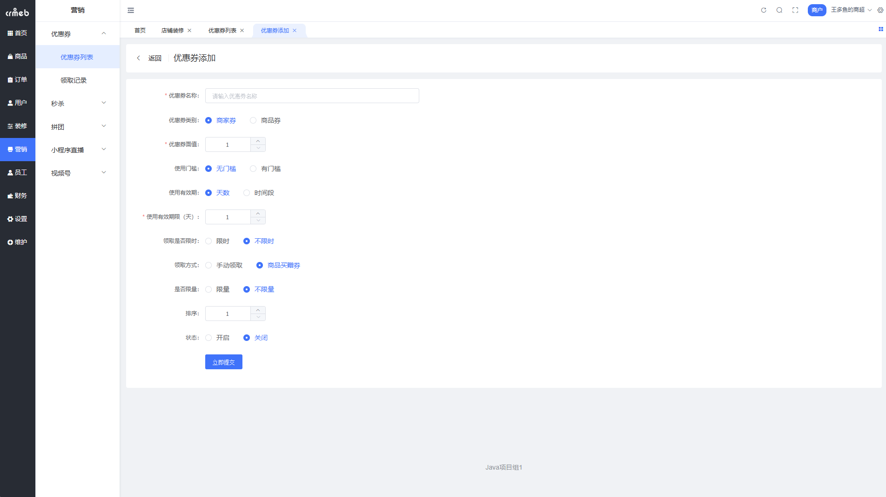
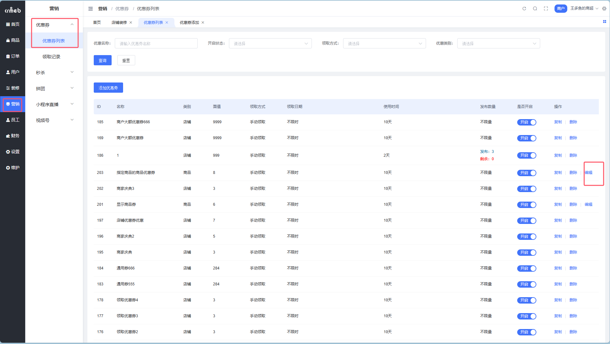
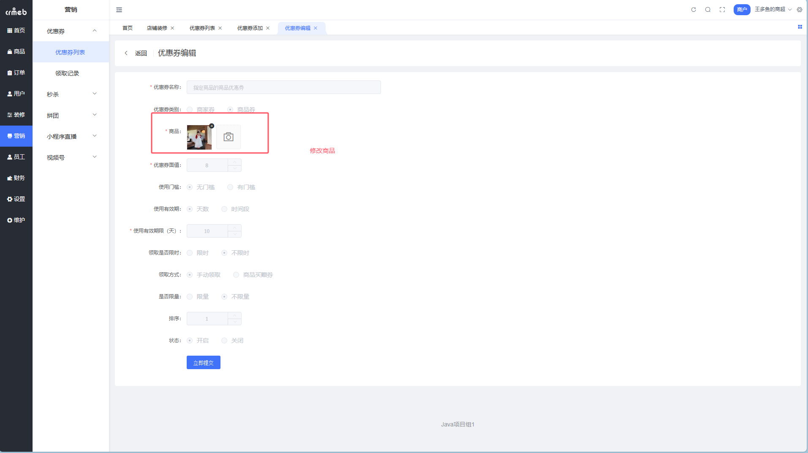
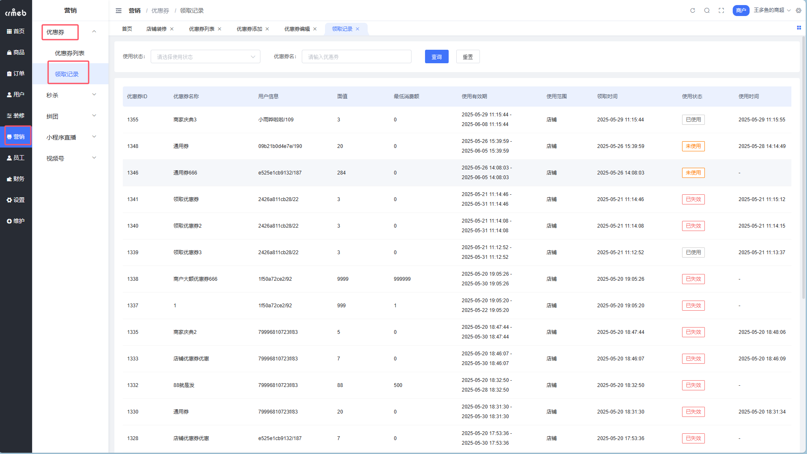
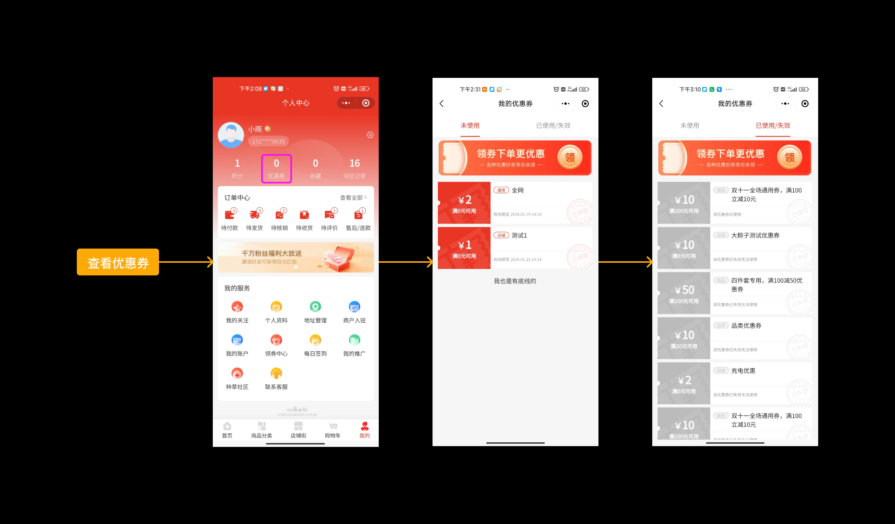

# 商户端优惠券管理

> 优惠券是拉新促活的「核武器」，用好了销量蹭蹭涨 🎫

## 这是个啥？

商家优惠券是商户自主发放的促销工具，支持**商家券**和**商品券**两种类型，可用于吸引新客、提升销量、清理库存。

**路径**：商户后台 → 营销 → 优惠券

### 优惠券能干啥？

| 作用 | 说明 |
| --- | --- |
| 🆕 吸引新客户 | 新人专享券，降低首单门槛 |
| 📈 提升销售量 | 满减券刺激老客复购 |
| 📦 促进库存周转 | 清仓券处理滞销商品 |
| 📢 增加品牌曝光 | 用户分享优惠券，裂变传播 |
| ❤️ 提高满意度 | 回馈老客户，增强忠诚度 |

---

## 优惠券类型

| 类型 | 使用范围 | 适用场景 |
| --- | --- | --- |
| **商家券** | 本店铺所有商品均可使用 | 全店促销、新店开业 |
| **商品券** | 指定商品可使用 | 爆款推广、清仓促销 |

---

## 领取途径

用户可以通过以下方式领取优惠券：

| 途径 | 说明 |
| --- | --- |
| 店铺主页-领券中心 | 展示领取时间有效、手动领取类型的优惠券 |
| 商品详情页 | 展示关联此商品的手动领取类型商品券 |
| 下单自动领取 | 系统自动领取优惠力度最大的券 |
| 购买商品赠送 | 支付成功后自动发放买赠券 |

---

## 使用优惠券

用户在结算界面可以选择使用哪张优惠券，或者不使用。

### 使用规则

| 规则 | 说明 |
| --- | --- |
| 叠加使用 | 商家券可与平台券、积分抵扣叠加 |
| 活动限制 | 秒杀等营销活动**不支持**使用商家优惠券 |
| 费用承担 | 商家优惠券金额由**商家承担** |
| 计算顺序 | 商品售价 → 减平台券 → 减商家券 → 计算积分抵扣 |

---

## 优惠券退回机制

| 场景 | 退回规则 |
| --- | --- |
| 整单退款 | 退款成功后自动退回，有效期内可继续使用 |
| 拆单退款 | 使用该券的商品全部退款后才退回 |
| 赠送券 | 支付成功即赠送，**永不回收** |

---

## 添加优惠券

**路径**：商户后台 → 营销 → 优惠券 → 优惠券列表

**Step 1**：点击【添加优惠券】

**Step 2**：填写优惠券信息

**Step 3**：点击【立即创建】完成

### 字段说明

| 字段 | 说明 |
| --- | --- |
| 优惠券名称 | 用户端展示，建议描述规则，如「满100减20」，最多 20 字 |
| 优惠券类别 | 商家券（全店可用）/ 商品券（指定商品） |
| 优惠券面值 | 抵扣金额（元） |
| 使用门槛 | 满多少可用，支持设置无门槛 |
| 使用有效期 | 领取后 N 天内可用 / 指定时间段内可用 |
| 领取时间 | 用户可领取的时间范围，支持不限制 |
| 领取方式 | 手动领取 / 商品买赠券 |
| 是否限量 | 总发放数量，支持不限量 |
| 重复领取 | 是否允许用户重复领取 |
| 排序 | 数字越大越靠前 |
| 是否开启 | 关闭后用户端不展示 |

---

## 编辑优惠券

::: warning 注意
仅支持对**商品券**进行添加或删除关联商品，其他信息创建后不可修改。
:::

---

## 复制优惠券

快速复制已有优惠券配置，修改后创建新券。

---

## 领取记录

查看优惠券的领取和使用情况。

**路径**：商户后台 → 营销 → 优惠券 → 领取记录

---

## 用户端展示

### 我的优惠券

用户可以查看自己领取的优惠券：
- 未使用
- 已使用
- 已过期

点击优惠券可查看可使用的商品列表。

---

## 最佳实践

### 优惠券策略推荐

| 场景 | 推荐设置 |
| --- | --- |
| 新店开业 | 无门槛券 + 大额满减券组合 |
| 日常促销 | 小额满减券，如满 50 减 5 |
| 爆款推广 | 商品券绑定爆款，降低尝试门槛 |
| 老客回馈 | 买赠券，购买后送下次优惠 |
| 清仓促销 | 指定商品券 + 大折扣 |

### 设置技巧

| 技巧 | 说明 |
| --- | --- |
| 门槛设置 | 门槛设为客单价的 1.2-1.5 倍，拉高客单价 |
| 有效期 | 7-15 天最佳，太长用户没紧迫感 |
| 限量发放 | 适当限量制造稀缺感 |
| 名称清晰 | 「满100减20」比「店铺优惠券」更直观 |

::: tip 灵魂拷问
你的优惠券为啥没人领？
1. 门槛太高？用户够不着
2. 面值太小？没吸引力
3. 藏太深？用户找不到
4. 有效期太短？来不及用
:::
