# 商户端拼团活动

> 人多力量大，拼着买更便宜，用户开心商家赚钱 🤝

## 这是个啥？

拼团是一种社交化营销工具，通过集合多人购买需求，以更低价格享受商品。用户开团后邀请好友参团，达到指定人数即拼团成功。

**路径**：商户后台 → 营销 → 拼团

### 拼团能干啥？

| 作用 | 说明 |
| --- | --- |
| 💰 经济实惠 | 用户享受更低价格 |
| 🚀 快速销售 | 促进商品快速出货 |
| 📢 品牌传播 | 用户主动分享裂变 |
| 👥 拉新引流 | 老用户带新用户 |

---

## 活动规则

::: warning 重要规则
- ❌ 拼团**不参与分销**
- ❌ 不与积分抵扣、平台券、商家券、会员折扣叠加
- ✅ 按拼团价结算，商家按实付金额分账
- ✅ 推广员邀请参团可绑定分销关系
:::

### 活动流程

```
商家创建活动 → 平台审核 → 用户开团 → 邀请好友参团 → 达到人数 → 拼团成功 → 商家发货
                                              ↓
                                        未达人数 → 拼团失败 → 自动退款
```

---

## 用户端操作

### 开团

用户以拼团价购买商品后成为「团长」，可邀请好友参团。

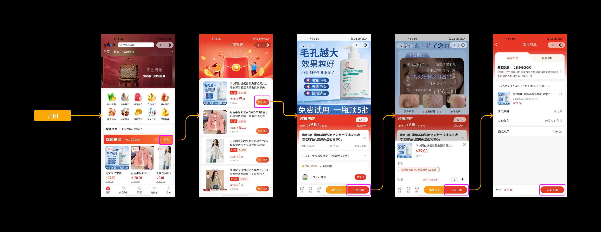

### 邀请好友参团

团长可以将拼团分享到微信好友或朋友圈。

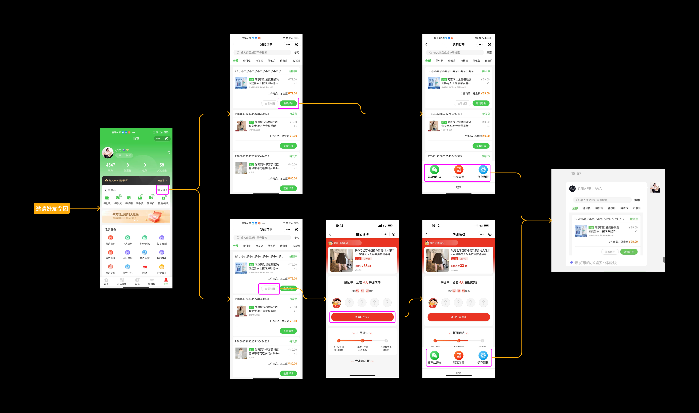

### 参团

用户可以通过好友分享或商品详情的「凑团列表」参与他人的拼团。

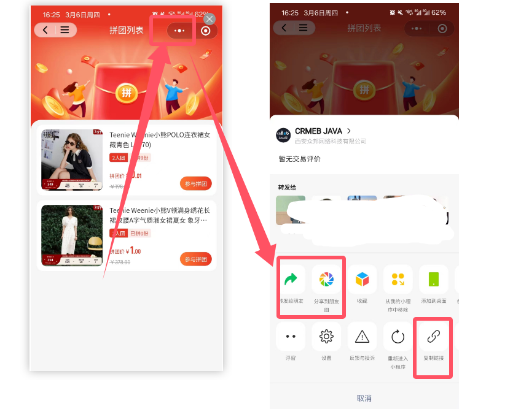

### 查看拼团订单

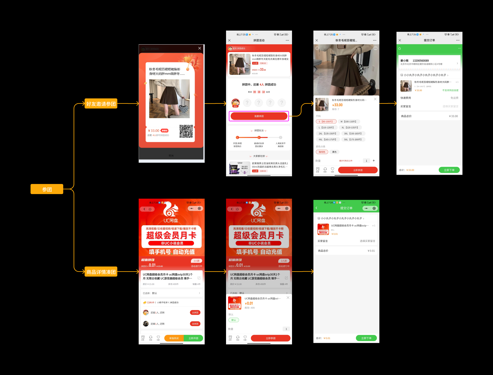

---

## 拼团活动管理

**路径**：商户后台 → 营销 → 拼团 → 拼团活动

### 活动列表

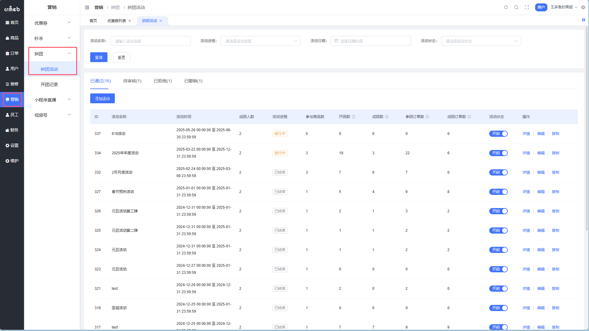

### 审核状态说明

| 状态 | 说明 |
| --- | --- |
| 已通过 | 平台审核通过，用户端展示 |
| 待审核 | 已提交，等待平台审核 |
| 已拒绝 | 平台审核拒绝或强制关闭 |
| 已撤销 | 商家主动撤回审核 |

### 列表字段说明

| 字段 | 说明 |
| --- | --- |
| 活动进程 | 未开始 / 进行中 / 已结束 |
| 参与商品数 | 活动包含的商品数量 |
| 开团数 | 用户开团次数 |
| 成团数 | 拼团成功的团数 |
| 参团订单数 | 所有已支付订单数 |
| 成团订单数 | 拼团成功的订单数 |

---

## 添加拼团活动

### Step 1：活动设置

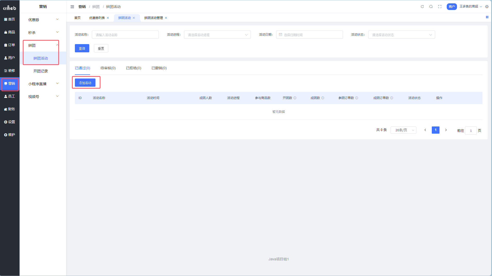

| 字段 | 说明 |
| --- | --- |
| 活动名称 | 管理用，用户端不展示，最多 20 字 |
| 活动时间 | 活动有效期 |
| 成团人数 | 2～10000 人 |
| 成团有效期 | 1～240 小时，超时未成团自动退款 |
| 活动限购 | 每用户最多购买数量，0 为不限购 |
| 单次限购 | 每次参团最大购买数量，0 为不限购 |
| 凑团 | 开启后详情页显示待成团列表 |
| 模拟成团 | 开启后系统自动凑满人数（需先开启凑团） |

::: tip 模拟成团说明
开启模拟成团后，有效期结束时人数未满的团，系统会用「匿名买家」凑满人数。只有真实付款用户获得商品，虚拟用户不发货。
:::

### Step 2：添加商品

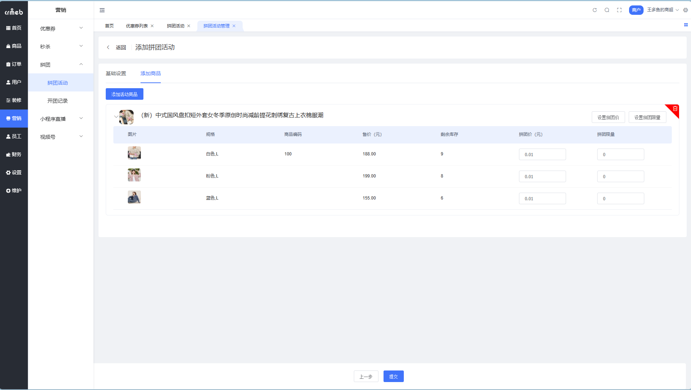

**Step 2.1**：点击【添加活动商品】选择商品（最多 10 个）

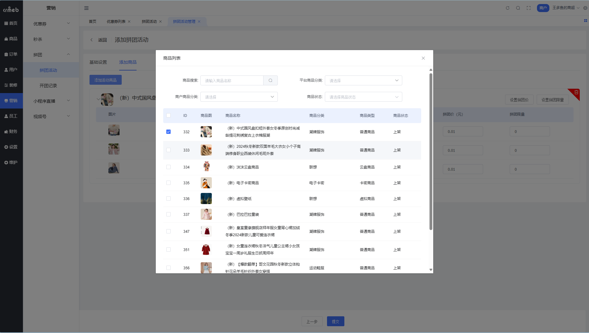

**Step 2.2**：设置拼团价和拼团库存

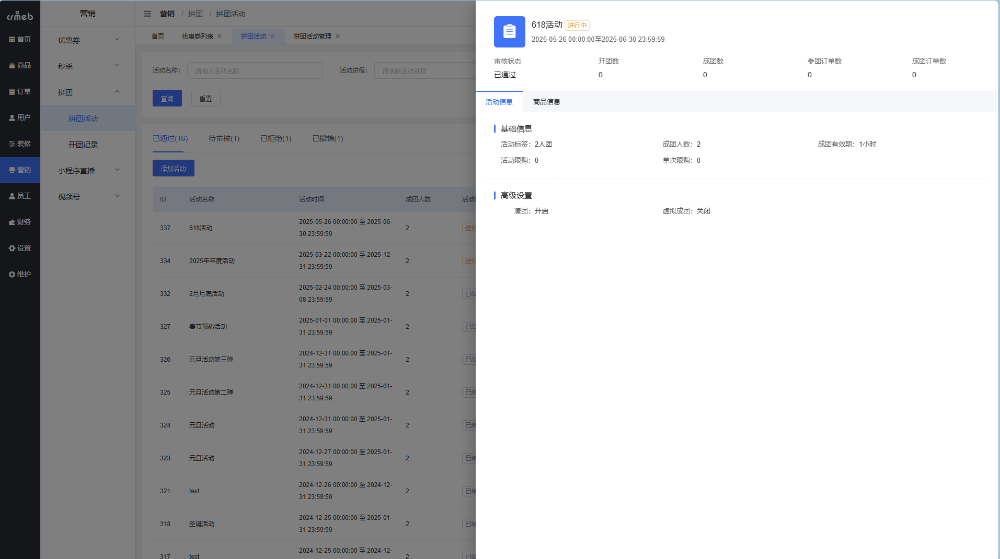

| 字段 | 说明 |
| --- | --- |
| 拼团价 | 0.01～999999.99 元 |
| 拼团库存 | 0～999999 件 |

::: tip 批量设置
支持批量设置拼团价和拼团库存，提高效率。
:::

### Step 3：提交审核

点击【提交】后进入待审核状态，等待平台审核通过后活动生效。

---

## 活动详情

### 活动信息

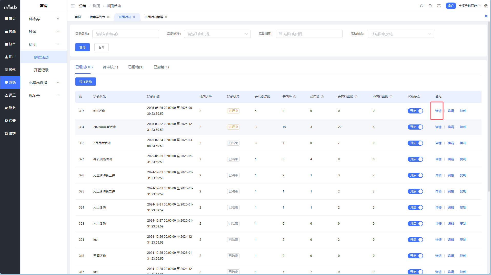

### 商品信息

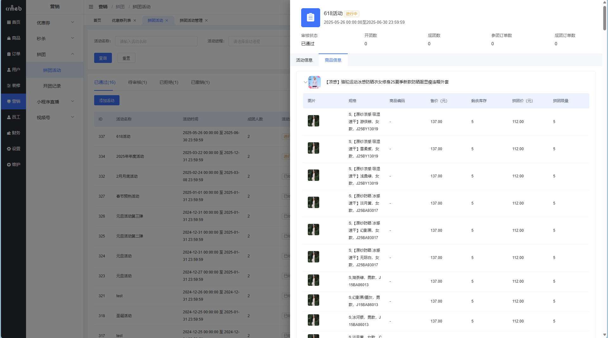

::: warning 注意
如果拼团商品对应的普通商品被下架，会提示「该商品已下架，无法进行拼团购买」
:::

---

## 开团记录

**路径**：商户后台 → 营销 → 拼团 → 开团记录

### 记录列表

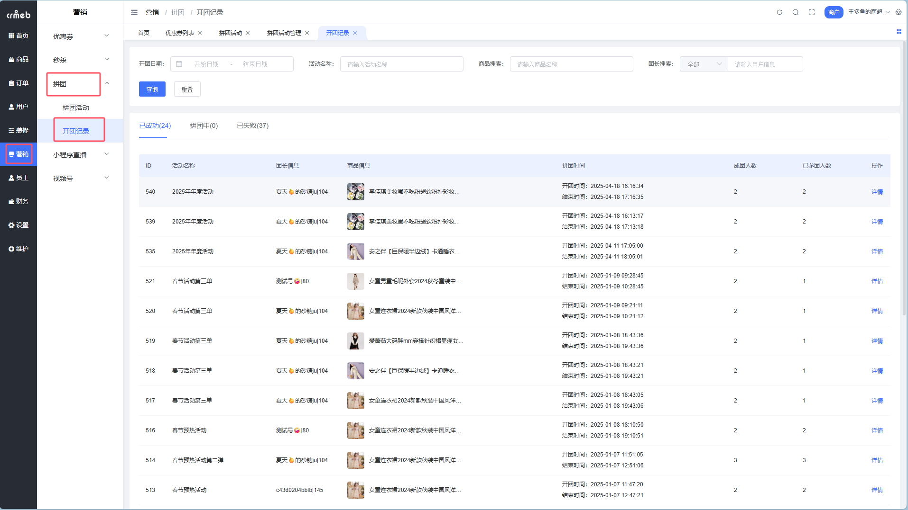

### 状态说明

| 状态 | 说明 |
| --- | --- |
| 已成功 | 有效期内达到成团人数 |
| 进行中 | 还在有效期，人数未满 |
| 已失败 | 有效期结束，人数未达标 |

### 列表字段

| 字段 | 说明 |
| --- | --- |
| 团长信息 | 开团用户的昵称和 ID |
| 拼团时间 | 开始时间～结束时间 |
| 成团人数 | 活动设置的成团人数 |
| 已参团人数 | 已付款参团的人数 |

### 查看详情

点击【详情】查看参团成员和订单信息。

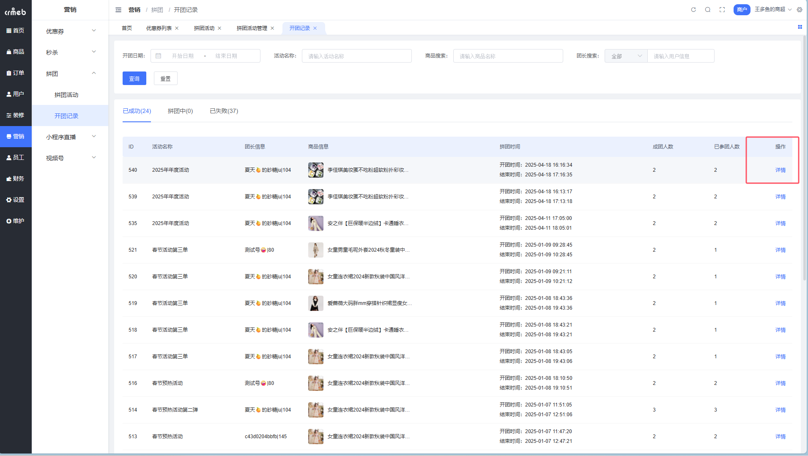

---

## 最佳实践

### 拼团设置建议

| 场景 | 推荐设置 |
| --- | --- |
| 引流爆款 | 2 人团 + 低价 + 高库存 |
| 清仓促销 | 3-5 人团 + 较大折扣 |
| 品牌推广 | 5-10 人团 + 开启模拟成团 |
| 高客单价 | 2 人团 + 较长有效期 |

### 成团人数选择

| 人数 | 特点 |
| --- | --- |
| 2 人 | 成团率高，适合新品推广 |
| 3-5 人 | 平衡成团率和裂变效果 |
| 5-10 人 | 裂变效果好，但成团率较低 |
| 10+ 人 | 建议开启模拟成团 |

### 有效期设置

| 时长 | 适用场景 |
| --- | --- |
| 1-6 小时 | 冲动消费型商品 |
| 12-24 小时 | 常规商品 |
| 48-72 小时 | 高客单价商品 |

::: tip 提升成团率的秘诀
1. 开启**凑团**功能，让用户看到待成团的团
2. 合理开启**模拟成团**，避免用户等太久
3. 设置合适的**成团人数**，别贪多
4. 拼团价要有**吸引力**，让用户愿意分享
:::
